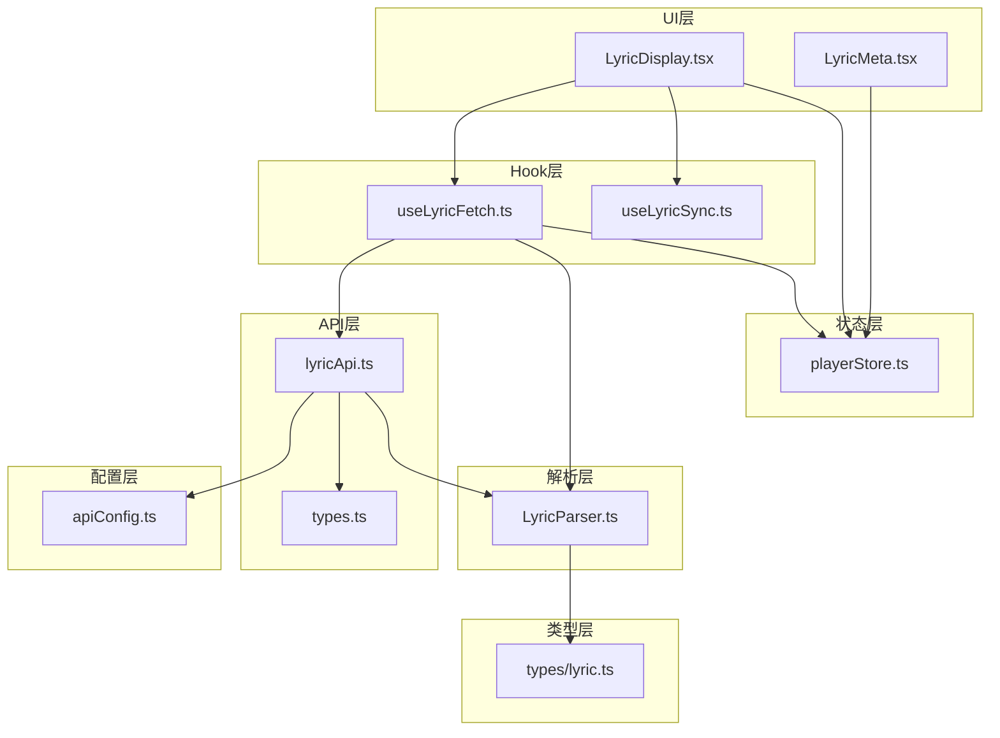
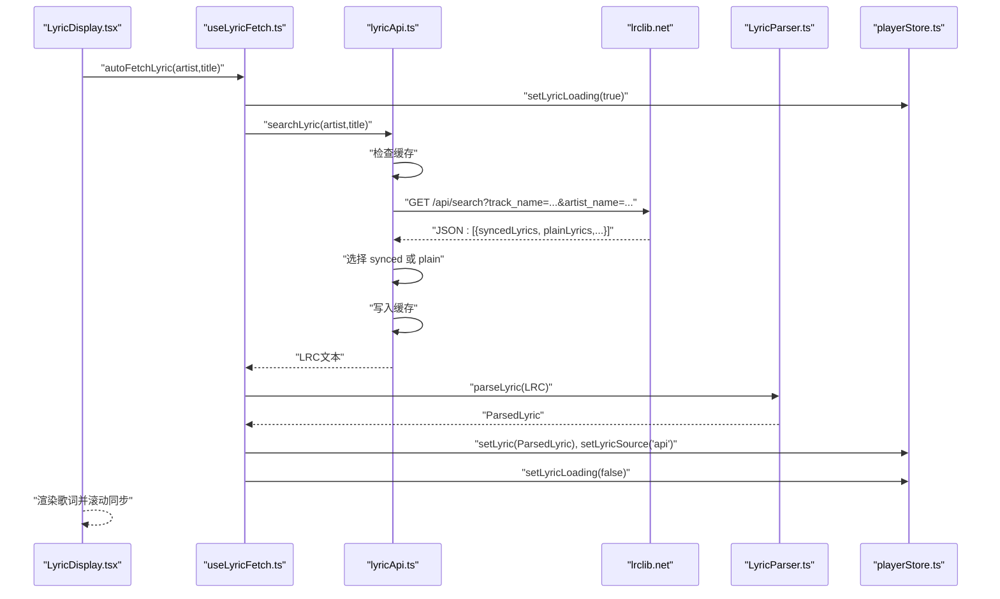
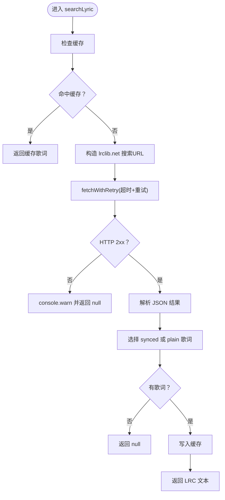
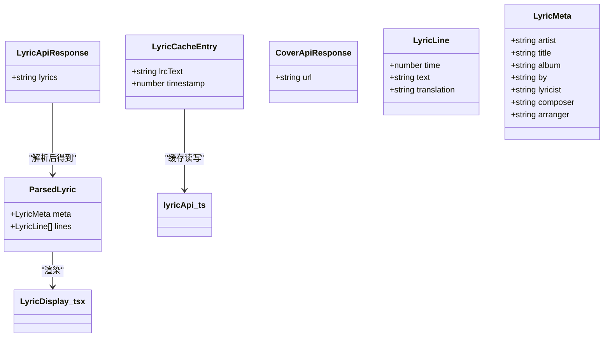

# API集成

<cite>
**本文引用的文件列表**
- [src/api/lyricApi.ts](file://src/api/lyricApi.ts)
- [src/api/types.ts](file://src/api/types.ts)
- [src/config/apiConfig.ts](file://src/config/apiConfig.ts)
- [src/hooks/useLyricFetch.ts](file://src/hooks/useLyricFetch.ts)
- [src/hooks/useLyricSync.ts](file://src/hooks/useLyricSync.ts)
- [src/core/LyricParser.ts](file://src/core/LyricParser.ts)
- [src/store/playerStore.ts](file://src/store/playerStore.ts)
- [src/components/Lyrics/LyricDisplay.tsx](file://src/components/Lyrics/LyricDisplay.tsx)
- [src/components/Lyrics/LyricMeta.tsx](file://src/components/Lyrics/LyricMeta.tsx)
- [src/types/lyric.ts](file://src/types/lyric.ts)
- [src/types/vendor.d.ts](file://src/types/vendor.d.ts)
</cite>

## 目录
1. [简介](#简介)
2. [项目结构](#项目结构)
3. [核心组件](#核心组件)
4. [架构总览](#架构总览)
5. [详细组件分析](#详细组件分析)
6. [依赖关系分析](#依赖关系分析)
7. [性能与优化](#性能与优化)
8. [故障排除指南](#故障排除指南)
9. [结论](#结论)
10. [附录](#附录)

## 简介
本文件面向 My Music 2026 的歌词 API 集成功能，系统化说明与 lrclib.net 的集成实现，包括：
- 调用 lrclib.net 的搜索接口、请求参数与响应处理
- API 配置管理、错误处理与重试策略
- TypeScript 类型设计与使用
- 最佳实践、性能优化与安全注意事项
- 具体使用示例与集成指南
- 版本管理、兼容性与故障排除方法

## 项目结构
歌词 API 集成涉及以下关键模块：
- API 层：封装 lrclib.net 搜索与缓存逻辑
- 配置层：集中管理 API 基础地址、超时、重试、缓存等参数
- Hook 层：在播放器切换歌曲时自动拉取歌词，并支持手动刷新
- 解析层：将 LRC 文本解析为结构化的歌词对象
- UI 层：展示歌词、滚动同步、加载状态与刷新入口
- 类型层：统一定义歌词、缓存、状态等类型

图表来源
- [src/components/Lyrics/LyricDisplay.tsx](file://src/components/Lyrics/LyricDisplay.tsx#L1-L102)
- [src/hooks/useLyricFetch.ts](file://src/hooks/useLyricFetch.ts#L1-L95)
- [src/hooks/useLyricSync.ts](file://src/hooks/useLyricSync.ts#L1-L33)
- [src/api/lyricApi.ts](file://src/api/lyricApi.ts#L1-L129)
- [src/api/types.ts](file://src/api/types.ts#L1-L26)
- [src/config/apiConfig.ts](file://src/config/apiConfig.ts#L1-L18)
- [src/core/LyricParser.ts](file://src/core/LyricParser.ts#L1-L101)
- [src/store/playerStore.ts](file://src/store/playerStore.ts#L1-L95)
- [src/types/lyric.ts](file://src/types/lyric.ts#L1-L21)

章节来源
- [src/components/Lyrics/LyricDisplay.tsx](file://src/components/Lyrics/LyricDisplay.tsx#L1-L102)
- [src/hooks/useLyricFetch.ts](file://src/hooks/useLyricFetch.ts#L1-L95)
- [src/hooks/useLyricSync.ts](file://src/hooks/useLyricSync.ts#L1-L33)
- [src/api/lyricApi.ts](file://src/api/lyricApi.ts#L1-L129)
- [src/api/types.ts](file://src/api/types.ts#L1-L26)
- [src/config/apiConfig.ts](file://src/config/apiConfig.ts#L1-L18)
- [src/core/LyricParser.ts](file://src/core/LyricParser.ts#L1-L101)
- [src/store/playerStore.ts](file://src/store/playerStore.ts#L1-L95)
- [src/types/lyric.ts](file://src/types/lyric.ts#L1-L21)

## 核心组件
- 歌词 API 封装：负责调用 lrclib.net 搜索接口、带超时与指数退避重试、LRU 式缓存、返回 LRC 文本
- 配置中心：集中管理 API 基础地址、超时、重试次数、缓存前缀与过期时间
- Hook：在切歌时自动获取歌词，防抖避免竞态，支持手动刷新
- 解析器：将 LRC 文本解析为结构化对象，含元信息与按时间排序的行列表
- UI 组件：展示歌词、高亮当前行、平滑滚动、加载状态与刷新入口
- 类型系统：统一定义歌词行、元信息、缓存条目、状态与来源等类型

章节来源
- [src/api/lyricApi.ts](file://src/api/lyricApi.ts#L1-L129)
- [src/config/apiConfig.ts](file://src/config/apiConfig.ts#L1-L18)
- [src/hooks/useLyricFetch.ts](file://src/hooks/useLyricFetch.ts#L1-L95)
- [src/core/LyricParser.ts](file://src/core/LyricParser.ts#L1-L101)
- [src/components/Lyrics/LyricDisplay.tsx](file://src/components/Lyrics/LyricDisplay.tsx#L1-L102)
- [src/api/types.ts](file://src/api/types.ts#L1-L26)
- [src/types/lyric.ts](file://src/types/lyric.ts#L1-L21)

## 架构总览
歌词获取的端到端流程如下：
- UI 触发：播放器切换歌曲或用户点击“重新获取”
- Hook 控制：去重与竞态控制，设置加载状态
- API 调用：构造 lrclib.net 搜索 URL，带超时与重试
- 结果处理：选择带时间轴的歌词或纯文本歌词，写入缓存
- 解析渲染：解析为结构化歌词，UI 高亮与滚动同步

图表来源
- [src/components/Lyrics/LyricDisplay.tsx](file://src/components/Lyrics/LyricDisplay.tsx#L1-L102)
- [src/hooks/useLyricFetch.ts](file://src/hooks/useLyricFetch.ts#L1-L95)
- [src/api/lyricApi.ts](file://src/api/lyricApi.ts#L86-L119)
- [src/core/LyricParser.ts](file://src/core/LyricParser.ts#L18-L81)
- [src/store/playerStore.ts](file://src/store/playerStore.ts#L42-L94)

## 详细组件分析

### 歌词 API 封装（lyricApi.ts）
- lrclib.net 搜索接口
  - 基础地址来自配置中心
  - 参数：track_name、artist_name
  - 返回：数组，优先取 syncedLyrics，否则取 plainLyrics
- 超时与重试
  - 使用 AbortController 控制超时
  - 重试次数可配置，每次等待时间递增
- 缓存策略
  - 键：cachePrefix + artist + "_" + title
  - 过期时间可配置，默认 7 天
  - 写入失败静默忽略，不影响主流程
- 错误处理
  - 捕获异常并返回 null，避免中断 UI
  - 控制台警告日志便于调试

图表来源
- [src/api/lyricApi.ts](file://src/api/lyricApi.ts#L86-L119)

章节来源
- [src/api/lyricApi.ts](file://src/api/lyricApi.ts#L1-L129)

### 配置中心（apiConfig.ts）
- 基础地址：lrclib.net 官方 API
- 超时：8 秒
- 重试：2 次
- 缓存：键前缀 lyric_cache_；过期 7 天
- 可扩展：新增字段时保持向后兼容

章节来源
- [src/config/apiConfig.ts](file://src/config/apiConfig.ts#L1-L18)

### Hook：歌词获取与刷新（useLyricFetch.ts）
- 自动获取：当无本地歌词时，切歌触发
- 手动刷新：清除歌词与来源，强制从 API 获取
- 竞态控制：fetchIdRef 防止快速切歌导致的结果回流
- 状态管理：通过 zustand store 设置歌词、来源与加载状态
- 解析与校验：解析后若无有效行则清空歌词

章节来源
- [src/hooks/useLyricFetch.ts](file://src/hooks/useLyricFetch.ts#L1-L95)

### 歌词解析器（LyricParser.ts）
- 时间标签正则：支持 mm:ss 或 mm:ss.xx/xxx
- 元信息解析：如 ar、ti、al、by、ly、mu、ar2 等
- 行解析：提取每行文本与对应时间点
- 排序与合并：按时间升序，合并同时间戳的翻译行
- 当前行查找：二分查找定位当前行索引

章节来源
- [src/core/LyricParser.ts](file://src/core/LyricParser.ts#L1-L101)

### UI 组件：歌词显示与同步（LyricDisplay.tsx、LyricMeta.tsx）
- LyricDisplay
  - 切歌时自动获取歌词
  - 加载中显示旋转图标与提示
  - 无歌词时提供“重新获取”按钮
  - 点击歌词行跳转到对应时间
  - 滚动到当前行并居中
- LyricMeta
  - 展示词、曲、编曲等元信息

章节来源
- [src/components/Lyrics/LyricDisplay.tsx](file://src/components/Lyrics/LyricDisplay.tsx#L1-L102)
- [src/components/Lyrics/LyricMeta.tsx](file://src/components/Lyrics/LyricMeta.tsx#L1-L19)

### 类型系统（api/types.ts、types/lyric.ts）
- LyricApiResponse/CoverApiResponse：API 响应结构（当前封面返回 null）
- LyricFetchStatus：获取状态枚举
- LyricSource：歌词来源枚举
- LyricCacheEntry：缓存条目
- LyricLine/LyricMeta/ParsedLyric：歌词结构化类型

章节来源
- [src/api/types.ts](file://src/api/types.ts#L1-L26)
- [src/types/lyric.ts](file://src/types/lyric.ts#L1-L21)

## 依赖关系分析
- lyricApi.ts 依赖：
  - 配置中心（baseUrl、timeout、retryCount、cachePrefix、cacheExpiry）
  - 类型定义（LyricCacheEntry）
- useLyricFetch.ts 依赖：
  - lyricApi.ts（搜索）
  - LyricParser（解析）
  - playerStore（状态）
- LyricDisplay.tsx 依赖：
  - useLyricFetch/useLyricSync
  - playerStore
- LyricParser.ts 依赖：
  - types/lyric.ts

图表来源
- [src/api/types.ts](file://src/api/types.ts#L1-L26)
- [src/types/lyric.ts](file://src/types/lyric.ts#L1-L21)
- [src/api/lyricApi.ts](file://src/api/lyricApi.ts#L1-L129)
- [src/components/Lyrics/LyricDisplay.tsx](file://src/components/Lyrics/LyricDisplay.tsx#L1-L102)

章节来源
- [src/api/lyricApi.ts](file://src/api/lyricApi.ts#L1-L129)
- [src/hooks/useLyricFetch.ts](file://src/hooks/useLyricFetch.ts#L1-L95)
- [src/core/LyricParser.ts](file://src/core/LyricParser.ts#L1-L101)
- [src/components/Lyrics/LyricDisplay.tsx](file://src/components/Lyrics/LyricDisplay.tsx#L1-L102)
- [src/api/types.ts](file://src/api/types.ts#L1-L26)
- [src/types/lyric.ts](file://src/types/lyric.ts#L1-L21)

## 性能与优化
- 请求层面
  - 超时与重试：避免长时间阻塞 UI，提升稳定性
  - 参数最小化：仅传必要参数（曲名、艺人）
- 缓存层面
  - 本地存储缓存，减少重复网络请求
  - 过期时间合理设置，兼顾新鲜度与性能
- UI 层面
  - 防抖与竞态控制：避免快速切歌产生多余请求
  - 滚动同步：仅在当前行变化时滚动，减少 DOM 操作
- 解析层面
  - 二分查找定位当前行，时间复杂度 O(log n)
  - 合并同时间戳翻译，减少渲染节点数量

章节来源
- [src/api/lyricApi.ts](file://src/api/lyricApi.ts#L18-L47)
- [src/hooks/useLyricFetch.ts](file://src/hooks/useLyricFetch.ts#L17-L60)
- [src/hooks/useLyricSync.ts](file://src/hooks/useLyricSync.ts#L1-L33)
- [src/core/LyricParser.ts](file://src/core/LyricParser.ts#L83-L100)

## 故障排除指南
- 无法获取歌词
  - 检查网络与 lrclib.net 可达性
  - 查看控制台警告日志
  - 确认参数（艺人、曲名）是否为空或“未知歌手”
- 歌词显示为空
  - 确认 API 返回结果非空且包含 synced/plain 歌词
  - 检查解析器是否正确识别时间标签与元信息
- 切歌后歌词未更新
  - 确认 useLyricFetch 的竞态控制是否生效
  - 检查 playerStore 中 lyricSource 是否被正确设置
- 缓存问题
  - 清理 localStorage 中以 lyric_cache_ 开头的键
  - 检查 cacheExpiry 是否过短导致频繁失效
- 性能问题
  - 调整 API_CONFIG 中 timeout 与 retryCount
  - 适当延长缓存过期时间以减少请求

章节来源
- [src/api/lyricApi.ts](file://src/api/lyricApi.ts#L115-L118)
- [src/hooks/useLyricFetch.ts](file://src/hooks/useLyricFetch.ts#L23-L58)
- [src/core/LyricParser.ts](file://src/core/LyricParser.ts#L18-L81)
- [src/config/apiConfig.ts](file://src/config/apiConfig.ts#L6-L17)

## 结论
本歌词 API 集成方案以 lrclib.net 为核心，结合超时与重试、本地缓存与竞态控制，实现了稳定、高效的歌词获取体验。类型系统保证了跨模块的数据一致性，UI 层提供了良好的交互反馈。建议在生产环境中持续监控网络与缓存表现，并根据用户反馈调整超时与重试策略。

## 附录

### API 使用示例与集成指南
- 自动获取歌词
  - 在播放器切换歌曲时调用：[useLyricFetch.ts](file://src/hooks/useLyricFetch.ts#L65-L79)
  - UI 层监听当前歌曲变化并触发：[LyricDisplay.tsx](file://src/components/Lyrics/LyricDisplay.tsx#L16-L20)
- 手动刷新歌词
  - 清空歌词与来源后重新获取：[useLyricFetch.ts](file://src/hooks/useLyricFetch.ts#L84-L91)
- 解析与渲染
  - 解析 LRC 文本为结构化对象：[LyricParser.ts](file://src/core/LyricParser.ts#L18-L81)
  - 渲染歌词并滚动同步：[LyricDisplay.tsx](file://src/components/Lyrics/LyricDisplay.tsx#L51-L99)

章节来源
- [src/hooks/useLyricFetch.ts](file://src/hooks/useLyricFetch.ts#L65-L91)
- [src/components/Lyrics/LyricDisplay.tsx](file://src/components/Lyrics/LyricDisplay.tsx#L16-L20)
- [src/core/LyricParser.ts](file://src/core/LyricParser.ts#L18-L81)

### TypeScript 类型设计与使用
- 类型定义位置
  - API 响应与状态：[src/api/types.ts](file://src/api/types.ts#L1-L26)
  - 歌词结构：[src/types/lyric.ts](file://src/types/lyric.ts#L1-L21)
- 使用场景
  - lyricApi.ts：LyricCacheEntry
  - LyricParser.ts：LyricLine/LyricMeta/ParsedLyric
  - UI/Hook：LyricFetchStatus/LyricSource

章节来源
- [src/api/types.ts](file://src/api/types.ts#L1-L26)
- [src/types/lyric.ts](file://src/types/lyric.ts#L1-L21)

### 安全与合规
- CORS：lrclib.net 支持跨域，可在浏览器直接访问
- 参数校验：避免空值与占位符（如“未知歌手”）触发无效请求
- 日志：控制台警告便于排查，不暴露敏感信息
- 第三方依赖声明：vendor.d.ts 声明第三方模块（如 colorthief/jsmediatags）

章节来源
- [src/config/apiConfig.ts](file://src/config/apiConfig.ts#L3-L4)
- [src/hooks/useLyricFetch.ts](file://src/hooks/useLyricFetch.ts#L25-L25)
- [src/types/vendor.d.ts](file://src/types/vendor.d.ts#L1-L3)

### 版本管理与兼容性
- 配置中心集中管理 API 版本与参数，便于升级与回滚
- 类型系统提供强约束，避免破坏性变更
- 缓存键带前缀，升级时可引入新前缀并兼容旧键

章节来源
- [src/config/apiConfig.ts](file://src/config/apiConfig.ts#L12-L16)
- [src/api/lyricApi.ts](file://src/api/lyricApi.ts#L51-L53)