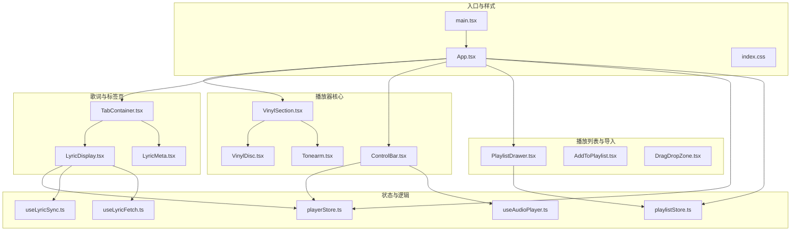
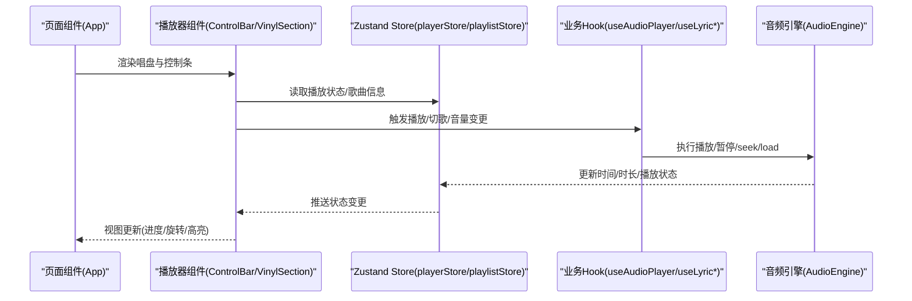
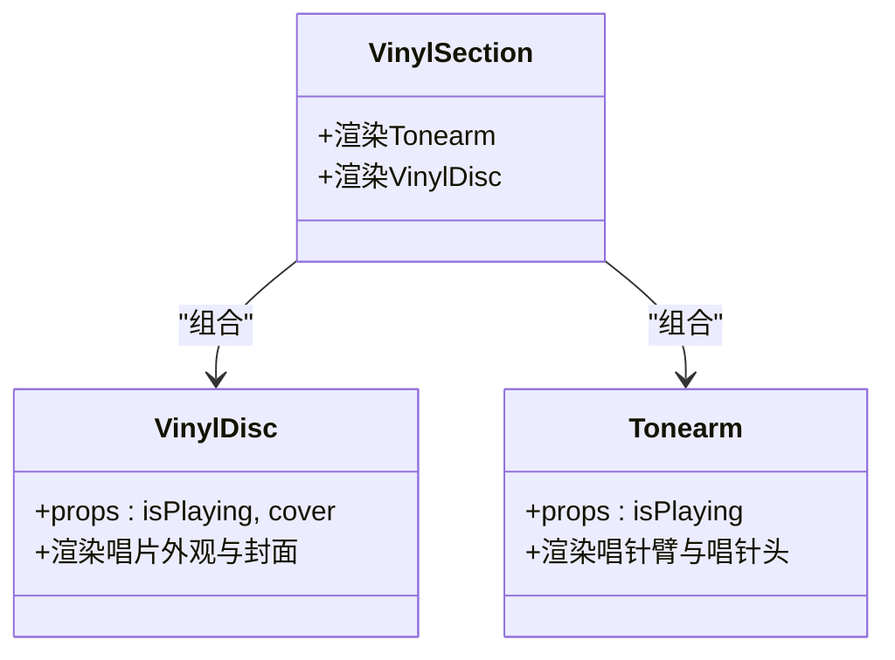
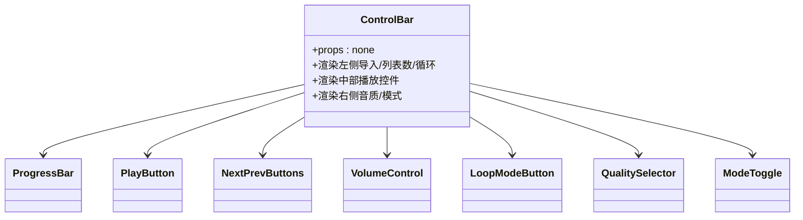
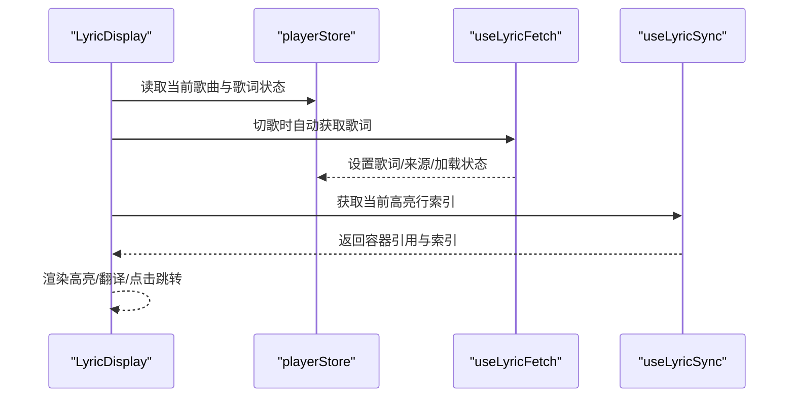
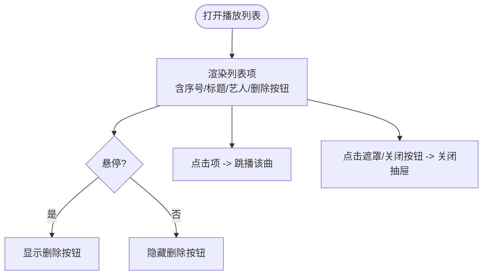
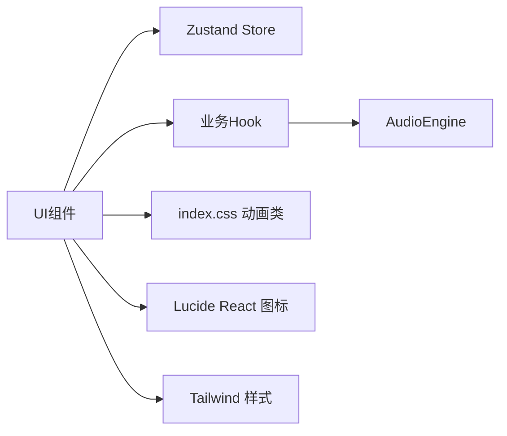

# UI组件系统

<cite>
**本文引用的文件**
- [src/App.tsx](file://src/App.tsx)
- [src/main.tsx](file://src/main.tsx)
- [src/index.css](file://src/index.css)
- [package.json](file://package.json)
- [src/components/Player/VinylSection.tsx](file://src/components/Player/VinylSection.tsx)
- [src/components/Player/VinylDisc.tsx](file://src/components/Player/VinylDisc.tsx)
- [src/components/Player/Tonearm.tsx](file://src/components/Player/Tonearm.tsx)
- [src/components/Controls/ControlBar.tsx](file://src/components/Controls/ControlBar.tsx)
- [src/components/Controls/ProgressBar.tsx](file://src/components/Controls/ProgressBar.tsx)
- [src/components/Controls/PlayButton.tsx](file://src/components/Controls/PlayButton.tsx)
- [src/components/Controls/NextPrevButtons.tsx](file://src/components/Controls/NextPrevButtons.tsx)
- [src/components/Controls/VolumeControl.tsx](file://src/components/Controls/VolumeControl.tsx)
- [src/components/Controls/LoopModeButton.tsx](file://src/components/Controls/LoopModeButton.tsx)
- [src/components/Controls/QualitySelector.tsx](file://src/components/Controls/QualitySelector.tsx)
- [src/components/Controls/ModeToggle.tsx](file://src/components/Controls/ModeToggle.tsx)
- [src/components/Lyrics/LyricDisplay.tsx](file://src/components/Lyrics/LyricDisplay.tsx)
- [src/components/Lyrics/LyricMeta.tsx](file://src/components/Lyrics/LyricMeta.tsx)
- [src/components/ContentTabs/TabContainer.tsx](file://src/components/ContentTabs/TabContainer.tsx)
- [src/components/ContentTabs/RecommendTab.tsx](file://src/components/ContentTabs/RecommendTab.tsx)
- [src/components/ContentTabs/WikiTab.tsx](file://src/components/ContentTabs/WikiTab.tsx)
- [src/components/Playlist/PlaylistDrawer.tsx](file://src/components/Playlist/PlaylistDrawer.tsx)
- [src/components/Playlist/AddToPlaylist.tsx](file://src/components/Playlist/AddToPlaylist.tsx)
- [src/components/SongInfo/FavoriteButton.tsx](file://src/components/SongInfo/FavoriteButton.tsx)
- [src/components/SongInfo/SongHeader.tsx](file://src/components/SongInfo/SongHeader.tsx)
- [src/components/FileImport/DragDropZone.tsx](file://src/components/FileImport/DragDropZone.tsx)
- [src/components/Background/DynamicGradient.tsx](file://src/components/Background/DynamicGradient.tsx)
- [src/store/playerStore.ts](file://src/store/playerStore.ts)
- [src/store/playlistStore.ts](file://src/store/playlistStore.ts)
- [src/hooks/useAudioPlayer.ts](file://src/hooks/useAudioPlayer.ts)
- [src/hooks/useLyricFetch.ts](file://src/hooks/useLyricFetch.ts)
- [src/hooks/useLyricSync.ts](file://src/hooks/useLyricSync.ts)
- [src/hooks/useKeyboardShortcuts.ts](file://src/hooks/useKeyboardShortcuts.ts)
- [src/hooks/useFileImport.ts](file://src/hooks/useFileImport.ts)
- [src/utils/timeFormat.ts](file://src/utils/timeFormat.ts)
- [src/core/AudioEngine.ts](file://src/core/AudioEngine.ts)
- [src/core/LyricParser.ts](file://src/core/LyricParser.ts)
- [src/core/ColorExtractor.ts](file://src/core/ColorExtractor.ts)
- [src/api/lyricApi.ts](file://src/api/lyricApi.ts)
- [src/api/types.ts](file://src/api/types.ts)
- [src/types/song.ts](file://src/types/song.ts)
- [src/types/player.ts](file://src/types/player.ts)
- [src/types/lyric.ts](file://src/types/lyric.ts)
</cite>

## 目录
1. [简介](#简介)
2. [项目结构](#项目结构)
3. [核心组件](#核心组件)
4. [架构总览](#架构总览)
5. [详细组件分析](#详细组件分析)
6. [依赖关系分析](#依赖关系分析)
7. [性能考量](#性能考量)
8. [故障排查指南](#故障排查指南)
9. [结论](#结论)
10. [附录](#附录)

## 简介
本文件为 My Music 2026 的 UI 组件系统文档，聚焦于唱盘动画组件、播放控制组件、歌词显示组件与播放列表组件等核心模块。文档从组件层次结构与设计理念出发，详细说明各组件的 props 接口、事件处理、状态管理与样式定制；解释组件间通信机制与数据传递模式；覆盖响应式设计、动画效果与用户体验优化；并提供使用示例、自定义配置与集成指南，同时涵盖可访问性与跨浏览器兼容性建议。

## 项目结构
应用采用按功能域分层的目录组织方式，核心 UI 组件位于 src/components 下，状态管理通过 Zustand Store 实现，业务逻辑与工具函数分布在 hooks、store、core、api、types 等目录中。入口文件负责渲染主界面与全局样式，页面级组件通过组合子组件完成复杂交互。

图表来源
- [src/main.tsx](file://src/main.tsx#L1-L11)
- [src/App.tsx](file://src/App.tsx#L1-L98)
- [src/index.css](file://src/index.css#L1-L94)
- [src/components/Player/VinylSection.tsx](file://src/components/Player/VinylSection.tsx#L1-L12)
- [src/components/Player/VinylDisc.tsx](file://src/components/Player/VinylDisc.tsx#L1-L44)
- [src/components/Player/Tonearm.tsx](file://src/components/Player/Tonearm.tsx#L1-L24)
- [src/components/Controls/ControlBar.tsx](file://src/components/Controls/ControlBar.tsx#L1-L105)
- [src/components/ContentTabs/TabContainer.tsx](file://src/components/ContentTabs/TabContainer.tsx#L1-L51)
- [src/components/Lyrics/LyricDisplay.tsx](file://src/components/Lyrics/LyricDisplay.tsx#L1-L102)
- [src/components/Playlist/PlaylistDrawer.tsx](file://src/components/Playlist/PlaylistDrawer.tsx#L1-L70)
- [src/store/playerStore.ts](file://src/store/playerStore.ts#L1-L95)
- [src/store/playlistStore.ts](file://src/store/playlistStore.ts#L1-L88)
- [src/hooks/useAudioPlayer.ts](file://src/hooks/useAudioPlayer.ts#L1-L131)
- [src/hooks/useLyricFetch.ts](file://src/hooks/useLyricFetch.ts)
- [src/hooks/useLyricSync.ts](file://src/hooks/useLyricSync.ts)

章节来源
- [src/main.tsx](file://src/main.tsx#L1-L11)
- [src/App.tsx](file://src/App.tsx#L1-L98)
- [src/index.css](file://src/index.css#L1-L94)

## 核心组件
本节概述关键 UI 组件及其职责与协作关系：
- 唱盘动画组件：VinylSection（容器）、VinylDisc（黑胶唱片）、Tonearm（唱针）构成旋转与触碰的拟真体验。
- 播放控制组件：ControlBar 聚合进度条、播放/暂停、上一首/下一首、音量、循环模式、音质选择、迷你/全屏切换等。
- 歌词显示组件：LyricDisplay 展示逐行歌词与翻译，并支持点击跳转与高亮同步。
- 播放列表组件：PlaylistDrawer 提供抽屉式播放列表浏览与操作，支持移除与跳播。
- 页面内容：TabContainer 管理“歌词/百科/相似推荐”标签页，配合 LyricMeta 与推荐/百科子组件。

章节来源
- [src/components/Player/VinylSection.tsx](file://src/components/Player/VinylSection.tsx#L1-L12)
- [src/components/Player/VinylDisc.tsx](file://src/components/Player/VinylDisc.tsx#L1-L44)
- [src/components/Player/Tonearm.tsx](file://src/components/Player/Tonearm.tsx#L1-L24)
- [src/components/Controls/ControlBar.tsx](file://src/components/Controls/ControlBar.tsx#L1-L105)
- [src/components/Lyrics/LyricDisplay.tsx](file://src/components/Lyrics/LyricDisplay.tsx#L1-L102)
- [src/components/Playlist/PlaylistDrawer.tsx](file://src/components/Playlist/PlaylistDrawer.tsx#L1-L70)
- [src/components/ContentTabs/TabContainer.tsx](file://src/components/ContentTabs/TabContainer.tsx#L1-L51)

## 架构总览
应用采用“页面容器 + 功能组件 + 状态与逻辑 Hook”的分层架构。页面容器 App 负责布局与全局状态联动；功能组件通过 Hooks 访问 Zustand Store 完成状态读写；动画与视觉效果由 CSS 动画与 Tailwind 类实现；音频与歌词逻辑通过独立模块注入到组件生命周期中。

图表来源
- [src/App.tsx](file://src/App.tsx#L15-L95)
- [src/components/Controls/ControlBar.tsx](file://src/components/Controls/ControlBar.tsx#L16-L104)
- [src/components/Player/VinylSection.tsx](file://src/components/Player/VinylSection.tsx#L4-L11)
- [src/store/playerStore.ts](file://src/store/playerStore.ts#L42-L94)
- [src/hooks/useAudioPlayer.ts](file://src/hooks/useAudioPlayer.ts#L6-L130)
- [src/core/AudioEngine.ts](file://src/core/AudioEngine.ts)

## 详细组件分析

### 唱盘动画组件
- VinylSection：作为容器，组合 Tonearm 与 VinylDisc，统一管理动画上下文。
- VinylDisc：根据播放状态动态应用 CSS 动画类，展示封面或默认图标；内部绘制多层圆环与中心圆点以模拟黑胶质感。
- Tonearm：依据播放状态切换“抬起/放下”动画类，实现唱针触碰与离盘的物理感。

图表来源
- [src/components/Player/VinylSection.tsx](file://src/components/Player/VinylSection.tsx#L1-L12)
- [src/components/Player/VinylDisc.tsx](file://src/components/Player/VinylDisc.tsx#L1-L44)
- [src/components/Player/Tonearm.tsx](file://src/components/Player/Tonearm.tsx#L1-L24)

章节来源
- [src/components/Player/VinylSection.tsx](file://src/components/Player/VinylSection.tsx#L1-L12)
- [src/components/Player/VinylDisc.tsx](file://src/components/Player/VinylDisc.tsx#L1-L44)
- [src/components/Player/Tonearm.tsx](file://src/components/Player/Tonearm.tsx#L1-L24)
- [src/index.css](file://src/index.css#L52-L88)

### 播放控制组件
- ControlBar：底部固定控制栏，聚合进度条、播放/暂停、上一首/下一首、音量、循环模式、音质选择、迷你/全屏切换、收藏与添加到歌单等。
- ProgressBar：基于播放进度与总时长渲染进度条。
- PlayButton：播放/暂停切换。
- NextPrevButtons：上一首/下一首导航。
- VolumeControl：音量调节与静音。
- LoopModeButton：循环模式切换（列表/单曲/随机）。
- QualitySelector：音质选择。
- ModeToggle：迷你/全屏模式切换。

图表来源
- [src/components/Controls/ControlBar.tsx](file://src/components/Controls/ControlBar.tsx#L1-L105)
- [src/components/Controls/ProgressBar.tsx](file://src/components/Controls/ProgressBar.tsx)
- [src/components/Controls/PlayButton.tsx](file://src/components/Controls/PlayButton.tsx)
- [src/components/Controls/NextPrevButtons.tsx](file://src/components/Controls/NextPrevButtons.tsx)
- [src/components/Controls/VolumeControl.tsx](file://src/components/Controls/VolumeControl.tsx)
- [src/components/Controls/LoopModeButton.tsx](file://src/components/Controls/LoopModeButton.tsx)
- [src/components/Controls/QualitySelector.tsx](file://src/components/Controls/QualitySelector.tsx)
- [src/components/Controls/ModeToggle.tsx](file://src/components/Controls/ModeToggle.tsx)

章节来源
- [src/components/Controls/ControlBar.tsx](file://src/components/Controls/ControlBar.tsx#L1-L105)

### 歌词显示组件
- LyricDisplay：根据当前歌曲自动拉取/刷新歌词，渲染逐行歌词与翻译，支持点击跳转与高亮同步；加载中与无歌词状态分别提供反馈与重试入口。
- LyricMeta：与歌词相关的元信息展示（如来源标识）。
- useLyricFetch/useLyricSync：封装歌词获取与高亮同步逻辑。

图表来源
- [src/components/Lyrics/LyricDisplay.tsx](file://src/components/Lyrics/LyricDisplay.tsx#L1-L102)
- [src/hooks/useLyricFetch.ts](file://src/hooks/useLyricFetch.ts)
- [src/hooks/useLyricSync.ts](file://src/hooks/useLyricSync.ts)
- [src/store/playerStore.ts](file://src/store/playerStore.ts#L8-L40)

章节来源
- [src/components/Lyrics/LyricDisplay.tsx](file://src/components/Lyrics/LyricDisplay.tsx#L1-L102)
- [src/components/Lyrics/LyricMeta.tsx](file://src/components/Lyrics/LyricMeta.tsx)

### 播放列表组件
- PlaylistDrawer：抽屉式播放列表，支持关闭、删除、跳播当前项；与播放状态联动高亮当前曲目。
- AddToPlaylist：向用户歌单添加歌曲。

图表来源
- [src/components/Playlist/PlaylistDrawer.tsx](file://src/components/Playlist/PlaylistDrawer.tsx#L1-L70)
- [src/components/Playlist/AddToPlaylist.tsx](file://src/components/Playlist/AddToPlaylist.tsx)

章节来源
- [src/components/Playlist/PlaylistDrawer.tsx](file://src/components/Playlist/PlaylistDrawer.tsx#L1-L70)

### 页面内容与标签页
- TabContainer：提供“歌词/百科/相似推荐”三个标签页，切换时渲染对应内容区。
- WikiTab/RecommendTab：内容页占位组件，用于扩展百科与推荐能力。

章节来源
- [src/components/ContentTabs/TabContainer.tsx](file://src/components/ContentTabs/TabContainer.tsx#L1-L51)
- [src/components/ContentTabs/WikiTab.tsx](file://src/components/ContentTabs/WikiTab.tsx)
- [src/components/ContentTabs/RecommendTab.tsx](file://src/components/ContentTabs/RecommendTab.tsx)

### 文件导入与背景
- DragDropZone：空态下的文件拖拽导入区。
- DynamicGradient：基于封面提取的颜色生成动态背景渐变。

章节来源
- [src/components/FileImport/DragDropZone.tsx](file://src/components/FileImport/DragDropZone.tsx)
- [src/components/Background/DynamicGradient.tsx](file://src/components/Background/DynamicGradient.tsx)
- [src/App.tsx](file://src/App.tsx#L15-L95)

## 依赖关系分析
- 组件与状态：所有 UI 组件通过 playerStore/playlistStore 读取与写入状态；ControlBar 与 VinylSection 通过 useAudioPlayer 驱动音频引擎。
- 动画与样式：CSS 动画类（旋转、唱针、心跳、过渡）集中于 index.css，组件通过条件类名切换状态。
- 外部库：React、Tailwind、Lucide React、Zustand、ColorThief 等。

图表来源
- [src/index.css](file://src/index.css#L1-L94)
- [package.json](file://package.json#L12-L36)
- [src/store/playerStore.ts](file://src/store/playerStore.ts#L1-L95)
- [src/store/playlistStore.ts](file://src/store/playlistStore.ts#L1-L88)
- [src/hooks/useAudioPlayer.ts](file://src/hooks/useAudioPlayer.ts#L1-L131)
- [src/core/AudioEngine.ts](file://src/core/AudioEngine.ts)

章节来源
- [package.json](file://package.json#L12-L36)
- [src/index.css](file://src/index.css#L1-L94)

## 性能考量
- 唱盘旋转动画：使用 will-change 与线性动画减少重绘开销；暂停时使用动画状态控制避免不必要的计算。
- 歌词滚动高亮：容器使用 mask-image 与 scroll-smooth，避免频繁 DOM 重排；点击跳转通过引擎 seek 与状态同步，避免重复解析。
- 状态持久化：Zustand persist 仅保存必要字段，降低本地存储体积与序列化成本。
- 图片与封面：未设置封面时延迟从 API 获取，避免无效请求；封面更新通过 store 批量同步，减少重复渲染。

章节来源
- [src/index.css](file://src/index.css#L52-L93)
- [src/store/playerStore.ts](file://src/store/playerStore.ts#L83-L92)
- [src/store/playlistStore.ts](file://src/store/playlistStore.ts#L79-L85)
- [src/App.tsx](file://src/App.tsx#L34-L46)

## 故障排查指南
- 自动播放受限：播放失败时捕获异常，等待用户交互后重试，确保浏览器策略合规。
- 歌词获取失败：提供“重新获取”按钮与加载状态提示，避免阻塞主流程。
- 封面缺失：检测当前歌曲封面为空时，尝试从 API 获取并回填至 store，保证 UI 一致性。
- 键盘快捷键：注册全局快捷键监听，避免重复绑定与内存泄漏。

章节来源
- [src/hooks/useAudioPlayer.ts](file://src/hooks/useAudioPlayer.ts#L70-L75)
- [src/components/Lyrics/LyricDisplay.tsx](file://src/components/Lyrics/LyricDisplay.tsx#L23-L49)
- [src/App.tsx](file://src/App.tsx#L34-L46)
- [src/hooks/useKeyboardShortcuts.ts](file://src/hooks/useKeyboardShortcuts.ts)

## 结论
本 UI 组件系统以清晰的功能域划分与轻量的状态管理为核心，结合 CSS 动画与响应式布局，实现了流畅的拟真唱盘体验与稳定的播放控制流。通过 Hook 将业务逻辑解耦，组件间通过 Store 协同，具备良好的可维护性与扩展性。后续可在无障碍与跨浏览器兼容方面进一步完善。

## 附录

### 组件 Props 接口与事件
- ControlBar
  - 无外部 props；内部通过 store 读取状态，通过 hooks 触发动作。
- VinylDisc
  - props: isPlaying, cover
- Tonearm
  - props: isPlaying
- LyricDisplay
  - props: 无；内部通过 store 与 hooks 管理歌词与高亮。
- PlaylistDrawer
  - props: 无；通过 store 控制显示与列表数据。
- TabContainer
  - props: 无；内部维护 activeTab 状态。

章节来源
- [src/components/Controls/ControlBar.tsx](file://src/components/Controls/ControlBar.tsx#L16-L29)
- [src/components/Player/VinylDisc.tsx](file://src/components/Player/VinylDisc.tsx#L4-L7)
- [src/components/Player/Tonearm.tsx](file://src/components/Player/Tonearm.tsx#L3-L5)
- [src/components/Lyrics/LyricDisplay.tsx](file://src/components/Lyrics/LyricDisplay.tsx#L7-L13)
- [src/components/Playlist/PlaylistDrawer.tsx](file://src/components/Playlist/PlaylistDrawer.tsx#L6-L14)
- [src/components/ContentTabs/TabContainer.tsx](file://src/components/ContentTabs/TabContainer.tsx#L15-L16)

### 状态管理与数据流
- playerStore：播放状态、当前歌曲、循环模式、音质、歌词、播放器模式、播放列表可见性等。
- playlistStore：播放列表、收藏、用户歌单、封面更新等。
- useAudioPlayer：封装播放/暂停/切歌/seek 等音频控制逻辑，订阅引擎事件并同步状态。

章节来源
- [src/store/playerStore.ts](file://src/store/playerStore.ts#L8-L40)
- [src/store/playlistStore.ts](file://src/store/playlistStore.ts#L12-L27)
- [src/hooks/useAudioPlayer.ts](file://src/hooks/useAudioPlayer.ts#L6-L130)

### 动画与样式定制
- 唱盘旋转：通过 CSS 动画类与 will-change 控制；暂停时切换状态类。
- 唱针触碰：通过 CSS transition 实现自然回弹。
- 心跳动画：收藏按钮的心跳效果，适合交互反馈。
- 歌词高亮：行元素过渡动画，提升阅读体验。

章节来源
- [src/index.css](file://src/index.css#L52-L93)

### 响应式设计与布局
- 全屏模式：左侧唱盘区域固定宽度，右侧内容自适应；底部控制条固定定位。
- 迷你模式：仅展示歌曲信息与唱盘缩略视图。
- 抽屉式播放列表：右侧滑出，遮罩层点击关闭，适配移动端。

章节来源
- [src/App.tsx](file://src/App.tsx#L50-L94)
- [src/components/Playlist/PlaylistDrawer.tsx](file://src/components/Playlist/PlaylistDrawer.tsx#L17-L21)

### 用户体验优化
- 自动播放限制处理：等待用户交互后恢复播放。
- 歌词加载与刷新：提供加载指示与手动刷新入口。
- 封面回填：无封面时自动从 API 获取，提升首屏体验。
- 键盘快捷键：全局快捷键支持，提升可访问性。

章节来源
- [src/hooks/useAudioPlayer.ts](file://src/hooks/useAudioPlayer.ts#L70-L75)
- [src/components/Lyrics/LyricDisplay.tsx](file://src/components/Lyrics/LyricDisplay.tsx#L23-L49)
- [src/App.tsx](file://src/App.tsx#L34-L46)
- [src/hooks/useKeyboardShortcuts.ts](file://src/hooks/useKeyboardShortcuts.ts)

### 可访问性与跨浏览器兼容
- 可访问性：为按钮提供 aria-label 与 title；使用语义化标签与键盘可达性；避免纯图标无文本。
- 跨浏览器：CSS 动画使用标准属性；滚动条样式使用 WebKit 前缀；图片懒加载与降级方案需按需补充。

章节来源
- [src/components/Controls/ControlBar.tsx](file://src/components/Controls/ControlBar.tsx#L40-L47)
- [src/index.css](file://src/index.css#L35-L50)

### 组件使用示例与集成指南
- 在页面容器中引入 VinylSection、SongHeader、TabContainer、ControlBar、PlaylistDrawer 并按布局拼装。
- 通过 useAudioPlayer 钩子在需要的地方调用播放/暂停/切歌/seek。
- 通过 playerStore/playlistStore 的 actions 更新状态与数据。
- 如需自定义动画或样式，可在 index.css 中扩展类名并在组件中按需切换。

章节来源
- [src/App.tsx](file://src/App.tsx#L50-L94)
- [src/hooks/useAudioPlayer.ts](file://src/hooks/useAudioPlayer.ts#L121-L130)
- [src/store/playerStore.ts](file://src/store/playerStore.ts#L60-L82)
- [src/store/playlistStore.ts](file://src/store/playlistStore.ts#L36-L77)
- [src/index.css](file://src/index.css#L52-L93)