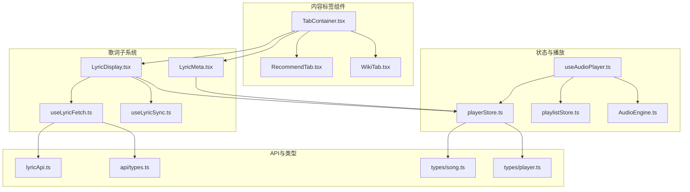
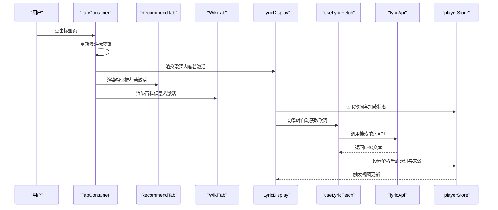
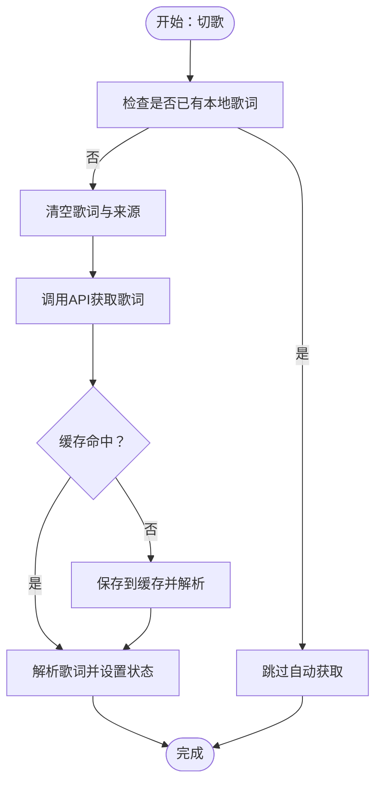
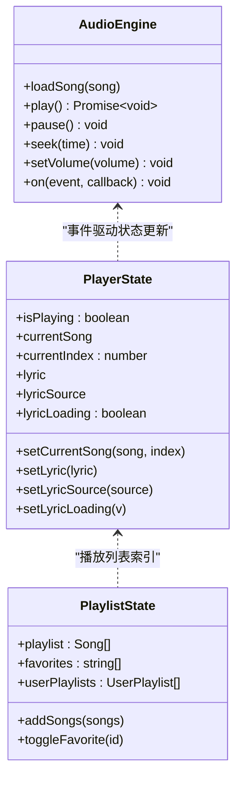
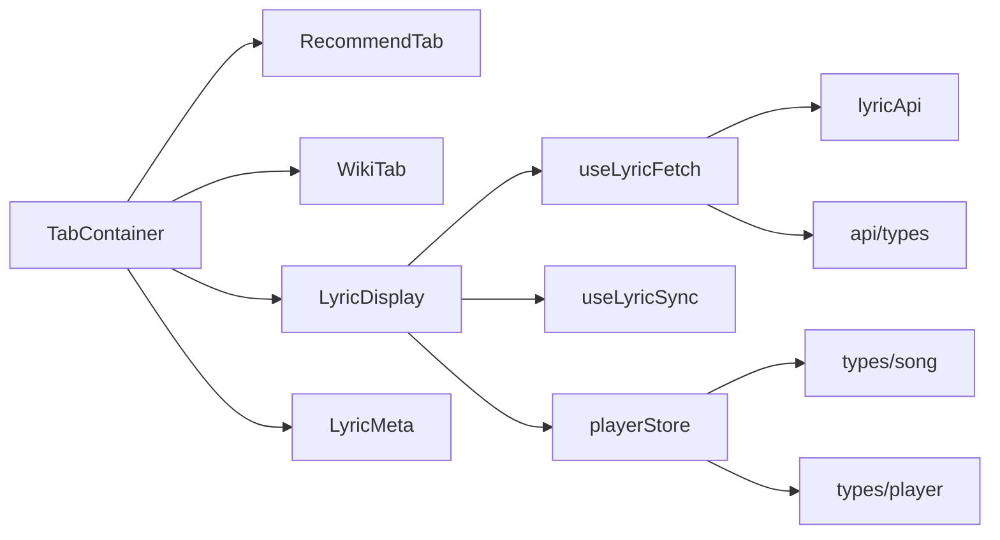

# 内容标签组件

<cite>
**本文引用的文件**
- [src/components/ContentTabs/TabContainer.tsx](file://src/components/ContentTabs/TabContainer.tsx)
- [src/components/ContentTabs/RecommendTab.tsx](file://src/components/ContentTabs/RecommendTab.tsx)
- [src/components/ContentTabs/WikiTab.tsx](file://src/components/ContentTabs/WikiTab.tsx)
- [src/components/Lyrics/LyricMeta.tsx](file://src/components/Lyrics/LyricMeta.tsx)
- [src/components/Lyrics/LyricDisplay.tsx](file://src/components/Lyrics/LyricDisplay.tsx)
- [src/hooks/useLyricFetch.ts](file://src/hooks/useLyricFetch.ts)
- [src/hooks/useLyricSync.ts](file://src/hooks/useLyricSync.ts)
- [src/hooks/useAudioPlayer.ts](file://src/hooks/useAudioPlayer.ts)
- [src/store/playerStore.ts](file://src/store/playerStore.ts)
- [src/store/playlistStore.ts](file://src/store/playlistStore.ts)
- [src/api/lyricApi.ts](file://src/api/lyricApi.ts)
- [src/api/types.ts](file://src/api/types.ts)
- [src/core/AudioEngine.ts](file://src/core/AudioEngine.ts)
- [src/types/song.ts](file://src/types/song.ts)
- [src/types/player.ts](file://src/types/player.ts)
</cite>

## 目录
1. [简介](#简介)
2. [项目结构](#项目结构)
3. [核心组件](#核心组件)
4. [架构总览](#架构总览)
5. [详细组件分析](#详细组件分析)
6. [依赖关系分析](#依赖关系分析)
7. [性能考虑](#性能考虑)
8. [故障排查指南](#故障排查指南)
9. [结论](#结论)
10. [附录](#附录)

## 简介
本文件为 My Music 2026 的“内容标签组件”技术文档，聚焦于 Tab 容器系统的设计与实现，包括：
- TabContainer 主容器：负责标签导航与内容区域的组织
- RecommendTab 推荐内容：展示相似歌曲推荐占位
- WikiTab 百科信息：展示艺人/专辑百科占位
- 歌词子系统：LyricMeta 与 LyricDisplay 的联动，配合歌词获取与同步逻辑
- 状态管理：Zustand store 在播放器与歌词中的应用
- 性能与体验：懒加载、缓存、防抖、滚动对齐等策略
- 可扩展性：歌词 API、歌词解析、播放引擎等模块化设计

## 项目结构
内容标签组件位于 src/components/ContentTabs 下，配合歌词子系统、状态存储与播放引擎协同工作。

图表来源
- [src/components/ContentTabs/TabContainer.tsx](file://src/components/ContentTabs/TabContainer.tsx#L1-L51)
- [src/components/ContentTabs/RecommendTab.tsx](file://src/components/ContentTabs/RecommendTab.tsx#L1-L21)
- [src/components/ContentTabs/WikiTab.tsx](file://src/components/ContentTabs/WikiTab.tsx#L1-L21)
- [src/components/Lyrics/LyricMeta.tsx](file://src/components/Lyrics/LyricMeta.tsx#L1-L19)
- [src/components/Lyrics/LyricDisplay.tsx](file://src/components/Lyrics/LyricDisplay.tsx#L1-L102)
- [src/hooks/useLyricFetch.ts](file://src/hooks/useLyricFetch.ts#L1-L95)
- [src/hooks/useLyricSync.ts](file://src/hooks/useLyricSync.ts#L1-L33)
- [src/store/playerStore.ts](file://src/store/playerStore.ts#L1-L95)
- [src/store/playlistStore.ts](file://src/store/playlistStore.ts#L1-L88)
- [src/hooks/useAudioPlayer.ts](file://src/hooks/useAudioPlayer.ts#L1-L131)
- [src/core/AudioEngine.ts](file://src/core/AudioEngine.ts#L1-L143)
- [src/api/lyricApi.ts](file://src/api/lyricApi.ts#L1-L129)
- [src/api/types.ts](file://src/api/types.ts#L1-L26)
- [src/types/song.ts](file://src/types/song.ts#L1-L14)
- [src/types/player.ts](file://src/types/player.ts#L1-L4)

章节来源
- [src/components/ContentTabs/TabContainer.tsx](file://src/components/ContentTabs/TabContainer.tsx#L1-L51)
- [src/components/ContentTabs/RecommendTab.tsx](file://src/components/ContentTabs/RecommendTab.tsx#L1-L21)
- [src/components/ContentTabs/WikiTab.tsx](file://src/components/ContentTabs/WikiTab.tsx#L1-L21)
- [src/components/Lyrics/LyricMeta.tsx](file://src/components/Lyrics/LyricMeta.tsx#L1-L19)
- [src/components/Lyrics/LyricDisplay.tsx](file://src/components/Lyrics/LyricDisplay.tsx#L1-L102)

## 核心组件
- TabContainer：定义三类标签页（歌词、百科、相似推荐），维护当前激活标签页状态，并按需渲染对应内容区。
- RecommendTab：基于当前播放歌曲显示“相似推荐”占位提示。
- WikiTab：基于当前播放歌曲显示“百科信息”占位提示。
- LyricMeta：根据歌词元信息渲染词/曲/编信息。
- LyricDisplay：渲染歌词列表、高亮当前行、支持点击跳转与刷新歌词。

章节来源
- [src/components/ContentTabs/TabContainer.tsx](file://src/components/ContentTabs/TabContainer.tsx#L7-L13)
- [src/components/ContentTabs/RecommendTab.tsx](file://src/components/ContentTabs/RecommendTab.tsx#L4-L18)
- [src/components/ContentTabs/WikiTab.tsx](file://src/components/ContentTabs/WikiTab.tsx#L4-L17)
- [src/components/Lyrics/LyricMeta.tsx](file://src/components/Lyrics/LyricMeta.tsx#L3-L16)
- [src/components/Lyrics/LyricDisplay.tsx](file://src/components/Lyrics/LyricDisplay.tsx#L7-L49)

## 架构总览
内容标签组件通过状态驱动的标签切换，结合歌词子系统的懒加载与同步机制，形成“播放状态 → 歌词状态 → 视图渲染”的闭环；同时与播放引擎解耦，通过 Hook 抽象对外暴露统一接口。

图表来源
- [src/components/ContentTabs/TabContainer.tsx](file://src/components/ContentTabs/TabContainer.tsx#L15-L49)
- [src/components/ContentTabs/RecommendTab.tsx](file://src/components/ContentTabs/RecommendTab.tsx#L4-L18)
- [src/components/ContentTabs/WikiTab.tsx](file://src/components/ContentTabs/WikiTab.tsx#L4-L17)
- [src/components/Lyrics/LyricDisplay.tsx](file://src/components/Lyrics/LyricDisplay.tsx#L15-L20)
- [src/hooks/useLyricFetch.ts](file://src/hooks/useLyricFetch.ts#L65-L79)
- [src/api/lyricApi.ts](file://src/api/lyricApi.ts#L86-L119)
- [src/store/playerStore.ts](file://src/store/playerStore.ts#L8-L40)

## 详细组件分析

### TabContainer 主容器
- 设计要点
  - 使用受控状态维护当前激活标签键，避免外部状态污染
  - 标签导航采用简洁的按钮组，支持悬停与选中态切换
  - 内容区按需渲染，减少不必要的组件实例化
- 数据流
  - 状态：激活标签键
  - 行为：点击切换、条件渲染对应子组件
- 样式与交互
  - 选中态强调色与半透明背景，未选中态悬停变色
  - 内容区使用 Flex 布局，保证歌词/百科/推荐区域自适应高度

章节来源
- [src/components/ContentTabs/TabContainer.tsx](file://src/components/ContentTabs/TabContainer.tsx#L15-L49)

### RecommendTab 推荐内容
- 功能说明
  - 当存在当前播放歌曲时，显示与该歌曲相关的推荐提示
  - 无歌曲时提示“请先选择一首歌曲”
- 依赖
  - 从播放状态读取当前歌曲信息
- 扩展建议
  - 后续版本接入推荐算法，动态生成相似歌曲列表

章节来源
- [src/components/ContentTabs/RecommendTab.tsx](file://src/components/ContentTabs/RecommendTab.tsx#L4-L18)
- [src/store/playerStore.ts](file://src/store/playerStore.ts#L8-L23)

### WikiTab 百科信息
- 功能说明
  - 当存在当前播放歌曲时，显示关于艺人/专辑的百科信息提示
  - 无歌曲时提示“请先选择一首歌曲”
- 依赖
  - 从播放状态读取当前歌曲信息
- 扩展建议
  - 后续版本接入百科 API，按艺人/专辑维度拉取结构化数据

章节来源
- [src/components/ContentTabs/WikiTab.tsx](file://src/components/ContentTabs/WikiTab.tsx#L4-L17)
- [src/store/playerStore.ts](file://src/store/playerStore.ts#L8-L23)

### 歌词子系统（LyricMeta 与 LyricDisplay）
- LyricMeta
  - 读取歌词元信息（词/曲/编），仅在存在有效字段时渲染
- LyricDisplay
  - 自动获取歌词：切歌时触发，避免重复请求
  - 加载中状态：显示加载指示与文案
  - 无歌词处理：提供“重新获取”按钮，支持手动刷新
  - 歌词渲染：逐行高亮当前行，支持点击跳转到指定时间点
  - 来源标识：当歌词来自在线 API 时显示来源与刷新入口

章节来源
- [src/components/Lyrics/LyricMeta.tsx](file://src/components/Lyrics/LyricMeta.tsx#L3-L16)
- [src/components/Lyrics/LyricDisplay.tsx](file://src/components/Lyrics/LyricDisplay.tsx#L7-L49)
- [src/components/Lyrics/LyricDisplay.tsx](file://src/components/Lyrics/LyricDisplay.tsx#L54-L65)
- [src/components/Lyrics/LyricDisplay.tsx](file://src/components/Lyrics/LyricDisplay.tsx#L72-L96)

### 歌词获取与同步（Hook 与 API）
- useLyricFetch
  - 自动获取：仅在没有本地歌词时调用 API
  - 手动刷新：清空歌词后强制从 API 重新获取
  - 防抖/竞态：通过内部递增 ID 控制请求生命周期，避免快速切歌导致的竞态
  - 缓存：命中缓存直接返回，未命中则写入缓存
- useLyricSync
  - 基于播放时间计算当前行索引
  - 自动滚动至当前行附近，保持视觉居中
- lyricApi
  - 带超时与重试的网络封装
  - 缓存键命名与过期控制
  - 优先返回带时间戳歌词，其次返回纯文本歌词
- 类型与状态
  - 歌词来源类型：local / api / null
  - 歌词缓存条目结构：包含 LRC 文本与时间戳

图表来源
- [src/hooks/useLyricFetch.ts](file://src/hooks/useLyricFetch.ts#L65-L79)
- [src/hooks/useLyricFetch.ts](file://src/hooks/useLyricFetch.ts#L23-L60)
- [src/api/lyricApi.ts](file://src/api/lyricApi.ts#L55-L78)
- [src/api/lyricApi.ts](file://src/api/lyricApi.ts#L86-L119)

章节来源
- [src/hooks/useLyricFetch.ts](file://src/hooks/useLyricFetch.ts#L12-L94)
- [src/hooks/useLyricSync.ts](file://src/hooks/useLyricSync.ts#L5-L32)
- [src/api/lyricApi.ts](file://src/api/lyricApi.ts#L18-L47)
- [src/api/lyricApi.ts](file://src/api/lyricApi.ts#L55-L78)
- [src/api/lyricApi.ts](file://src/api/lyricApi.ts#L86-L119)
- [src/api/types.ts](file://src/api/types.ts#L13-L25)

### 状态管理与播放引擎
- playerStore
  - 维护播放状态、歌词状态、播放列表索引、循环模式、音质等
  - 提供歌词设置、来源标记、加载状态等方法
- playlistStore
  - 维护播放列表、收藏、用户歌单等
- useAudioPlayer
  - 将播放引擎事件映射到状态，处理切歌、循环、随机播放、跳转等
- AudioEngine
  - 封装 HTMLAudioElement，提供事件回调、播放/暂停/跳转/音量控制等

图表来源
- [src/core/AudioEngine.ts](file://src/core/AudioEngine.ts#L7-L137)
- [src/store/playerStore.ts](file://src/store/playerStore.ts#L8-L40)
- [src/store/playlistStore.ts](file://src/store/playlistStore.ts#L12-L27)

章节来源
- [src/store/playerStore.ts](file://src/store/playerStore.ts#L42-L94)
- [src/store/playlistStore.ts](file://src/store/playlistStore.ts#L29-L87)
- [src/hooks/useAudioPlayer.ts](file://src/hooks/useAudioPlayer.ts#L6-L129)
- [src/core/AudioEngine.ts](file://src/core/AudioEngine.ts#L17-L137)

## 依赖关系分析
- 组件间依赖
  - TabContainer 依赖 RecommendTab、WikiTab 与歌词子组件
  - LyricDisplay 依赖 useLyricFetch、useLyricSync 与 playerStore
- 外部依赖
  - API 层：lyricApi 提供歌词搜索与缓存
  - 类型层：song 与 player 类型约束状态结构
- 状态依赖
  - playerStore 与 playlistStore 为播放与歌词状态提供单一事实来源

图表来源
- [src/components/ContentTabs/TabContainer.tsx](file://src/components/ContentTabs/TabContainer.tsx#L1-L5)
- [src/components/Lyrics/LyricDisplay.tsx](file://src/components/Lyrics/LyricDisplay.tsx#L1-L13)
- [src/hooks/useLyricFetch.ts](file://src/hooks/useLyricFetch.ts#L1-L5)
- [src/api/lyricApi.ts](file://src/api/lyricApi.ts#L1-L5)
- [src/api/types.ts](file://src/api/types.ts#L1-L26)
- [src/store/playerStore.ts](file://src/store/playerStore.ts#L1-L7)
- [src/types/song.ts](file://src/types/song.ts#L1-L14)
- [src/types/player.ts](file://src/types/player.ts#L1-L4)

章节来源
- [src/components/ContentTabs/TabContainer.tsx](file://src/components/ContentTabs/TabContainer.tsx#L1-L5)
- [src/components/Lyrics/LyricDisplay.tsx](file://src/components/Lyrics/LyricDisplay.tsx#L1-L13)
- [src/hooks/useLyricFetch.ts](file://src/hooks/useLyricFetch.ts#L1-L5)
- [src/api/lyricApi.ts](file://src/api/lyricApi.ts#L1-L5)
- [src/store/playerStore.ts](file://src/store/playerStore.ts#L1-L7)

## 性能考虑
- 懒加载与按需渲染
  - TabContainer 仅渲染当前激活标签内容，降低初始渲染压力
- 歌词获取防抖与竞态控制
  - useLyricFetch 使用内部递增 ID 防止快速切歌导致的竞态与重复请求
- 缓存策略
  - lyricApi 实现本地缓存与过期控制，命中缓存直接返回，显著降低网络请求
- 滚动与高亮
  - useLyricSync 仅在当前行变化时滚动，避免频繁 DOM 访问
- 状态持久化
  - playerStore 与 playlistStore 使用持久化中间件，提升用户体验一致性

章节来源
- [src/components/ContentTabs/TabContainer.tsx](file://src/components/ContentTabs/TabContainer.tsx#L38-L46)
- [src/hooks/useLyricFetch.ts](file://src/hooks/useLyricFetch.ts#L17-L60)
- [src/api/lyricApi.ts](file://src/api/lyricApi.ts#L55-L78)
- [src/hooks/useLyricSync.ts](file://src/hooks/useLyricSync.ts#L20-L29)
- [src/store/playerStore.ts](file://src/store/playerStore.ts#L83-L93)
- [src/store/playlistStore.ts](file://src/store/playlistStore.ts#L79-L86)

## 故障排查指南
- 歌词无法加载
  - 检查当前歌曲是否存在且非“未知歌手”，API 仅对有效标题/艺人发起请求
  - 查看网络面板确认请求是否被拦截或超时
  - 清除缓存后重试，确认缓存键与过期时间配置
- 歌词加载中状态卡住
  - 确认播放状态事件是否正常触发（timeupdate/durationchange）
  - 检查 useLyricFetch 的请求生命周期是否被新的请求覆盖
- 歌词高亮不同步
  - 确认 useLyricSync 的当前时间与歌词时间线一致
  - 检查歌词解析是否包含时间戳
- 播放异常
  - 检查浏览器自动播放策略，必要时增加用户交互后再触发播放
  - 使用 AudioEngine 的错误回调定位具体问题

章节来源
- [src/hooks/useLyricFetch.ts](file://src/hooks/useLyricFetch.ts#L23-L58)
- [src/api/lyricApi.ts](file://src/api/lyricApi.ts#L18-L47)
- [src/hooks/useLyricSync.ts](file://src/hooks/useLyricSync.ts#L11-L18)
- [src/core/AudioEngine.ts](file://src/core/AudioEngine.ts#L54-L61)

## 结论
内容标签组件以简洁的状态驱动方式实现了标签页切换与内容渲染，歌词子系统通过 Hook 与 API 形成稳定的获取与同步链路，并辅以缓存与防抖策略保障性能。未来可在推荐与百科模块引入真实数据源，在播放引擎与歌词解析层面进一步扩展能力，同时完善 SEO 与性能监控指标以提升整体体验。

## 附录
- 样式与动画
  - 标签页切换采用平滑过渡与悬停反馈，选中态强调色突出当前状态
  - 歌词滚动采用平滑行为，确保当前行稳定出现在可视区域
- 响应式布局
  - 使用 Flex 布局与最小高度约束，适配不同屏幕尺寸
- 扩展接口与插件机制
  - 建议在 lyricApi 中新增更多歌词源与解析器，通过配置化扩展
  - 在 TabContainer 中以配置数组形式扩展新标签页，遵循现有接口约定
- 第三方集成
  - 推荐/百科模块预留占位，便于接入外部服务（如音乐平台 API、维基百科）
- SEO 与性能监控
  - 建议在歌词与百科内容区添加结构化数据与可访问性属性
  - 在关键路径（歌词获取、播放事件）埋点，收集加载耗时与错误率