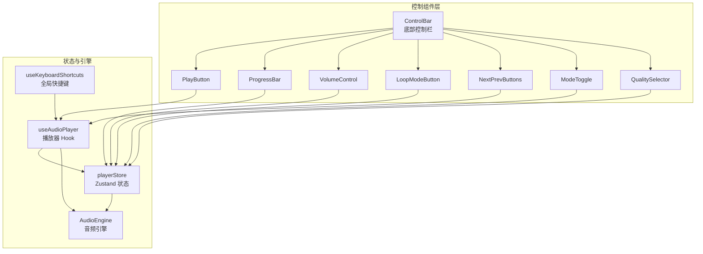
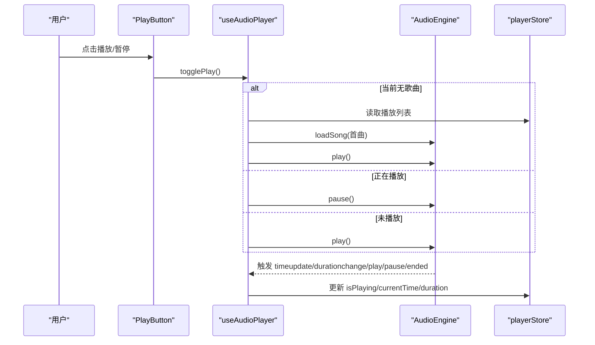
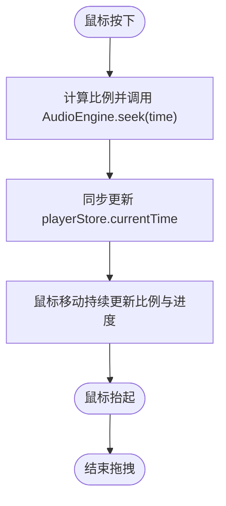
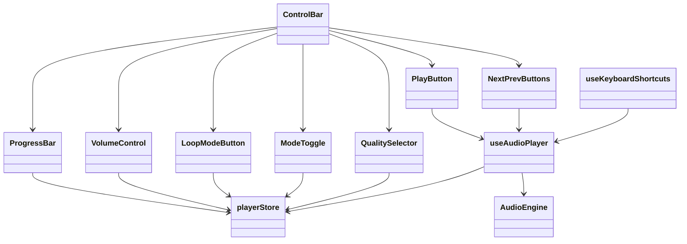

# 控制组件

<cite>
**本文引用的文件**
- [src/components/Controls/ControlBar.tsx](file://src/components/Controls/ControlBar.tsx)
- [src/components/Controls/PlayButton.tsx](file://src/components/Controls/PlayButton.tsx)
- [src/components/Controls/ProgressBar.tsx](file://src/components/Controls/ProgressBar.tsx)
- [src/components/Controls/VolumeControl.tsx](file://src/components/Controls/VolumeControl.tsx)
- [src/components/Controls/LoopModeButton.tsx](file://src/components/Controls/LoopModeButton.tsx)
- [src/components/Controls/NextPrevButtons.tsx](file://src/components/Controls/NextPrevButtons.tsx)
- [src/components/Controls/ModeToggle.tsx](file://src/components/Controls/ModeToggle.tsx)
- [src/components/Controls/QualitySelector.tsx](file://src/components/Controls/QualitySelector.tsx)
- [src/hooks/useAudioPlayer.ts](file://src/hooks/useAudioPlayer.ts)
- [src/hooks/useKeyboardShortcuts.ts](file://src/hooks/useKeyboardShortcuts.ts)
- [src/store/playerStore.ts](file://src/store/playerStore.ts)
- [src/types/player.ts](file://src/types/player.ts)
- [src/utils/timeFormat.ts](file://src/utils/timeFormat.ts)
- [src/core/AudioEngine.ts](file://src/core/AudioEngine.ts)
</cite>

## 目录
1. [简介](#简介)
2. [项目结构](#项目结构)
3. [核心组件](#核心组件)
4. [架构总览](#架构总览)
5. [详细组件分析](#详细组件分析)
6. [依赖关系分析](#依赖关系分析)
7. [性能考量](#性能考量)
8. [故障排查指南](#故障排查指南)
9. [结论](#结论)
10. [附录](#附录)

## 简介
本文件面向 My Music 2026 的“控制组件”体系，系统性梳理底部控制栏及其子组件的职责、交互与状态管理。重点覆盖以下组件：
- ControlBar 主容器：布局组织与跨组件协调
- PlayButton 播放按钮：播放/暂停控制
- ProgressBar 进度条：时间拖动与悬停预览
- VolumeControl 音量控制：音量调节与静音
- LoopModeButton 循环模式按钮：列表/单曲/随机循环切换
- NextPrevButtons 上一首/下一首按钮：切歌控制
- ModeToggle 全屏/迷你模式切换
- QualitySelector 音质选择器：标准/高/极高（含无损）

文档同时解释组件间通信、数据绑定、用户反馈设计，并给出键盘快捷键、无障碍与响应式适配的实现要点。

## 项目结构
控制组件位于 src/components/Controls 目录下，围绕 Zustand 状态库与自研 AudioEngine 构建，通过自定义 Hook 将 UI 与播放器引擎解耦。

图表来源
- [src/components/Controls/ControlBar.tsx](file://src/components/Controls/ControlBar.tsx#L16-L104)
- [src/components/Controls/PlayButton.tsx](file://src/components/Controls/PlayButton.tsx#L4-L16)
- [src/components/Controls/ProgressBar.tsx](file://src/components/Controls/ProgressBar.tsx#L5-L82)
- [src/components/Controls/VolumeControl.tsx](file://src/components/Controls/VolumeControl.tsx#L5-L58)
- [src/components/Controls/LoopModeButton.tsx](file://src/components/Controls/LoopModeButton.tsx#L10-L28)
- [src/components/Controls/NextPrevButtons.tsx](file://src/components/Controls/NextPrevButtons.tsx#L9-L54)
- [src/components/Controls/ModeToggle.tsx](file://src/components/Controls/ModeToggle.tsx#L4-L22)
- [src/components/Controls/QualitySelector.tsx](file://src/components/Controls/QualitySelector.tsx#L12-L61)
- [src/hooks/useAudioPlayer.ts](file://src/hooks/useAudioPlayer.ts#L6-L130)
- [src/store/playerStore.ts](file://src/store/playerStore.ts#L42-L94)
- [src/core/AudioEngine.ts](file://src/core/AudioEngine.ts#L7-L137)
- [src/hooks/useKeyboardShortcuts.ts](file://src/hooks/useKeyboardShortcuts.ts#L6-L72)

章节来源
- [src/components/Controls/ControlBar.tsx](file://src/components/Controls/ControlBar.tsx#L16-L104)

## 核心组件
- ControlBar：固定在页面底部，负责组织进度条、播放控制区、音量、循环模式、音质与模式切换等区域；同时承载文件导入、播放列表开关、收藏与添加到歌单等入口。
- PlayButton：基于播放状态切换图标与行为，调用播放器 Hook 实现播放/暂停。
- ProgressBar：展示当前时间与总时长，支持拖拽跳转与悬停预览；内部使用时间格式化工具。
- VolumeControl：提供静音切换与垂直滑条音量调节，动态显示音量图标。
- LoopModeButton：循环模式三态循环（列表/单曲/随机），点击循环切换。
- NextPrevButtons：支持仅左/右或双按钮组合，分别触发上一首/下一首。
- ModeToggle：在全屏与迷你模式之间切换。
- QualitySelector：音质选项面板，支持点击外部关闭。

章节来源
- [src/components/Controls/ControlBar.tsx](file://src/components/Controls/ControlBar.tsx#L16-L104)
- [src/components/Controls/PlayButton.tsx](file://src/components/Controls/PlayButton.tsx#L4-L16)
- [src/components/Controls/ProgressBar.tsx](file://src/components/Controls/ProgressBar.tsx#L5-L82)
- [src/components/Controls/VolumeControl.tsx](file://src/components/Controls/VolumeControl.tsx#L5-L58)
- [src/components/Controls/LoopModeButton.tsx](file://src/components/Controls/LoopModeButton.tsx#L10-L28)
- [src/components/Controls/NextPrevButtons.tsx](file://src/components/Controls/NextPrevButtons.tsx#L9-L54)
- [src/components/Controls/ModeToggle.tsx](file://src/components/Controls/ModeToggle.tsx#L4-L22)
- [src/components/Controls/QualitySelector.tsx](file://src/components/Controls/QualitySelector.tsx#L12-L61)

## 架构总览
控制组件采用“UI 组件 + 自定义 Hook + Zustand 状态 + 音频引擎”的分层架构：
- UI 组件只负责渲染与事件回调
- useAudioPlayer 将 UI 与 AudioEngine 解耦，集中处理播放、切歌、循环策略与引擎同步
- playerStore 提供全局状态与持久化
- 键盘快捷键通过独立 Hook 注入，统一处理空格、方向键、M 等

图表来源
- [src/components/Controls/PlayButton.tsx](file://src/components/Controls/PlayButton.tsx#L4-L16)
- [src/hooks/useAudioPlayer.ts](file://src/hooks/useAudioPlayer.ts#L77-L90)
- [src/core/AudioEngine.ts](file://src/core/AudioEngine.ts#L23-L45)
- [src/store/playerStore.ts](file://src/store/playerStore.ts#L42-L94)

## 详细组件分析

### ControlBar 主容器
- 职责：固定底部、组织左右/中间区域、承载文件导入、播放列表、收藏与添加到歌单弹窗。
- 关键交互：
  - 导入音乐：隐藏文件输入触发选择，选择后通过文件导入 Hook 处理并清空输入值。
  - 播放列表：切换显示状态，右侧数字显示列表长度。
  - 收藏与添加到歌单：根据当前歌曲存在性决定是否启用。
- 布局：左侧（导入+列表数+循环模式）、中间（收藏+添加到歌单+音量+上一首/播放/下一首）、右侧（音质+模式）。

章节来源
- [src/components/Controls/ControlBar.tsx](file://src/components/Controls/ControlBar.tsx#L16-L104)

### PlayButton 播放按钮
- 行为：根据播放状态切换图标；点击调用播放器 Hook 的 togglePlay。
- 无障碍：aria-label 动态反映当前状态（播放/暂停）。

章节来源
- [src/components/Controls/PlayButton.tsx](file://src/components/Controls/PlayButton.tsx#L4-L16)
- [src/hooks/useAudioPlayer.ts](file://src/hooks/useAudioPlayer.ts#L77-L90)

### ProgressBar 进度条
- 数据绑定：从 playerStore 读取 currentTime 与 duration，计算百分比。
- 交互：
  - 鼠标按下开始拖拽，移动时持续更新进度；抬起结束。
  - 悬停时显示时间气泡与扩展高度，提升可发现性。
- 事件链：直接调用 AudioEngine.seek 并同步更新 playerStore 的 currentTime。
- 工具：使用时间格式化工具将秒转换为 mm:ss。

图表来源
- [src/components/Controls/ProgressBar.tsx](file://src/components/Controls/ProgressBar.tsx#L14-L37)
- [src/core/AudioEngine.ts](file://src/core/AudioEngine.ts#L67-L71)
- [src/store/playerStore.ts](file://src/store/playerStore.ts#L61-L62)
- [src/utils/timeFormat.ts](file://src/utils/timeFormat.ts#L1-L7)

章节来源
- [src/components/Controls/ProgressBar.tsx](file://src/components/Controls/ProgressBar.tsx#L5-L82)
- [src/utils/timeFormat.ts](file://src/utils/timeFormat.ts#L1-L7)

### VolumeControl 音量控制
- 数据绑定：从 playerStore 读取 volume 与 isMuted。
- 交互：
  - 点击静音/取消静音按钮切换静音状态。
  - 拖拽滑条设置音量，当音量大于 0 且处于静音时自动取消静音。
- 图标：根据静音或音量阈值动态选择音量图标。

章节来源
- [src/components/Controls/VolumeControl.tsx](file://src/components/Controls/VolumeControl.tsx#L5-L58)
- [src/store/playerStore.ts](file://src/store/playerStore.ts#L6-L8)

### LoopModeButton 循环模式按钮
- 数据绑定：从 playerStore 读取 loopMode。
- 行为：点击循环切换 list → single → random → list。
- 样式：非列表循环时以强调色显示，提升视觉反馈。

章节来源
- [src/components/Controls/LoopModeButton.tsx](file://src/components/Controls/LoopModeButton.tsx#L10-L28)
- [src/store/playerStore.ts](file://src/store/playerStore.ts#L67-L71)
- [src/types/player.ts](file://src/types/player.ts#L1-L4)

### NextPrevButtons 上一首/下一首
- 参数：支持 leftOnly、rightOnly 或默认双按钮。
- 行为：调用播放器 Hook 的 prevSong/nextSong，内部根据循环模式（随机/顺序）选择下一曲索引。

章节来源
- [src/components/Controls/NextPrevButtons.tsx](file://src/components/Controls/NextPrevButtons.tsx#L9-L54)
- [src/hooks/useAudioPlayer.ts](file://src/hooks/useAudioPlayer.ts#L92-L114)

### ModeToggle 全屏/迷你模式
- 数据绑定：从 playerStore 读取 playerMode。
- 行为：点击在 fullscreen 与 mini 之间切换，对应不同布局与尺寸。

章节来源
- [src/components/Controls/ModeToggle.tsx](file://src/components/Controls/ModeToggle.tsx#L4-L22)
- [src/store/playerStore.ts](file://src/store/playerStore.ts#L72-L73)
- [src/types/player.ts](file://src/types/player.ts#L2-L2)

### QualitySelector 音质选择器
- 数据绑定：从 playerStore 读取当前质量，提供 standard/high/extreme 三档。
- 交互：
  - 点击触发下拉菜单，点击选项设置新质量并关闭菜单。
  - 点击组件外部自动关闭菜单。
- 展示：每项包含标签与描述（码率/无损）。

章节来源
- [src/components/Controls/QualitySelector.tsx](file://src/components/Controls/QualitySelector.tsx#L12-L61)
- [src/store/playerStore.ts](file://src/store/playerStore.ts#L72-L73)
- [src/types/player.ts](file://src/types/player.ts#L3-L3)

## 依赖关系分析
- 组件到 Hook/Store/引擎的依赖：
  - PlayButton/NextPrevButtons/ProgressBar/VolumeControl/LoopModeButton/QualitySelector/ModeToggle 均依赖 playerStore 与 useAudioPlayer。
  - useAudioPlayer 内部依赖 AudioEngine，并向 playerStore 发布状态变化。
- 键盘快捷键：
  - useKeyboardShortcuts 监听全局按键，调用播放器 Hook 或 playerStore 修改音量/静音/跳转。
- 类型约束：
  - LoopMode/PlayerMode/Quality 在类型文件中定义，确保状态一致性。

图表来源
- [src/components/Controls/ControlBar.tsx](file://src/components/Controls/ControlBar.tsx#L1-L15)
- [src/hooks/useAudioPlayer.ts](file://src/hooks/useAudioPlayer.ts#L6-L130)
- [src/store/playerStore.ts](file://src/store/playerStore.ts#L42-L94)
- [src/core/AudioEngine.ts](file://src/core/AudioEngine.ts#L7-L137)
- [src/hooks/useKeyboardShortcuts.ts](file://src/hooks/useKeyboardShortcuts.ts#L6-L72)

章节来源
- [src/hooks/useAudioPlayer.ts](file://src/hooks/useAudioPlayer.ts#L6-L130)
- [src/store/playerStore.ts](file://src/store/playerStore.ts#L42-L94)
- [src/core/AudioEngine.ts](file://src/core/AudioEngine.ts#L7-L137)
- [src/hooks/useKeyboardShortcuts.ts](file://src/hooks/useKeyboardShortcuts.ts#L6-L72)

## 性能考量
- 进度条拖拽：
  - 使用 useCallback 缓存 seek 与鼠标事件处理器，减少重渲染。
  - 拖拽期间仅监听 document 级事件，避免频繁绑定/解绑。
- 音量调节：
  - 滑条拖拽同样使用 useCallback，避免每次渲染生成新函数。
- 状态更新：
  - playerStore 使用持久化中间件，减少不必要的全局广播。
- 渲染优化建议：
  - ProgressBar/VolumeControl 可考虑拆分子组件按需渲染（如悬停气泡）。
  - LoopModeButton/ModeToggle 可使用 memo 包裹以避免不必要重渲染。

## 故障排查指南
- 播放无声音或首次播放失败
  - 可能由浏览器自动播放限制导致；播放器 Hook 在播放失败时捕获异常并提示需要用户交互。
  - 排查路径：[src/hooks/useAudioPlayer.ts](file://src/hooks/useAudioPlayer.ts#L70-L75)
- 进度条无法拖拽
  - 确认进度条容器存在且有有效宽度；拖拽事件绑定在 document 上，检查是否有遮挡或阻止事件冒泡。
  - 排查路径：[src/components/Controls/ProgressBar.tsx](file://src/components/Controls/ProgressBar.tsx#L27-L37)
- 音量调节无效
  - 检查是否处于静音状态且拖拽比例为 0；确认 setVolume 是否被调用。
  - 排查路径：[src/components/Controls/VolumeControl.tsx](file://src/components/Controls/VolumeControl.tsx#L14-L20)
- 循环模式不生效
  - 确认 playerStore 的 loopMode 状态已更新；检查循环策略在播放结束时的分支逻辑。
  - 排查路径：[src/hooks/useAudioPlayer.ts](file://src/hooks/useAudioPlayer.ts#L47-L62)
- 键盘快捷键无效
  - 确认未在输入框内触发；检查全局 keydown 监听是否注册成功。
  - 排查路径：[src/hooks/useKeyboardShortcuts.ts](file://src/hooks/useKeyboardShortcuts.ts#L9-L14)

章节来源
- [src/hooks/useAudioPlayer.ts](file://src/hooks/useAudioPlayer.ts#L70-L75)
- [src/components/Controls/ProgressBar.tsx](file://src/components/Controls/ProgressBar.tsx#L27-L37)
- [src/components/Controls/VolumeControl.tsx](file://src/components/Controls/VolumeControl.tsx#L14-L20)
- [src/hooks/useAudioPlayer.ts](file://src/hooks/useAudioPlayer.ts#L47-L62)
- [src/hooks/useKeyboardShortcuts.ts](file://src/hooks/useKeyboardShortcuts.ts#L9-L14)

## 结论
控制组件通过清晰的分层与稳定的事件流，实现了从 UI 到引擎的顺畅衔接。各子组件职责明确、交互直观，配合 playerStore 的状态持久化与 useAudioPlayer 的引擎桥接，形成可维护、可扩展的播放控制体系。建议后续在渲染性能与可访问性细节上进一步完善。

## 附录

### 键盘快捷键支持
- 空格：播放/暂停
- N：下一首
- P：上一首
- 方向右：向前 5 秒
- 方向左：向后 5 秒
- 方向上：增加音量 5%
- 方向下：降低音量 5%
- M：静音/取消静音

章节来源
- [src/hooks/useKeyboardShortcuts.ts](file://src/hooks/useKeyboardShortcuts.ts#L6-L72)

### 无障碍访问建议
- 为所有按钮提供 aria-label 或 title，确保读屏可用。
- 为进度条提供 role="slider" 与 aria-valuemin/max/value 等属性（可在扩展时加入）。
- 为音量滑条提供数值读出与键盘微调支持（可在扩展时加入）。

### 响应式适配建议
- 控制栏在小屏设备上可调整为单列布局，将中间区域折叠为两行。
- 按钮尺寸与间距在窄屏下适当缩小，保证触控可达性。
- 进度条悬停气泡在移动端可改为点击显示，避免误触。