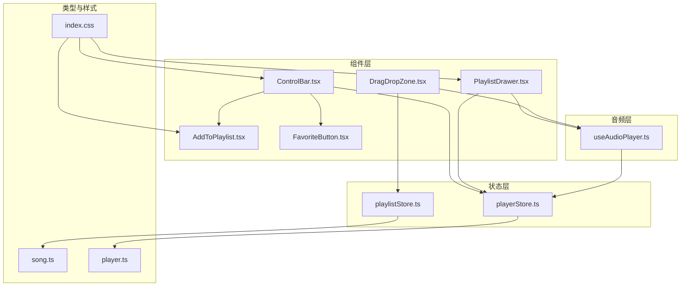
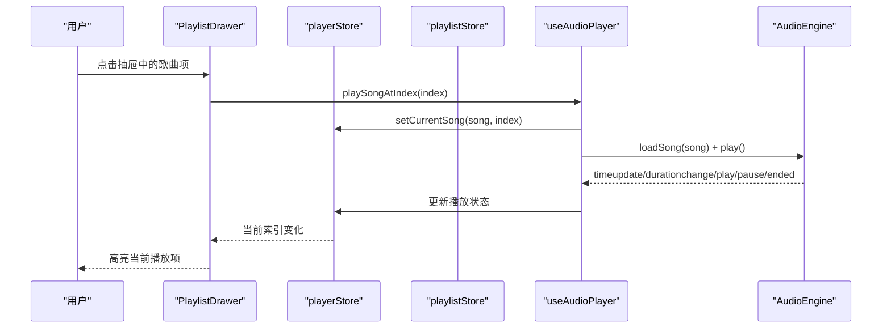
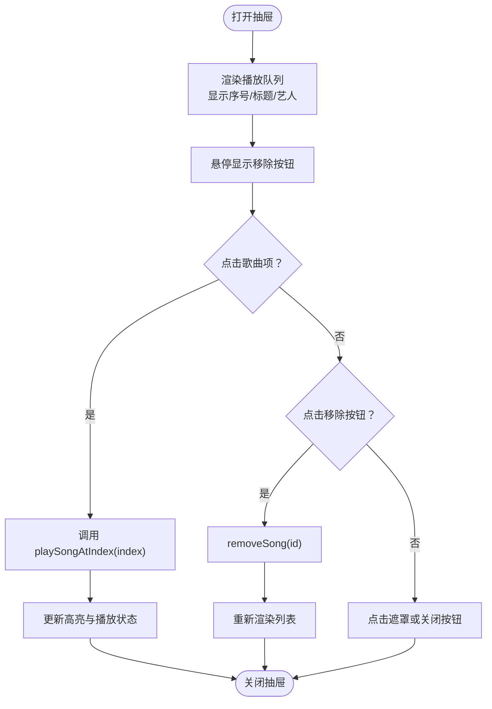
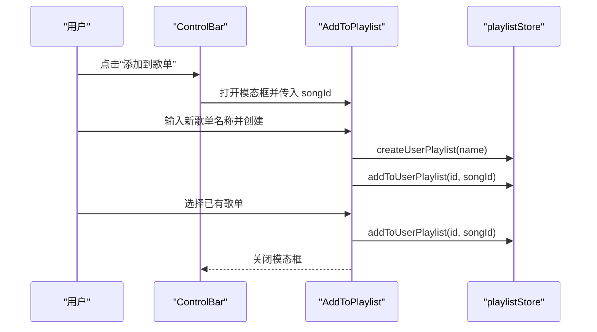
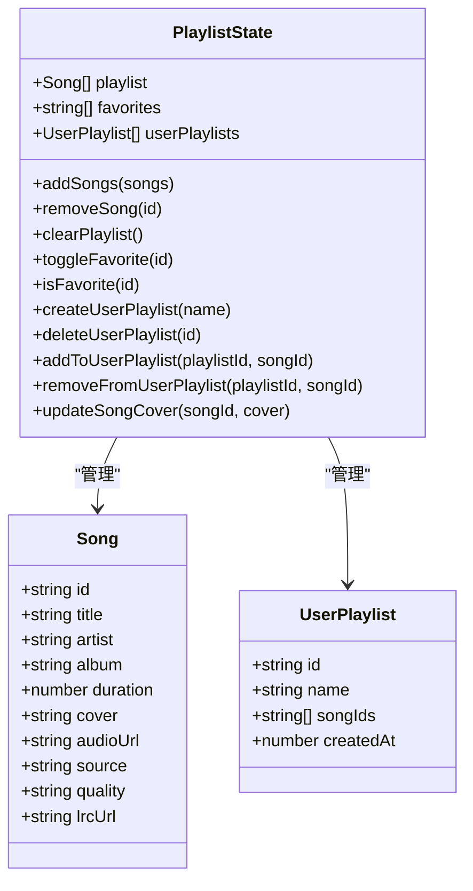
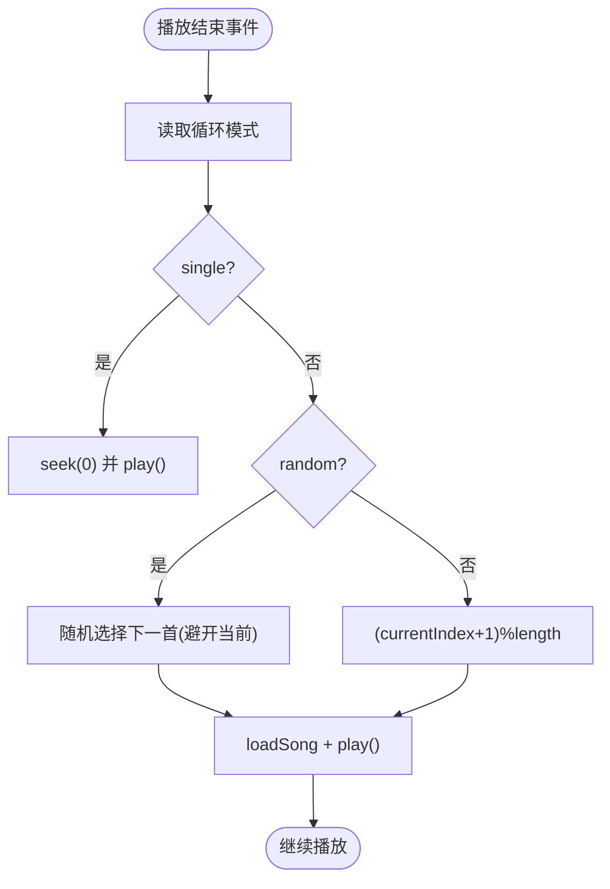
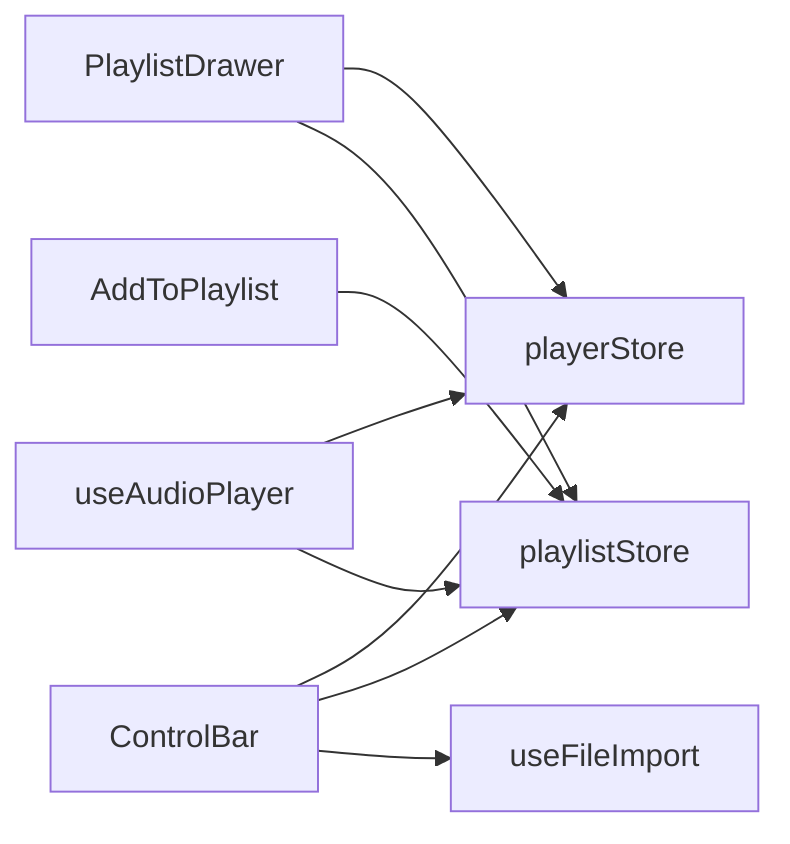

# 播放列表组件

<cite>
**本文引用的文件**
- [src/components/Playlist/PlaylistDrawer.tsx](file://src/components/Playlist/PlaylistDrawer.tsx)
- [src/components/Playlist/AddToPlaylist.tsx](file://src/components/Playlist/AddToPlaylist.tsx)
- [src/store/playlistStore.ts](file://src/store/playlistStore.ts)
- [src/store/playerStore.ts](file://src/store/playerStore.ts)
- [src/hooks/useAudioPlayer.ts](file://src/hooks/useAudioPlayer.ts)
- [src/types/song.ts](file://src/types/song.ts)
- [src/types/player.ts](file://src/types/player.ts)
- [src/components/Controls/ControlBar.tsx](file://src/components/Controls/ControlBar.tsx)
- [src/components/FileImport/DragDropZone.tsx](file://src/components/FileImport/DragDropZone.tsx)
- [src/hooks/useFileImport.ts](file://src/hooks/useFileImport.ts)
- [src/components/SongInfo/FavoriteButton.tsx](file://src/components/SongInfo/FavoriteButton.tsx)
- [src/App.tsx](file://src/App.tsx)
- [src/index.css](file://src/index.css)
- [Web音乐播放器PRD.md](file://Web音乐播放器PRD.md)
</cite>

## 目录
1. [简介](#简介)
2. [项目结构](#项目结构)
3. [核心组件](#核心组件)
4. [架构总览](#架构总览)
5. [组件详解](#组件详解)
6. [依赖关系分析](#依赖关系分析)
7. [性能考量](#性能考量)
8. [故障排查指南](#故障排查指南)
9. [结论](#结论)
10. [附录](#附录)

## 简介
本文件面向 My Music 2026 的播放列表系统，聚焦以下目标：
- 全面介绍播放列表组件架构，包括抽屉式播放列表 PlaylistDrawer 与添加到歌单 AddToPlaylist 组件的实现。
- 详细说明播放列表的数据结构、状态管理与持久化存储机制。
- 解释播放列表操作逻辑、歌曲排序规则与队列管理算法。
- 覆盖用户歌单功能、收藏夹实现与播放历史记录的现状与扩展建议。
- 提供播放列表导入导出、批量操作与搜索过滤的实现指南。
- 涵盖响应式布局、手势操作与无障碍访问的优化方案。

## 项目结构
播放列表相关代码主要分布在以下模块：
- 组件层：PlaylistDrawer、AddToPlaylist、ControlBar、DragDropZone、FavoriteButton
- 状态层：playlistStore（播放列表、收藏、用户歌单）、playerStore（播放状态、循环模式等）
- 音频层：useAudioPlayer（播放控制、切歌算法）
- 类型层：song.ts、player.ts
- 视觉与交互：index.css（动画与样式）

图表来源
- [src/components/Playlist/PlaylistDrawer.tsx](file://src/components/Playlist/PlaylistDrawer.tsx#L1-L70)
- [src/components/Playlist/AddToPlaylist.tsx](file://src/components/Playlist/AddToPlaylist.tsx#L1-L131)
- [src/components/Controls/ControlBar.tsx](file://src/components/Controls/ControlBar.tsx#L1-L105)
- [src/components/FileImport/DragDropZone.tsx](file://src/components/FileImport/DragDropZone.tsx#L1-L67)
- [src/components/SongInfo/FavoriteButton.tsx](file://src/components/SongInfo/FavoriteButton.tsx#L1-L30)
- [src/store/playlistStore.ts](file://src/store/playlistStore.ts#L1-L88)
- [src/store/playerStore.ts](file://src/store/playerStore.ts#L1-L95)
- [src/hooks/useAudioPlayer.ts](file://src/hooks/useAudioPlayer.ts#L1-L131)
- [src/types/song.ts](file://src/types/song.ts#L1-L14)
- [src/types/player.ts](file://src/types/player.ts#L1-L4)
- [src/index.css](file://src/index.css#L1-L93)

章节来源
- [src/components/Playlist/PlaylistDrawer.tsx](file://src/components/Playlist/PlaylistDrawer.tsx#L1-L70)
- [src/components/Playlist/AddToPlaylist.tsx](file://src/components/Playlist/AddToPlaylist.tsx#L1-L131)
- [src/store/playlistStore.ts](file://src/store/playlistStore.ts#L1-L88)
- [src/store/playerStore.ts](file://src/store/playerStore.ts#L1-L95)
- [src/hooks/useAudioPlayer.ts](file://src/hooks/useAudioPlayer.ts#L1-L131)
- [src/types/song.ts](file://src/types/song.ts#L1-L14)
- [src/types/player.ts](file://src/types/player.ts#L1-L4)
- [src/components/Controls/ControlBar.tsx](file://src/components/Controls/ControlBar.tsx#L1-L105)
- [src/components/FileImport/DragDropZone.tsx](file://src/components/FileImport/DragDropZone.tsx#L1-L67)
- [src/components/SongInfo/FavoriteButton.tsx](file://src/components/SongInfo/FavoriteButton.tsx#L1-L30)
- [src/index.css](file://src/index.css#L1-L93)

## 核心组件
- 抽屉式播放列表 PlaylistDrawer：展示当前播放队列，支持点击切换播放、移除歌曲、遮罩关闭。
- 添加到歌单 AddToPlaylist：在模态框内创建或选择用户歌单，将歌曲加入其中。
- 播放列表状态管理 playlistStore：维护播放队列、收藏、用户歌单，并持久化部分数据。
- 播放状态管理 playerStore：维护播放开关、当前索引、循环模式、播放抽屉显隐等。
- 音频控制 useAudioPlayer：封装播放、暂停、切歌、随机播放等逻辑。
- 导入与拖拽 DragDropZone：支持本地文件导入，自动加入播放队列并按需开始播放。
- 收藏按钮 FavoriteButton：切换当前歌曲的收藏状态。

章节来源
- [src/components/Playlist/PlaylistDrawer.tsx](file://src/components/Playlist/PlaylistDrawer.tsx#L1-L70)
- [src/components/Playlist/AddToPlaylist.tsx](file://src/components/Playlist/AddToPlaylist.tsx#L1-L131)
- [src/store/playlistStore.ts](file://src/store/playlistStore.ts#L1-L88)
- [src/store/playerStore.ts](file://src/store/playerStore.ts#L1-L95)
- [src/hooks/useAudioPlayer.ts](file://src/hooks/useAudioPlayer.ts#L1-L131)
- [src/components/FileImport/DragDropZone.tsx](file://src/components/FileImport/DragDropZone.tsx#L1-L67)
- [src/components/SongInfo/FavoriteButton.tsx](file://src/components/SongInfo/FavoriteButton.tsx#L1-L30)

## 架构总览
播放列表系统采用“组件-状态-音频”分层架构：
- 组件层负责 UI 行为与交互（抽屉、模态框、控制条、导入区）。
- 状态层使用 Zustand 管理播放队列、收藏与用户歌单，并通过 persist 中间件进行 localStorage 持久化。
- 音频层通过 useAudioPlayer 封装播放引擎事件与切歌算法，与播放状态联动。

图表来源
- [src/components/Playlist/PlaylistDrawer.tsx](file://src/components/Playlist/PlaylistDrawer.tsx#L41-L62)
- [src/hooks/useAudioPlayer.ts](file://src/hooks/useAudioPlayer.ts#L64-L75)
- [src/store/playerStore.ts](file://src/store/playerStore.ts#L65-L65)
- [src/store/playlistStore.ts](file://src/store/playlistStore.ts#L36-L41)

## 组件详解

### PlaylistDrawer 抽屉式播放列表
- 功能要点
  - 展示当前播放队列，显示序号、标题、艺人、移除按钮。
  - 点击项触发播放该索引歌曲；当前播放项高亮。
  - 点击遮罩或右上角关闭按钮隐藏抽屉。
- 数据与状态
  - 读取播放队列与当前索引，调用播放器 hook 切歌。
  - 通过播放列表 store 移除歌曲。
- 交互细节
  - 悬停显示移除按钮，阻止事件冒泡避免误触播放。
  - 队列为空时显示空状态提示。

图表来源
- [src/components/Playlist/PlaylistDrawer.tsx](file://src/components/Playlist/PlaylistDrawer.tsx#L16-L68)
- [src/store/playlistStore.ts](file://src/store/playlistStore.ts#L39-L41)
- [src/hooks/useAudioPlayer.ts](file://src/hooks/useAudioPlayer.ts#L64-L75)

章节来源
- [src/components/Playlist/PlaylistDrawer.tsx](file://src/components/Playlist/PlaylistDrawer.tsx#L1-L70)
- [src/store/playlistStore.ts](file://src/store/playlistStore.ts#L12-L27)
- [src/hooks/useAudioPlayer.ts](file://src/hooks/useAudioPlayer.ts#L64-L75)

### AddToPlaylist 添加到歌单
- 功能要点
  - 新建歌单：输入名称并创建，随后将当前歌曲加入。
  - 选择已有歌单：遍历用户歌单，已包含则禁用或显示已添加状态。
  - 点击外部区域关闭模态框。
- 数据与状态
  - 读取用户歌单列表，创建新歌单并加入歌曲。
  - 使用 ref 管理焦点与点击外层关闭。
- 交互细节
  - Enter 键快速创建。
  - 已在歌单的歌曲显示勾选状态，不可重复添加。

图表来源
- [src/components/Controls/ControlBar.tsx](file://src/components/Controls/ControlBar.tsx#L72-L101)
- [src/components/Playlist/AddToPlaylist.tsx](file://src/components/Playlist/AddToPlaylist.tsx#L10-L44)
- [src/store/playlistStore.ts](file://src/store/playlistStore.ts#L49-L64)

章节来源
- [src/components/Playlist/AddToPlaylist.tsx](file://src/components/Playlist/AddToPlaylist.tsx#L1-L131)
- [src/store/playlistStore.ts](file://src/store/playlistStore.ts#L12-L27)
- [src/components/Controls/ControlBar.tsx](file://src/components/Controls/ControlBar.tsx#L16-L105)

### 播放列表数据结构与状态管理
- 数据模型
  - Song：歌曲基础字段（id、title、artist、album、duration、cover、audioUrl、source、quality、lrcUrl）。
  - UserPlaylist：用户歌单（id、name、songIds、createdAt）。
- 状态接口
  - 播放队列：playlist（Song[]）
  - 收藏：favorites（string[]）
  - 用户歌单：userPlaylists（UserPlaylist[]）
- 持久化策略
  - playlistStore：仅持久化 favorites 与 userPlaylists，playlist 由运行时状态驱动。
  - playerStore：持久化音量、静音、循环模式、音质、播放器模式等设置。
- 关键方法
  - addSongs/removeSong/clearPlaylist：队列增删改。
  - toggleFavorite/isFavorite：收藏状态切换与查询。
  - createUserPlaylist/deleteUserPlaylist/addToUserPlaylist/removeFromUserPlaylist：用户歌单管理。
  - updateSongCover：更新歌曲封面（用于封面回填）。

图表来源
- [src/types/song.ts](file://src/types/song.ts#L1-L14)
- [src/store/playlistStore.ts](file://src/store/playlistStore.ts#L5-L27)

章节来源
- [src/types/song.ts](file://src/types/song.ts#L1-L14)
- [src/store/playlistStore.ts](file://src/store/playlistStore.ts#L1-L88)
- [src/types/player.ts](file://src/types/player.ts#L1-L4)

### 队列管理与播放算法
- 切歌流程
  - playSongAtIndex：根据索引加载并播放歌曲，更新当前歌曲与索引。
  - ended 事件：根据循环模式决定下一首。
- 循环模式
  - list：顺序播放，到末尾回到开头。
  - single：单曲循环，结束时重播。
  - random：随机播放，避免连续播放同一首（多于一首时）。
- 上一首/下一首
  - nextSong/prevSong：基于当前索引与循环模式计算下标。

图表来源
- [src/hooks/useAudioPlayer.ts](file://src/hooks/useAudioPlayer.ts#L31-L62)
- [src/hooks/useAudioPlayer.ts](file://src/hooks/useAudioPlayer.ts#L92-L114)

章节来源
- [src/hooks/useAudioPlayer.ts](file://src/hooks/useAudioPlayer.ts#L1-L131)
- [src/store/playerStore.ts](file://src/store/playerStore.ts#L8-L40)

### 导入与批量操作
- 文件导入
  - DragDropZone：支持拖拽与文件选择，自动解析为 Song 并加入播放队列。
  - useFileImport：解析本地音频文件，生成 Song 对象并去重加入队列。
- 批量操作建议
  - 批量移除：在 PlaylistDrawer 中为每项提供移除按钮，或在抽屉顶部提供“清空队列”入口。
  - 批量收藏：在 ControlBar 或抽屉中增加“全选/反选”与“批量收藏”按钮。
  - 批量导出：将 playlistStore 中的 playlist 序列化为 JSON，提供下载。

章节来源
- [src/components/FileImport/DragDropZone.tsx](file://src/components/FileImport/DragDropZone.tsx#L1-L67)
- [src/hooks/useFileImport.ts](file://src/hooks/useFileImport.ts#L1-L49)
- [src/store/playlistStore.ts](file://src/store/playlistStore.ts#L36-L42)

### 搜索与过滤
- 现状
  - 当前未提供播放列表搜索与过滤功能。
- 建议实现
  - 在 PlaylistDrawer 顶部增加搜索框，按标题/艺人过滤。
  - 提供“仅显示收藏”、“仅显示本地”等筛选器。
  - 支持快捷键（如 Ctrl+F）聚焦搜索框。

章节来源
- [src/components/Playlist/PlaylistDrawer.tsx](file://src/components/Playlist/PlaylistDrawer.tsx#L1-L70)

### 用户歌单与收藏夹
- 用户歌单
  - 支持创建、删除、向歌单添加/移除歌曲。
  - 歌单持久化至 localStorage（partialize）。
- 收藏夹
  - 支持切换当前歌曲收藏状态，收藏列表持久化。
- 播放历史
  - 当前未实现播放历史记录；可扩展在播放完成后将歌曲推入 history 列表并在 store 中持久化。

章节来源
- [src/store/playlistStore.ts](file://src/store/playlistStore.ts#L12-L27)
- [src/components/SongInfo/FavoriteButton.tsx](file://src/components/SongInfo/FavoriteButton.tsx#L1-L30)

### 导入导出与分享
- 导入
  - 通过 DragDropZone 与 useFileImport 导入本地音频文件。
- 导出
  - 将 userPlaylists 与 favorites 序列化为 JSON，提供下载。
  - 导出播放队列：将 playlist 序列化为 JSON。
- 分享
  - 以 JSON 形式分享用户歌单，接收方可导入恢复。

章节来源
- [src/components/FileImport/DragDropZone.tsx](file://src/components/FileImport/DragDropZone.tsx#L1-L67)
- [src/hooks/useFileImport.ts](file://src/hooks/useFileImport.ts#L33-L49)
- [src/store/playlistStore.ts](file://src/store/playlistStore.ts#L79-L86)

### 响应式布局与无障碍访问
- 响应式布局
  - 抽屉宽度固定（w-80），在小屏设备上仍可通过滑动关闭。
  - 控制条在底部固定，适配移动端安全区域。
- 无障碍访问
  - 所有按钮均提供 aria-label 与 title。
  - 支持键盘导航与快捷键（参考 PRD 的可访问性要求）。
- 动画与手势
  - 抽屉滑入动画与模糊背景增强视觉体验。
  - 唱片旋转与唱针动画提升沉浸感。

章节来源
- [src/components/Playlist/PlaylistDrawer.tsx](file://src/components/Playlist/PlaylistDrawer.tsx#L17-L21)
- [src/components/Controls/ControlBar.tsx](file://src/components/Controls/ControlBar.tsx#L32-L96)
- [src/index.css](file://src/index.css#L52-L88)
- [Web音乐播放器PRD.md](file://Web音乐播放器PRD.md#L119-L120)

## 依赖关系分析
- 组件耦合
  - PlaylistDrawer 依赖 playerStore（显示抽屉、当前索引）与 playlistStore（队列、移除）。
  - AddToPlaylist 依赖 playlistStore（用户歌单、创建/添加）。
  - ControlBar 依赖 playlistStore（队列长度）、playerStore（抽屉开关）、useFileImport（导入）、FavoriteButton、AddToPlaylist。
- 状态依赖
  - useAudioPlayer 依赖 playlistStore 与 playerStore，处理切歌与循环模式。
- 外部依赖
  - AudioEngine（通过 useAudioPlayer 间接使用）。
  - localStorage（Zustand persist）。

图表来源
- [src/components/Playlist/PlaylistDrawer.tsx](file://src/components/Playlist/PlaylistDrawer.tsx#L1-L12)
- [src/components/Playlist/AddToPlaylist.tsx](file://src/components/Playlist/AddToPlaylist.tsx#L1-L17)
- [src/components/Controls/ControlBar.tsx](file://src/components/Controls/ControlBar.tsx#L1-L14)
- [src/hooks/useAudioPlayer.ts](file://src/hooks/useAudioPlayer.ts#L1-L5)

章节来源
- [src/components/Playlist/PlaylistDrawer.tsx](file://src/components/Playlist/PlaylistDrawer.tsx#L1-L70)
- [src/components/Playlist/AddToPlaylist.tsx](file://src/components/Playlist/AddToPlaylist.tsx#L1-L131)
- [src/components/Controls/ControlBar.tsx](file://src/components/Controls/ControlBar.tsx#L1-L105)
- [src/hooks/useAudioPlayer.ts](file://src/hooks/useAudioPlayer.ts#L1-L131)

## 性能考量
- 渲染优化
  - 列表项使用 key=song.id，减少不必要的重渲染。
  - 抽屉列表使用虚拟滚动（建议）以提升长列表性能。
- 状态更新
  - playlistStore 使用不可变更新，避免深层拷贝带来的开销。
- 音频性能
  - 自动播放限制：首次交互后播放，避免白屏与失败。
  - 随机播放时避免重复选择同一首（多首情况下）。
- 存储策略
  - playlist 不持久化，仅持久化 favorites 与 userPlaylists，降低存储压力。

章节来源
- [src/store/playlistStore.ts](file://src/store/playlistStore.ts#L36-L41)
- [src/hooks/useAudioPlayer.ts](file://src/hooks/useAudioPlayer.ts#L47-L62)
- [Web音乐播放器PRD.md](file://Web音乐播放器PRD.md#L124-L126)

## 故障排查指南
- 无法播放
  - 检查浏览器自动播放限制，确保用户交互后触发播放。
  - 确认歌曲对象包含有效 audioUrl。
- 切歌异常
  - 检查 currentIndex 与 playlist 长度是否匹配。
  - 随机模式下确保多于一首时才随机跳转。
- 抽屉不显示
  - 确认 playerStore 的 showPlaylist 状态被正确切换。
- 歌单创建失败
  - 检查歌单名称非空，确认 createUserPlaylist 返回了新 id。
- 收藏状态不同步
  - 确保 FavoriteButton 使用的 songId 与当前歌曲一致。

章节来源
- [src/hooks/useAudioPlayer.ts](file://src/hooks/useAudioPlayer.ts#L77-L90)
- [src/store/playerStore.ts](file://src/store/playerStore.ts#L77-L78)
- [src/components/Playlist/AddToPlaylist.tsx](file://src/components/Playlist/AddToPlaylist.tsx#L33-L40)
- [src/components/SongInfo/FavoriteButton.tsx](file://src/components/SongInfo/FavoriteButton.tsx#L5-L15)

## 结论
My Music 2026 的播放列表系统以清晰的分层架构实现了播放队列、用户歌单与收藏的核心能力。通过 Zustand 的持久化与 useAudioPlayer 的播放算法，系统在易用性与性能之间取得平衡。建议后续增强搜索过滤、播放历史、批量操作与导入导出能力，并进一步优化长列表渲染与无障碍访问细节。

## 附录
- 快速集成清单
  - 在 ControlBar 中接入 AddToPlaylist 与 FavoriteButton。
  - 在 PlaylistDrawer 中增加“清空队列”与“导出播放列表”入口。
  - 在 App 中根据播放器模式切换布局（迷你/全屏）。
- 设计与交互建议
  - 为播放列表项增加长按菜单（复制链接、设为封面等）。
  - 为抽屉增加手势滑动关闭（移动端友好）。
  - 为收藏按钮增加动画反馈与无障碍标签。

章节来源
- [src/components/Controls/ControlBar.tsx](file://src/components/Controls/ControlBar.tsx#L16-L105)
- [src/components/Playlist/PlaylistDrawer.tsx](file://src/components/Playlist/PlaylistDrawer.tsx#L1-L70)
- [src/App.tsx](file://src/App.tsx#L50-L94)