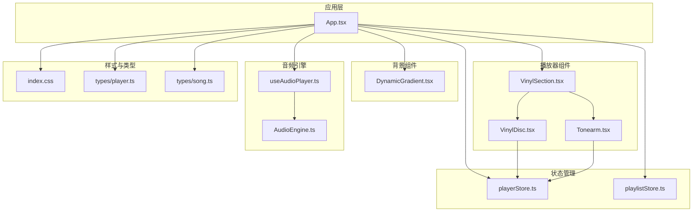
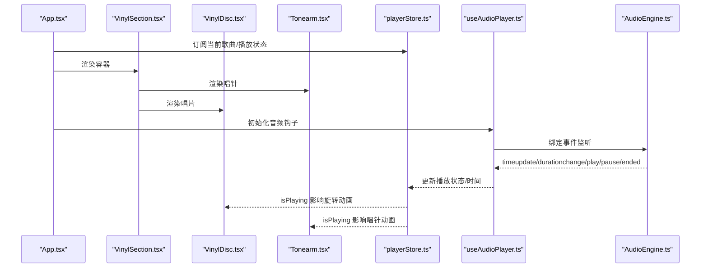
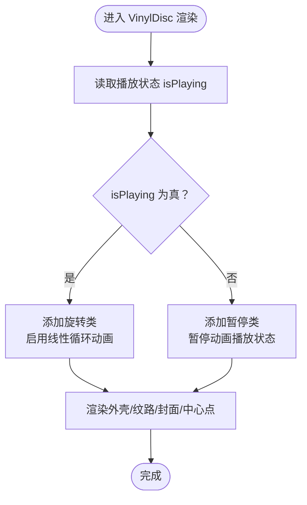
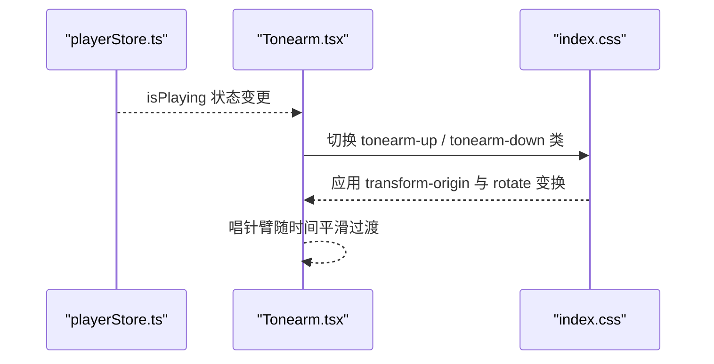
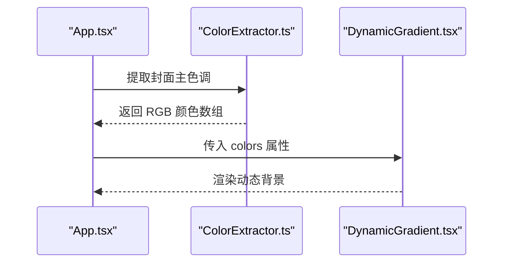
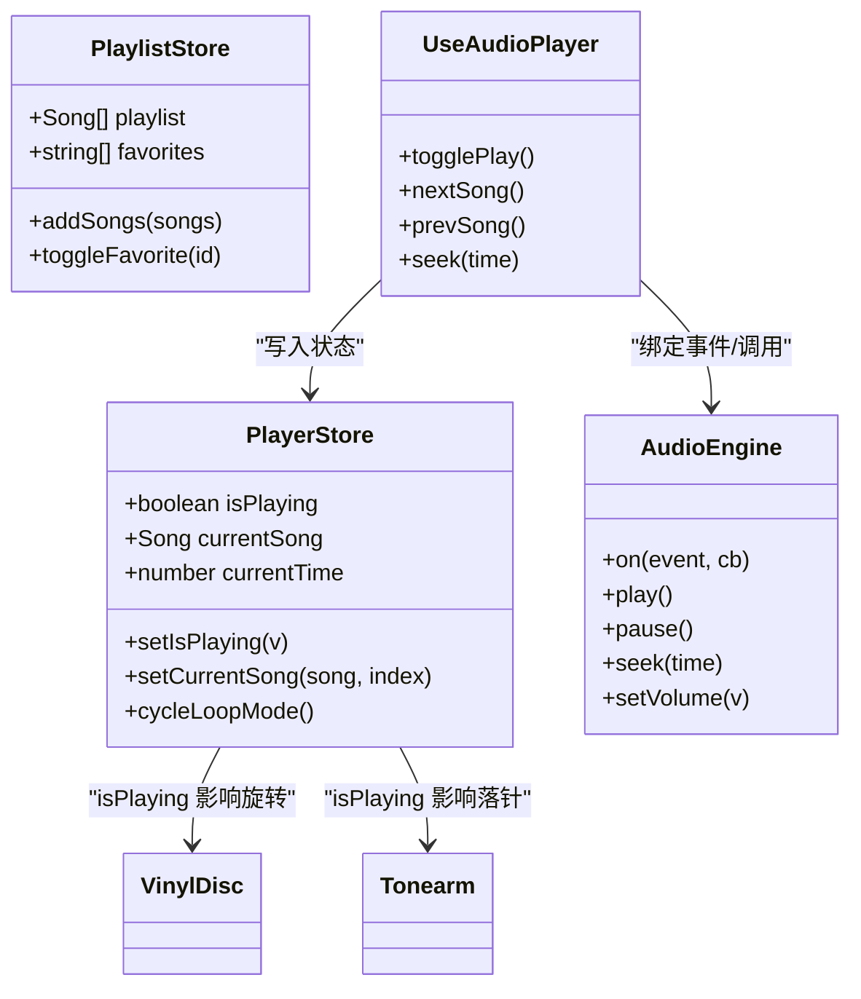
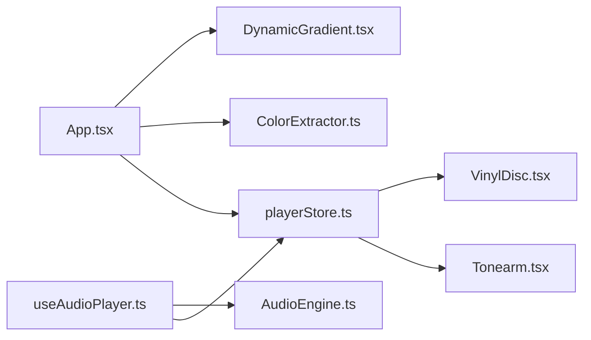

# 播放器组件

<cite>
**本文引用的文件**
- [src/components/Player/VinylSection.tsx](file://src/components/Player/VinylSection.tsx)
- [src/components/Player/VinylDisc.tsx](file://src/components/Player/VinylDisc.tsx)
- [src/components/Player/Tonearm.tsx](file://src/components/Player/Tonearm.tsx)
- [src/components/Background/DynamicGradient.tsx](file://src/components/Background/DynamicGradient.tsx)
- [src/store/playerStore.ts](file://src/store/playerStore.ts)
- [src/store/playlistStore.ts](file://src/store/playlistStore.ts)
- [src/hooks/useAudioPlayer.ts](file://src/hooks/useAudioPlayer.ts)
- [src/core/AudioEngine.ts](file://src/core/AudioEngine.ts)
- [src/core/ColorExtractor.ts](file://src/core/ColorExtractor.ts)
- [src/App.tsx](file://src/App.tsx)
- [src/index.css](file://src/index.css)
- [src/types/player.ts](file://src/types/player.ts)
- [src/types/song.ts](file://src/types/song.ts)
</cite>

## 目录
1. [简介](#简介)
2. [项目结构](#项目结构)
3. [核心组件](#核心组件)
4. [架构总览](#架构总览)
5. [详细组件分析](#详细组件分析)
6. [依赖关系分析](#依赖关系分析)
7. [性能考量](#性能考量)
8. [故障排查指南](#故障排查指南)
9. [结论](#结论)
10. [附录](#附录)

## 简介
本文件聚焦 My Music 2026 的播放器组件，围绕“唱盘动画系统”展开，系统性阐述 VinylSection 主容器、VinylDisc 旋转机制、Tonearm 唱针动画与 DynamicGradient 动态背景生成的设计理念与实现细节。文档同时覆盖 props 接口、状态管理、动画参数配置、CSS 动画与 3D 变换、性能优化策略、组件间数据流与事件处理、用户交互响应，以及自定义动画参数、主题切换与响应式布局的实践建议。

## 项目结构
播放器相关代码位于 src/components/Player 与 src/components/Background，配合全局样式 src/index.css 与状态管理 store 层（playerStore、playlistStore），并通过 hooks/useAudioPlayer.ts 与核心 AudioEngine.ts 协同工作。

图表来源
- [src/App.tsx](file://src/App.tsx#L1-L98)
- [src/components/Player/VinylSection.tsx](file://src/components/Player/VinylSection.tsx#L1-L12)
- [src/components/Player/VinylDisc.tsx](file://src/components/Player/VinylDisc.tsx#L1-L44)
- [src/components/Player/Tonearm.tsx](file://src/components/Player/Tonearm.tsx#L1-L24)
- [src/components/Background/DynamicGradient.tsx](file://src/components/Background/DynamicGradient.tsx#L1-L22)
- [src/store/playerStore.ts](file://src/store/playerStore.ts#L1-L95)
- [src/store/playlistStore.ts](file://src/store/playlistStore.ts#L1-L88)
- [src/hooks/useAudioPlayer.ts](file://src/hooks/useAudioPlayer.ts#L1-L131)
- [src/core/AudioEngine.ts](file://src/core/AudioEngine.ts#L1-L143)
- [src/index.css](file://src/index.css#L1-L94)
- [src/types/player.ts](file://src/types/player.ts#L1-L4)
- [src/types/song.ts](file://src/types/song.ts#L1-L14)

章节来源
- [src/App.tsx](file://src/App.tsx#L1-L98)
- [src/index.css](file://src/index.css#L1-L94)

## 核心组件
- VinylSection：作为唱盘动画系统的根容器，负责组织 Tonearm 与 VinylDisc 的层级与定位。
- VinylDisc：渲染黑胶唱片外观与旋转动画，根据播放状态切换暂停/旋转。
- Tonearm：渲染唱针臂与唱针头，依据播放状态在“抬起/放下”之间切换。
- DynamicGradient：基于封面提取的颜色生成动态径向渐变背景，支持自定义颜色数组。

章节来源
- [src/components/Player/VinylSection.tsx](file://src/components/Player/VinylSection.tsx#L1-L12)
- [src/components/Player/VinylDisc.tsx](file://src/components/Player/VinylDisc.tsx#L1-L44)
- [src/components/Player/Tonearm.tsx](file://src/components/Player/Tonearm.tsx#L1-L24)
- [src/components/Background/DynamicGradient.tsx](file://src/components/Background/DynamicGradient.tsx#L1-L22)

## 架构总览
下图展示从应用入口到播放器组件、状态管理与音频引擎的调用链与数据流。

图表来源
- [src/App.tsx](file://src/App.tsx#L1-L98)
- [src/components/Player/VinylSection.tsx](file://src/components/Player/VinylSection.tsx#L1-L12)
- [src/components/Player/VinylDisc.tsx](file://src/components/Player/VinylDisc.tsx#L1-L44)
- [src/components/Player/Tonearm.tsx](file://src/components/Player/Tonearm.tsx#L1-L24)
- [src/store/playerStore.ts](file://src/store/playerStore.ts#L1-L95)
- [src/hooks/useAudioPlayer.ts](file://src/hooks/useAudioPlayer.ts#L1-L131)
- [src/core/AudioEngine.ts](file://src/core/AudioEngine.ts#L1-L143)

## 详细组件分析

### VinylSection 容器设计
- 职责：提供相对定位的容器，确保 Tonearm 与 VinylDisc 的绝对定位与层级关系稳定；内部通过 Flex 布局居中。
- 关键点：
  - 使用绝对定位的 Tonearm，配合相对定位的父容器，保证“右上角”锚点的视觉一致性。
  - 子元素顺序决定 z-index 层级，Tonearm 在上层以遮挡唱片中心装饰。
- 适用场景：全屏模式与迷你模式均复用该容器，通过外部布局控制尺寸与位置。

章节来源
- [src/components/Player/VinylSection.tsx](file://src/components/Player/VinylSection.tsx#L1-L12)

### VinylDisc 旋转机制
- 外观结构：
  - 外壳：圆形渐变背景与阴影，模拟黑胶质感。
  - 纹路：多层同心环边框，营造经典纹路效果。
  - 中心封面：可选图片或默认图标占位。
  - 中心小圆点：强调转轴。
- 动画逻辑：
  - 通过播放状态 isPlaying 切换 CSS 类，驱动旋转与暂停。
  - 使用 will-change 提示浏览器对 transform 进行优化。
- 性能优化：
  - 使用 will-change 与硬件加速友好的 transform。
  - 固定尺寸与相对定位，避免重排。
- 可定制项：
  - 旋转速度可通过 CSS 动画时长调整。
  - 纹路密度与边框粗细可按需微调。

图表来源
- [src/components/Player/VinylDisc.tsx](file://src/components/Player/VinylDisc.tsx#L1-L44)
- [src/index.css](file://src/index.css#L52-L64)

章节来源
- [src/components/Player/VinylDisc.tsx](file://src/components/Player/VinylDisc.tsx#L1-L44)
- [src/index.css](file://src/index.css#L52-L64)

### Tonearm 唱针动画
- 结构组成：
  - 底座：圆形定位点，作为旋转支点。
  - 臂体：倾斜杆件，使用渐变色与圆角模拟金属质感。
  - 唱针头：底部圆形，贴合唱片表面。
- 动画逻辑：
  - 通过 isPlaying 切换“抬起/放下”两类 CSS 类，配合 transform-origin 实现支点旋转。
  - 使用缓动曲线与过渡时长控制自然落针与抬升的物理感。
- 交互映射：
  - 播放开始时落针，暂停时抬升，与播放状态保持一致。

图表来源
- [src/components/Player/Tonearm.tsx](file://src/components/Player/Tonearm.tsx#L1-L24)
- [src/store/playerStore.ts](file://src/store/playerStore.ts#L1-L95)
- [src/index.css](file://src/index.css#L66-L78)

章节来源
- [src/components/Player/Tonearm.tsx](file://src/components/Player/Tonearm.tsx#L1-L24)
- [src/index.css](file://src/index.css#L66-L78)

### DynamicGradient 动态背景
- 设计目标：基于当前歌曲封面提取主色调，生成两个带透明度的径向渐变叠加，营造沉浸式背景。
- Props 接口：
  - colors?: [number, number, number][]（最多三元组 RGB）
- 行为特性：
  - 默认颜色回退，保证稳定性。
  - 使用 transition 控制颜色过渡时长，提升视觉连贯性。
- 集成方式：
  - App.tsx 在封面变化时调用 ColorExtractor 提取颜色，传入 DynamicGradient。

图表来源
- [src/App.tsx](file://src/App.tsx#L1-L98)
- [src/core/ColorExtractor.ts](file://src/core/ColorExtractor.ts#L1-L27)
- [src/components/Background/DynamicGradient.tsx](file://src/components/Background/DynamicGradient.tsx#L1-L22)

章节来源
- [src/components/Background/DynamicGradient.tsx](file://src/components/Background/DynamicGradient.tsx#L1-L22)
- [src/App.tsx](file://src/App.tsx#L1-L98)
- [src/core/ColorExtractor.ts](file://src/core/ColorExtractor.ts#L1-L27)

### 状态管理与事件处理
- playerStore：
  - 管理播放状态、当前歌曲、播放进度、音量、循环模式、歌词等。
  - 提供更新函数，如 setIsPlaying、setCurrentSong、cycleLoopMode 等。
- playlistStore：
  - 管理播放列表、收藏、用户歌单等。
- useAudioPlayer：
  - 将 AudioEngine 事件桥接到 Zustand 状态，统一处理播放/暂停/跳转/下一首/上一首。
  - 根据循环模式自动切换下一曲目。
- AudioEngine：
  - 对原生 HTMLAudioElement 的封装，暴露事件订阅与控制方法。

图表来源
- [src/store/playerStore.ts](file://src/store/playerStore.ts#L1-L95)
- [src/store/playlistStore.ts](file://src/store/playlistStore.ts#L1-L88)
- [src/hooks/useAudioPlayer.ts](file://src/hooks/useAudioPlayer.ts#L1-L131)
- [src/core/AudioEngine.ts](file://src/core/AudioEngine.ts#L1-L143)

章节来源
- [src/store/playerStore.ts](file://src/store/playerStore.ts#L1-L95)
- [src/store/playlistStore.ts](file://src/store/playlistStore.ts#L1-L88)
- [src/hooks/useAudioPlayer.ts](file://src/hooks/useAudioPlayer.ts#L1-L131)
- [src/core/AudioEngine.ts](file://src/core/AudioEngine.ts#L1-L143)

### 用户交互与响应式布局
- 交互路径：
  - 控制条触发 useAudioPlayer 的 togglePlay/nextSong/prevSong/seek。
  - 播放状态变化通过 playerStore 推送至 VinylDisc 与 Tonearm。
- 响应式布局：
  - 全屏模式下左侧固定宽度的唱片区域，右侧内容自适应。
  - 迷你模式下仅展示唱片与标题/艺人信息，适合移动端或悬浮窗场景。
- 动画联动：
  - 播放开始：VinylDisc 开始旋转；Tonearm 落针。
  - 暂停：VinylDisc 暂停；Tonearm 抬升。

章节来源
- [src/App.tsx](file://src/App.tsx#L61-L94)
- [src/hooks/useAudioPlayer.ts](file://src/hooks/useAudioPlayer.ts#L77-L114)
- [src/store/playerStore.ts](file://src/store/playerStore.ts#L24-L40)

## 依赖关系分析
- 组件耦合：
  - VinylDisc 与 Tonearm 依赖 playerStore 的 isPlaying。
  - App.tsx 依赖 ColorExtractor 与 DynamicGradient，形成“封面→颜色→背景”的单向数据流。
- 外部依赖：
  - 颜色提取依赖 colorthief（运行时动态导入）。
  - CSS 动画依赖 Tailwind 与自定义关键帧/类名。
- 循环依赖：
  - 未发现直接循环依赖；状态更新通过 hooks 与 store 解耦。

图表来源
- [src/store/playerStore.ts](file://src/store/playerStore.ts#L1-L95)
- [src/components/Player/VinylDisc.tsx](file://src/components/Player/VinylDisc.tsx#L1-L44)
- [src/components/Player/Tonearm.tsx](file://src/components/Player/Tonearm.tsx#L1-L24)
- [src/App.tsx](file://src/App.tsx#L1-L98)
- [src/core/ColorExtractor.ts](file://src/core/ColorExtractor.ts#L1-L27)
- [src/hooks/useAudioPlayer.ts](file://src/hooks/useAudioPlayer.ts#L1-L131)
- [src/core/AudioEngine.ts](file://src/core/AudioEngine.ts#L1-L143)

章节来源
- [src/App.tsx](file://src/App.tsx#L1-L98)
- [src/store/playerStore.ts](file://src/store/playerStore.ts#L1-L95)

## 性能考量
- CSS 动画与 will-change：
  - VinylDisc 使用 will-change: transform，提示浏览器对 transform 进行优化，减少重绘成本。
- 硬件加速：
  - 使用 transform/rotate 等属性，尽量避免触发布局与绘制。
- 动画参数：
  - 旋转动画采用线性插值与较长周期，降低 CPU/GPU 压力。
  - 唱针过渡使用缓动曲线，兼顾自然与性能。
- 图像与颜色提取：
  - 封面加载使用跨域与错误兜底，避免阻塞主线程。
- 状态更新：
  - 使用 Zustand 的局部状态更新，减少不必要的重渲染。

章节来源
- [src/components/Player/VinylDisc.tsx](file://src/components/Player/VinylDisc.tsx#L14-L14)
- [src/index.css](file://src/index.css#L52-L78)
- [src/core/ColorExtractor.ts](file://src/core/ColorExtractor.ts#L1-L27)

## 故障排查指南
- 唱针不落/不抬：
  - 检查 isPlaying 是否正确同步至 store。
  - 确认 CSS 类是否正确切换（tonearm-up/tonearm-down）。
- 唱片不转/卡住：
  - 确认 CSS 动画类是否应用（vinyl-spinning/vinyl-paused）。
  - 检查 will-change 与 transform 是否被其他样式覆盖。
- 背景颜色不更新：
  - 确认封面变更后是否触发颜色提取与 props 传递。
  - 检查颜色数组格式与默认回退逻辑。
- 自动播放限制：
  - 浏览器策略可能阻止自动播放，需等待用户交互后再触发 play。

章节来源
- [src/hooks/useAudioPlayer.ts](file://src/hooks/useAudioPlayer.ts#L15-L36)
- [src/core/AudioEngine.ts](file://src/core/AudioEngine.ts#L54-L61)
- [src/App.tsx](file://src/App.tsx#L24-L31)

## 结论
本播放器组件以简洁的结构与清晰的状态流实现了经典的黑胶唱盘动画体验。VinylDisc 的旋转与 Tonearm 的落针动画通过播放状态精确联动，DynamicGradient 则以封面色彩驱动背景氛围。结合 CSS 动画与 will-change 优化，整体具备良好的性能表现与可扩展性。后续可在动画参数、主题切换与响应式布局方面进一步增强个性化与跨设备适配能力。

## 附录

### Props 接口速览
- DynamicGradient
  - colors?: [number, number, number][]
- VinylDisc
  - 无显式 props，依赖 store 中 currentSong.cover 渲染封面
- Tonearm
  - 无显式 props，依赖 store 中 isPlaying 控制动画
- VinylSection
  - 无显式 props，作为容器承载其他组件

章节来源
- [src/components/Background/DynamicGradient.tsx](file://src/components/Background/DynamicGradient.tsx#L1-L3)
- [src/components/Player/VinylDisc.tsx](file://src/components/Player/VinylDisc.tsx#L1-L7)
- [src/components/Player/Tonearm.tsx](file://src/components/Player/Tonearm.tsx#L1-L4)
- [src/components/Player/VinylSection.tsx](file://src/components/Player/VinylSection.tsx#L1-L11)

### 动画参数与自定义指南
- 旋转速度：调整 CSS 关键帧时长或循环次数。
- 唱针过渡：修改过渡时长与缓动曲线，平衡自然感与流畅度。
- 背景渐变：通过 DynamicGradient 的 colors 数组自定义主色，或在 App 层注入更多颜色策略。

章节来源
- [src/index.css](file://src/index.css#L52-L78)
- [src/components/Background/DynamicGradient.tsx](file://src/components/Background/DynamicGradient.tsx#L6-L18)

### 主题切换与响应式布局
- 主题切换：通过 CSS 变量与颜色提取结果动态更新背景与组件配色。
- 响应式布局：利用 Tailwind 基础类与 Flex/Grid 组合，适配不同屏幕尺寸与模式（全屏/迷你）。

章节来源
- [src/index.css](file://src/index.css#L3-L15)
- [src/App.tsx](file://src/App.tsx#L61-L94)