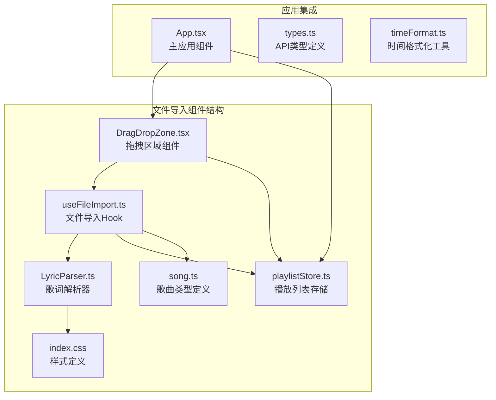
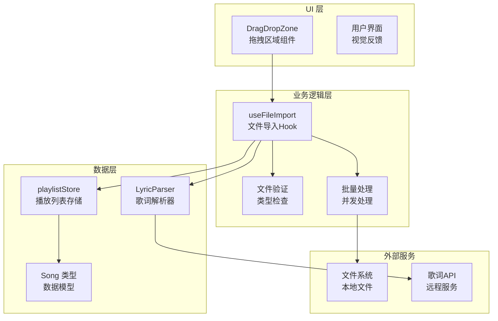
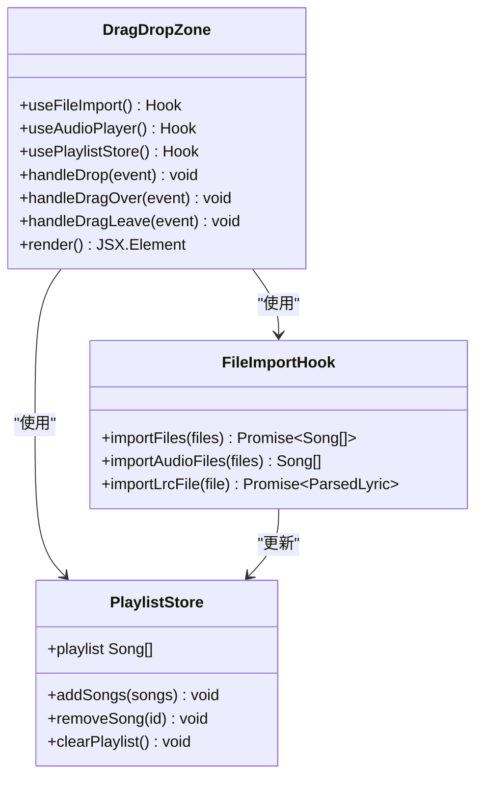
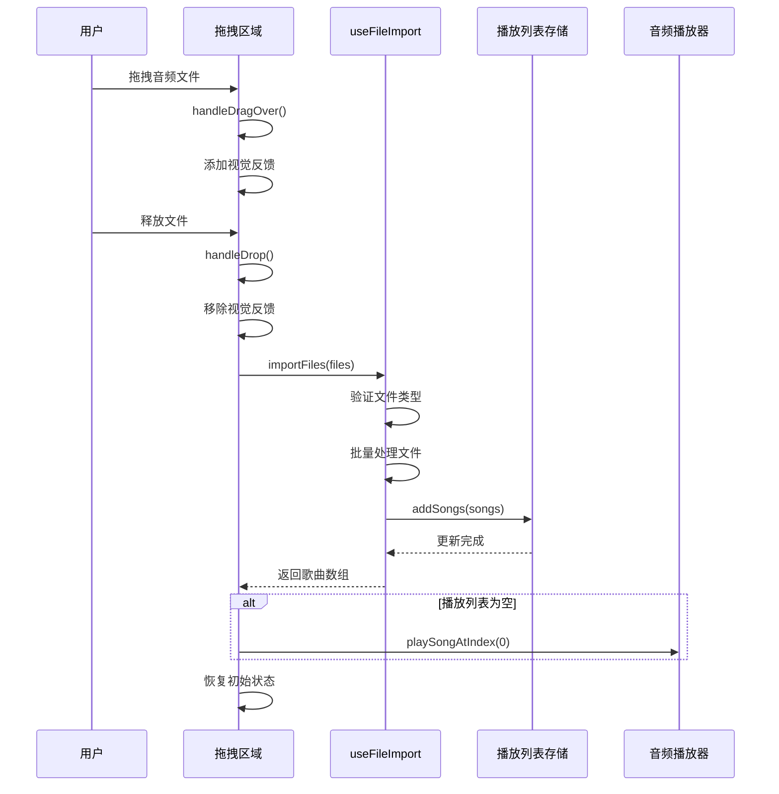
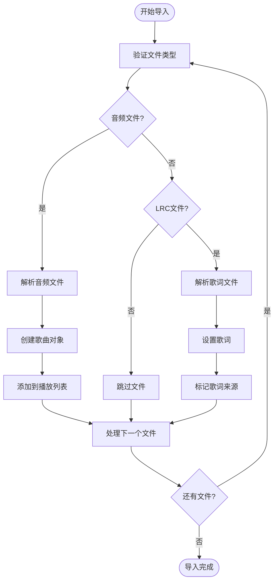
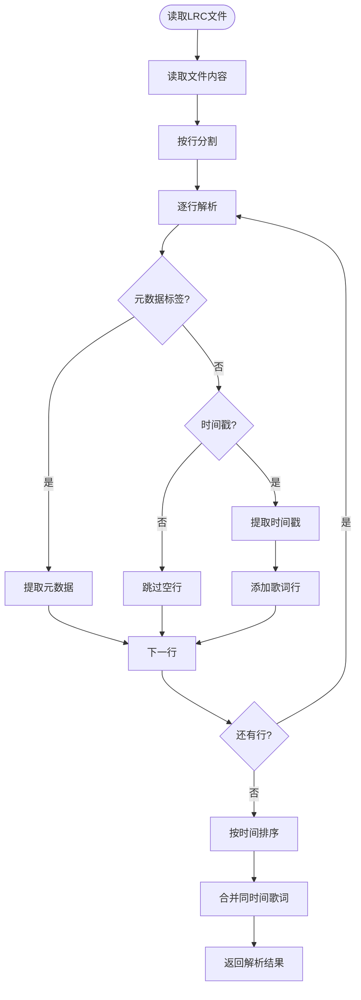
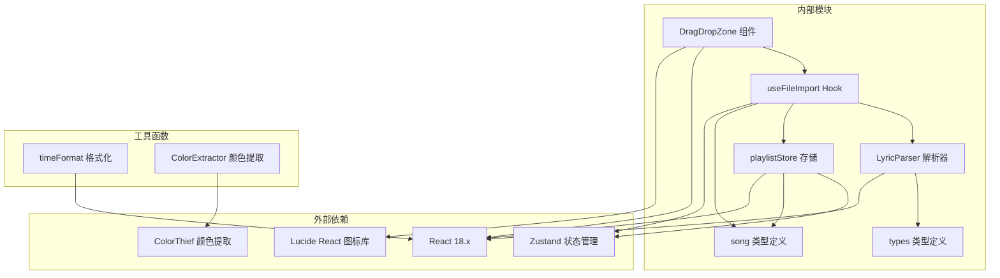

# 文件导入组件

<cite>
**本文档引用的文件**
- [DragDropZone.tsx](file://src/components/FileImport/DragDropZone.tsx)
- [useFileImport.ts](file://src/hooks/useFileImport.ts)
- [song.ts](file://src/types/song.ts)
- [LyricParser.ts](file://src/core/LyricParser.ts)
- [playlistStore.ts](file://src/store/playlistStore.ts)
- [index.css](file://src/index.css)
- [App.tsx](file://src/App.tsx)
- [lyric.ts](file://src/types/lyric.ts)
- [types.ts](file://src/api/types.ts)
- [timeFormat.ts](file://src/utils/timeFormat.ts)
</cite>

## 目录
1. [简介](#简介)
2. [项目结构](#项目结构)
3. [核心组件](#核心组件)
4. [架构概览](#架构概览)
5. [详细组件分析](#详细组件分析)
6. [依赖关系分析](#依赖关系分析)
7. [性能考虑](#性能考虑)
8. [故障排除指南](#故障排除指南)
9. [结论](#结论)

## 简介

My Music 2026 的文件导入组件是一个基于 React 和 TypeScript 构建的现代化音频文件导入系统。该系统提供了直观的拖拽导入体验，支持多种音频格式和歌词文件的批量处理。组件采用模块化设计，集成了文件类型验证、批量处理机制和进度反馈系统，为用户提供了流畅的音乐导入体验。

## 项目结构

文件导入组件位于 `src/components/FileImport/` 目录下，主要包含以下关键文件：

**图表来源**
- [DragDropZone.tsx](file://src/components/FileImport/DragDropZone.tsx#L1-L67)
- [useFileImport.ts](file://src/hooks/useFileImport.ts#L1-L78)
- [playlistStore.ts](file://src/store/playlistStore.ts#L1-L88)

**章节来源**
- [DragDropZone.tsx](file://src/components/FileImport/DragDropZone.tsx#L1-L67)
- [useFileImport.ts](file://src/hooks/useFileImport.ts#L1-L78)
- [App.tsx](file://src/App.tsx#L1-L98)

## 核心组件

### DragDropZone 拖拽区域组件

DragDropZone 是文件导入系统的核心 UI 组件，提供了直观的拖拽交互体验。该组件实现了完整的拖拽事件处理机制，包括拖拽进入、拖拽离开和文件释放等事件。

#### 主要功能特性

- **拖拽事件处理**: 实现了完整的拖拽生命周期管理
- **文件类型验证**: 自动过滤非音频文件
- **批量文件处理**: 支持多文件同时导入
- **视觉反馈**: 提供实时的拖拽状态视觉提示
- **传统选择方式**: 支持传统的文件选择对话框

#### 核心交互逻辑

组件通过三个主要回调函数处理拖拽事件：
- `handleDragOver`: 处理拖拽悬停事件，添加视觉反馈
- `handleDragLeave`: 处理拖拽离开事件，移除视觉反馈  
- `handleDrop`: 处理文件释放事件，执行文件导入逻辑

**章节来源**
- [DragDropZone.tsx](file://src/components/FileImport/DragDropZone.tsx#L7-L32)

### useFileImport Hook

useFileImport 是一个专门的 React Hook，负责处理文件导入的所有业务逻辑。该 Hook 提供了统一的文件处理接口，支持音频文件和歌词文件的导入。

#### 核心功能

- **文件类型识别**: 自动识别音频文件和 LRC 歌词文件
- **批量处理**: 支持多个文件的并发处理
- **元数据提取**: 从文件名中提取歌曲标题和艺术家信息
- **URL 生成**: 为音频文件生成临时访问 URL
- **歌词解析**: 支持 LRC 格式的歌词文件解析

**章节来源**
- [useFileImport.ts](file://src/hooks/useFileImport.ts#L33-L77)

## 架构概览

文件导入系统采用分层架构设计，确保了良好的代码组织和可维护性：

**图表来源**
- [DragDropZone.tsx](file://src/components/FileImport/DragDropZone.tsx#L1-L67)
- [useFileImport.ts](file://src/hooks/useFileImport.ts#L1-L78)
- [playlistStore.ts](file://src/store/playlistStore.ts#L1-L88)

## 详细组件分析

### DragDropZone 组件深度分析

#### 组件结构与状态管理

DragDropZone 组件采用函数式组件设计，通过 React Hook 管理状态和副作用：

**图表来源**
- [DragDropZone.tsx](file://src/components/FileImport/DragDropZone.tsx#L1-L67)
- [useFileImport.ts](file://src/hooks/useFileImport.ts#L33-L77)
- [playlistStore.ts](file://src/store/playlistStore.ts#L29-L88)

#### 拖拽事件处理流程

**图表来源**
- [DragDropZone.tsx](file://src/components/FileImport/DragDropZone.tsx#L12-L23)
- [useFileImport.ts](file://src/hooks/useFileImport.ts#L60-L74)

#### 文件类型验证机制

组件支持多种音频格式的自动识别：

**音频格式支持**:
- MP3 (.mp3)
- WAV (.wav) 
- OGG (.ogg)
- FLAC (.flac)
- AAC (.aac)
- M4A (.m4a)
- WMA (.wma)

**验证策略**:
1. MIME 类型检查 (`audio/*`)
2. 文件扩展名匹配
3. 统一的文件过滤逻辑

**章节来源**
- [DragDropZone.tsx](file://src/components/FileImport/DragDropZone.tsx#L48-L50)
- [useFileImport.ts](file://src/hooks/useFileImport.ts#L38-L40)

### useFileImport Hook 深度分析

#### 文件导入工作流程

**图表来源**
- [useFileImport.ts](file://src/hooks/useFileImport.ts#L37-L74)

#### 元数据提取算法

组件实现了智能的元数据提取机制：

**文件名解析规则**:
1. 优先尝试 "歌手 - 歌名" 格式
2. 如果匹配失败，使用原始文件名作为标题
3. 艺术家默认设置为 "未知歌手"

**质量等级分配**:
- 所有本地导入文件统一标记为标准质量
- 支持的质量等级：standard, high, extreme

**章节来源**
- [useFileImport.ts](file://src/hooks/useFileImport.ts#L7-L31)

### 歌词处理系统

#### LRC 文件解析流程

**图表来源**
- [LyricParser.ts](file://src/core/LyricParser.ts#L18-L81)

#### 歌词元数据支持

支持的标准 LRC 元数据标签：
- `[ar:艺术家]` - 艺术家信息
- `[ti:歌曲名]` - 歌曲标题  
- `[al:专辑名]` - 专辑名称
- `[by:作者]` - 歌词作者
- `[ly:作词]` - 歌词作者
- `[mu:作曲]` - 作曲者
- `[ar2:编曲]` - 编曲者

**章节来源**
- [LyricParser.ts](file://src/core/LyricParser.ts#L18-L81)
- [lyric.ts](file://src/types/lyric.ts#L1-L21)

## 依赖关系分析

文件导入组件的依赖关系体现了清晰的分层架构：

**图表来源**
- [DragDropZone.tsx](file://src/components/FileImport/DragDropZone.tsx#L1-L6)
- [useFileImport.ts](file://src/hooks/useFileImport.ts#L1-L6)
- [playlistStore.ts](file://src/store/playlistStore.ts#L1-L4)

### 关键依赖特性

**状态管理**: 使用 Zustand 实现轻量级状态管理，避免了复杂的 Redux 配置
**类型安全**: 完整的 TypeScript 类型定义，确保运行时安全
**异步处理**: Promise-based 异步处理机制，支持现代 JavaScript 特性
**模块化设计**: 清晰的模块边界，便于测试和维护

**章节来源**
- [playlistStore.ts](file://src/store/playlistStore.ts#L1-L88)
- [song.ts](file://src/types/song.ts#L1-L14)

## 性能考虑

### 文件处理优化策略

#### 并发处理机制

组件采用了高效的并发处理策略：

1. **批量文件处理**: 所有音频文件在单次调用中处理
2. **异步解析**: 歌词文件采用异步解析，避免阻塞主线程
3. **内存管理**: 使用 URL.createObjectURL 创建临时访问链接
4. **去重机制**: 自动检测并避免重复添加相同歌曲

#### 内存使用优化

- **临时 URL 管理**: 导入完成后及时清理临时 URL
- **渐进式加载**: 歌词解析采用流式处理
- **状态最小化**: 仅存储必要的元数据信息

### 性能监控建议

虽然当前实现已经很高效，但可以考虑以下优化：

1. **进度反馈**: 添加文件处理进度指示器
2. **错误恢复**: 实现部分失败时的容错机制
3. **缓存策略**: 对已解析的歌词进行缓存
4. **预览功能**: 添加文件预览能力

## 故障排除指南

### 常见问题及解决方案

#### 拖拽功能不工作

**可能原因**:
- 浏览器不支持拖拽 API
- 样式冲突导致事件被阻止
- 文件类型不被识别

**解决方法**:
1. 检查浏览器兼容性
2. 确认 CSS 样式没有阻止事件传播
3. 验证文件扩展名格式

#### 文件无法导入

**可能原因**:
- 文件格式不受支持
- 文件损坏或格式错误
- 权限问题

**解决方法**:
1. 确认文件格式在支持列表内
2. 尝试重新编码音频文件
3. 检查文件权限设置

#### 歌词解析失败

**可能原因**:
- LRC 文件格式不符合规范
- 时间戳格式错误
- 元数据标签格式不正确

**解决方法**:
1. 验证 LRC 文件格式
2. 检查时间戳格式 [mm:ss.xx]
3. 确认元数据标签格式

### 错误处理策略

组件实现了多层次的错误处理机制：

1. **输入验证**: 在导入前验证文件类型和格式
2. **异常捕获**: 使用 try-catch 处理解析异常
3. **降级处理**: 当解析失败时提供默认值
4. **用户反馈**: 通过视觉和文本反馈错误信息

**章节来源**
- [useFileImport.ts](file://src/hooks/useFileImport.ts#L51-L58)
- [LyricParser.ts](file://src/core/LyricParser.ts#L18-L81)

## 结论

My Music 2026 的文件导入组件展现了现代前端开发的最佳实践。通过精心设计的架构和完善的错误处理机制，该组件为用户提供了流畅、可靠的音频文件导入体验。

### 主要优势

1. **用户体验优秀**: 直观的拖拽界面和即时反馈
2. **功能完整**: 支持多种音频格式和歌词文件
3. **性能高效**: 优化的并发处理和内存管理
4. **代码质量高**: 清晰的架构和完善的类型定义
5. **易于扩展**: 模块化设计便于功能扩展

### 技术亮点

- **TypeScript 类型安全**: 确保代码质量和开发效率
- **React Hooks 模式**: 现代化的状态管理和副作用处理
- **Zustand 状态管理**: 轻量级且高效的替代方案
- **模块化设计**: 清晰的职责分离和依赖管理

该组件为 My Music 2026 提供了坚实的基础，支持了整个音乐播放器的核心功能。其设计原则和实现模式可以作为其他类似项目的参考模板。