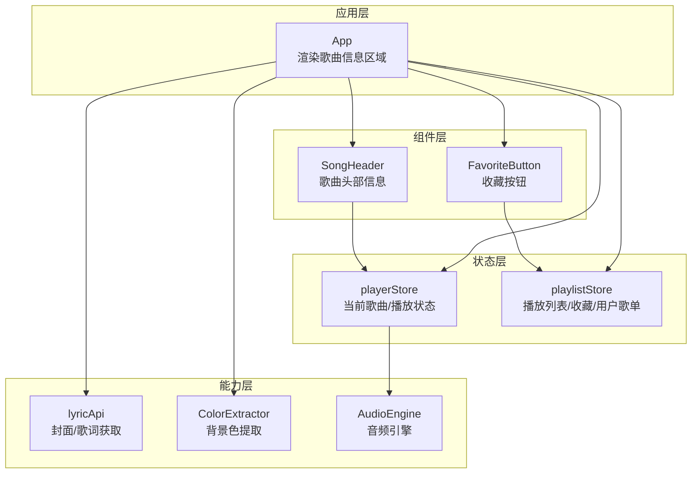
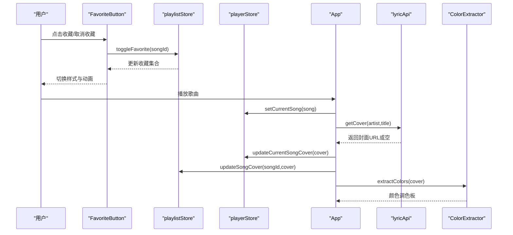
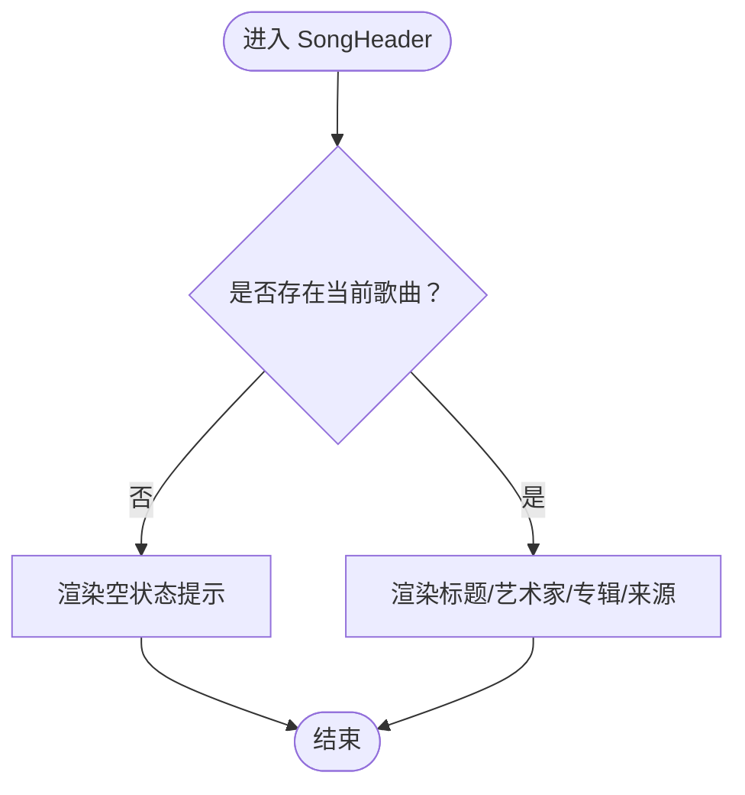
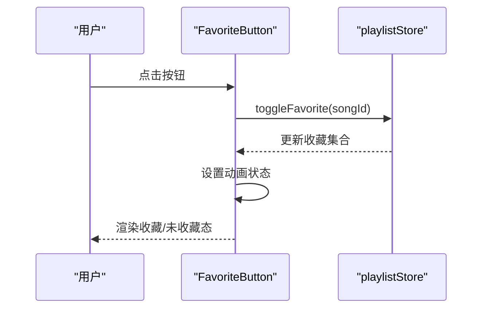
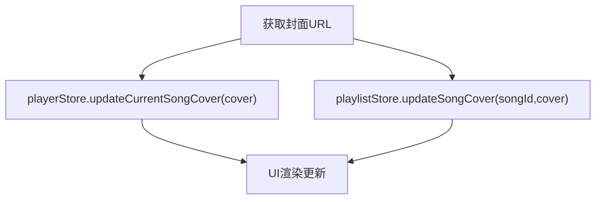
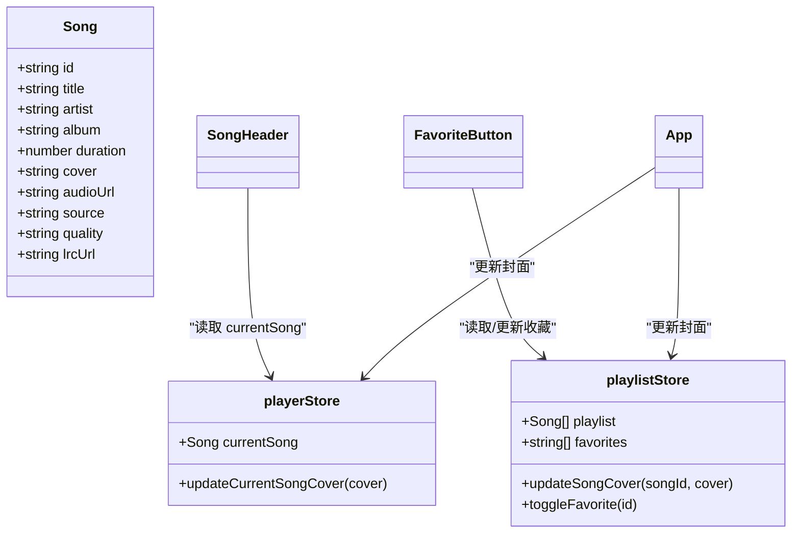
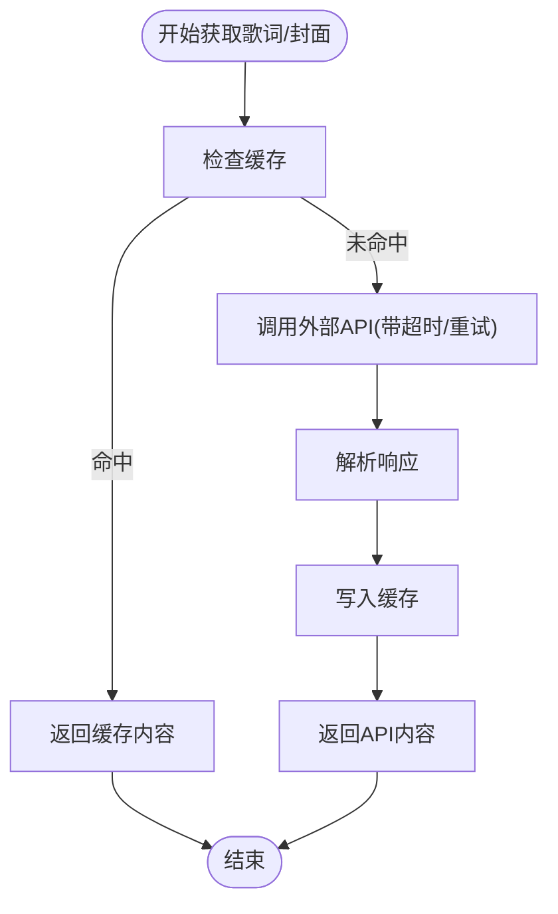
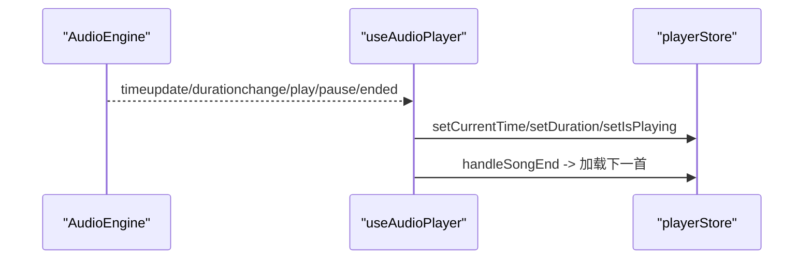
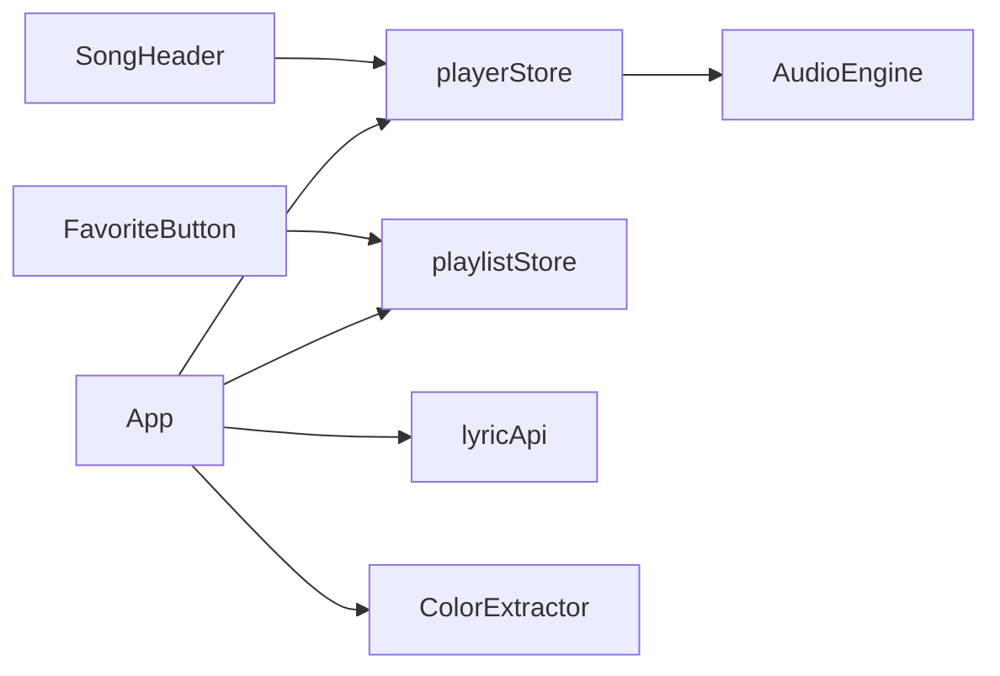

# 歌曲信息组件

<cite>
**本文引用的文件**
- [src/components/SongInfo/SongHeader.tsx](file://src/components/SongInfo/SongHeader.tsx)
- [src/components/SongInfo/FavoriteButton.tsx](file://src/components/SongInfo/FavoriteButton.tsx)
- [src/types/song.ts](file://src/types/song.ts)
- [src/store/playerStore.ts](file://src/store/playerStore.ts)
- [src/store/playlistStore.ts](file://src/store/playlistStore.ts)
- [src/App.tsx](file://src/App.tsx)
- [src/index.css](file://src/index.css)
- [src/api/lyricApi.ts](file://src/api/lyricApi.ts)
- [src/core/ColorExtractor.ts](file://src/core/ColorExtractor.ts)
- [src/hooks/useAudioPlayer.ts](file://src/hooks/useAudioPlayer.ts)
- [src/components/Player/VinylSection.tsx](file://src/components/Player/VinylSection.tsx)
</cite>

## 目录
1. [简介](#简介)
2. [项目结构](#项目结构)
3. [核心组件](#核心组件)
4. [架构总览](#架构总览)
5. [详细组件分析](#详细组件分析)
6. [依赖关系分析](#依赖关系分析)
7. [性能考量](#性能考量)
8. [故障排查指南](#故障排查指南)
9. [结论](#结论)
10. [附录](#附录)

## 简介
本文件聚焦 My Music 2026 的“歌曲信息组件”，系统性阐述歌曲头部信息展示与收藏功能的实现，包括 SongHeader 歌曲标题组件与 FavoriteButton 收藏按钮的设计与交互；详解歌曲元数据展示、专辑封面显示与艺术家信息呈现；解释收藏状态管理、本地存储机制与同步策略；并给出歌曲信息编辑、元数据更新与封面上传的扩展建议，以及样式定制、响应式布局与无障碍访问支持方案。最后提供用户偏好设置、个性化推荐与社交分享的集成思路。

## 项目结构
歌曲信息组件位于 src/components/SongInfo 目录下，配合全局状态管理与应用入口进行渲染与联动：
- 组件层：SongHeader、FavoriteButton
- 类型定义：Song 接口
- 状态层：playerStore（当前歌曲、播放控制）、playlistStore（播放列表、收藏、用户歌单）
- 应用层：App 渲染歌曲信息区域与封面提取逻辑
- 样式层：主题变量、动画与响应式类名
- 能力层：歌词封面获取、颜色提取、音频引擎

图表来源
- [src/components/SongInfo/SongHeader.tsx](file://src/components/SongInfo/SongHeader.tsx#L1-L31)
- [src/components/SongInfo/FavoriteButton.tsx](file://src/components/SongInfo/FavoriteButton.tsx#L1-L30)
- [src/store/playerStore.ts](file://src/store/playerStore.ts#L1-L95)
- [src/store/playlistStore.ts](file://src/store/playlistStore.ts#L1-L88)
- [src/App.tsx](file://src/App.tsx#L1-L98)
- [src/api/lyricApi.ts](file://src/api/lyricApi.ts#L1-L129)
- [src/core/ColorExtractor.ts](file://src/core/ColorExtractor.ts#L1-L27)
- [src/core/AudioEngine.ts](file://src/core/AudioEngine.ts#L1-L143)

章节来源
- [src/components/SongInfo/SongHeader.tsx](file://src/components/SongInfo/SongHeader.tsx#L1-L31)
- [src/components/SongInfo/FavoriteButton.tsx](file://src/components/SongInfo/FavoriteButton.tsx#L1-L30)
- [src/store/playerStore.ts](file://src/store/playerStore.ts#L1-L95)
- [src/store/playlistStore.ts](file://src/store/playlistStore.ts#L1-L88)
- [src/App.tsx](file://src/App.tsx#L1-L98)

## 核心组件
- SongHeader：展示当前歌曲标题、艺术家、专辑与来源标识；在无歌曲时提示导入。
- FavoriteButton：基于收藏状态切换收藏，提供点击反馈动画与无障碍标签。
- 类型 Song：统一歌曲元数据结构，包含 id、标题、艺术家、专辑、时长、封面、音频地址、来源、音质与可选歌词链接。
- playerStore：维护播放状态、当前歌曲、歌词等；提供更新当前歌曲封面的方法。
- playlistStore：维护播放列表、收藏、用户歌单；提供收藏切换、封面更新等方法。
- App：渲染歌曲信息区域，触发封面提取与自动封面获取逻辑。

章节来源
- [src/components/SongInfo/SongHeader.tsx](file://src/components/SongInfo/SongHeader.tsx#L1-L31)
- [src/components/SongInfo/FavoriteButton.tsx](file://src/components/SongInfo/FavoriteButton.tsx#L1-L30)
- [src/types/song.ts](file://src/types/song.ts#L1-L14)
- [src/store/playerStore.ts](file://src/store/playerStore.ts#L1-L95)
- [src/store/playlistStore.ts](file://src/store/playlistStore.ts#L1-L88)
- [src/App.tsx](file://src/App.tsx#L1-L98)

## 架构总览
歌曲信息组件通过状态驱动渲染，收藏状态与播放列表状态相互独立但共享同一存储；封面获取与颜色提取在应用层统一调度，音频引擎负责播放事件与时间同步。

图表来源
- [src/components/SongInfo/FavoriteButton.tsx](file://src/components/SongInfo/FavoriteButton.tsx#L1-L30)
- [src/store/playlistStore.ts](file://src/store/playlistStore.ts#L1-L88)
- [src/store/playerStore.ts](file://src/store/playerStore.ts#L1-L95)
- [src/App.tsx](file://src/App.tsx#L1-L98)
- [src/api/lyricApi.ts](file://src/api/lyricApi.ts#L1-L129)
- [src/core/ColorExtractor.ts](file://src/core/ColorExtractor.ts#L1-L27)

## 详细组件分析

### SongHeader 组件
- 功能要点
  - 读取当前歌曲：当存在时展示标题、艺术家、专辑与来源标识；不存在时提示导入。
  - 样式与可访问性：标题使用主色与截断处理；来源以徽标形式展示本地/API。
- 数据流
  - 从 playerStore 读取 currentSong 并渲染。
- 错误处理
  - 无歌曲时的占位文案，避免渲染异常。
- 性能
  - 仅在 currentSong 变化时重新计算渲染。

图表来源
- [src/components/SongInfo/SongHeader.tsx](file://src/components/SongInfo/SongHeader.tsx#L1-L31)
- [src/store/playerStore.ts](file://src/store/playerStore.ts#L1-L95)

章节来源
- [src/components/SongInfo/SongHeader.tsx](file://src/components/SongInfo/SongHeader.tsx#L1-L31)
- [src/store/playerStore.ts](file://src/store/playerStore.ts#L1-L95)

### FavoriteButton 组件
- 功能要点
  - 读取收藏集合与切换函数，根据是否收藏切换样式与图标填充。
  - 点击时触发动画反馈，提升交互感知。
  - 提供无障碍标签，明确“收藏/取消收藏”语义。
- 数据流
  - 从 playlistStore 读取 favorites 与 toggleFavorite。
  - 点击后立即 setState 触发动画，短暂延迟后恢复。
- 错误处理
  - 无歌曲 ID 时不会执行切换（由调用方保证）。
- 性能
  - 使用局部状态控制动画，避免全局重渲染。

图表来源
- [src/components/SongInfo/FavoriteButton.tsx](file://src/components/SongInfo/FavoriteButton.tsx#L1-L30)
- [src/store/playlistStore.ts](file://src/store/playlistStore.ts#L1-L88)

章节来源
- [src/components/SongInfo/FavoriteButton.tsx](file://src/components/SongInfo/FavoriteButton.tsx#L1-L30)
- [src/store/playlistStore.ts](file://src/store/playlistStore.ts#L1-L88)

### 收藏状态管理与本地存储
- 状态模型
  - playlistStore 维护 favorites 数组，toggleFavorite 实现添加/移除。
  - playerStore 维护 currentSong，提供 updateCurrentSongCover 以更新封面。
- 本地持久化
  - 两个 store 均使用 persist 中间件，分别持久化播放器设置与播放列表/收藏/用户歌单。
- 同步策略
  - 当获取到封面时，同时更新 playerStore 与 playlistStore 中对应歌曲的 cover 字段，确保 UI 一致。

图表来源
- [src/store/playlistStore.ts](file://src/store/playlistStore.ts#L1-L88)
- [src/store/playerStore.ts](file://src/store/playerStore.ts#L1-L95)
- [src/App.tsx](file://src/App.tsx#L1-L98)

章节来源
- [src/store/playlistStore.ts](file://src/store/playlistStore.ts#L1-L88)
- [src/store/playerStore.ts](file://src/store/playerStore.ts#L1-L95)
- [src/App.tsx](file://src/App.tsx#L1-L98)

### 歌曲元数据展示与封面显示
- 元数据来源
  - Song 接口定义了 id、title、artist、album、duration、cover、audioUrl、source、quality、lrcUrl 等字段。
- 展示方式
  - SongHeader 展示标题、艺术家、专辑与来源；来源以徽标形式区分本地/API。
- 封面获取与回退
  - 若当前歌曲无封面，应用层会尝试通过歌词 API 获取封面；若仍无，则不强制要求封面。
- 背景色提取
  - 成功获取封面后，使用 ColorExtractor 提取调色板，动态设置背景渐变。

图表来源
- [src/types/song.ts](file://src/types/song.ts#L1-L14)
- [src/store/playerStore.ts](file://src/store/playerStore.ts#L1-L95)
- [src/store/playlistStore.ts](file://src/store/playlistStore.ts#L1-L88)
- [src/components/SongInfo/SongHeader.tsx](file://src/components/SongInfo/SongHeader.tsx#L1-L31)
- [src/components/SongInfo/FavoriteButton.tsx](file://src/components/SongInfo/FavoriteButton.tsx#L1-L30)
- [src/App.tsx](file://src/App.tsx#L1-L98)

章节来源
- [src/types/song.ts](file://src/types/song.ts#L1-L14)
- [src/store/playerStore.ts](file://src/store/playerStore.ts#L1-L95)
- [src/store/playlistStore.ts](file://src/store/playlistStore.ts#L1-L88)
- [src/components/SongInfo/SongHeader.tsx](file://src/components/SongInfo/SongHeader.tsx#L1-L31)
- [src/components/SongInfo/FavoriteButton.tsx](file://src/components/SongInfo/FavoriteButton.tsx#L1-L30)
- [src/App.tsx](file://src/App.tsx#L1-L98)

### 歌词与封面的获取与缓存
- 歌词获取
  - 通过 searchLyric 调用外部 API，带超时与重试封装；命中缓存则直接返回。
  - 缓存采用 localStorage，带过期时间校验。
- 封面获取
  - 当前歌词 API 不提供封面，返回空；应用层在无封面时尝试自动获取并更新状态。

图表来源
- [src/api/lyricApi.ts](file://src/api/lyricApi.ts#L1-L129)

章节来源
- [src/api/lyricApi.ts](file://src/api/lyricApi.ts#L1-L129)

### 播放器与音频事件联动
- 音频引擎
  - AudioEngine 封装 HTMLAudioElement，提供事件订阅与播放控制。
- 播放事件同步
  - useAudioPlayer 订阅引擎事件，同步播放状态、时间、时长与循环模式。
- 歌曲切换
  - 根据循环模式（列表/单曲/随机）决定下一首索引并加载播放。

图表来源
- [src/core/AudioEngine.ts](file://src/core/AudioEngine.ts#L1-L143)
- [src/hooks/useAudioPlayer.ts](file://src/hooks/useAudioPlayer.ts#L1-L131)
- [src/store/playerStore.ts](file://src/store/playerStore.ts#L1-L95)

章节来源
- [src/core/AudioEngine.ts](file://src/core/AudioEngine.ts#L1-L143)
- [src/hooks/useAudioPlayer.ts](file://src/hooks/useAudioPlayer.ts#L1-L131)
- [src/store/playerStore.ts](file://src/store/playerStore.ts#L1-L95)

## 依赖关系分析
- 组件依赖
  - SongHeader 依赖 playerStore 的 currentSong。
  - FavoriteButton 依赖 playlistStore 的 favorites 与 toggleFavorite。
- 应用层依赖
  - App 依赖 playerStore、playlistStore、lyricApi、ColorExtractor。
- 状态持久化
  - playerStore 与 playlistStore 分别持久化不同维度的数据，避免互相污染。
- 外部依赖
  - ColorThief 用于封面颜色提取；lucide-react 用于收藏图标。

图表来源
- [src/components/SongInfo/SongHeader.tsx](file://src/components/SongInfo/SongHeader.tsx#L1-L31)
- [src/components/SongInfo/FavoriteButton.tsx](file://src/components/SongInfo/FavoriteButton.tsx#L1-L30)
- [src/store/playerStore.ts](file://src/store/playerStore.ts#L1-L95)
- [src/store/playlistStore.ts](file://src/store/playlistStore.ts#L1-L88)
- [src/App.tsx](file://src/App.tsx#L1-L98)
- [src/api/lyricApi.ts](file://src/api/lyricApi.ts#L1-L129)
- [src/core/ColorExtractor.ts](file://src/core/ColorExtractor.ts#L1-L27)
- [src/core/AudioEngine.ts](file://src/core/AudioEngine.ts#L1-L143)

章节来源
- [src/components/SongInfo/SongHeader.tsx](file://src/components/SongInfo/SongHeader.tsx#L1-L31)
- [src/components/SongInfo/FavoriteButton.tsx](file://src/components/SongInfo/FavoriteButton.tsx#L1-L30)
- [src/store/playerStore.ts](file://src/store/playerStore.ts#L1-L95)
- [src/store/playlistStore.ts](file://src/store/playlistStore.ts#L1-L88)
- [src/App.tsx](file://src/App.tsx#L1-L98)

## 性能考量
- 状态粒度
  - 将播放器设置与播放列表/收藏分离持久化，减少不必要的序列化开销。
- 渲染优化
  - SongHeader 仅在 currentSong 变化时重渲染；FavoriteButton 使用局部动画状态，避免全局抖动。
- 异步与缓存
  - 歌词获取带超时与重试，缓存命中直接返回，降低网络与解析成本。
- 资源释放
  - AudioEngine 在销毁时清理 blob URL，避免内存泄漏。

## 故障排查指南
- 无法显示封面
  - 检查歌词 API 是否返回封面（当前返回空），确认应用层自动获取逻辑是否执行。
  - 确认 ColorExtractor 是否成功加载图片并提取颜色。
- 收藏状态不同步
  - 确认点击后是否调用 toggleFavorite；检查持久化是否生效（localStorage）。
  - 确保封面更新时同时更新 playerStore 与 playlistStore。
- 播放异常
  - 查看浏览器自动播放限制提示；确认 useAudioPlayer 是否正确绑定事件。
- 样式异常
  - 检查主题变量与动画类名是否正确引入；确认 Tailwind 配置未被覆盖。

章节来源
- [src/api/lyricApi.ts](file://src/api/lyricApi.ts#L1-L129)
- [src/core/ColorExtractor.ts](file://src/core/ColorExtractor.ts#L1-L27)
- [src/store/playlistStore.ts](file://src/store/playlistStore.ts#L1-L88)
- [src/store/playerStore.ts](file://src/store/playerStore.ts#L1-L95)
- [src/hooks/useAudioPlayer.ts](file://src/hooks/useAudioPlayer.ts#L1-L131)
- [src/index.css](file://src/index.css#L1-L94)

## 结论
歌曲信息组件通过简洁的 UI 与完善的状态管理，实现了歌曲元数据的清晰展示与收藏功能的即时反馈。结合本地存储与缓存策略，保障了用户体验的一致性与稳定性。后续可在封面上传、元数据编辑、个性化推荐与社交分享等方面进一步扩展，以满足更丰富的场景需求。

## 附录

### 样式定制与响应式布局
- 主题变量
  - 通过 CSS 变量集中管理主色、背景、文字与辅助色，便于主题切换。
- 动画与交互
  - 收藏心跳动画、黑胶唱片旋转动画与唱针过渡动画增强沉浸感。
- 响应式
  - 使用 Flex 布局与 Tailwind 类名实现自适应；迷你模式下精简展示。

章节来源
- [src/index.css](file://src/index.css#L1-L94)
- [src/App.tsx](file://src/App.tsx#L1-L98)

### 无障碍访问支持
- 语义化标签
  - FavoriteButton 提供 aria-label，明确“收藏/取消收藏”语义。
- 键盘与焦点
  - 结合全局快捷键钩子，确保键盘可操作性。

章节来源
- [src/components/SongInfo/FavoriteButton.tsx](file://src/components/SongInfo/FavoriteButton.tsx#L1-L30)
- [src/App.tsx](file://src/App.tsx#L1-L98)

### 用户偏好设置与个性化推荐
- 偏好设置
  - 播放器设置（音量、循环模式、音质、播放器模式）已持久化，可作为用户偏好的基础数据。
- 个性化推荐
  - 基于收藏与播放历史，可扩展推荐算法；封面与颜色提取可用于界面个性化。
- 社交分享
  - 可在现有收藏与播放列表基础上，增加分享卡片与社交链接生成。

章节来源
- [src/store/playerStore.ts](file://src/store/playerStore.ts#L1-L95)
- [src/store/playlistStore.ts](file://src/store/playlistStore.ts#L1-L88)
- [src/core/ColorExtractor.ts](file://src/core/ColorExtractor.ts#L1-L27)

### 扩展建议（非仓库既有实现）
- 歌曲信息编辑
  - 在 playlistStore 中新增更新歌曲元数据的方法，并在 UI 中暴露编辑表单。
- 封面上传
  - 新增上传接口与进度反馈，完成后调用 updateSongCover 与 updateCurrentSongCover。
- 歌词与元数据更新
  - 增加歌词解析与同步更新逻辑，结合 useLyricSync 与 playerStore.lyric。

章节来源
- [src/store/playlistStore.ts](file://src/store/playlistStore.ts#L1-L88)
- [src/store/playerStore.ts](file://src/store/playerStore.ts#L1-L95)