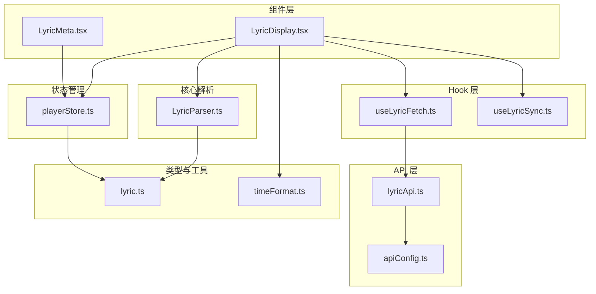
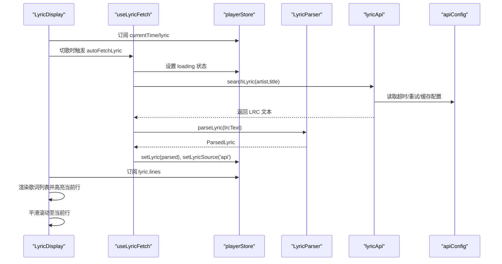
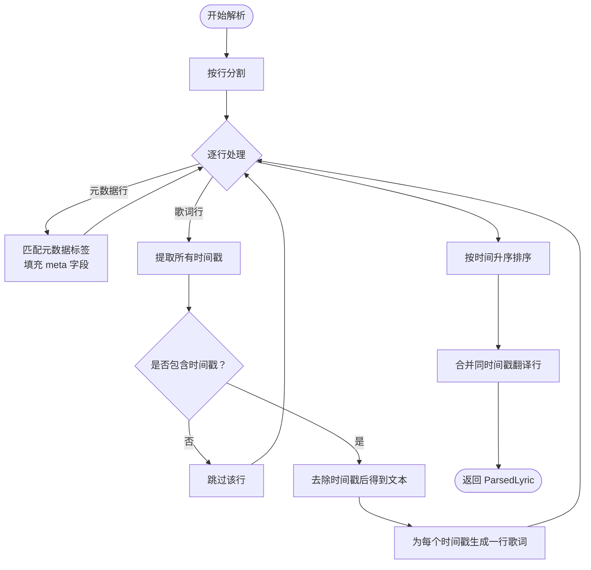
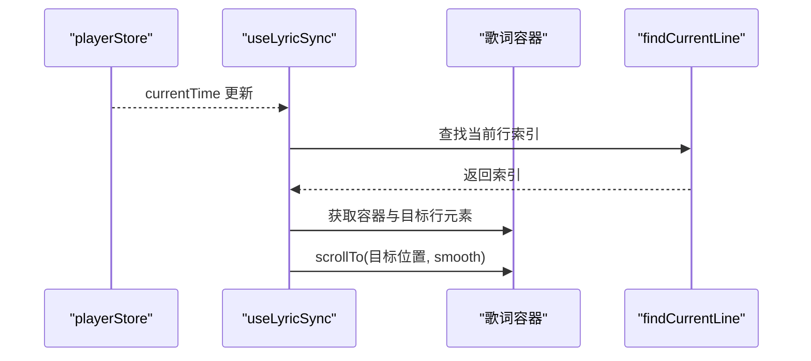
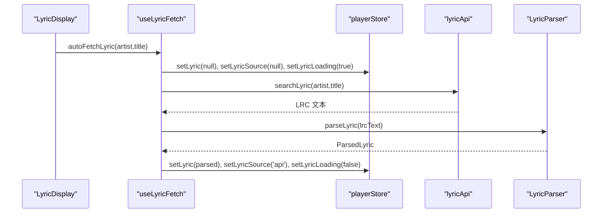
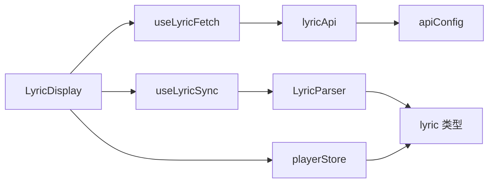

# 歌词组件

<cite>
**本文引用的文件**
- [src/components/Lyrics/LyricDisplay.tsx](file://src/components/Lyrics/LyricDisplay.tsx)
- [src/components/Lyrics/LyricMeta.tsx](file://src/components/Lyrics/LyricMeta.tsx)
- [src/core/LyricParser.ts](file://src/core/LyricParser.ts)
- [src/hooks/useLyricFetch.ts](file://src/hooks/useLyricFetch.ts)
- [src/hooks/useLyricSync.ts](file://src/hooks/useLyricSync.ts)
- [src/types/lyric.ts](file://src/types/lyric.ts)
- [src/api/lyricApi.ts](file://src/api/lyricApi.ts)
- [src/store/playerStore.ts](file://src/store/playerStore.ts)
- [src/config/apiConfig.ts](file://src/config/apiConfig.ts)
- [src/utils/timeFormat.ts](file://src/utils/timeFormat.ts)
</cite>

## 目录
1. [简介](#简介)
2. [项目结构](#项目结构)
3. [核心组件](#核心组件)
4. [架构总览](#架构总览)
5. [详细组件分析](#详细组件分析)
6. [依赖关系分析](#依赖关系分析)
7. [性能与缓存策略](#性能与缓存策略)
8. [错误处理与容错](#错误处理与容错)
9. [样式定制与主题适配](#样式定制与主题适配)
10. [多语言支持与扩展建议](#多语言支持与扩展建议)
11. [搜索与编辑集成方案](#搜索与编辑集成方案)
12. [结论](#结论)

## 简介
本文件为 My Music 2026 的歌词组件提供系统化技术文档，重点覆盖以下方面：
- LyricDisplay 主显示组件与 LyricMeta 元数据组件的职责划分与协作方式
- LRC 歌词格式解析、时间轴计算与实时滚动同步机制
- 歌词高亮逻辑、滚动对齐算法与用户交互响应
- 歌词数据结构、缓存策略与错误处理机制
- 样式定制、字体调整与主题适配的配置入口
- 多语言支持、歌词搜索与歌词编辑的集成思路

## 项目结构
歌词相关代码主要分布在以下模块：
- 组件层：LyricDisplay、LyricMeta
- 核心解析：LyricParser（LRC 解析、二分查找定位当前行）
- 数据流：playerStore（全局状态管理）
- Hook 层：useLyricFetch（歌词获取与防抖）、useLyricSync（滚动同步）
- API 层：lyricApi（lrclib.net 搜索、缓存封装）
- 类型定义：lyric.ts（ParsedLyric、LyricLine、LyricMeta）
- 配置：apiConfig.ts（超时、重试、缓存过期等）

图表来源
- [src/components/Lyrics/LyricDisplay.tsx](file://src/components/Lyrics/LyricDisplay.tsx#L1-L102)
- [src/components/Lyrics/LyricMeta.tsx](file://src/components/Lyrics/LyricMeta.tsx#L1-L19)
- [src/hooks/useLyricFetch.ts](file://src/hooks/useLyricFetch.ts#L1-L95)
- [src/hooks/useLyricSync.ts](file://src/hooks/useLyricSync.ts#L1-L33)
- [src/core/LyricParser.ts](file://src/core/LyricParser.ts#L1-L101)
- [src/store/playerStore.ts](file://src/store/playerStore.ts#L1-L95)
- [src/api/lyricApi.ts](file://src/api/lyricApi.ts#L1-L129)
- [src/config/apiConfig.ts](file://src/config/apiConfig.ts#L1-L18)
- [src/types/lyric.ts](file://src/types/lyric.ts#L1-L21)
- [src/utils/timeFormat.ts](file://src/utils/timeFormat.ts#L1-L7)

章节来源
- [src/components/Lyrics/LyricDisplay.tsx](file://src/components/Lyrics/LyricDisplay.tsx#L1-L102)
- [src/components/Lyrics/LyricMeta.tsx](file://src/components/Lyrics/LyricMeta.tsx#L1-L19)
- [src/hooks/useLyricFetch.ts](file://src/hooks/useLyricFetch.ts#L1-L95)
- [src/hooks/useLyricSync.ts](file://src/hooks/useLyricSync.ts#L1-L33)
- [src/core/LyricParser.ts](file://src/core/LyricParser.ts#L1-L101)
- [src/store/playerStore.ts](file://src/store/playerStore.ts#L1-L95)
- [src/api/lyricApi.ts](file://src/api/lyricApi.ts#L1-L129)
- [src/config/apiConfig.ts](file://src/config/apiConfig.ts#L1-L18)
- [src/types/lyric.ts](file://src/types/lyric.ts#L1-L21)
- [src/utils/timeFormat.ts](file://src/utils/timeFormat.ts#L1-L7)

## 核心组件
- LyricDisplay：负责渲染歌词列表、高亮当前行、显示来源与刷新按钮、点击跳转到指定时间点；通过滚动容器实现平滑滚动至当前行附近。
- LyricMeta：展示歌词作者、作曲者、编曲者等元信息，当无元信息时隐藏。
- LyricParser：解析 LRC 文本，提取元数据与时间戳行，合并同时间戳的翻译行，并提供二分查找定位当前行索引。
- useLyricFetch：封装歌词获取流程，支持自动获取（无本地歌词时）、手动刷新、防抖与竞态控制。
- useLyricSync：根据播放时间实时计算当前行索引，并驱动歌词容器滚动到合适位置。
- playerStore：集中管理歌词对象、歌词来源、加载状态与播放时间等。

章节来源
- [src/components/Lyrics/LyricDisplay.tsx](file://src/components/Lyrics/LyricDisplay.tsx#L7-L101)
- [src/components/Lyrics/LyricMeta.tsx](file://src/components/Lyrics/LyricMeta.tsx#L3-L18)
- [src/core/LyricParser.ts](file://src/core/LyricParser.ts#L18-L100)
- [src/hooks/useLyricFetch.ts](file://src/hooks/useLyricFetch.ts#L12-L94)
- [src/hooks/useLyricSync.ts](file://src/hooks/useLyricSync.ts#L5-L32)
- [src/store/playerStore.ts](file://src/store/playerStore.ts#L8-L40)

## 架构总览
歌词系统采用“组件 + Hook + 核心解析 + 状态管理 + API”的分层架构：
- 组件层负责 UI 表现与用户交互
- Hook 层封装业务逻辑（获取、同步）
- 核心解析层提供数据结构与算法
- 状态管理统一暴露播放时间与歌词数据
- API 层对接外部歌词服务并内置缓存

图表来源
- [src/components/Lyrics/LyricDisplay.tsx](file://src/components/Lyrics/LyricDisplay.tsx#L12-L101)
- [src/hooks/useLyricFetch.ts](file://src/hooks/useLyricFetch.ts#L65-L79)
- [src/api/lyricApi.ts](file://src/api/lyricApi.ts#L86-L119)
- [src/core/LyricParser.ts](file://src/core/LyricParser.ts#L18-L81)
- [src/store/playerStore.ts](file://src/store/playerStore.ts#L74-L76)
- [src/config/apiConfig.ts](file://src/config/apiConfig.ts#L2-L17)

## 详细组件分析

### LyricDisplay 组件
- 职责
  - 在切歌时自动获取歌词（若无本地歌词）
  - 显示加载中、无歌词、在线歌词来源与刷新按钮
  - 渲染歌词行，支持点击跳转到该行对应的时间点
  - 渲染翻译行（若存在）
  - 提供滚动遮罩与平滑滚动
- 关键交互
  - 点击某行：调用音频引擎跳转到该行时间点，并更新播放时间
  - 在线歌词来源：显示来源标识与刷新按钮
- 样式与高亮
  - 当前行高亮：更大字号、强调色、更高不透明度
  - 非当前行：较小字号、较淡颜色、悬停提升不透明度

章节来源
- [src/components/Lyrics/LyricDisplay.tsx](file://src/components/Lyrics/LyricDisplay.tsx#L7-L101)

### LyricMeta 组件
- 职责
  - 读取歌词元信息（词、曲、编曲）
  - 仅在存在至少一项元信息时显示
- 展示
  - 使用语义化的标签组合显示

章节来源
- [src/components/Lyrics/LyricMeta.tsx](file://src/components/Lyrics/LyricMeta.tsx#L3-L18)

### LyricParser 解析器
- LRC 解析
  - 支持多种元数据标签（如艺术家、标题、专辑、词作者、曲作者、编曲者等）
  - 时间戳正则匹配，支持分:秒或分:秒.毫秒两种格式
  - 合并同时间戳的翻译行到上一行
- 时间轴计算
  - 将时间字符串转换为秒数
  - 对所有歌词行按时间升序排序
- 当前行定位
  - 使用二分查找在有序时间轴中定位当前行索引

图表来源
- [src/core/LyricParser.ts](file://src/core/LyricParser.ts#L18-L81)

章节来源
- [src/core/LyricParser.ts](file://src/core/LyricParser.ts#L18-L100)
- [src/types/lyric.ts](file://src/types/lyric.ts#L1-L21)

### useLyricSync 同步 Hook
- 功能
  - 基于播放时间计算当前行索引
  - 在索引变化时，将歌词容器滚动到当前行附近
- 滚动算法
  - 容器高度的三分之一处对齐当前行顶部，实现“居中偏上”的视觉效果
  - 使用平滑滚动增强体验

图表来源
- [src/hooks/useLyricSync.ts](file://src/hooks/useLyricSync.ts#L11-L29)
- [src/core/LyricParser.ts](file://src/core/LyricParser.ts#L83-L100)

章节来源
- [src/hooks/useLyricSync.ts](file://src/hooks/useLyricSync.ts#L5-L32)
- [src/core/LyricParser.ts](file://src/core/LyricParser.ts#L83-L100)

### useLyricFetch 获取 Hook
- 功能
  - 自动获取：在无本地歌词时，切歌时自动发起 API 请求
  - 手动刷新：点击刷新按钮强制重新获取
  - 防抖与竞态控制：通过自增 fetchId 防止快速切歌导致的竞态
  - 错误处理：异常时清空歌词来源，避免误导
- 与 API 层协作
  - 读取配置（超时、重试、缓存）
  - 解析 LRC 文本为结构化歌词
  - 写入状态并标记来源为在线

图表来源
- [src/hooks/useLyricFetch.ts](file://src/hooks/useLyricFetch.ts#L65-L79)
- [src/api/lyricApi.ts](file://src/api/lyricApi.ts#L86-L119)
- [src/core/LyricParser.ts](file://src/core/LyricParser.ts#L18-L81)
- [src/store/playerStore.ts](file://src/store/playerStore.ts#L74-L76)

章节来源
- [src/hooks/useLyricFetch.ts](file://src/hooks/useLyricFetch.ts#L12-L94)
- [src/api/lyricApi.ts](file://src/api/lyricApi.ts#L86-L119)
- [src/core/LyricParser.ts](file://src/core/LyricParser.ts#L18-L81)
- [src/store/playerStore.ts](file://src/store/playerStore.ts#L74-L76)

## 依赖关系分析
- 组件依赖
  - LyricDisplay 依赖 useLyricFetch、useLyricSync、playerStore
  - LyricMeta 依赖 playerStore
- 解析与存储
  - LyricParser 依赖 lyric 类型定义
  - useLyricFetch 依赖 LyricParser 与 lyricApi
  - useLyricSync 依赖 LyricParser 与 playerStore
- 外部依赖
  - lyricApi 依赖 apiConfig（超时、重试、缓存）
  - lyricApi 使用 localStorage 实现歌词缓存

图表来源
- [src/components/Lyrics/LyricDisplay.tsx](file://src/components/Lyrics/LyricDisplay.tsx#L1-L13)
- [src/hooks/useLyricFetch.ts](file://src/hooks/useLyricFetch.ts#L1-L5)
- [src/hooks/useLyricSync.ts](file://src/hooks/useLyricSync.ts#L1-L4)
- [src/core/LyricParser.ts](file://src/core/LyricParser.ts#L1)
- [src/api/lyricApi.ts](file://src/api/lyricApi.ts#L1-L3)
- [src/config/apiConfig.ts](file://src/config/apiConfig.ts#L1-L18)
- [src/types/lyric.ts](file://src/types/lyric.ts#L1-L21)
- [src/store/playerStore.ts](file://src/store/playerStore.ts#L1-L7)

章节来源
- [src/components/Lyrics/LyricDisplay.tsx](file://src/components/Lyrics/LyricDisplay.tsx#L1-L13)
- [src/hooks/useLyricFetch.ts](file://src/hooks/useLyricFetch.ts#L1-L5)
- [src/hooks/useLyricSync.ts](file://src/hooks/useLyricSync.ts#L1-L4)
- [src/core/LyricParser.ts](file://src/core/LyricParser.ts#L1)
- [src/api/lyricApi.ts](file://src/api/lyricApi.ts#L1-L3)
- [src/config/apiConfig.ts](file://src/config/apiConfig.ts#L1-L18)
- [src/types/lyric.ts](file://src/types/lyric.ts#L1-L21)
- [src/store/playerStore.ts](file://src/store/playerStore.ts#L1-L7)

## 性能与缓存策略
- 缓存策略
  - 使用 localStorage 存储 LRC 文本与时间戳
  - 缓存键由前缀 + 艺术家名 + 歌曲名组成
  - 默认缓存过期时间为 7 天
- 请求优化
  - 超时与重试：默认超时 8 秒，最多重试 2 次
  - 防抖与竞态：通过自增 fetchId 避免快速切歌导致的竞态
- 渲染优化
  - 滚动使用 smooth 行为，减少突兀跳变
  - 仅在当前行索引变化时触发滚动，降低 DOM 操作频率

章节来源
- [src/api/lyricApi.ts](file://src/api/lyricApi.ts#L51-L78)
- [src/config/apiConfig.ts](file://src/config/apiConfig.ts#L6-L17)
- [src/hooks/useLyricFetch.ts](file://src/hooks/useLyricFetch.ts#L17-L18)
- [src/hooks/useLyricSync.ts](file://src/hooks/useLyricSync.ts#L20-L29)

## 错误处理与容错
- API 层
  - 超时与网络错误：统一捕获并返回 null，避免崩溃
  - 结果为空：返回 null，调用方据此设置来源为 null
- Hook 层
  - 解析失败：setLyricSource(null)，避免显示错误来源
  - 加载状态：finally 中统一关闭 loading，保证 UI 一致性
- 组件层
  - 无歌词时显示占位与刷新按钮
  - 加载中显示旋转指示器与提示文案

章节来源
- [src/api/lyricApi.ts](file://src/api/lyricApi.ts#L18-L47)
- [src/hooks/useLyricFetch.ts](file://src/hooks/useLyricFetch.ts#L48-L57)
- [src/components/Lyrics/LyricDisplay.tsx](file://src/components/Lyrics/LyricDisplay.tsx#L23-L49)

## 样式定制与主题适配
- 当前行高亮
  - 使用强调色、更大字号与更高不透明度突出当前行
- 非当前行
  - 使用较淡颜色与较小字号，悬停时提升不透明度
- 滚动遮罩
  - 使用渐变遮罩隐藏上下边界，突出当前行
- 主题适配
  - 通过 Tailwind 类名与 CSS 变量实现主题切换
  - 建议在应用层面统一管理颜色变量，以适配深浅主题

章节来源
- [src/components/Lyrics/LyricDisplay.tsx](file://src/components/Lyrics/LyricDisplay.tsx#L67-L98)

## 多语言支持与扩展建议
- LRC 元数据
  - 解析器已支持多类元数据标签（词、曲、编曲等），可扩展为多语言字段
- 歌词文本
  - 当前解析不区分语言，渲染层可结合 UI 层的语言设置进行排版与字体选择
- 建议
  - 引入语言检测与切换机制，配合字体族选择与行高调整
  - 为翻译行提供独立的样式与可读性优化

章节来源
- [src/core/LyricParser.ts](file://src/core/LyricParser.ts#L28-L43)
- [src/types/lyric.ts](file://src/types/lyric.ts#L7-L15)

## 搜索与编辑集成方案
- 搜索
  - lyricApi 已基于 lrclib.net 提供搜索能力，返回带时间轴或纯文本歌词
  - 可在 UI 中增加“搜索歌词”入口，结合自动补全与历史记录
- 编辑
  - 当前未提供歌词编辑功能，可在 LyricDisplay 上方增加“编辑模式”
  - 编辑模式下允许修改时间戳与文本，保存时重新生成 LRC 文本并写回
  - 建议与本地存储结合，支持离线编辑与同步

章节来源
- [src/api/lyricApi.ts](file://src/api/lyricApi.ts#L86-L119)
- [src/components/Lyrics/LyricDisplay.tsx](file://src/components/Lyrics/LyricDisplay.tsx#L54-L65)

## 结论
My Music 2026 的歌词组件通过清晰的分层设计实现了稳定、可扩展的歌词显示与同步能力。LyricDisplay 与 LyricMeta 分别承担渲染与元信息展示职责；LyricParser 提供可靠的 LRC 解析与定位算法；useLyricFetch 与 useLyricSync 将数据流与播放状态紧密耦合；apiConfig 与 lyricApi 则保障了性能与可用性。未来可在多语言支持、搜索与编辑能力上进一步增强，以满足更丰富的使用场景。