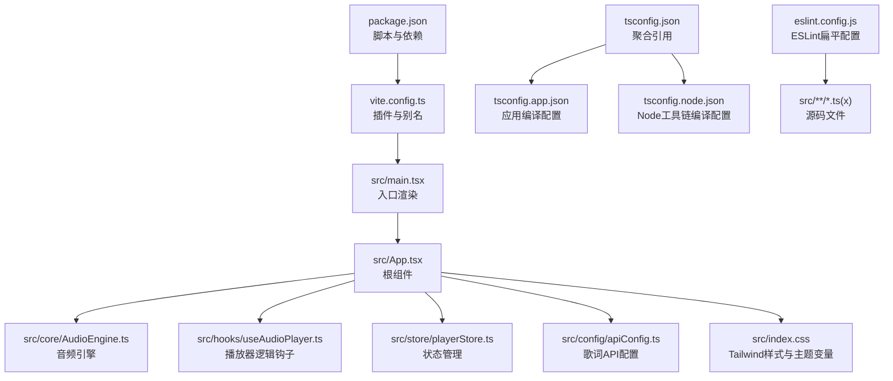
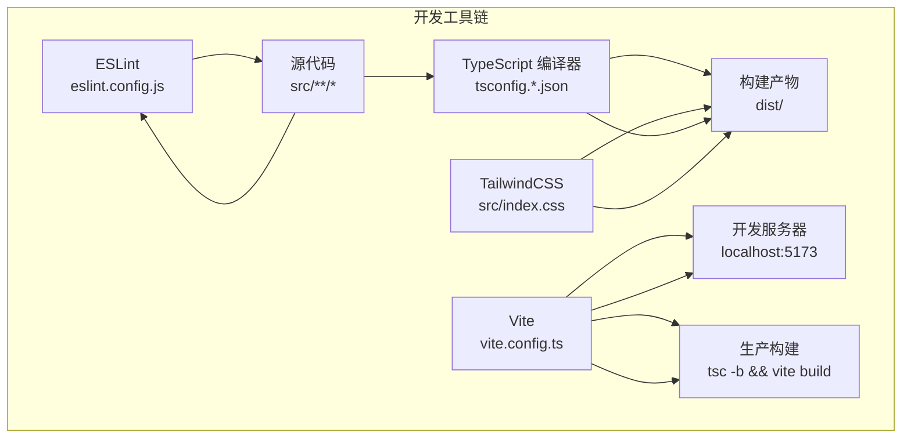
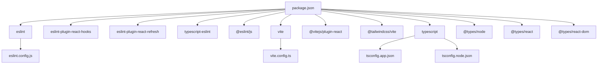
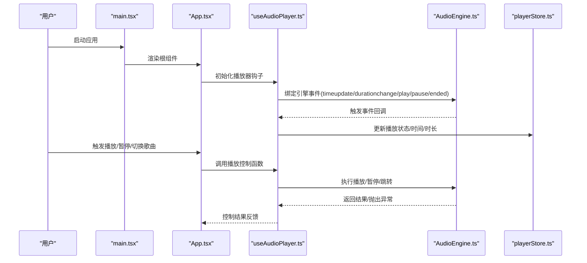
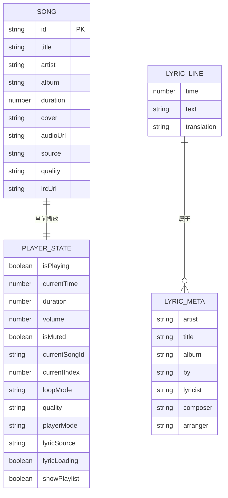

# 开发工具配置

<cite>
**本文引用的文件**
- [eslint.config.js](file://eslint.config.js)
- [vite.config.ts](file://vite.config.ts)
- [tsconfig.json](file://tsconfig.json)
- [tsconfig.app.json](file://tsconfig.app.json)
- [tsconfig.node.json](file://tsconfig.node.json)
- [package.json](file://package.json)
- [src/main.tsx](file://src/main.tsx)
- [src/App.tsx](file://src/App.tsx)
- [src/core/AudioEngine.ts](file://src/core/AudioEngine.ts)
- [src/hooks/useAudioPlayer.ts](file://src/hooks/useAudioPlayer.ts)
- [src/store/playerStore.ts](file://src/store/playerStore.ts)
- [src/config/apiConfig.ts](file://src/config/apiConfig.ts)
- [src/types/vendor.d.ts](file://src/types/vendor.d.ts)
- [src/index.css](file://src/index.css)
- [src/types/song.ts](file://src/types/song.ts)
- [src/types/player.ts](file://src/types/player.ts)
- [src/types/lyric.ts](file://src/types/lyric.ts)
</cite>

## 目录
1. [简介](#简介)
2. [项目结构](#项目结构)
3. [核心组件](#核心组件)
4. [架构总览](#架构总览)
5. [详细组件分析](#详细组件分析)
6. [依赖分析](#依赖分析)
7. [性能考虑](#性能考虑)
8. [故障排查指南](#故障排查指南)
9. [结论](#结论)
10. [附录](#附录)

## 简介
本文件系统性梳理 My Music 2026 的开发工具链配置与最佳实践，覆盖 ESLint 代码质量规则、TypeScript 编译与类型检查、Vite 构建与优化策略、开发调试与性能分析、代码格式化与自动修复、持续集成建议，以及团队协作的统一规范。目标是帮助开发者快速上手并在团队内保持一致的开发体验与质量标准。

## 项目结构
该项目采用 React + TypeScript + Vite 技术栈，配合 TailwindCSS 实现样式体系；通过分层的 TypeScript 配置文件实现应用与 Node 工具链的分离编译；ESLint 使用 Flat Config 组织规则，确保在 Vite 开发环境下具备推荐的 React Hooks 与 React Refresh 规则集。

图表来源
- [package.json](file://package.json#L1-L39)
- [vite.config.ts](file://vite.config.ts#L1-L13)
- [src/main.tsx](file://src/main.tsx#L1-L11)
- [src/App.tsx](file://src/App.tsx#L1-L98)
- [src/core/AudioEngine.ts](file://src/core/AudioEngine.ts#L1-L143)
- [src/hooks/useAudioPlayer.ts](file://src/hooks/useAudioPlayer.ts#L1-L131)
- [src/store/playerStore.ts](file://src/store/playerStore.ts#L1-L95)
- [src/config/apiConfig.ts](file://src/config/apiConfig.ts#L1-L18)
- [src/index.css](file://src/index.css#L1-L94)
- [tsconfig.json](file://tsconfig.json#L1-L8)
- [tsconfig.app.json](file://tsconfig.app.json#L1-L29)
- [tsconfig.node.json](file://tsconfig.node.json#L1-L27)
- [eslint.config.js](file://eslint.config.js#L1-L24)

章节来源
- [package.json](file://package.json#L1-L39)
- [vite.config.ts](file://vite.config.ts#L1-L13)
- [tsconfig.json](file://tsconfig.json#L1-L8)

## 核心组件
- ESLint 扁平配置：启用推荐规则集、React Hooks 推荐规则、React Refresh 适配，并对 ts/tsx 文件生效，同时忽略构建产物目录。
- TypeScript 分层配置：应用与 Node 工具链分别独立配置，开启严格模式与未使用项检查，使用 bundler 解析以适配现代打包器。
- Vite 构建配置：集成 React 与 TailwindCSS 插件，配置模块别名以优化媒体标签库加载。
- 包脚本：提供 dev/build/lint/preview 四类常用命令，便于本地开发与预览。

章节来源
- [eslint.config.js](file://eslint.config.js#L1-L24)
- [tsconfig.app.json](file://tsconfig.app.json#L1-L29)
- [tsconfig.node.json](file://tsconfig.node.json#L1-L27)
- [vite.config.ts](file://vite.config.ts#L1-L13)
- [package.json](file://package.json#L6-L11)

## 架构总览
下图展示开发工具链在项目中的角色与交互关系，包括 ESLint 在编辑器与 CI 中的执行、TypeScript 编译器在构建阶段的作用、Vite 在开发与生产阶段的职责，以及样式与类型系统的协同。

图表来源
- [eslint.config.js](file://eslint.config.js#L1-L24)
- [tsconfig.json](file://tsconfig.json#L1-L8)
- [tsconfig.app.json](file://tsconfig.app.json#L1-L29)
- [tsconfig.node.json](file://tsconfig.node.json#L1-L27)
- [vite.config.ts](file://vite.config.ts#L1-L13)
- [src/index.css](file://src/index.css#L1-L94)

## 详细组件分析

### ESLint 配置与代码质量检查
- 文件范围与语言选项：针对 ts/tsx 文件启用规则，设置 ECMAScript 版本与浏览器全局变量。
- 规则集继承：基于官方推荐、TypeScript ESLint 推荐、React Hooks 推荐与 React Refresh 适配，确保现代 React + TS 场景下的最佳实践。
- 忽略策略：忽略构建输出目录，避免对生成文件进行重复检查。
- 建议的扩展与自定义：
  - 在团队内统一编辑器 ESLint 插件与保存时自动修复流程。
  - 如需更严格的约束，可在现有规则基础上增加 no-restricted-imports、import/order 等规则。
  - 对测试文件与工具脚本可单独建立规则集，避免过度约束。

章节来源
- [eslint.config.js](file://eslint.config.js#L8-L23)

### TypeScript 编译配置与类型检查
- 配置聚合：通过根 tsconfig.json 引用应用与 Node 两套配置，实现多项目引用编译。
- 应用配置（app）：
  - 目标与运行时：ES2022、DOM/DOM.Iterable，JSX 使用 react-jsx。
  - 模块解析：bundler 模式，支持 verbatimModuleSyntax 与 moduleDetection。
  - 类型声明：内置 vite/client，第三方类型由 @types/* 提供。
  - 严格性：开启严格模式、未使用局部变量/参数、switch 覆盖检查、unchecked side effect imports 等。
- Node 配置（node）：
  - 目标与运行时：ES2023，内置 Node 类型。
  - 模块解析：同上，保证工具链一致性。
  - 严格性：同 app。
- 建议的扩展与自定义：
  - 如引入测试框架，可新增 tsconfig.test.json 并在根配置中引用。
  - 对 monorepo 场景，可拆分更多引用配置以提升增量编译效率。

章节来源
- [tsconfig.json](file://tsconfig.json#L1-L8)
- [tsconfig.app.json](file://tsconfig.app.json#L1-L29)
- [tsconfig.node.json](file://tsconfig.node.json#L1-L27)

### Vite 构建工具配置与优化策略
- 插件生态：集成 @vitejs/plugin-react 与 @tailwindcss/vite，确保 React HMR 与 TailwindCSS 自动扫描生效。
- 模块别名：将 jsmediatags 指向其压缩版本，减少体积与加载时间。
- 开发与构建脚本：dev 启动开发服务器，build 先执行 tsc -b 再 vite build，确保类型检查与构建顺序正确。
- 性能优化建议：
  - 按需引入第三方库，结合动态导入与路由级分割。
  - 生产环境启用压缩与资源内联策略，合理配置 rollupOptions。
  - 利用 Vite 缓存与预构建优化大型依赖。

章节来源
- [vite.config.ts](file://vite.config.ts#L1-L13)
- [package.json](file://package.json#L6-L11)

### 开发环境配置、调试与性能分析
- 开发服务器：通过 npm run dev 启动，端口默认 5173，支持热更新与 React Refresh。
- 调试增强：音频引擎在开发模式下暴露至 window，便于在浏览器控制台直接调试。
- 性能分析：
  - 使用浏览器性能面板分析渲染与网络请求。
  - 结合 React DevTools Profiler 定位组件重渲染热点。
  - 使用 Vite 插件如 vite-bundle-analyzer 评估包体构成。

章节来源
- [package.json](file://package.json#L6-L11)
- [src/core/AudioEngine.ts](file://src/core/AudioEngine.ts#L139-L142)

### 代码格式化、自动修复与持续集成
- 代码格式化：建议在团队内统一使用 Prettier，并与 ESLint 配置联动，确保保存时自动格式化。
- 自动修复：在编辑器中启用保存时自动修复；CI 中通过 npm run lint 执行 ESLint 并阻断不合规提交。
- 持续集成：在 CI 中按顺序执行类型检查（tsc）、ESLint 检查与构建，确保质量门禁。
- 提示：当前仓库未包含 Prettier 或 EditorConfig 配置文件，建议补充以统一风格。

章节来源
- [eslint.config.js](file://eslint.config.js#L8-L23)
- [package.json](file://package.json#L6-L11)

### 开发工具扩展与自定义配置方法
- ESLint 扩展：可在现有 flat config 基础上添加自定义规则或第三方插件规则，注意与 React Refresh、TypeScript ESLint 的兼容性。
- TypeScript 扩展：根据业务拆分更多引用配置（如测试、工具脚本等），并为不同环境设置条件编译常量。
- Vite 扩展：按需引入更多插件（如 svg、mdx、worker 等），并通过环境变量区分开发/生产行为。
- 类型声明：通过 src/types/vendor.d.ts 为第三方库补充声明，避免隐式 any。

章节来源
- [eslint.config.js](file://eslint.config.js#L1-L24)
- [tsconfig.app.json](file://tsconfig.app.json#L1-L29)
- [vite.config.ts](file://vite.config.ts#L1-L13)
- [src/types/vendor.d.ts](file://src/types/vendor.d.ts#L1-L3)

### 团队协作的统一开发规范与最佳实践
- 代码风格：统一使用 Prettier 与 ESLint，明确禁止的语法与命名约定。
- 提交规范：建议引入 commitlint 与 conventional commits，配合 husky 在本地执行校验。
- 文档与注释：为公共 API、复杂算法与跨模块交互补充必要的注释与变更日志。
- 依赖管理：定期更新依赖，使用 npm audit 或类似工具扫描安全风险；对大体积依赖进行替代或按需加载。

章节来源
- [eslint.config.js](file://eslint.config.js#L8-L23)
- [package.json](file://package.json#L22-L37)

## 依赖分析
下图展示开发工具链的核心依赖与其作用域，帮助理解各工具在项目中的定位与耦合关系。

图表来源
- [package.json](file://package.json#L22-L37)
- [eslint.config.js](file://eslint.config.js#L1-L24)
- [vite.config.ts](file://vite.config.ts#L1-L13)
- [tsconfig.app.json](file://tsconfig.app.json#L1-L29)
- [tsconfig.node.json](file://tsconfig.node.json#L1-L27)

章节来源
- [package.json](file://package.json#L1-L39)

## 性能考虑
- 构建阶段：先执行 tsc -b 进行类型检查，再进行 Vite 构建，确保类型错误在构建前被发现。
- 运行时：通过模块别名指向压缩版媒体标签库，降低首屏加载时间；TailwindCSS 仅在开发时启用，生产构建中建议配合 Purge/Tree Shaking。
- 渲染与状态：使用 Zustand 精简状态管理，避免不必要的订阅与重渲染；对高频回调使用 useCallback 缓存。
- 网络与缓存：歌词 API 配置包含超时、重试与缓存策略，减少重复请求与失败重试带来的抖动。

章节来源
- [package.json](file://package.json#L6-L11)
- [vite.config.ts](file://vite.config.ts#L7-L12)
- [src/config/apiConfig.ts](file://src/config/apiConfig.ts#L1-L18)
- [src/store/playerStore.ts](file://src/store/playerStore.ts#L42-L94)

## 故障排查指南
- ESLint 报错
  - 症状：编辑器或 CI 中出现规则冲突或无法识别的语法。
  - 排查：确认 eslint.config.js 是否正确继承推荐规则集；检查文件匹配范围是否覆盖目标文件；必要时在本地执行 eslint . --fix。
- TypeScript 错误
  - 症状：构建失败或编辑器提示类型错误。
  - 排查：优先解决 app 配置中的严格模式相关错误；核对第三方库类型声明是否存在；确保引用配置正确。
- Vite 启动异常
  - 症状：开发服务器启动失败或 HMR 不生效。
  - 排查：检查 vite.config.ts 插件注册与别名配置；确认端口占用与防火墙设置；尝试清理 node_modules/.vite 缓存。
- 媒体标签加载问题
  - 症状：音频封面读取失败或报错。
  - 排查：确认 jsmediatags 的别名指向压缩版本；检查网络权限与跨域策略；在开发控制台查看 __audioEngine 的状态。

章节来源
- [eslint.config.js](file://eslint.config.js#L8-L23)
- [tsconfig.app.json](file://tsconfig.app.json#L19-L25)
- [vite.config.ts](file://vite.config.ts#L5-L12)
- [src/types/vendor.d.ts](file://src/types/vendor.d.ts#L1-L3)
- [src/core/AudioEngine.ts](file://src/core/AudioEngine.ts#L139-L142)

## 结论
本项目在开发工具链层面已形成较为完善的配置体系：ESLint 提供代码质量保障，TypeScript 通过分层配置确保严格性与可维护性，Vite 集成 React 与 TailwindCSS 插件满足现代前端开发需求。建议团队在此基础上补充统一的格式化与提交规范，并在 CI 中强化质量门禁，以进一步提升协作效率与交付质量。

## 附录

### 关键流程时序图：播放器初始化与事件同步
该序列图展示从应用挂载到音频引擎事件绑定、状态同步与播放控制的关键调用链。

图表来源
- [src/main.tsx](file://src/main.tsx#L1-L11)
- [src/App.tsx](file://src/App.tsx#L1-L98)
- [src/hooks/useAudioPlayer.ts](file://src/hooks/useAudioPlayer.ts#L1-L131)
- [src/core/AudioEngine.ts](file://src/core/AudioEngine.ts#L1-L143)
- [src/store/playerStore.ts](file://src/store/playerStore.ts#L1-L95)

### 数据模型图：播放器核心类型
该 ER 图展示播放器相关类型之间的关联关系，帮助理解数据结构与边界。

图表来源
- [src/types/song.ts](file://src/types/song.ts#L1-L14)
- [src/types/player.ts](file://src/types/player.ts#L1-L4)
- [src/types/lyric.ts](file://src/types/lyric.ts#L1-L21)
- [src/store/playerStore.ts](file://src/store/playerStore.ts#L8-L40)