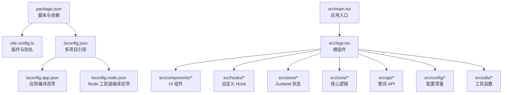
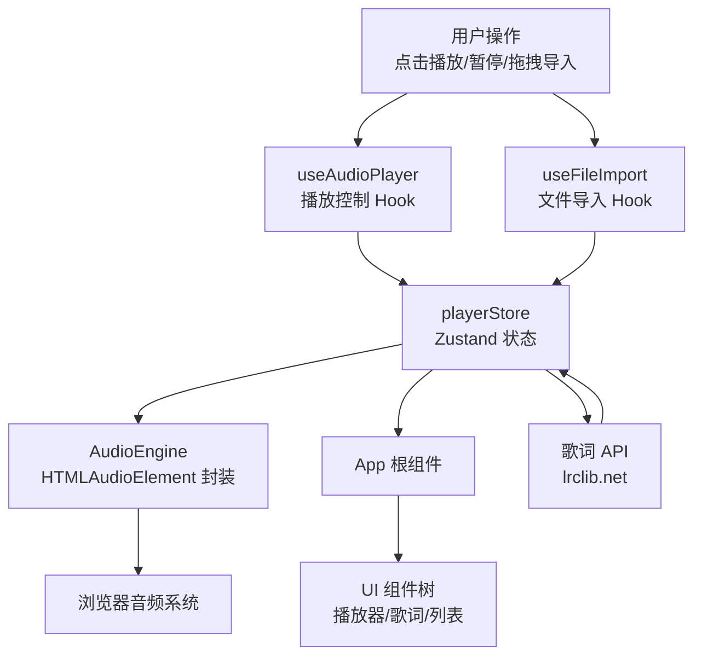
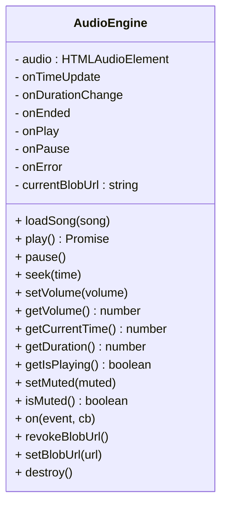
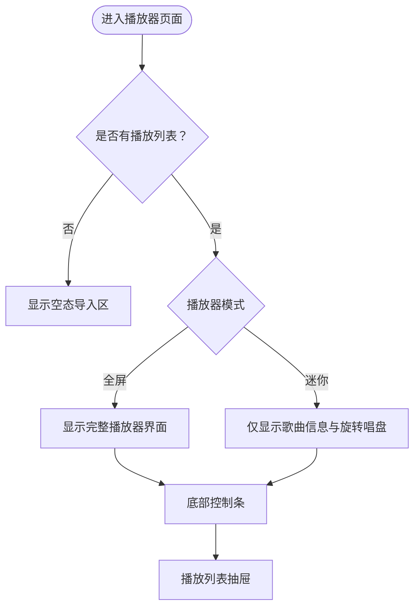
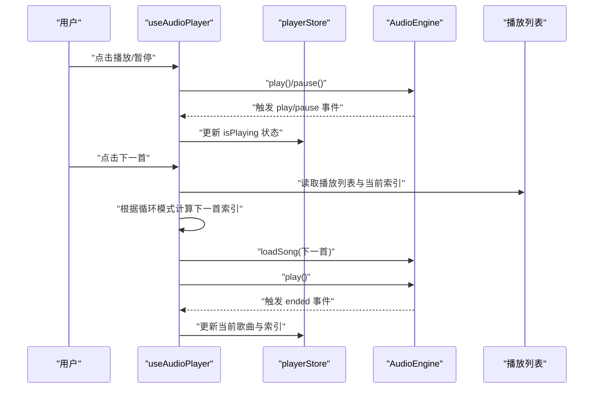
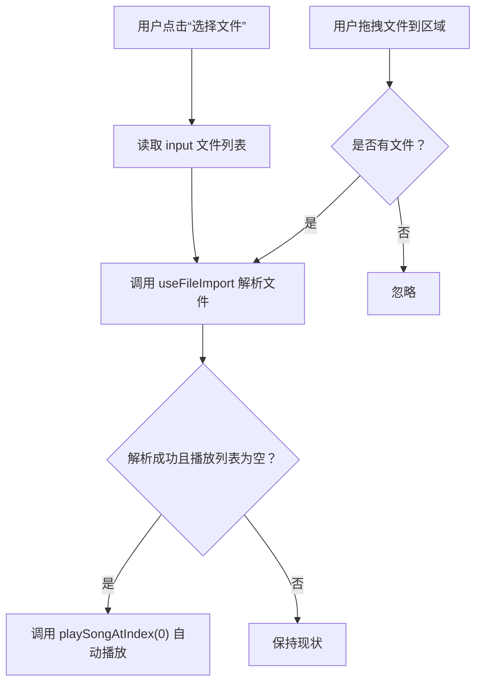
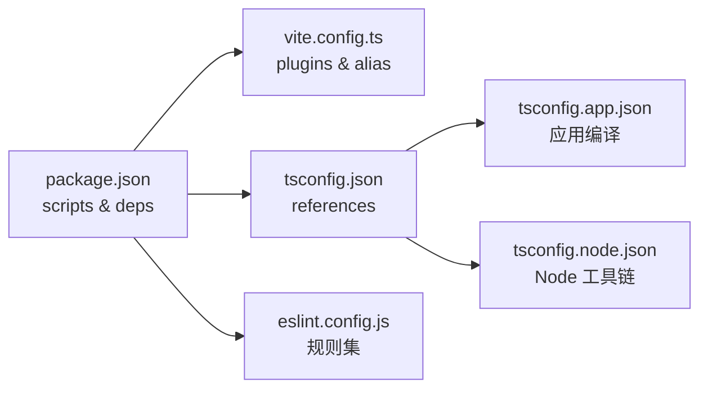

# 快速开始

<cite>
**本文引用的文件**
- [package.json](file://package.json)
- [vite.config.ts](file://vite.config.ts)
- [tsconfig.json](file://tsconfig.json)
- [tsconfig.app.json](file://tsconfig.app.json)
- [tsconfig.node.json](file://tsconfig.node.json)
- [README.md](file://README.md)
- [src/main.tsx](file://src/main.tsx)
- [src/App.tsx](file://src/App.tsx)
- [src/core/AudioEngine.ts](file://src/core/AudioEngine.ts)
- [src/store/playerStore.ts](file://src/store/playerStore.ts)
- [src/hooks/useAudioPlayer.ts](file://src/hooks/useAudioPlayer.ts)
- [src/components/FileImport/DragDropZone.tsx](file://src/components/FileImport/DragDropZone.tsx)
- [src/config/apiConfig.ts](file://src/config/apiConfig.ts)
- [src/utils/timeFormat.ts](file://src/utils/timeFormat.ts)
- [eslint.config.js](file://eslint.config.js)
</cite>

## 目录
1. [简介](#简介)
2. [项目结构](#项目结构)
3. [核心组件](#核心组件)
4. [架构总览](#架构总览)
5. [详细组件分析](#详细组件分析)
6. [依赖分析](#依赖分析)
7. [性能考虑](#性能考虑)
8. [故障排除指南](#故障排除指南)
9. [结论](#结论)
10. [附录](#附录)

## 简介
本指南面向新手开发者，帮助你在最短时间内克隆、安装并运行 My Music 2026 项目。你将学到：
- 环境要求与安装步骤
- 开发服务器启动与构建流程
- Vite 与 TypeScript 的配置要点
- 基本使用方法：导入音乐、播放控制、查看歌词
- 常见初始化问题与解决方案

## 项目结构
该项目基于 React + TypeScript，采用 Vite 作为构建工具，使用 Zustand 管理播放器状态，TailwindCSS 提供样式能力。核心目录与职责概览如下：
- src：源代码根目录
  - components：UI 组件（播放器、歌词、播放列表、导入区等）
  - core：核心业务逻辑（音频引擎、颜色提取、歌词解析）
  - hooks：自定义 Hook（播放器控制、文件导入、快捷键、歌词同步）
  - store：全局状态（播放器状态、播放列表）
  - utils：通用工具函数（时间格式化）
  - api：网络请求（歌词 API）
  - config：配置常量（歌词 API 基础地址、超时、缓存策略）
  - main.tsx：应用入口
  - App.tsx：根组件
- vite.config.ts：Vite 配置（React 插件、TailwindCSS 插件、别名）
- tsconfig.*：TypeScript 多项目配置（应用与 Node 工具链）
- package.json：脚本、依赖与开发依赖

图表来源
- [package.json](file://package.json#L1-L39)
- [vite.config.ts](file://vite.config.ts#L1-L13)
- [tsconfig.json](file://tsconfig.json#L1-L8)
- [tsconfig.app.json](file://tsconfig.app.json#L1-L29)
- [tsconfig.node.json](file://tsconfig.node.json#L1-L27)
- [src/main.tsx](file://src/main.tsx#L1-L11)
- [src/App.tsx](file://src/App.tsx#L1-L98)

章节来源
- [package.json](file://package.json#L1-L39)
- [vite.config.ts](file://vite.config.ts#L1-L13)
- [tsconfig.json](file://tsconfig.json#L1-L8)
- [tsconfig.app.json](file://tsconfig.app.json#L1-L29)
- [tsconfig.node.json](file://tsconfig.node.json#L1-L27)
- [src/main.tsx](file://src/main.tsx#L1-L11)
- [src/App.tsx](file://src/App.tsx#L1-L98)

## 核心组件
- 应用入口与根组件
  - 入口文件负责挂载 React 根节点，渲染根组件。
  - 根组件根据播放器模式与播放列表状态决定布局（空态导入区、迷你模式、全屏模式），并渲染控制条与播放列表抽屉。
- 音频引擎
  - 基于原生 HTMLAudioElement，封装播放、暂停、跳转、音量、错误处理等接口，并通过事件回调与播放器状态同步。
- 播放器状态
  - 使用 Zustand 管理播放状态、当前歌曲、循环模式、音质、歌词等；部分状态持久化到本地存储。
- 自定义 Hook
  - useAudioPlayer：将音频引擎事件映射为播放器行为（播放/暂停、切歌、进度跳转）。
  - useFileImport：处理文件拖拽与选择，解析媒体标签，生成歌曲对象并加入播放列表。
- 文件导入区
  - 提供拖拽与文件选择两种方式导入音乐文件，支持多种音频格式与歌词文件。
- 歌词与 API
  - 通过歌词 API 获取封面与歌词数据，带超时、重试与缓存策略。

章节来源
- [src/main.tsx](file://src/main.tsx#L1-L11)
- [src/App.tsx](file://src/App.tsx#L1-L98)
- [src/core/AudioEngine.ts](file://src/core/AudioEngine.ts#L1-L143)
- [src/store/playerStore.ts](file://src/store/playerStore.ts#L1-L95)
- [src/hooks/useAudioPlayer.ts](file://src/hooks/useAudioPlayer.ts#L1-L131)
- [src/components/FileImport/DragDropZone.tsx](file://src/components/FileImport/DragDropZone.tsx#L1-L67)
- [src/config/apiConfig.ts](file://src/config/apiConfig.ts#L1-L18)

## 架构总览
下图展示了从用户操作到状态更新与 UI 渲染的关键路径，以及与外部资源（音频文件、歌词 API）的交互。

图表来源
- [src/hooks/useAudioPlayer.ts](file://src/hooks/useAudioPlayer.ts#L1-L131)
- [src/store/playerStore.ts](file://src/store/playerStore.ts#L1-L95)
- [src/core/AudioEngine.ts](file://src/core/AudioEngine.ts#L1-L143)
- [src/App.tsx](file://src/App.tsx#L1-L98)
- [src/config/apiConfig.ts](file://src/config/apiConfig.ts#L1-L18)

## 详细组件分析

### 音频引擎（AudioEngine）
- 职责
  - 封装 HTMLAudioElement，提供统一的播放控制接口与事件订阅。
  - 管理 Blob URL 生命周期，避免内存泄漏。
- 关键点
  - 事件映射：timeupdate、durationchange、ended、play、pause、error。
  - 安全播放：捕获播放异常，提示需要用户交互。
  - 状态查询：当前时间、时长、是否播放、静音状态。
- 设计模式
  - 单例模式：全局共享实例，便于跨组件调用。
  - 事件驱动：通过回调与播放器状态解耦。

图表来源
- [src/core/AudioEngine.ts](file://src/core/AudioEngine.ts#L1-L143)

章节来源
- [src/core/AudioEngine.ts](file://src/core/AudioEngine.ts#L1-L143)

### 播放器状态（playerStore）
- 职责
  - 统一管理播放器状态：播放/暂停、进度、音量、当前歌曲、循环模式、歌词、播放列表抽屉开关等。
  - 使用持久化中间件保存部分用户偏好。
- 关键点
  - 状态字段覆盖播放控制、歌词显示、UI 模式切换。
  - 动作包括：设置播放状态、更新当前歌曲、切换循环模式、切换播放器模式、更新歌词与来源、控制播放列表抽屉等。

图表来源
- [src/App.tsx](file://src/App.tsx#L48-L94)
- [src/store/playerStore.ts](file://src/store/playerStore.ts#L42-L94)

章节来源
- [src/store/playerStore.ts](file://src/store/playerStore.ts#L1-L95)
- [src/App.tsx](file://src/App.tsx#L1-L98)

### 播放控制 Hook（useAudioPlayer）
- 职责
  - 将音频引擎事件与播放器状态联动，实现播放/暂停、切歌、进度跳转等行为。
  - 处理循环模式（列表、单曲、随机）与自动播放限制。
- 关键点
  - 事件绑定：timeupdate/durationchange/play/pause/ended。
  - 切歌逻辑：根据循环模式计算下一首索引并加载播放。
  - 用户交互：首次播放可能因浏览器策略被阻断，等待用户手势后重试。

图表来源
- [src/hooks/useAudioPlayer.ts](file://src/hooks/useAudioPlayer.ts#L1-L131)
- [src/core/AudioEngine.ts](file://src/core/AudioEngine.ts#L1-L143)
- [src/store/playerStore.ts](file://src/store/playerStore.ts#L1-L95)

章节来源
- [src/hooks/useAudioPlayer.ts](file://src/hooks/useAudioPlayer.ts#L1-L131)

### 文件导入区（DragDropZone）
- 职责
  - 提供拖拽与文件选择两种导入方式，解析音频文件与歌词文件，生成歌曲对象并加入播放列表。
  - 导入完成后，若播放列表为空则自动播放第一首。
- 关键点
  - 支持的文件类型：音频文件与 .lrc 歌词文件。
  - 交互反馈：拖拽悬停高亮、文件选择清空输入值以允许重复选择同一文件。

图表来源
- [src/components/FileImport/DragDropZone.tsx](file://src/components/FileImport/DragDropZone.tsx#L1-L67)
- [src/hooks/useAudioPlayer.ts](file://src/hooks/useAudioPlayer.ts#L64-L75)

章节来源
- [src/components/FileImport/DragDropZone.tsx](file://src/components/FileImport/DragDropZone.tsx#L1-L67)

### 歌词与 API 配置
- 配置项
  - 基础 URL：lrclib.net（支持 CORS，浏览器可直连）
  - 超时时间与重试次数
  - 缓存键前缀与过期时间（默认 7 天）
- 用途
  - 在无封面或歌词缺失时，按歌手与歌名请求封面与歌词数据，并更新状态。

章节来源
- [src/config/apiConfig.ts](file://src/config/apiConfig.ts#L1-L18)

## 依赖分析
- 包管理与脚本
  - 使用 npm 脚本启动开发服务器、构建产物、预览与代码检查。
- 生产依赖
  - React 19、React DOM、Tailwind 相关工具、颜色提取、媒体标签解析、图标库、状态管理。
- 开发依赖
  - Vite、React 插件、TailwindCSS 插件、TypeScript、ESLint 及相关规则。
- Vite 配置
  - 启用 React 与 TailwindCSS 插件；为 jsmediatags 设置别名以适配打包器。
- TypeScript 配置
  - 多项目引用：app 与 node；Bundler 模式；严格类型检查与模块解析策略。

图表来源
- [package.json](file://package.json#L1-L39)
- [vite.config.ts](file://vite.config.ts#L1-L13)
- [tsconfig.json](file://tsconfig.json#L1-L8)
- [tsconfig.app.json](file://tsconfig.app.json#L1-L29)
- [tsconfig.node.json](file://tsconfig.node.json#L1-L27)
- [eslint.config.js](file://eslint.config.js#L1-L24)

章节来源
- [package.json](file://package.json#L1-L39)
- [vite.config.ts](file://vite.config.ts#L1-L13)
- [tsconfig.json](file://tsconfig.json#L1-L8)
- [tsconfig.app.json](file://tsconfig.app.json#L1-L29)
- [tsconfig.node.json](file://tsconfig.node.json#L1-L27)
- [eslint.config.js](file://eslint.config.js#L1-L24)

## 性能考虑
- 播放器模式切换
  - 迷你模式减少渲染层级，适合轻量展示。
- 图片与歌词加载
  - 无封面时按需请求，避免不必要的网络开销。
- 时间格式化
  - 简洁的时间格式化函数，避免复杂计算。
- 构建优化
  - Vite 与 React 插件已启用，建议在生产构建中开启压缩与分包策略（由 Vite 默认行为处理）。

章节来源
- [src/App.tsx](file://src/App.tsx#L48-L94)
- [src/utils/timeFormat.ts](file://src/utils/timeFormat.ts#L1-L7)

## 故障排除指南
- 无法自动播放
  - 浏览器出于安全策略限制自动播放，需等待用户交互（点击/触摸）后再次尝试播放。
  - 参考：[AudioEngine.play](file://src/core/AudioEngine.ts#L54-L61)
- 拖拽导入无响应
  - 确认文件类型匹配（音频与 .lrc），并检查控制台是否存在解析错误。
  - 参考：[DragDropZone](file://src/components/FileImport/DragDropZone.tsx#L12-L23)
- 歌词或封面未显示
  - 检查网络请求是否超时或被拦截；确认 API 配置与跨域策略。
  - 参考：[apiConfig](file://src/config/apiConfig.ts#L1-L18)
- 构建报错或类型检查失败
  - 确保 TypeScript 版本与配置一致；执行 lint 修复后再构建。
  - 参考：[tsconfig.app.json](file://tsconfig.app.json#L1-L29)、[eslint.config.js](file://eslint.config.js#L1-L24)
- jsmediatags 无法解析
  - Vite 已为其设置别名以适配打包器；若仍失败，请检查依赖安装与版本兼容性。
  - 参考：[vite.config.ts](file://vite.config.ts#L8-L11)

章节来源
- [src/core/AudioEngine.ts](file://src/core/AudioEngine.ts#L54-L61)
- [src/components/FileImport/DragDropZone.tsx](file://src/components/FileImport/DragDropZone.tsx#L12-L23)
- [src/config/apiConfig.ts](file://src/config/apiConfig.ts#L1-L18)
- [tsconfig.app.json](file://tsconfig.app.json#L1-L29)
- [eslint.config.js](file://eslint.config.js#L1-L24)
- [vite.config.ts](file://vite.config.ts#L8-L11)

## 结论
通过本指南，你可以完成环境准备、项目安装与开发服务器启动，并掌握导入音乐、播放控制与歌词查看的基本操作。遇到问题时，可依据“故障排除指南”定位常见问题。随着对项目结构与核心组件的深入理解，你可以进一步扩展功能或优化性能。

## 附录

### 环境要求
- Node.js：建议使用 LTS 版本（具体版本请参考项目使用的包管理器与构建工具版本）
- 包管理器：npm（推荐）
- 浏览器：现代浏览器（支持 ES2022 语法与模块）

章节来源
- [package.json](file://package.json#L1-L39)
- [tsconfig.app.json](file://tsconfig.app.json#L4-L6)

### 安装与启动步骤
- 克隆仓库后，在项目根目录执行以下命令：
  - 安装依赖：npm install
  - 启动开发服务器：npm run dev
  - 构建生产包：npm run build
  - 预览生产包：npm run preview
  - 代码检查：npm run lint

章节来源
- [package.json](file://package.json#L6-L11)

### Vite 与 TypeScript 配置要点
- Vite
  - 启用 React 与 TailwindCSS 插件
  - 为 jsmediatags 设置别名以适配打包器
- TypeScript
  - 多项目引用：app 与 node
  - Bundler 模式与严格类型检查
  - 应用与 Node 工具链分别配置

章节来源
- [vite.config.ts](file://vite.config.ts#L1-L13)
- [tsconfig.json](file://tsconfig.json#L1-L8)
- [tsconfig.app.json](file://tsconfig.app.json#L11-L16)
- [tsconfig.node.json](file://tsconfig.node.json#L10-L15)

### 基本使用示例
- 导入音乐文件
  - 方式一：拖拽音频文件到导入区
  - 方式二：点击“选择文件”，在弹出对话框中选择多个文件
  - 若播放列表为空，导入完成后将自动播放第一首
  - 参考：[DragDropZone](file://src/components/FileImport/DragDropZone.tsx#L12-L23)
- 控制播放
  - 点击播放/暂停按钮，或使用快捷键（如 Space）
  - 切换上一首/下一首，或拖动进度条跳转
  - 参考：[useAudioPlayer](file://src/hooks/useAudioPlayer.ts#L77-L114)
- 查看歌词
  - 歌词随播放进度同步滚动；若歌词未加载，将显示“暂无歌词”
  - 参考：[playerStore](file://src/store/playerStore.ts#L18-L22)

章节来源
- [src/components/FileImport/DragDropZone.tsx](file://src/components/FileImport/DragDropZone.tsx#L12-L23)
- [src/hooks/useAudioPlayer.ts](file://src/hooks/useAudioPlayer.ts#L77-L114)
- [src/store/playerStore.ts](file://src/store/playerStore.ts#L18-L22)