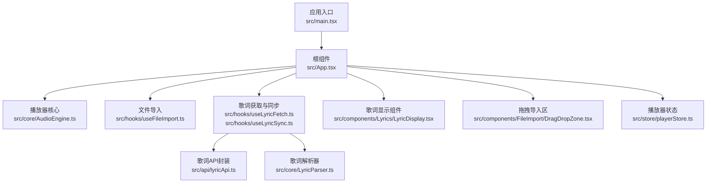
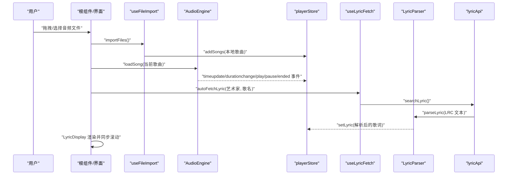
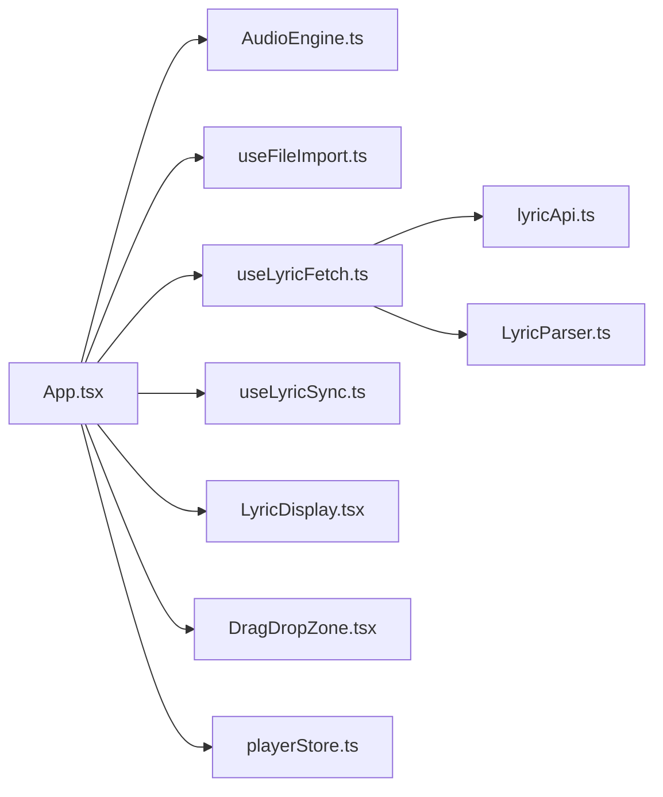

# 故障排除

<cite>
**本文引用的文件**
- [README.md](file://README.md)
- [package.json](file://package.json)
- [src/main.tsx](file://src/main.tsx)
- [src/App.tsx](file://src/App.tsx)
- [src/core/AudioEngine.ts](file://src/core/AudioEngine.ts)
- [src/hooks/useAudioPlayer.ts](file://src/hooks/useAudioPlayer.ts)
- [src/hooks/useFileImport.ts](file://src/hooks/useFileImport.ts)
- [src/hooks/useLyricFetch.ts](file://src/hooks/useLyricFetch.ts)
- [src/hooks/useLyricSync.ts](file://src/hooks/useLyricSync.ts)
- [src/store/playerStore.ts](file://src/store/playerStore.ts)
- [src/api/lyricApi.ts](file://src/api/lyricApi.ts)
- [src/core/LyricParser.ts](file://src/core/LyricParser.ts)
- [src/components/FileImport/DragDropZone.tsx](file://src/components/FileImport/DragDropZone.tsx)
- [src/components/Lyrics/LyricDisplay.tsx](file://src/components/Lyrics/LyricDisplay.tsx)
- [src/types/player.ts](file://src/types/player.ts)
</cite>

## 目录
1. [简介](#简介)
2. [项目结构](#项目结构)
3. [核心组件](#核心组件)
4. [架构总览](#架构总览)
5. [详细组件分析与排障要点](#详细组件分析与排障要点)
6. [依赖关系分析](#依赖关系分析)
7. [性能考虑](#性能考虑)
8. [故障排除指南](#故障排除指南)
9. [结论](#结论)
10. [附录](#附录)

## 简介
本指南面向 My Music 2026 用户与开发者，聚焦于音频播放、文件导入、歌词显示等常见问题的诊断与修复路径，并提供浏览器兼容性、性能优化、日志与监控最佳实践、问题报告模板与社区支持资源，帮助用户自助定位并解决问题。

## 项目结构
- 应用入口与根组件负责渲染播放器主界面、迷你模式、播放列表抽屉与底部控制栏。
- 核心播放引擎封装 HTMLAudioElement，统一事件与状态管理。
- 文件导入模块支持拖拽/选择本地音频与 LRC 歌词，生成本地播放列表。
- 歌词模块通过 API 智能拉取与本地解析，支持滚动同步与点击跳转。
- 状态管理采用 Zustand，持久化关键播放设置。

图表来源
- [src/main.tsx](file://src/main.tsx#L1-L11)
- [src/App.tsx](file://src/App.tsx#L1-L98)
- [src/core/AudioEngine.ts](file://src/core/AudioEngine.ts#L1-L143)
- [src/hooks/useFileImport.ts](file://src/hooks/useFileImport.ts#L1-L78)
- [src/hooks/useLyricFetch.ts](file://src/hooks/useLyricFetch.ts#L1-L95)
- [src/hooks/useLyricSync.ts](file://src/hooks/useLyricSync.ts#L1-L33)
- [src/components/Lyrics/LyricDisplay.tsx](file://src/components/Lyrics/LyricDisplay.tsx#L1-L102)
- [src/components/FileImport/DragDropZone.tsx](file://src/components/FileImport/DragDropZone.tsx#L1-L67)
- [src/store/playerStore.ts](file://src/store/playerStore.ts#L1-L95)
- [src/api/lyricApi.ts](file://src/api/lyricApi.ts#L1-L129)
- [src/core/LyricParser.ts](file://src/core/LyricParser.ts#L1-L101)

章节来源
- [src/main.tsx](file://src/main.tsx#L1-L11)
- [src/App.tsx](file://src/App.tsx#L1-L98)

## 核心组件
- 播放引擎 AudioEngine：封装 HTMLAudioElement 的播放、暂停、跳转、音量、事件监听与资源回收；提供错误回调与调试暴露。
- 播放器 Hook useAudioPlayer：桥接引擎与状态，处理循环模式、随机播放、下一首/上一首、seek 同步。
- 文件导入 Hook useFileImport：识别音频与 LRC，生成本地 Song 并写入播放列表，支持本地歌词标记。
- 歌词 Hook useLyricFetch：防抖/竞态控制的歌词获取，支持自动与手动刷新；歌词来源标记。
- 歌词 Hook useLyricSync：基于当前时间计算高亮行并平滑滚动。
- 歌词显示组件 LyricDisplay：渲染歌词、来源标识、刷新按钮，支持点击跳转。
- 拖拽导入区 DragDropZone：拖拽/选择文件入口，自动触发播放。
- 播放器状态 playerStore：集中管理播放状态、歌词、播放模式、循环模式、音质等。

章节来源
- [src/core/AudioEngine.ts](file://src/core/AudioEngine.ts#L1-L143)
- [src/hooks/useAudioPlayer.ts](file://src/hooks/useAudioPlayer.ts#L1-L131)
- [src/hooks/useFileImport.ts](file://src/hooks/useFileImport.ts#L1-L78)
- [src/hooks/useLyricFetch.ts](file://src/hooks/useLyricFetch.ts#L1-L95)
- [src/hooks/useLyricSync.ts](file://src/hooks/useLyricSync.ts#L1-L33)
- [src/components/Lyrics/LyricDisplay.tsx](file://src/components/Lyrics/LyricDisplay.tsx#L1-L102)
- [src/components/FileImport/DragDropZone.tsx](file://src/components/FileImport/DragDropZone.tsx#L1-L67)
- [src/store/playerStore.ts](file://src/store/playerStore.ts#L1-L95)

## 架构总览
播放链路与数据流概览如下：

图表来源
- [src/App.tsx](file://src/App.tsx#L1-L98)
- [src/hooks/useFileImport.ts](file://src/hooks/useFileImport.ts#L1-L78)
- [src/core/AudioEngine.ts](file://src/core/AudioEngine.ts#L1-L143)
- [src/store/playerStore.ts](file://src/store/playerStore.ts#L1-L95)
- [src/hooks/useLyricFetch.ts](file://src/hooks/useLyricFetch.ts#L1-L95)
- [src/core/LyricParser.ts](file://src/core/LyricParser.ts#L1-L101)
- [src/api/lyricApi.ts](file://src/api/lyricApi.ts#L1-L129)

## 详细组件分析与排障要点

### 播放引擎 AudioEngine
- 关键点
  - 事件映射：timeupdate/durationchange/play/pause/ended/error。
  - 安全 seek：边界检查与有限时长判断。
  - 资源管理：load/destroy 与 revokeObjectURL。
  - 开发调试：DEV 环境下挂载至 window 以供调试。
- 常见问题与排查
  - 播放报错：检查 error 回调与浏览器自动播放策略；首次播放需用户交互。
  - 无法跳转：确认传入时间有效且小于时长。
  - 内存泄漏：切换歌曲后确保 revokeObjectURL 被调用。
- 代码片段路径
  - [事件绑定与错误处理](file://src/core/AudioEngine.ts#L23-L45)
  - [播放/暂停/seek 实现](file://src/core/AudioEngine.ts#L54-L71)
  - [资源回收与销毁](file://src/core/AudioEngine.ts#L118-L134)
  - [调试暴露](file://src/core/AudioEngine.ts#L139-L142)

章节来源
- [src/core/AudioEngine.ts](file://src/core/AudioEngine.ts#L1-L143)

### 播放器 Hook useAudioPlayer
- 关键点
  - 事件桥接：将引擎事件映射到状态更新。
  - 循环/随机：根据 loopMode 计算下一曲索引。
  - 自动播放限制：首次播放捕获异常并等待用户交互。
- 常见问题与排查
  - 点击播放无响应：确认已触发用户交互；检查 isPlaying 状态与 currentSong 是否存在。
  - 切歌后不播放：检查 handleSongEnd 逻辑与 playSongAtIndex 参数。
  - 音量/静音不同步：确认依赖数组包含 volume/isMuted。
- 代码片段路径
  - [事件桥接与播放结束处理](file://src/hooks/useAudioPlayer.ts#L15-L36)
  - [循环/随机/顺序切换](file://src/hooks/useAudioPlayer.ts#L47-L62)
  - [播放/暂停/跳转](file://src/hooks/useAudioPlayer.ts#L77-L119)

章节来源
- [src/hooks/useAudioPlayer.ts](file://src/hooks/useAudioPlayer.ts#L1-L131)

### 文件导入 useFileImport
- 关键点
  - 音频类型过滤：按 MIME 或扩展名筛选。
  - LRC 解析：读取文本并写入歌词状态，标记来源为 local。
  - 本地歌曲生成：基于文件名解析“歌手 - 歌名”，否则回退默认值。
- 常见问题与排查
  - 导入无效：确认文件类型匹配；检查文件名是否符合“歌手 - 歌名”以便解析标题/歌手。
  - 歌词未显示：确认 LRC 文件被正确识别与解析；检查歌词来源标记。
  - 无法播放：确认 audioUrl 有效且可访问。
- 代码片段路径
  - [音频文件识别与解析](file://src/hooks/useFileImport.ts#L7-L31)
  - [LRC 导入与解析](file://src/hooks/useFileImport.ts#L51-L58)
  - [统一导入流程](file://src/hooks/useFileImport.ts#L60-L74)

章节来源
- [src/hooks/useFileImport.ts](file://src/hooks/useFileImport.ts#L1-L78)

### 歌词获取与同步 useLyricFetch / useLyricSync
- 关键点
  - 防抖/竞态：fetchIdRef 控制请求生命周期，避免快速切歌导致的竞态。
  - 自动/手动刷新：无本地歌词时自动拉取，否则可手动刷新。
  - 同步滚动：findCurrentLine 使用二分查找定位当前行并平滑滚动。
- 常见问题与排查
  - 歌词不显示：检查歌词来源标记；确认 API 返回非空且解析成功。
  - 刷新无效：确认当前 artist/title 非空且非“未知歌手”。
  - 滚动不同步：检查 currentTime 更新频率与 lines 是否有序。
- 代码片段路径
  - [防抖/竞态控制与自动获取](file://src/hooks/useLyricFetch.ts#L17-L79)
  - [手动刷新](file://src/hooks/useLyricFetch.ts#L84-L91)
  - [二分查找定位当前行](file://src/hooks/useLyricSync.ts#L11-L18)
  - [滚动同步](file://src/hooks/useLyricSync.ts#L20-L29)

章节来源
- [src/hooks/useLyricFetch.ts](file://src/hooks/useLyricFetch.ts#L1-L95)
- [src/hooks/useLyricSync.ts](file://src/hooks/useLyricSync.ts#L1-L33)

### 歌词显示 LyricDisplay
- 关键点
  - 加载态与占位：显示加载动画与“暂无歌词”提示。
  - 来源标识与刷新：在线歌词显示刷新按钮。
  - 点击跳转：点击行触发 seek 与时间更新。
- 常见问题与排查
  - 显示空白：确认歌词已写入状态且 lines 非空。
  - 刷新按钮不可用：确认当前歌曲非“未知歌手”。
  - 点击无反应：检查 seek 与状态更新是否执行。
- 代码片段路径
  - [自动获取与渲染](file://src/components/Lyrics/LyricDisplay.tsx#L15-L49)
  - [来源标识与刷新](file://src/components/Lyrics/LyricDisplay.tsx#L54-L65)
  - [点击跳转实现](file://src/components/Lyrics/LyricDisplay.tsx#L80-L85)

章节来源
- [src/components/Lyrics/LyricDisplay.tsx](file://src/components/Lyrics/LyricDisplay.tsx#L1-L102)

### 拖拽导入区 DragDropZone
- 关键点
  - 拖拽高亮与事件处理：dragover/dragleave/onDrop。
  - 自动播放：当播放列表为空时，导入完成后自动播放第一首。
- 常见问题与排查
  - 无法拖拽：确认事件阻止默认行为与类名切换。
  - 导入后不播放：确认导入前播放列表长度为 0。
- 代码片段路径
  - [拖拽与选择文件处理](file://src/components/FileImport/DragDropZone.tsx#L12-L23)
  - [自动播放逻辑](file://src/components/FileImport/DragDropZone.tsx#L18-L21)

章节来源
- [src/components/FileImport/DragDropZone.tsx](file://src/components/FileImport/DragDropZone.tsx#L1-L67)

### 播放器状态 playerStore
- 关键点
  - 持久化：仅保存音量、静音、循环模式、音质、播放模式等设置。
  - 多状态聚合：播放、时间、歌词、播放列表可见性等。
- 常见问题与排查
  - 设置丢失：确认持久化配置与键名一致。
  - 状态不一致：检查多处对同一字段的更新是否同步。
- 代码片段路径
  - [状态定义与持久化](file://src/store/playerStore.ts#L42-L94)

章节来源
- [src/store/playerStore.ts](file://src/store/playerStore.ts#L1-L95)

### 歌词 API 与解析 lyricApi / LyricParser
- 关键点
  - fetchWithRetry：带超时与重试的网络请求封装。
  - 缓存：localStorage 缓存 LRC 文本，带过期控制。
  - 解析：支持元数据标签与多时间戳合并，二分查找定位当前行。
- 常见问题与排查
  - 请求超时/失败：检查超时与重试参数；确认网络可达。
  - 缓存失效：确认缓存键与过期时间设置。
  - 解析异常：检查 LRC 文本格式与时间戳规范。
- 代码片段路径
  - [超时/重试封装](file://src/api/lyricApi.ts#L18-L47)
  - [缓存读取/写入](file://src/api/lyricApi.ts#L55-L78)
  - [歌词搜索与缓存](file://src/api/lyricApi.ts#L86-L119)
  - [歌词解析与定位](file://src/core/LyricParser.ts#L18-L81)

章节来源
- [src/api/lyricApi.ts](file://src/api/lyricApi.ts#L1-L129)
- [src/core/LyricParser.ts](file://src/core/LyricParser.ts#L1-L101)

## 依赖关系分析
- 组件耦合
  - App 作为根容器协调播放器、歌词、导入与控制栏。
  - useAudioPlayer 依赖 AudioEngine 与 playerStore。
  - useLyricFetch 依赖 lyricApi 与 LyricParser，并写入 playerStore。
  - DragDropZone 与 LyricDisplay 通过 Hooks 与状态交互。
- 外部依赖
  - 浏览器原生 Audio 与 fetch。
  - 第三方库：React、Zustand、colorthief、jsmediatags 等。
- 潜在风险
  - 浏览器自动播放策略导致首次播放失败。
  - LRC 解析对时间戳格式敏感。
  - localStorage 存储上限与隐私模式影响缓存可用性。

图表来源
- [src/App.tsx](file://src/App.tsx#L1-L98)
- [src/core/AudioEngine.ts](file://src/core/AudioEngine.ts#L1-L143)
- [src/hooks/useFileImport.ts](file://src/hooks/useFileImport.ts#L1-L78)
- [src/hooks/useLyricFetch.ts](file://src/hooks/useLyricFetch.ts#L1-L95)
- [src/hooks/useLyricSync.ts](file://src/hooks/useLyricSync.ts#L1-L33)
- [src/components/Lyrics/LyricDisplay.tsx](file://src/components/Lyrics/LyricDisplay.tsx#L1-L102)
- [src/components/FileImport/DragDropZone.tsx](file://src/components/FileImport/DragDropZone.tsx#L1-L67)
- [src/store/playerStore.ts](file://src/store/playerStore.ts#L1-L95)
- [src/api/lyricApi.ts](file://src/api/lyricApi.ts#L1-L129)
- [src/core/LyricParser.ts](file://src/core/LyricParser.ts#L1-L101)

## 性能考虑
- 播放性能
  - preload 与资源回收：合理使用 load 与 revokeObjectURL，避免内存累积。
  - 事件节流：timeupdate 频繁触发，避免在渲染中做重计算。
- 歌词性能
  - 二分查找：定位当前行的时间复杂度 O(log n)，适合长歌词。
  - 滚动优化：使用 smooth behavior，但注意滚动冲突与容器高度。
- 导入性能
  - 批量导入：一次性添加多首歌曲，减少多次状态更新。
  - 类型过滤：提前过滤音频文件，减少无效解析。
- 缓存与网络
  - 合理设置超时与重试次数，避免阻塞主线程。
  - localStorage 写入失败时降级处理，不影响主流程。

## 故障排除指南

### 一、音频播放问题
- 症状
  - 点击播放无声音。
  - 播放后立即停止。
  - 无法跳转进度条。
- 诊断步骤
  - 确认首次播放前已发生用户交互（点击/触摸）。
  - 检查 isPlaying 与 currentSong 是否正确设置。
  - 查看引擎 error 回调输出，确认音频 URL 可访问。
  - 使用调试暴露对象验证 seek 与时间更新。
- 解决方案
  - 引导用户进行一次页面交互后再尝试播放。
  - 确保 loadSong 后再 play；必要时捕获异常并提示用户交互。
  - 对 seek 输入进行边界校验，避免越界。
- 代码片段路径
  - [首次播放异常处理](file://src/hooks/useAudioPlayer.ts#L70-L75)
  - [引擎错误回调](file://src/core/AudioEngine.ts#L41-L44)
  - [seek 边界检查](file://src/core/AudioEngine.ts#L67-L71)

章节来源
- [src/hooks/useAudioPlayer.ts](file://src/hooks/useAudioPlayer.ts#L70-L75)
- [src/core/AudioEngine.ts](file://src/core/AudioEngine.ts#L41-L44)

### 二、文件导入失败
- 症状
  - 拖拽/选择文件后无歌曲加入。
  - 歌词未显示或解析失败。
- 诊断步骤
  - 检查文件类型是否匹配（audio/* 或常见扩展名）。
  - 确认文件名是否符合“歌手 - 歌名”以便解析标题/歌手。
  - 检查 LRC 文件是否被识别与解析。
- 解决方案
  - 更换文件格式或命名方式。
  - 确保 LRC 文件编码正确（UTF-8）。
  - 若仍失败，尝试重新选择文件或清空缓存后重试。
- 代码片段路径
  - [类型过滤与解析](file://src/hooks/useFileImport.ts#L37-L48)
  - [LRC 解析与来源标记](file://src/hooks/useFileImport.ts#L51-L58)

章节来源
- [src/hooks/useFileImport.ts](file://src/hooks/useFileImport.ts#L37-L58)

### 三、歌词显示异常
- 症状
  - “暂无歌词”或加载中长时间停留。
  - 在线歌词按钮不可用或刷新无效。
  - 点击歌词行无法跳转。
- 诊断步骤
  - 确认当前歌曲的 artist/title 非空且非“未知歌手”。
  - 检查歌词来源标记与 loading 状态。
  - 验证歌词解析结果 lines 是否非空且有序。
- 解决方案
  - 手动刷新歌词，或更换歌曲名称/歌手尝试。
  - 确认 LRC 文本格式规范（时间戳与文本）。
  - 点击行后检查 seek 与状态更新是否生效。
- 代码片段路径
  - [自动获取与刷新](file://src/hooks/useLyricFetch.ts#L65-L91)
  - [解析与定位](file://src/core/LyricParser.ts#L18-L81)
  - [点击跳转](file://src/components/Lyrics/LyricDisplay.tsx#L80-L85)

章节来源
- [src/hooks/useLyricFetch.ts](file://src/hooks/useLyricFetch.ts#L65-L91)
- [src/core/LyricParser.ts](file://src/core/LyricParser.ts#L18-L81)
- [src/components/Lyrics/LyricDisplay.tsx](file://src/components/Lyrics/LyricDisplay.tsx#L80-L85)

### 四、浏览器兼容性问题
- 常见问题
  - 自动播放受限导致首次播放失败。
  - 某些浏览器对特定音频格式支持不佳。
  - 移动端手势/权限限制影响交互。
- 解决方案
  - 引导用户进行一次页面交互后再播放。
  - 提示用户使用主流浏览器（Chrome/Firefox/Safari）。
  - 对移动端提供明确的“允许媒体权限”指引。
- 代码片段路径
  - [自动播放限制说明](file://src/hooks/useAudioPlayer.ts#L72-L74)

章节来源
- [src/hooks/useAudioPlayer.ts](file://src/hooks/useAudioPlayer.ts#L72-L74)

### 五、性能优化建议
- 减少渲染压力
  - 歌词列表使用虚拟滚动（如需支持超长歌词）。
  - 降低 timeupdate 的渲染频率，或拆分计算。
- 资源管理
  - 切歌时及时 revokeObjectURL，避免内存泄漏。
  - 合理设置 preload 与缓存策略。
- 网络优化
  - 适当提高超时与重试间隔，避免频繁失败。
  - 对重复请求进行去重与缓存命中。

### 六、日志记录与错误监控最佳实践
- 日志采集
  - 在关键路径（导入、播放、歌词获取）记录上下文信息（歌曲名、艺术家、状态）。
  - 区分用户可感知错误与内部异常，避免泄露敏感信息。
- 错误上报
  - 对网络请求失败、解析异常、播放失败进行分类上报。
  - 附带设备信息、浏览器版本、时间戳，便于复现。
- 调试工具
  - DEV 环境暴露引擎对象，便于在控制台直接操作与观测。
- 代码片段路径
  - [调试暴露](file://src/core/AudioEngine.ts#L139-L142)

章节来源
- [src/core/AudioEngine.ts](file://src/core/AudioEngine.ts#L139-L142)

### 七、问题报告模板
- 基本信息
  - 浏览器与版本、操作系统、设备类型。
  - 应用版本与构建时间。
- 复现步骤
  - 详细描述操作流程与期望/实际结果。
- 日志与截图
  - 控制台错误信息、网络请求状态、屏幕截图。
- 附加信息
  - 音频文件格式与大小、LRC 文件内容片段（脱敏后）。

### 八、社区支持资源
- 仓库与文档
  - 项目 README 与 PRD 文档。
  - Issues 页面提交问题报告。
- 社区渠道
  - 讨论区/群组（如适用）。
- 反馈与改进
  - 提交功能建议与改进建议，附带最小可复现示例。

## 结论
通过梳理播放引擎、导入与歌词模块的职责边界与交互关系，结合常见问题的诊断步骤与解决方案，用户可以快速定位并修复大部分使用问题。建议在日常使用中关注浏览器自动播放策略、文件格式与命名规范、歌词格式与缓存策略，并配合调试工具与日志上报机制，持续优化体验与稳定性。

## 附录
- 快速检查清单
  - 首次播放前是否有用户交互？
  - 音频 URL 是否可访问？是否为受支持格式？
  - 文件名是否符合“歌手 - 歌名”以便解析？
  - LRC 文本格式是否规范？
  - 歌词来源标记是否正确？
  - localStorage 是否可用且未满？