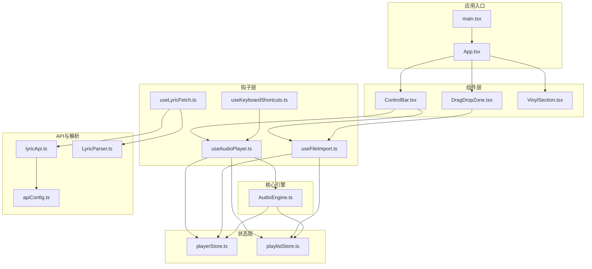
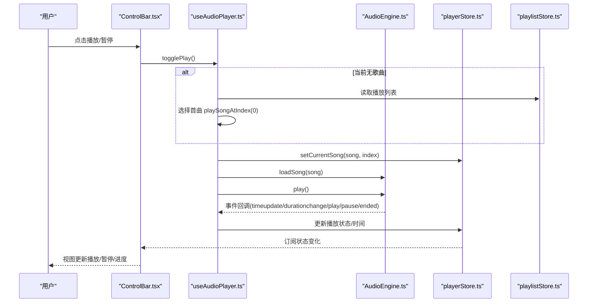
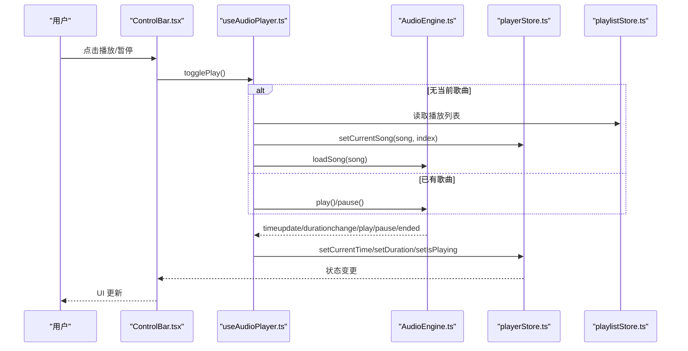
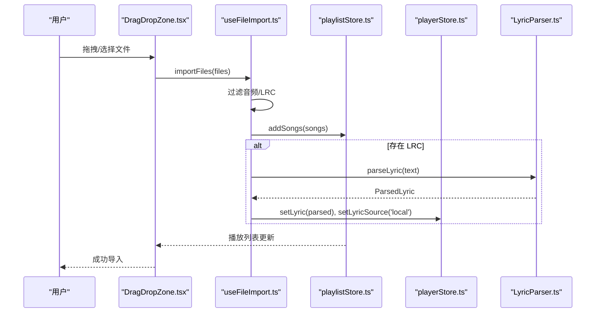
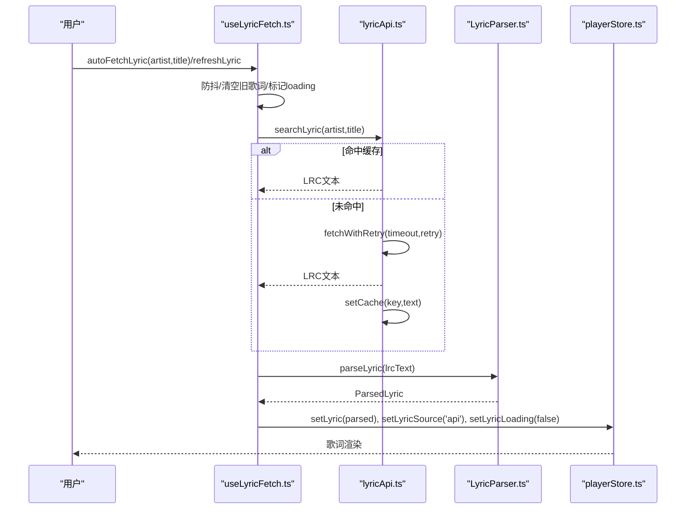
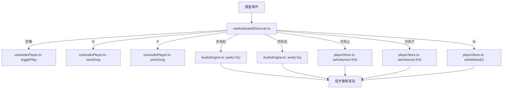
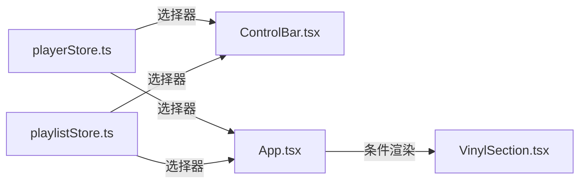
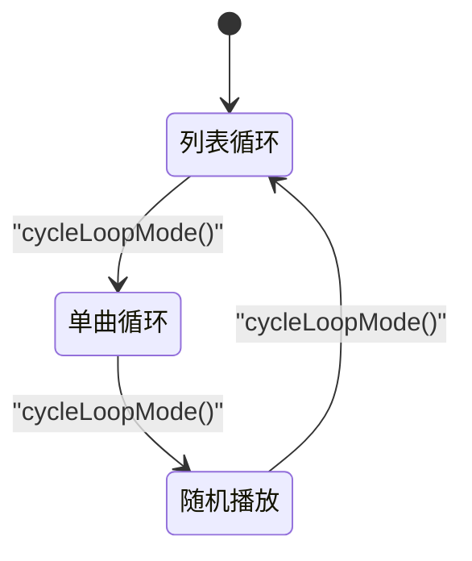
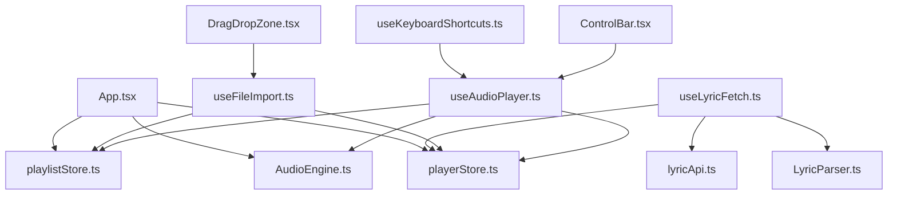

# 数据流架构

<cite>
**本文引用的文件**
- [src/store/playerStore.ts](file://src/store/playerStore.ts)
- [src/store/playlistStore.ts](file://src/store/playlistStore.ts)
- [src/hooks/useAudioPlayer.ts](file://src/hooks/useAudioPlayer.ts)
- [src/hooks/useFileImport.ts](file://src/hooks/useFileImport.ts)
- [src/hooks/useLyricFetch.ts](file://src/hooks/useLyricFetch.ts)
- [src/hooks/useKeyboardShortcuts.ts](file://src/hooks/useKeyboardShortcuts.ts)
- [src/core/AudioEngine.ts](file://src/core/AudioEngine.ts)
- [src/api/lyricApi.ts](file://src/api/lyricApi.ts)
- [src/core/LyricParser.ts](file://src/core/LyricParser.ts)
- [src/App.tsx](file://src/App.tsx)
- [src/components/Controls/ControlBar.tsx](file://src/components/Controls/ControlBar.tsx)
- [src/components/FileImport/DragDropZone.tsx](file://src/components/FileImport/DragDropZone.tsx)
- [src/components/Player/VinylSection.tsx](file://src/components/Player/VinylSection.tsx)
- [src/config/apiConfig.ts](file://src/config/apiConfig.ts)
- [src/main.tsx](file://src/main.tsx)
</cite>

## 目录
1. [简介](#简介)
2. [项目结构](#项目结构)
3. [核心组件](#核心组件)
4. [架构总览](#架构总览)
5. [详细组件分析](#详细组件分析)
6. [依赖关系分析](#依赖关系分析)
7. [性能考虑](#性能考虑)
8. [故障排查指南](#故障排查指南)
9. [结论](#结论)
10. [附录](#附录)

## 简介
本文件系统性梳理 My Music 2026 的数据流架构，覆盖从用户交互到状态更新再到 UI 渲染的完整链路。重点说明以下方面：
- 用户操作如何触发状态变更：播放控制、文件导入、歌词获取等
- 状态变更如何驱动组件重新渲染：状态订阅与组件更新机制
- 异步数据处理流程：API 调用、数据缓存与错误处理
- 数据一致性保障、性能优化策略与调试技巧
- 提供数据流图与状态转换图，帮助开发者快速理解系统数据处理逻辑

## 项目结构
项目采用“状态层 + 钩子层 + 核心引擎 + 组件层”的分层设计：
- 状态层：基于 Zustand 的播放器与播放列表状态管理，支持持久化
- 钩子层：封装播放器、文件导入、歌词获取、键盘快捷键等业务逻辑
- 核心引擎：统一的音频播放引擎，负责事件桥接与底层播放控制
- 组件层：UI 组件按功能模块组织，通过状态钩子读写状态并触发异步流程

图表来源
- [src/main.tsx](file://src/main.tsx#L1-L11)
- [src/App.tsx](file://src/App.tsx#L1-L98)
- [src/store/playerStore.ts](file://src/store/playerStore.ts#L1-L95)
- [src/store/playlistStore.ts](file://src/store/playlistStore.ts#L1-L88)
- [src/hooks/useAudioPlayer.ts](file://src/hooks/useAudioPlayer.ts#L1-L131)
- [src/hooks/useFileImport.ts](file://src/hooks/useFileImport.ts#L1-L78)
- [src/hooks/useLyricFetch.ts](file://src/hooks/useLyricFetch.ts#L1-L95)
- [src/hooks/useKeyboardShortcuts.ts](file://src/hooks/useKeyboardShortcuts.ts#L1-L73)
- [src/core/AudioEngine.ts](file://src/core/AudioEngine.ts#L1-L143)
- [src/api/lyricApi.ts](file://src/api/lyricApi.ts#L1-L129)
- [src/core/LyricParser.ts](file://src/core/LyricParser.ts#L1-L101)
- [src/config/apiConfig.ts](file://src/config/apiConfig.ts#L1-L18)
- [src/components/Controls/ControlBar.tsx](file://src/components/Controls/ControlBar.tsx#L1-L105)
- [src/components/FileImport/DragDropZone.tsx](file://src/components/FileImport/DragDropZone.tsx#L1-L67)
- [src/components/Player/VinylSection.tsx](file://src/components/Player/VinylSection.tsx#L1-L12)

章节来源
- [src/main.tsx](file://src/main.tsx#L1-L11)
- [src/App.tsx](file://src/App.tsx#L1-L98)

## 核心组件
- 播放器状态仓库：集中管理播放状态、当前歌曲、循环模式、音质、歌词等，并持久化部分设置
- 播放列表状态仓库：维护播放队列、收藏、用户歌单及其歌曲集合
- 音频引擎：封装 HTMLAudioElement，统一事件桥接与播放控制
- 播放器钩子：将 UI 交互映射为状态变更与引擎调用
- 文件导入钩子：解析本地音频与 LRC 歌词，写入状态
- 歌词获取钩子：防抖、竞态控制、缓存与解析
- 键盘快捷键钩子：全局快捷键映射到播放器操作

章节来源
- [src/store/playerStore.ts](file://src/store/playerStore.ts#L1-L95)
- [src/store/playlistStore.ts](file://src/store/playlistStore.ts#L1-L88)
- [src/core/AudioEngine.ts](file://src/core/AudioEngine.ts#L1-L143)
- [src/hooks/useAudioPlayer.ts](file://src/hooks/useAudioPlayer.ts#L1-L131)
- [src/hooks/useFileImport.ts](file://src/hooks/useFileImport.ts#L1-L78)
- [src/hooks/useLyricFetch.ts](file://src/hooks/useLyricFetch.ts#L1-L95)
- [src/hooks/useKeyboardShortcuts.ts](file://src/hooks/useKeyboardShortcuts.ts#L1-L73)

## 架构总览
下图展示从用户交互到状态更新再到 UI 渲染的端到端数据流。

图表来源
- [src/components/Controls/ControlBar.tsx](file://src/components/Controls/ControlBar.tsx#L1-L105)
- [src/hooks/useAudioPlayer.ts](file://src/hooks/useAudioPlayer.ts#L1-L131)
- [src/core/AudioEngine.ts](file://src/core/AudioEngine.ts#L1-L143)
- [src/store/playerStore.ts](file://src/store/playerStore.ts#L1-L95)
- [src/store/playlistStore.ts](file://src/store/playlistStore.ts#L1-L88)

## 详细组件分析

### 播放控制数据流（播放/暂停/跳转/切歌）
- 用户点击播放按钮触发 ControlBar 调用 useAudioPlayer 的 togglePlay
- 若当前无歌曲，根据播放列表选择首曲并加载；否则切换播放/暂停
- 音频引擎事件通过 useAudioPlayer 注册监听，回推时间、时长、播放/暂停、结束事件
- 状态仓库更新后，订阅该状态的组件自动重新渲染

图表来源
- [src/components/Controls/ControlBar.tsx](file://src/components/Controls/ControlBar.tsx#L1-L105)
- [src/hooks/useAudioPlayer.ts](file://src/hooks/useAudioPlayer.ts#L1-L131)
- [src/core/AudioEngine.ts](file://src/core/AudioEngine.ts#L1-L143)
- [src/store/playerStore.ts](file://src/store/playerStore.ts#L1-L95)
- [src/store/playlistStore.ts](file://src/store/playlistStore.ts#L1-L88)

章节来源
- [src/components/Controls/ControlBar.tsx](file://src/components/Controls/ControlBar.tsx#L1-L105)
- [src/hooks/useAudioPlayer.ts](file://src/hooks/useAudioPlayer.ts#L1-L131)
- [src/core/AudioEngine.ts](file://src/core/AudioEngine.ts#L1-L143)
- [src/store/playerStore.ts](file://src/store/playerStore.ts#L1-L95)
- [src/store/playlistStore.ts](file://src/store/playlistStore.ts#L1-L88)

### 文件导入数据流（本地音频与 LRC 歌词）
- 用户通过拖拽或文件选择导入音频与 LRC
- useFileImport 解析音频文件生成 Song 并去重加入播放列表
- 若存在 LRC 文件，解析歌词并标记来源为本地，写入播放器状态

图表来源
- [src/components/FileImport/DragDropZone.tsx](file://src/components/FileImport/DragDropZone.tsx#L1-L67)
- [src/hooks/useFileImport.ts](file://src/hooks/useFileImport.ts#L1-L78)
- [src/store/playlistStore.ts](file://src/store/playlistStore.ts#L1-L88)
- [src/store/playerStore.ts](file://src/store/playerStore.ts#L1-L95)
- [src/core/LyricParser.ts](file://src/core/LyricParser.ts#L1-L101)

章节来源
- [src/components/FileImport/DragDropZone.tsx](file://src/components/FileImport/DragDropZone.tsx#L1-L67)
- [src/hooks/useFileImport.ts](file://src/hooks/useFileImport.ts#L1-L78)
- [src/store/playlistStore.ts](file://src/store/playlistStore.ts#L1-L88)
- [src/store/playerStore.ts](file://src/store/playerStore.ts#L1-L95)
- [src/core/LyricParser.ts](file://src/core/LyricParser.ts#L1-L101)

### 歌词获取与同步数据流（API、缓存、解析）
- 切歌或手动刷新时，useLyricFetch 根据条件发起歌词搜索
- lyricApi 使用带超时与重试的 fetch 封装，命中本地缓存则直接返回
- 返回的 LRC 文本经 LyricParser 解析为结构化歌词，写入播放器状态并标记来源

图表来源
- [src/hooks/useLyricFetch.ts](file://src/hooks/useLyricFetch.ts#L1-L95)
- [src/api/lyricApi.ts](file://src/api/lyricApi.ts#L1-L129)
- [src/core/LyricParser.ts](file://src/core/LyricParser.ts#L1-L101)
- [src/store/playerStore.ts](file://src/store/playerStore.ts#L1-L95)

章节来源
- [src/hooks/useLyricFetch.ts](file://src/hooks/useLyricFetch.ts#L1-L95)
- [src/api/lyricApi.ts](file://src/api/lyricApi.ts#L1-L129)
- [src/core/LyricParser.ts](file://src/core/LyricParser.ts#L1-L101)
- [src/store/playerStore.ts](file://src/store/playerStore.ts#L1-L95)

### 键盘快捷键与全局状态联动
- useKeyboardShortcuts 监听全局按键，映射到播放/暂停、上下一首、快进/快退、音量调节、静音
- 通过 playerStore 状态更新，驱动 UI 与引擎同步

图表来源
- [src/hooks/useKeyboardShortcuts.ts](file://src/hooks/useKeyboardShortcuts.ts#L1-L73)
- [src/hooks/useAudioPlayer.ts](file://src/hooks/useAudioPlayer.ts#L1-L131)
- [src/core/AudioEngine.ts](file://src/core/AudioEngine.ts#L1-L143)
- [src/store/playerStore.ts](file://src/store/playerStore.ts#L1-L95)

章节来源
- [src/hooks/useKeyboardShortcuts.ts](file://src/hooks/useKeyboardShortcuts.ts#L1-L73)
- [src/hooks/useAudioPlayer.ts](file://src/hooks/useAudioPlayer.ts#L1-L131)
- [src/core/AudioEngine.ts](file://src/core/AudioEngine.ts#L1-L143)
- [src/store/playerStore.ts](file://src/store/playerStore.ts#L1-L95)

### 状态订阅与组件更新机制
- 组件通过选择器订阅状态（如 currentSong、playerMode、playlist 等）
- 状态变更后，订阅同一选择器的组件自动重新渲染
- App.tsx 根据播放器模式与空状态渲染不同布局

图表来源
- [src/store/playerStore.ts](file://src/store/playerStore.ts#L1-L95)
- [src/store/playlistStore.ts](file://src/store/playlistStore.ts#L1-L88)
- [src/components/Controls/ControlBar.tsx](file://src/components/Controls/ControlBar.tsx#L1-L105)
- [src/App.tsx](file://src/App.tsx#L1-L98)
- [src/components/Player/VinylSection.tsx](file://src/components/Player/VinylSection.tsx#L1-L12)

章节来源
- [src/App.tsx](file://src/App.tsx#L1-L98)
- [src/store/playerStore.ts](file://src/store/playerStore.ts#L1-L95)
- [src/store/playlistStore.ts](file://src/store/playlistStore.ts#L1-L88)
- [src/components/Player/VinylSection.tsx](file://src/components/Player/VinylSection.tsx#L1-L12)

### 状态机与循环模式转换
- 循环模式在列表循环、单曲循环、随机播放之间轮转
- 结束事件触发时，根据模式计算下一曲索引并加载播放

图表来源
- [src/store/playerStore.ts](file://src/store/playerStore.ts#L67-L71)
- [src/hooks/useAudioPlayer.ts](file://src/hooks/useAudioPlayer.ts#L47-L62)

章节来源
- [src/store/playerStore.ts](file://src/store/playerStore.ts#L67-L71)
- [src/hooks/useAudioPlayer.ts](file://src/hooks/useAudioPlayer.ts#L47-L62)

## 依赖关系分析
- 组件依赖状态钩子与状态仓库，形成自顶向下的数据流
- useAudioPlayer 作为播放中枢，同时依赖 AudioEngine 与两个状态仓库
- useLyricFetch 依赖 lyricApi 与 LyricParser，最终写回 playerStore
- App.tsx 作为根组件，协调背景色提取、封面回填与布局渲染

图表来源
- [src/components/Controls/ControlBar.tsx](file://src/components/Controls/ControlBar.tsx#L1-L105)
- [src/components/FileImport/DragDropZone.tsx](file://src/components/FileImport/DragDropZone.tsx#L1-L67)
- [src/hooks/useAudioPlayer.ts](file://src/hooks/useAudioPlayer.ts#L1-L131)
- [src/hooks/useFileImport.ts](file://src/hooks/useFileImport.ts#L1-L78)
- [src/hooks/useLyricFetch.ts](file://src/hooks/useLyricFetch.ts#L1-L95)
- [src/hooks/useKeyboardShortcuts.ts](file://src/hooks/useKeyboardShortcuts.ts#L1-L73)
- [src/core/AudioEngine.ts](file://src/core/AudioEngine.ts#L1-L143)
- [src/store/playerStore.ts](file://src/store/playerStore.ts#L1-L95)
- [src/store/playlistStore.ts](file://src/store/playlistStore.ts#L1-L88)
- [src/api/lyricApi.ts](file://src/api/lyricApi.ts#L1-L129)
- [src/core/LyricParser.ts](file://src/core/LyricParser.ts#L1-L101)
- [src/App.tsx](file://src/App.tsx#L1-L98)

章节来源
- [src/components/Controls/ControlBar.tsx](file://src/components/Controls/ControlBar.tsx#L1-L105)
- [src/components/FileImport/DragDropZone.tsx](file://src/components/FileImport/DragDropZone.tsx#L1-L67)
- [src/hooks/useAudioPlayer.ts](file://src/hooks/useAudioPlayer.ts#L1-L131)
- [src/hooks/useFileImport.ts](file://src/hooks/useFileImport.ts#L1-L78)
- [src/hooks/useLyricFetch.ts](file://src/hooks/useLyricFetch.ts#L1-L95)
- [src/hooks/useKeyboardShortcuts.ts](file://src/hooks/useKeyboardShortcuts.ts#L1-L73)
- [src/core/AudioEngine.ts](file://src/core/AudioEngine.ts#L1-L143)
- [src/store/playerStore.ts](file://src/store/playerStore.ts#L1-L95)
- [src/store/playlistStore.ts](file://src/store/playlistStore.ts#L1-L88)
- [src/api/lyricApi.ts](file://src/api/lyricApi.ts#L1-L129)
- [src/core/LyricParser.ts](file://src/core/LyricParser.ts#L1-L101)
- [src/App.tsx](file://src/App.tsx#L1-L98)

## 性能考虑
- 防抖与竞态控制：useLyricFetch 使用递增 ID 与“最后请求获胜”策略避免快速切歌导致的竞态与重复渲染
- 本地缓存：歌词以键值形式存储于 localStorage，带过期时间，显著降低网络请求与解析开销
- 事件节流：AudioEngine 将原生事件标准化为 set 回调，避免频繁重渲染
- 持久化状态：播放器设置（音量、循环模式、音质、播放器模式）持久化，减少初始化成本
- 渐进式渲染：App 根据播放列表与当前歌曲决定渲染路径，避免不必要的 DOM 结构

[本节为通用性能建议，无需特定文件引用]

## 故障排查指南
- 播放失败（浏览器自动播放限制）
  - 现象：首次播放抛出异常
  - 处理：useAudioPlayer 捕获异常并提示需用户交互
  - 参考
    - [src/hooks/useAudioPlayer.ts](file://src/hooks/useAudioPlayer.ts#L70-L75)
    - [src/core/AudioEngine.ts](file://src/core/AudioEngine.ts#L54-L61)
- 歌词未显示
  - 检查是否为“未知歌手”，API 会过滤该情况
  - 检查是否命中缓存或解析成功
  - 参考
    - [src/hooks/useLyricFetch.ts](file://src/hooks/useLyricFetch.ts#L24-L58)
    - [src/api/lyricApi.ts](file://src/api/lyricApi.ts#L86-L119)
    - [src/core/LyricParser.ts](file://src/core/LyricParser.ts#L18-L81)
- 封面缺失
  - App 在封面为空且非“未知歌手”时尝试从 API 获取
  - 参考
    - [src/App.tsx](file://src/App.tsx#L34-L46)
- 键盘快捷键无效
  - 确认焦点不在输入控件内
  - 参考
    - [src/hooks/useKeyboardShortcuts.ts](file://src/hooks/useKeyboardShortcuts.ts#L10-L14)
- 调试技巧
  - 开发环境可通过全局对象访问音频引擎实例进行调试
  - 参考
    - [src/core/AudioEngine.ts](file://src/core/AudioEngine.ts#L139-L142)

章节来源
- [src/hooks/useAudioPlayer.ts](file://src/hooks/useAudioPlayer.ts#L70-L75)
- [src/core/AudioEngine.ts](file://src/core/AudioEngine.ts#L54-L61)
- [src/hooks/useLyricFetch.ts](file://src/hooks/useLyricFetch.ts#L24-L58)
- [src/api/lyricApi.ts](file://src/api/lyricApi.ts#L86-L119)
- [src/core/LyricParser.ts](file://src/core/LyricParser.ts#L18-L81)
- [src/App.tsx](file://src/App.tsx#L34-L46)
- [src/hooks/useKeyboardShortcuts.ts](file://src/hooks/useKeyboardShortcuts.ts#L10-L14)
- [src/core/AudioEngine.ts](file://src/core/AudioEngine.ts#L139-L142)

## 结论
本项目通过清晰的分层与状态驱动的 UI 设计，实现了从用户交互到状态更新再到渲染的高内聚、低耦合数据流。播放器钩子作为中枢，串联引擎与状态；歌词获取与文件导入分别走独立的异步管线并复用解析与缓存能力。配合持久化与缓存策略，系统在可用性与性能之间取得良好平衡。

[本节为总结性内容，无需特定文件引用]

## 附录
- 关键配置项
  - 歌词 API 基础地址、超时、重试次数、缓存前缀与过期时间
  - 参考
    - [src/config/apiConfig.ts](file://src/config/apiConfig.ts#L1-L18)
- 组件职责概览
  - ControlBar：底部控制栏，聚合播放控制、导入、列表、循环模式、音质与模式切换
  - DragDropZone：空状态导入区，支持拖拽与文件选择
  - VinylSection：视觉化播放器外观容器
  - 参考
    - [src/components/Controls/ControlBar.tsx](file://src/components/Controls/ControlBar.tsx#L1-L105)
    - [src/components/FileImport/DragDropZone.tsx](file://src/components/FileImport/DragDropZone.tsx#L1-L67)
    - [src/components/Player/VinylSection.tsx](file://src/components/Player/VinylSection.tsx#L1-L12)

章节来源
- [src/config/apiConfig.ts](file://src/config/apiConfig.ts#L1-L18)
- [src/components/Controls/ControlBar.tsx](file://src/components/Controls/ControlBar.tsx#L1-L105)
- [src/components/FileImport/DragDropZone.tsx](file://src/components/FileImport/DragDropZone.tsx#L1-L67)
- [src/components/Player/VinylSection.tsx](file://src/components/Player/VinylSection.tsx#L1-L12)