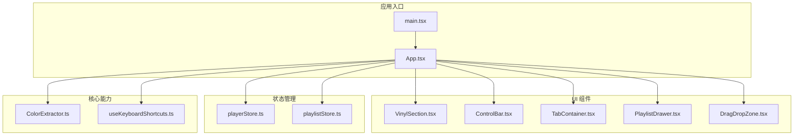
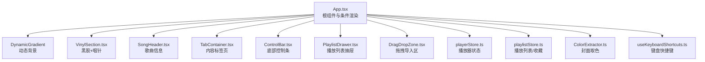
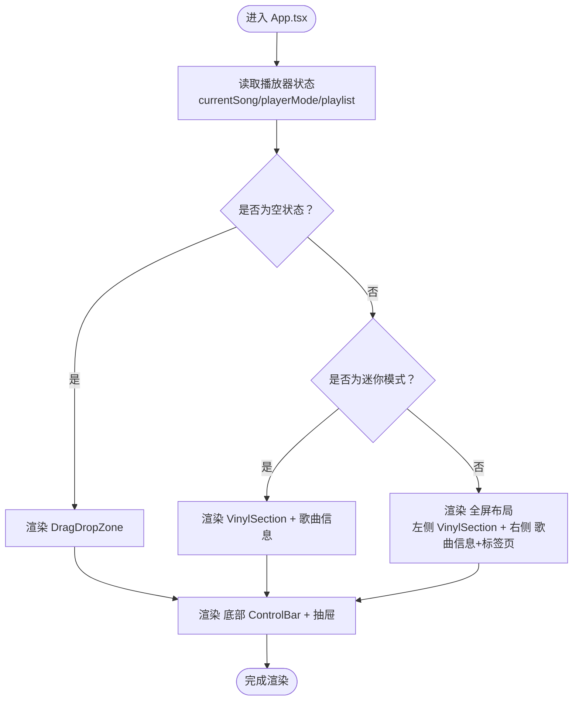
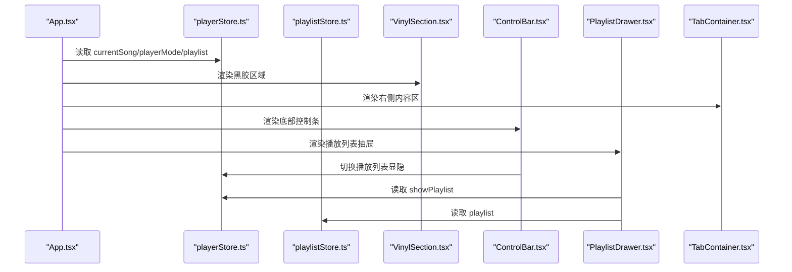
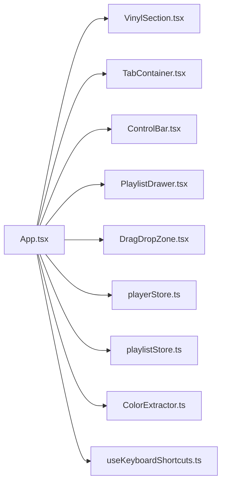

# 整体架构

<cite>
**本文引用的文件**
- [src/App.tsx](file://src/App.tsx)
- [src/main.tsx](file://src/main.tsx)
- [src/index.css](file://src/index.css)
- [src/store/playerStore.ts](file://src/store/playerStore.ts)
- [src/store/playlistStore.ts](file://src/store/playlistStore.ts)
- [src/hooks/useKeyboardShortcuts.ts](file://src/hooks/useKeyboardShortcuts.ts)
- [src/core/ColorExtractor.ts](file://src/core/ColorExtractor.ts)
- [src/components/Player/VinylSection.tsx](file://src/components/Player/VinylSection.tsx)
- [src/components/Controls/ControlBar.tsx](file://src/components/Controls/ControlBar.tsx)
- [src/components/ContentTabs/TabContainer.tsx](file://src/components/ContentTabs/TabContainer.tsx)
- [src/components/Playlist/PlaylistDrawer.tsx](file://src/components/Playlist/PlaylistDrawer.tsx)
- [src/components/FileImport/DragDropZone.tsx](file://src/components/FileImport/DragDropZone.tsx)
- [package.json](file://package.json)
- [README.md](file://README.md)
- [Web音乐播放器PRD.md](file://Web音乐播放器PRD.md)
</cite>

## 目录
1. [引言](#引言)
2. [项目结构](#项目结构)
3. [核心组件](#核心组件)
4. [架构总览](#架构总览)
5. [详细组件分析](#详细组件分析)
6. [依赖分析](#依赖分析)
7. [性能考虑](#性能考虑)
8. [故障排查指南](#故障排查指南)
9. [结论](#结论)
10. [附录](#附录)

## 引言
本文件面向 My Music 2026 的前端整体架构，聚焦于 App.tsx 作为根组件的设计思路与实现，系统性阐述组件层次结构、布局模式与页面组织方式；解释条件渲染逻辑（空状态、迷你模式、全屏模式）；说明主容器 Flex 布局与响应式适配策略；梳理组件间组合关系与数据流向；给出系统边界、技术选型理由与架构决策说明，并以多幅架构图展示组件层次与布局结构。

## 项目结构
项目采用按功能域分层的目录组织方式：
- 根入口与样式：main.tsx、index.css
- 核心业务模块：components（Player、Controls、ContentTabs、Lyrics、Playlist、SongInfo、FileImport、Background）、core（AudioEngine、ColorExtractor、LyricParser）、hooks（useAudioPlayer、useFileImport、useKeyboardShortcuts、useLyricFetch、useLyricSync）、store（playerStore、playlistStore）、types、utils、api
- 配置与构建：package.json、vite.config.ts、tsconfig*.json、eslint.config.js
- 文档：README.md、Web音乐播放器PRD.md

图表来源
- [src/main.tsx](file://src/main.tsx#L1-L11)
- [src/App.tsx](file://src/App.tsx#L1-L98)
- [src/components/Player/VinylSection.tsx](file://src/components/Player/VinylSection.tsx#L1-L12)
- [src/components/Controls/ControlBar.tsx](file://src/components/Controls/ControlBar.tsx#L1-L105)
- [src/components/ContentTabs/TabContainer.tsx](file://src/components/ContentTabs/TabContainer.tsx#L1-L51)
- [src/components/Playlist/PlaylistDrawer.tsx](file://src/components/Playlist/PlaylistDrawer.tsx#L1-L70)
- [src/components/FileImport/DragDropZone.tsx](file://src/components/FileImport/DragDropZone.tsx#L1-L67)
- [src/store/playerStore.ts](file://src/store/playerStore.ts#L1-L95)
- [src/store/playlistStore.ts](file://src/store/playlistStore.ts#L1-L88)
- [src/core/ColorExtractor.ts](file://src/core/ColorExtractor.ts#L1-L27)
- [src/hooks/useKeyboardShortcuts.ts](file://src/hooks/useKeyboardShortcuts.ts#L1-L73)

章节来源
- [src/main.tsx](file://src/main.tsx#L1-L11)
- [src/index.css](file://src/index.css#L1-L94)
- [package.json](file://package.json#L1-L39)

## 核心组件
- 根组件 App.tsx：负责全局状态读取、条件渲染（空状态/迷你/全屏）、背景渐变、封面缺失时的封面回填、键盘快捷键注册等。
- 主容器布局：基于 Tailwind 的 Flex 布局，主容器采用纵向 Flex，子元素使用 flex-1 实现自适应填充，底部控制条固定定位，右侧抽屉采用绝对定位与遮罩层。
- 状态管理：playerStore 与 playlistStore 使用 Zustand + persist，分别管理播放器状态与播放列表/收藏/用户歌单。
- 核心能力：ColorExtractor 提取封面主色用于动态渐变背景；useKeyboardShortcuts 提供键盘快捷键处理。
- UI 组成：VinylSection 作为黑胶唱片与唱针的组合；ControlBar 作为底部控制条；TabContainer 作为右侧内容区的标签页容器；PlaylistDrawer 作为播放列表抽屉；DragDropZone 作为空状态下的拖拽导入区。

章节来源
- [src/App.tsx](file://src/App.tsx#L15-L95)
- [src/store/playerStore.ts](file://src/store/playerStore.ts#L8-L40)
- [src/store/playlistStore.ts](file://src/store/playlistStore.ts#L12-L27)
- [src/core/ColorExtractor.ts](file://src/core/ColorExtractor.ts#L1-L27)
- [src/hooks/useKeyboardShortcuts.ts](file://src/hooks/useKeyboardShortcuts.ts#L6-L72)
- [src/components/Player/VinylSection.tsx](file://src/components/Player/VinylSection.tsx#L4-L11)
- [src/components/Controls/ControlBar.tsx](file://src/components/Controls/ControlBar.tsx#L16-L104)
- [src/components/ContentTabs/TabContainer.tsx](file://src/components/ContentTabs/TabContainer.tsx#L15-L50)
- [src/components/Playlist/PlaylistDrawer.tsx](file://src/components/Playlist/PlaylistDrawer.tsx#L6-L69)
- [src/components/FileImport/DragDropZone.tsx](file://src/components/FileImport/DragDropZone.tsx#L7-L66)

## 架构总览
My Music 2026 采用“根组件 + 组合式 UI 组件 + Zustand 状态 + Hooks 能力”的前端架构。App.tsx 作为根组件，统一协调播放器模式、封面颜色、键盘事件与全局 UI 布局；各功能域组件通过 props 与状态共享进行解耦；底层通过 hooks 与 core 能力提供可复用的播放、导入、解析与可视化能力。

图表来源
- [src/App.tsx](file://src/App.tsx#L15-L95)
- [src/store/playerStore.ts](file://src/store/playerStore.ts#L42-L94)
- [src/store/playlistStore.ts](file://src/store/playlistStore.ts#L29-L87)
- [src/core/ColorExtractor.ts](file://src/core/ColorExtractor.ts#L1-L27)
- [src/hooks/useKeyboardShortcuts.ts](file://src/hooks/useKeyboardShortcuts.ts#L6-L72)
- [src/components/Player/VinylSection.tsx](file://src/components/Player/VinylSection.tsx#L4-L11)
- [src/components/Controls/ControlBar.tsx](file://src/components/Controls/ControlBar.tsx#L16-L104)
- [src/components/ContentTabs/TabContainer.tsx](file://src/components/ContentTabs/TabContainer.tsx#L15-L50)
- [src/components/Playlist/PlaylistDrawer.tsx](file://src/components/Playlist/PlaylistDrawer.tsx#L6-L69)
- [src/components/FileImport/DragDropZone.tsx](file://src/components/FileImport/DragDropZone.tsx#L7-L66)

## 详细组件分析

### 根组件 App.tsx 设计与条件渲染
- 条件渲染逻辑
  - 空状态：当播放列表与当前歌曲均为空时，渲染 DragDropZone 作为导入入口。
  - 迷你模式：当 playerMode 为 mini 时，仅展示 VinylSection 与歌曲标题/艺人信息。
  - 全屏模式：默认布局，左侧 VinylSection，右侧 SongHeader + TabContainer。
- 数据流与副作用
  - 读取播放器状态：currentSong、playerMode、playlist。
  - 封面颜色提取：基于封面 URL 调用 ColorExtractor 并设置背景色。
  - 封面回填：若当前歌曲缺少封面且非“未知歌手”，通过 API 获取并写回播放器与播放列表。
  - 键盘快捷键：注册全局快捷键处理。
- 布局与响应式
  - 主容器采用纵向 Flex，子元素使用 flex-1 自适应高度；底部 ControlBar 固定定位；右侧抽屉使用绝对定位与遮罩层。
  - 全屏模式下左侧固定宽度，右侧使用 flex-1 与 min-w-0 防止溢出。

图表来源
- [src/App.tsx](file://src/App.tsx#L48-L94)

章节来源
- [src/App.tsx](file://src/App.tsx#L15-L95)

### 主容器 Flex 布局与响应式适配
- 主容器：纵向 Flex 容器，高度占满视口，overflow-hidden 防止滚动穿透。
- 子布局：
  - 空状态：flex-1 + 居中对齐，最大宽度约束。
  - 迷你模式：flex-1 + 居中对齐，底部留出 ControlBar 高度空间。
  - 全屏模式：左侧固定宽度区域 + 右侧 flex-1，min-w-0 防止内容溢出。
- 底部控制条：fixed 定位，z-index 保证层级高于内容；进度条与控制按钮分组布局。
- 抽屉：绝对定位，遮罩层点击关闭；右侧滑入动画。

章节来源
- [src/App.tsx](file://src/App.tsx#L50-L94)
- [src/components/Controls/ControlBar.tsx](file://src/components/Controls/ControlBar.tsx#L32-L104)
- [src/components/Playlist/PlaylistDrawer.tsx](file://src/components/Playlist/PlaylistDrawer.tsx#L16-L68)

### 组件间组合关系与数据流向
- App.tsx 作为中枢，读取 playerStore 与 playlistStore，向下传递给子组件。
- ControlBar 与 PlaylistDrawer 通过 playerStore 的 togglePlaylist 控制抽屉显隐；通过 playlistStore 的 playlist 获取列表长度。
- TabContainer 作为右侧内容区的标签页容器，内部根据 activeTab 渲染不同面板。
- VinylSection 由 App.tsx 直接渲染，内部组合 VinylDisc 与 Tonearm。
- DragDropZone 在空状态下作为导入入口，导入成功后可触发自动播放第一首。

图表来源
- [src/App.tsx](file://src/App.tsx#L15-L95)
- [src/store/playerStore.ts](file://src/store/playerStore.ts#L42-L94)
- [src/store/playlistStore.ts](file://src/store/playlistStore.ts#L29-L87)
- [src/components/Player/VinylSection.tsx](file://src/components/Player/VinylSection.tsx#L4-L11)
- [src/components/Controls/ControlBar.tsx](file://src/components/Controls/ControlBar.tsx#L16-L104)
- [src/components/Playlist/PlaylistDrawer.tsx](file://src/components/Playlist/PlaylistDrawer.tsx#L6-L69)
- [src/components/ContentTabs/TabContainer.tsx](file://src/components/ContentTabs/TabContainer.tsx#L15-L50)

### 系统边界与技术选型
- 系统边界
  - 前端边界：浏览器环境，遵循浏览器自动播放限制；音频源通过 URL 提供；状态持久化使用 localStorage。
  - 第三方集成：封面取色使用 colorthief；UI 图标使用 lucide-react；音频标签解析使用 jsmediatags；状态管理使用 zustand。
- 技术选型理由
  - React 19：函数组件与并发特性，适合复杂 UI 与状态管理。
  - Tailwind CSS v4：原子化样式，快速实现暗色主题与动画。
  - Zustand：轻量状态管理，支持持久化中间件，满足播放器状态与用户偏好的本地存储。
  - Vite：快速开发与构建工具链，配合 TypeScript 与 ESLint。
  - PRD 规划：明确 P0/P1 功能与验收标准，指导前端实现优先级与质量门槛。

章节来源
- [package.json](file://package.json#L12-L36)
- [Web音乐播放器PRD.md](file://Web音乐播放器PRD.md#L122-L127)
- [src/index.css](file://src/index.css#L3-L15)

## 依赖分析
- 组件耦合
  - App.tsx 与各功能组件松耦合，通过状态与 props 通信；ControlBar 与 PlaylistDrawer 通过 playerStore 的 toggle 交互。
  - ColorExtractor 与 useKeyboardShortcuts 作为纯函数能力注入 App.tsx。
- 外部依赖
  - colorthief：封面取色；lucide-react：图标；jsmediatags：音频元数据读取；zustand：状态管理；clsx/tailwind-merge：类名合并与样式合并。

图表来源
- [src/App.tsx](file://src/App.tsx#L1-L14)
- [src/store/playerStore.ts](file://src/store/playerStore.ts#L1-L95)
- [src/store/playlistStore.ts](file://src/store/playlistStore.ts#L1-L88)
- [src/core/ColorExtractor.ts](file://src/core/ColorExtractor.ts#L1-L27)
- [src/hooks/useKeyboardShortcuts.ts](file://src/hooks/useKeyboardShortcuts.ts#L1-L73)

章节来源
- [package.json](file://package.json#L12-L36)

## 性能考虑
- 动画与渲染
  - 黑胶旋转使用 CSS 动画，避免 JavaScript 驱动导致掉帧；底部 ControlBar 固定定位减少重排。
- 状态与计算
  - Zustand 精细化状态更新，避免不必要的重渲染；ColorExtractor 异步执行，失败时提供默认色板。
- 资源加载
  - 首屏加载控制在合理范围内，避免一次性加载过多资源；音频与封面按需请求。
- 无障碍与兼容
  - 按钮具备 aria-label，支持键盘导航；兼容主流浏览器最近多个大版本。

## 故障排查指南
- 封面未显示或颜色异常
  - 检查封面 URL 是否有效；确认跨域设置；查看 ColorExtractor 的错误回退逻辑。
- 播放列表为空但无法导入
  - 确认 DragDropZone 的拖拽事件回调是否触发；检查 useFileImport 的导入流程；确认导入后是否自动播放第一首。
- 键盘快捷键无效
  - 检查 useKeyboardShortcuts 的事件绑定与输入框焦点过滤；确认 useAudioPlayer 的切换方法是否可用。
- 抽屉无法关闭
  - 检查 playerStore 的 togglePlaylist 与 setShowPlaylist；确认遮罩层点击事件是否生效。

章节来源
- [src/core/ColorExtractor.ts](file://src/core/ColorExtractor.ts#L1-L27)
- [src/components/FileImport/DragDropZone.tsx](file://src/components/FileImport/DragDropZone.tsx#L12-L23)
- [src/hooks/useKeyboardShortcuts.ts](file://src/hooks/useKeyboardShortcuts.ts#L9-L71)
- [src/components/Playlist/PlaylistDrawer.tsx](file://src/components/Playlist/PlaylistDrawer.tsx#L16-L31)

## 结论
My Music 2026 的前端架构以 App.tsx 为核心，结合组合式 UI 组件、Zustand 状态管理与 Hooks 能力，实现了清晰的组件层次与稳定的数据流。通过 Flex 布局与固定定位的组合，兼顾了视觉沉浸感与交互效率；通过条件渲染与抽屉/遮罩机制，覆盖了空状态、迷你与全屏三种使用场景。技术选型与 PRD 验收标准相辅相成，确保了功能完整性与用户体验一致性。

## 附录
- 产品愿景与目标：零安装、跨平台一致、沉浸感与掌控感。
- 核心功能清单：播放引擎、进度条、播放列表、歌曲信息、黑胶动画、逐行歌词、音量控制、循环模式、动态背景、键盘快捷键、音质选择、模式切换等。
- 非功能性验收：首屏加载、兼容性、动画流畅度、可访问性、状态持久化。

章节来源
- [README.md](file://README.md#L1-L3)
- [Web音乐播放器PRD.md](file://Web音乐播放器PRD.md#L5-L127)