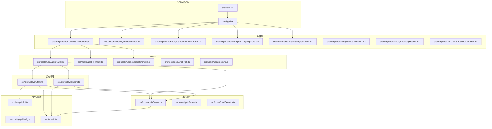
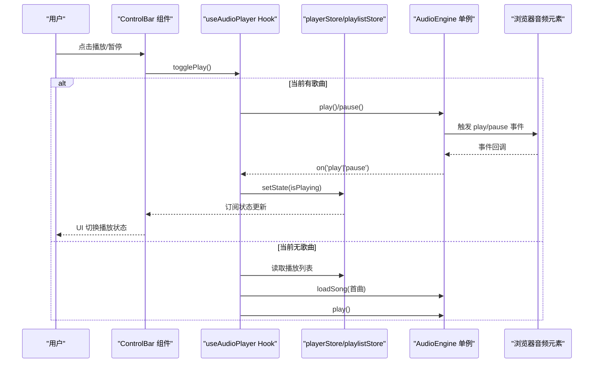
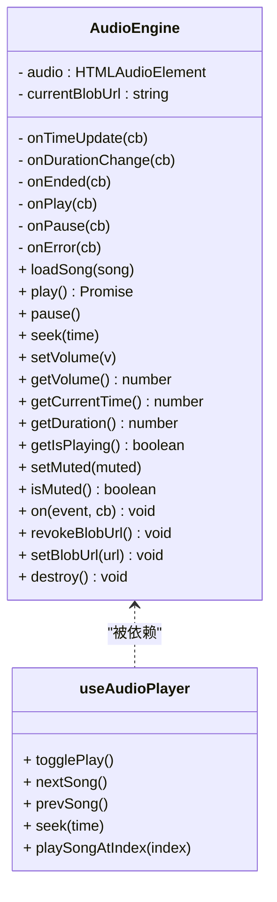
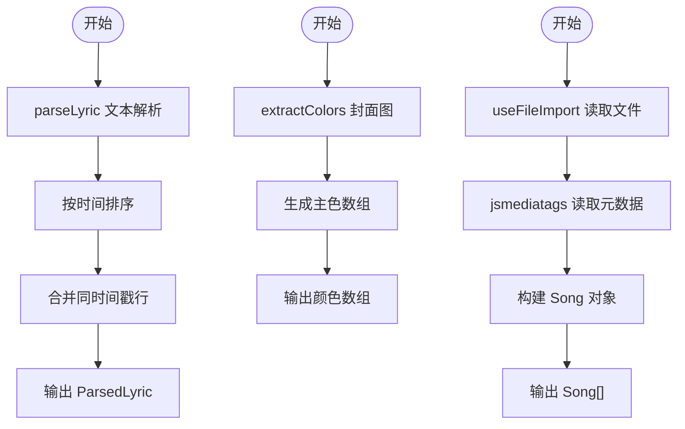
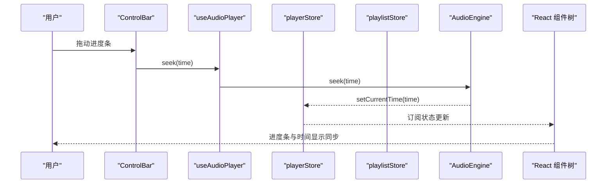
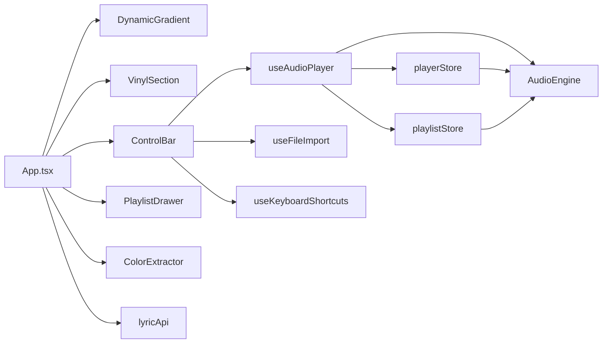
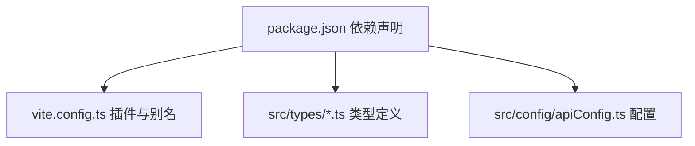

# 架构设计

<cite>
**本文引用的文件**
- [README.md](file://README.md)
- [package.json](file://package.json)
- [vite.config.ts](file://vite.config.ts)
- [src/main.tsx](file://src/main.tsx)
- [src/App.tsx](file://src/App.tsx)
- [src/core/AudioEngine.ts](file://src/core/AudioEngine.ts)
- [src/core/LyricParser.ts](file://src/core/LyricParser.ts)
- [src/core/ColorExtractor.ts](file://src/core/ColorExtractor.ts)
- [src/store/playerStore.ts](file://src/store/playerStore.ts)
- [src/store/playlistStore.ts](file://src/store/playlistStore.ts)
- [src/hooks/useAudioPlayer.ts](file://src/hooks/useAudioPlayer.ts)
- [src/hooks/useFileImport.ts](file://src/hooks/useFileImport.ts)
- [src/hooks/useKeyboardShortcuts.ts](file://src/hooks/useKeyboardShortcuts.ts)
- [src/hooks/useLyricFetch.ts](file://src/hooks/useLyricFetch.ts)
- [src/hooks/useLyricSync.ts](file://src/hooks/useLyricSync.ts)
- [src/components/Controls/ControlBar.tsx](file://src/components/Controls/ControlBar.tsx)
- [src/components/Player/VinylSection.tsx](file://src/components/Player/VinylSection.tsx)
- [src/components/Player/VinylDisc.tsx](file://src/components/Player/VinylDisc.tsx)
- [src/components/Player/Tonearm.tsx](file://src/components/Player/Tonearm.tsx)
- [src/components/Background/DynamicGradient.tsx](file://src/components/Background/DynamicGradient.tsx)
- [src/components/FileImport/DragDropZone.tsx](file://src/components/FileImport/DragDropZone.tsx)
- [src/components/Playlist/PlaylistDrawer.tsx](file://src/components/Playlist/PlaylistDrawer.tsx)
- [src/components/Playlist/AddToPlaylist.tsx](file://src/components/Playlist/AddToPlaylist.tsx)
- [src/components/SongInfo/SongHeader.tsx](file://src/components/SongInfo/SongHeader.tsx)
- [src/components/SongInfo/FavoriteButton.tsx](file://src/components/SongInfo/FavoriteButton.tsx)
- [src/components/ContentTabs/TabContainer.tsx](file://src/components/ContentTabs/TabContainer.tsx)
- [src/components/ContentTabs/RecommendTab.tsx](file://src/components/ContentTabs/RecommendTab.tsx)
- [src/components/ContentTabs/WikiTab.tsx](file://src/components/ContentTabs/WikiTab.tsx)
- [src/api/lyricApi.ts](file://src/api/lyricApi.ts)
- [src/api/types.ts](file://src/api/types.ts)
- [src/config/apiConfig.ts](file://src/config/apiConfig.ts)
- [src/types/player.ts](file://src/types/player.ts)
- [src/types/song.ts](file://src/types/song.ts)
- [src/types/lyric.ts](file://src/types/lyric.ts)
- [src/utils/timeFormat.ts](file://src/utils/timeFormat.ts)
</cite>

## 目录
1. [简介](#简介)
2. [项目结构](#项目结构)
3. [核心组件](#核心组件)
4. [架构总览](#架构总览)
5. [详细组件分析](#详细组件分析)
6. [依赖分析](#依赖分析)
7. [性能考量](#性能考量)
8. [故障排查指南](#故障排查指南)
9. [结论](#结论)
10. [附录](#附录)

## 简介
本文件为 My Music 2026 的架构设计文档，面向前端与全栈开发者，系统性阐述前端应用架构、组件层次结构、状态管理模式、核心设计模式（单例、观察者、工厂）、数据流与组件通信机制，并给出架构图与组件关系图，帮助快速理解与扩展系统。

## 项目结构
项目采用基于功能域的组织方式，按“核心能力/业务域”划分目录，前端以 React + TypeScript 实现，构建工具为 Vite，状态管理采用 Zustand，UI 使用 TailwindCSS。



图表来源
- [src/main.tsx](file://src/main.tsx#L1-L11)
- [src/App.tsx](file://src/App.tsx#L1-L98)
- [src/core/AudioEngine.ts](file://src/core/AudioEngine.ts#L1-L143)
- [src/store/playerStore.ts](file://src/store/playerStore.ts#L1-L95)
- [src/store/playlistStore.ts](file://src/store/playlistStore.ts#L1-L88)
- [src/hooks/useAudioPlayer.ts](file://src/hooks/useAudioPlayer.ts#L1-L131)
- [src/components/Controls/ControlBar.tsx](file://src/components/Controls/ControlBar.tsx#L1-L105)
- [src/components/Player/VinylSection.tsx](file://src/components/Player/VinylSection.tsx#L1-L12)
- [src/api/lyricApi.ts](file://src/api/lyricApi.ts#L1-L129)
- [src/config/apiConfig.ts](file://src/config/apiConfig.ts)

章节来源
- [README.md](file://README.md#L1-L3)
- [package.json](file://package.json#L1-L39)
- [vite.config.ts](file://vite.config.ts#L1-L13)

## 核心组件
- 单例音频引擎：封装 HTMLAudioElement，统一播放、暂停、跳转、音量、事件监听与资源回收，暴露全局实例供各模块调用。
- 歌词解析器：解析 LRC 歌词文本，提取元数据与时间轴，支持二分查找定位当前句。
- 背景色提取器：异步提取专辑封面主色，生成渐变背景。
- 状态存储：Zustand 管理播放器状态（播放/暂停、进度、音量、循环模式、歌词等）与播放列表（收藏、自建歌单、歌曲封面回填）。
- Hooks：围绕播放器行为封装 useAudioPlayer，处理循环/随机/顺序切换、播放/暂停、上一首/下一首、seek；useFileImport、useKeyboardShortcuts、useLyricFetch、useLyricSync 提供文件导入、快捷键、歌词拉取与同步。
- 组件层：控制条、唱片区、动态背景、文件导入区、播放列表抽屉、歌曲信息、内容页签等。

章节来源
- [src/core/AudioEngine.ts](file://src/core/AudioEngine.ts#L1-L143)
- [src/core/LyricParser.ts](file://src/core/LyricParser.ts#L1-L101)
- [src/core/ColorExtractor.ts](file://src/core/ColorExtractor.ts#L1-L27)
- [src/store/playerStore.ts](file://src/store/playerStore.ts#L1-L95)
- [src/store/playlistStore.ts](file://src/store/playlistStore.ts#L1-L88)
- [src/hooks/useAudioPlayer.ts](file://src/hooks/useAudioPlayer.ts#L1-L131)

## 架构总览
系统采用“组件驱动 + 状态驱动”的前端架构，核心数据流自上而下：用户交互触发组件事件 → Hooks 处理业务逻辑 → 调用 Zustand 更新状态 → 订阅状态的组件重新渲染；同时通过单例 AudioEngine 承载底层音频事件，实现观察者模式解耦。



图表来源
- [src/components/Controls/ControlBar.tsx](file://src/components/Controls/ControlBar.tsx#L1-L105)
- [src/hooks/useAudioPlayer.ts](file://src/hooks/useAudioPlayer.ts#L1-L131)
- [src/store/playerStore.ts](file://src/store/playerStore.ts#L1-L95)
- [src/store/playlistStore.ts](file://src/store/playlistStore.ts#L1-L88)
- [src/core/AudioEngine.ts](file://src/core/AudioEngine.ts#L1-L143)

## 详细组件分析

### 单例模式：AudioEngine
- 设计要点
  - 私有构造与静态实例，确保全局唯一。
  - 内部维护 HTMLAudioElement，集中处理事件订阅与派发。
  - 提供 loadSong、play、pause、seek、setVolume、setMuted 等方法，屏蔽浏览器差异。
  - 提供 on(...) 观察者注册，映射到内部回调槽位。
  - 资源管理：destroy/revokeBlobUrl 防止内存泄漏。
- 适用场景
  - 音频播放控制、跨组件事件通知、统一音量/静音策略。
- 复杂度
  - 方法均为 O(1)，事件派发为 O(1) 回调执行。



图表来源
- [src/core/AudioEngine.ts](file://src/core/AudioEngine.ts#L1-L143)
- [src/hooks/useAudioPlayer.ts](file://src/hooks/useAudioPlayer.ts#L1-L131)

章节来源
- [src/core/AudioEngine.ts](file://src/core/AudioEngine.ts#L1-L143)

### 观察者模式：音频事件监听
- 事件绑定
  - 在初始化时通过 AudioEngine.on(...) 注册 timeupdate/durationchange/play/pause/ended/error 回调。
- 状态联动
  - useAudioPlayer 将事件转换为 playerStore 状态变更，驱动 UI 渲染。
- 循环/随机/顺序
  - ended 事件中根据 loopMode 分支处理下一曲或重播。

```mermaid
sequenceDiagram
participant H as "useAudioPlayer"
participant E as "AudioEngine"
participant S as "playerStore"
participant P as "playlistStore"
H->>E : on("ended")
E-->>H : 触发 ended 回调
H->>S : 读取 loopMode/currentIndex
H->>P : 读取 playlist
alt single
H->>E : seek(0); play()
else random
H->>H : 随机选择不同索引
H->>S : setCurrentSong(...)
H->>E : loadSong(...); play()
else list
H->>H : 计算下一个索引
H->>S : setCurrentSong(...)
H->>E : loadSong(...); play()
end
```

图表来源
- [src/hooks/useAudioPlayer.ts](file://src/hooks/useAudioPlayer.ts#L1-L131)
- [src/core/AudioEngine.ts](file://src/core/AudioEngine.ts#L1-L143)
- [src/store/playerStore.ts](file://src/store/playerStore.ts#L1-L95)
- [src/store/playlistStore.ts](file://src/store/playlistStore.ts#L1-L88)

章节来源
- [src/hooks/useAudioPlayer.ts](file://src/hooks/useAudioPlayer.ts#L1-L131)

### 工厂模式：工具类设计
- 歌词解析器
  - parseLyric(...) 返回标准化的 ParsedLyric 结构，findCurrentLine(...) 使用二分查找定位当前句。
- 背景色提取器
  - extractColors(...) 异步返回主色数组，rgbToString(...) 生成 CSS 颜色字符串。
- 文件导入与媒体标签读取
  - useFileImport 与 jsmediatags 工具链组合，形成“文件导入工厂”，产出 Song 对象集合。



图表来源
- [src/core/LyricParser.ts](file://src/core/LyricParser.ts#L1-L101)
- [src/core/ColorExtractor.ts](file://src/core/ColorExtractor.ts#L1-L27)
- [src/hooks/useFileImport.ts](file://src/hooks/useFileImport.ts)

章节来源
- [src/core/LyricParser.ts](file://src/core/LyricParser.ts#L1-L101)
- [src/core/ColorExtractor.ts](file://src/core/ColorExtractor.ts#L1-L27)

### 数据流架构：从用户交互到 UI 渲染
- 用户交互
  - ControlBar 中的播放/暂停、上一首/下一首、音量、进度条拖动、导入文件等。
- 业务处理
  - useAudioPlayer 统一封装播放控制逻辑，调用 AudioEngine 并更新 playerStore/playlistStore。
- 状态持久化
  - playerStore/playlistStore 使用 persist 中间件，将关键状态写入本地存储。
- UI 渲染
  - App 与各子组件订阅 Zustand 状态，响应式更新。



图表来源
- [src/components/Controls/ControlBar.tsx](file://src/components/Controls/ControlBar.tsx#L1-L105)
- [src/hooks/useAudioPlayer.ts](file://src/hooks/useAudioPlayer.ts#L1-L131)
- [src/store/playerStore.ts](file://src/store/playerStore.ts#L1-L95)
- [src/core/AudioEngine.ts](file://src/core/AudioEngine.ts#L1-L143)

章节来源
- [src/components/Controls/ControlBar.tsx](file://src/components/Controls/ControlBar.tsx#L1-L105)
- [src/hooks/useAudioPlayer.ts](file://src/hooks/useAudioPlayer.ts#L1-L131)
- [src/store/playerStore.ts](file://src/store/playerStore.ts#L1-L95)

### 组件间通信与依赖关系
- App 作为根容器，协调背景、播放器主界面、迷你模式、底部控制条与播放列表抽屉。
- ControlBar 依赖 useAudioPlayer、useFileImport、useKeyboardShortcuts，同时消费 playerStore/playlistStore。
- VinylSection 由 VinylDisc 与 Tonearm 组成，承载视觉动画。
- 动态背景 DynamicGradient 依赖 ColorExtractor 提供的颜色数组。
- 歌词与封面：App 在封面变化时提取颜色；当缺少封面时通过 lyricApi 拉取（当前 lrclib 不提供封面，返回空）。



图表来源
- [src/App.tsx](file://src/App.tsx#L1-L98)
- [src/components/Controls/ControlBar.tsx](file://src/components/Controls/ControlBar.tsx#L1-L105)
- [src/components/Player/VinylSection.tsx](file://src/components/Player/VinylSection.tsx#L1-L12)
- [src/components/Background/DynamicGradient.tsx](file://src/components/Background/DynamicGradient.tsx)
- [src/hooks/useAudioPlayer.ts](file://src/hooks/useAudioPlayer.ts#L1-L131)
- [src/store/playerStore.ts](file://src/store/playerStore.ts#L1-L95)
- [src/store/playlistStore.ts](file://src/store/playlistStore.ts#L1-L88)
- [src/core/AudioEngine.ts](file://src/core/AudioEngine.ts#L1-L143)
- [src/core/ColorExtractor.ts](file://src/core/ColorExtractor.ts#L1-L27)
- [src/api/lyricApi.ts](file://src/api/lyricApi.ts#L1-L129)

章节来源
- [src/App.tsx](file://src/App.tsx#L1-L98)
- [src/components/Controls/ControlBar.tsx](file://src/components/Controls/ControlBar.tsx#L1-L105)

## 依赖分析
- 外部依赖
  - React、ReactDOM、Zustand、lucide-react、colorthief、jsmediatags、TailwindCSS。
- 构建与别名
  - Vite 插件链路包含 @vitejs/plugin-react 与 @tailwindcss/vite；对 jsmediatags 使用路径别名优化加载。
- 类型与配置
  - types 目录提供播放器、歌曲、歌词的强类型定义；apiConfig 定义歌词 API 的基础地址、缓存与超时策略。



图表来源
- [package.json](file://package.json#L1-L39)
- [vite.config.ts](file://vite.config.ts#L1-L13)
- [src/config/apiConfig.ts](file://src/config/apiConfig.ts)

章节来源
- [package.json](file://package.json#L1-L39)
- [vite.config.ts](file://vite.config.ts#L1-L13)

## 性能考量
- 状态持久化：播放器设置与播放列表使用 persist，减少刷新后状态丢失，但需注意 localStorage 存储上限与序列化开销。
- 歌词解析：LRC 解析与二分查找为 O(n log n) 排序与 O(log n) 查找，适合常见歌词规模；建议对长歌词进行分段或懒加载。
- 图片与颜色：ColorExtractor 异步加载图片并使用 ColorThief 提取主色，失败时回退默认色，避免阻塞主线程。
- 音频事件：AudioEngine 统一事件派发，避免多处重复监听；seek 与 setCurrentTime 成对调用，保持 UI 与引擎状态一致。
- 构建优化：jsmediatags 使用别名指向压缩版本，减小体积；Tailwind 按需引入，减少 CSS 体积。

## 故障排查指南
- 自动播放限制
  - 浏览器策略导致首次播放失败，AudioEngine 捕获异常并提示需用户交互；建议引导用户点击播放按钮或允许自动播放权限。
- 歌词获取失败
  - lyricApi.searchLyric 使用带重试与超时的 fetch 封装；若多次失败，检查网络与 lrclib 服务可用性；当前 getCover 返回空，封面缺失时可考虑替代方案。
- 进度不同步
  - 确认 seek 与 setCurrentTime 是否成对调用；检查 timeupdate 事件是否正常派发。
- 资源释放
  - 切歌或销毁时调用 revokeBlobUrl 与 destroy，防止内存泄漏；确认不再持有旧 Blob URL。

章节来源
- [src/core/AudioEngine.ts](file://src/core/AudioEngine.ts#L1-L143)
- [src/api/lyricApi.ts](file://src/api/lyricApi.ts#L1-L129)
- [src/hooks/useAudioPlayer.ts](file://src/hooks/useAudioPlayer.ts#L1-L131)

## 结论
My Music 2026 采用清晰的分层架构：组件层负责视图与交互，Hooks 层封装业务逻辑，Zustand 管理状态并与持久化结合，核心能力（AudioEngine、LyricParser、ColorExtractor）以工具类形式提供高内聚能力。通过单例与观察者模式实现低耦合的事件驱动，配合工厂式工具提升可扩展性。整体架构简洁、职责明确，便于后续扩展 AI 歌词、智能推荐与更多播放器特性。

## 附录
- 关键类型定义
  - 播放器模式与循环模式：见 [src/types/player.ts](file://src/types/player.ts#L1-L4)
  - 歌曲结构：见 [src/types/song.ts](file://src/types/song.ts#L1-L14)
  - 歌词结构：见 [src/types/lyric.ts](file://src/types/lyric.ts#L1-L21)
- 时间格式化：见 [src/utils/timeFormat.ts](file://src/utils/timeFormat.ts#L1-L7)
- API 配置：见 [src/config/apiConfig.ts](file://src/config/apiConfig.ts)