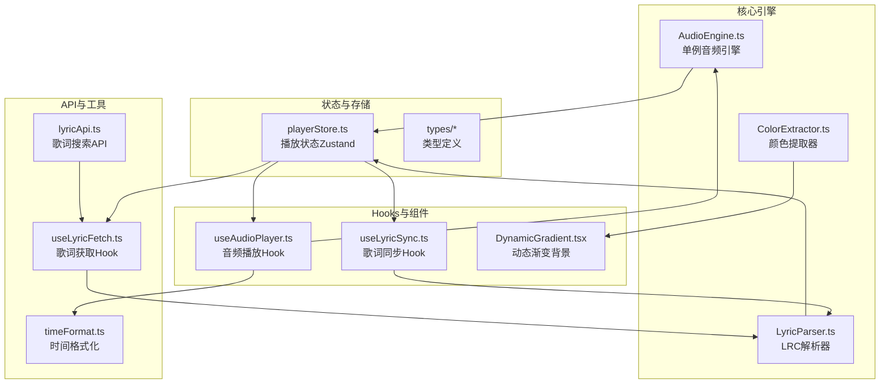
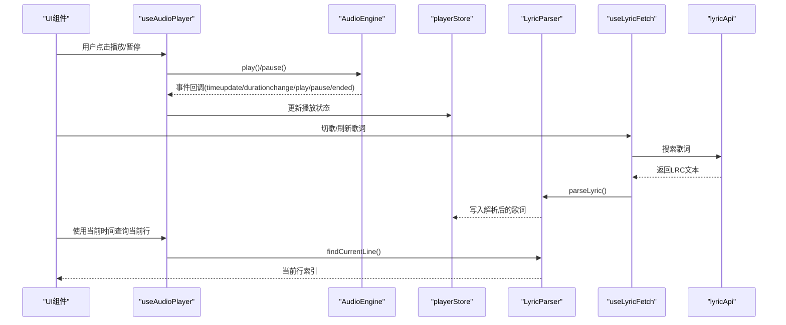
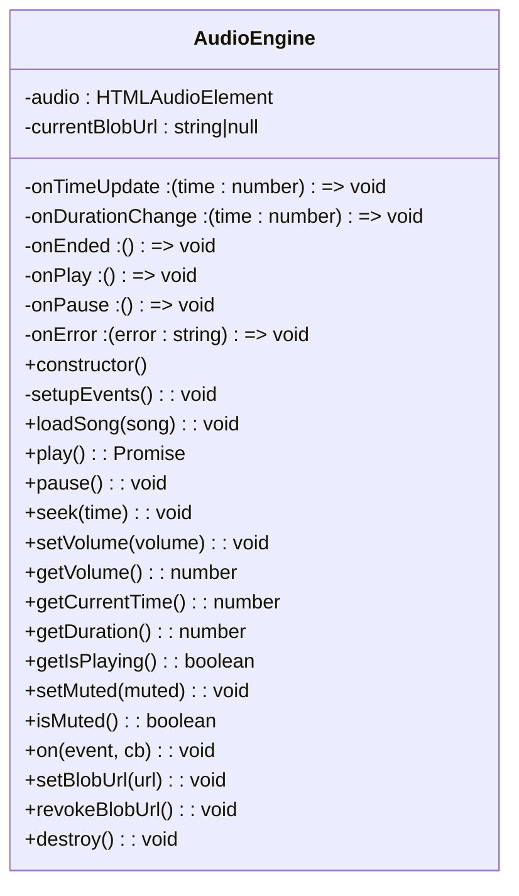
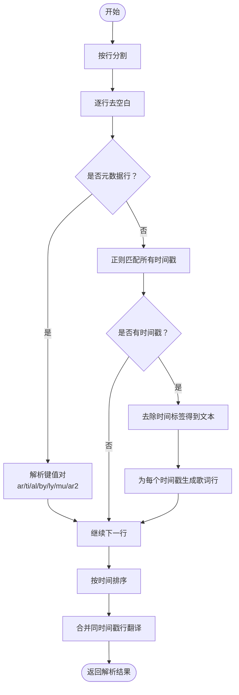
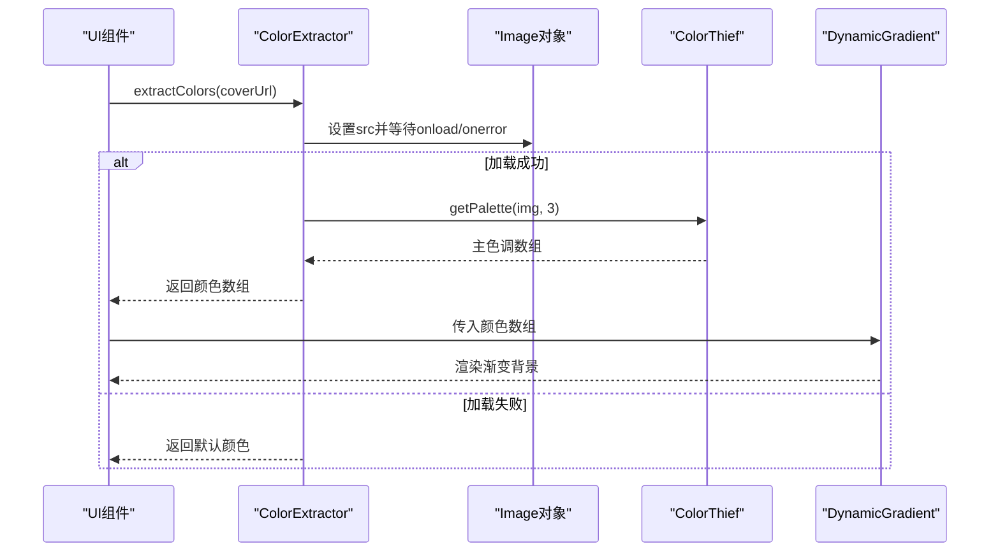
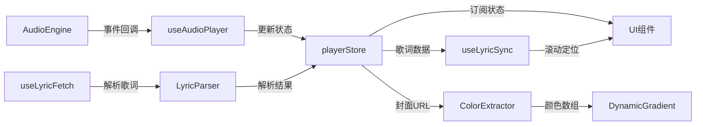
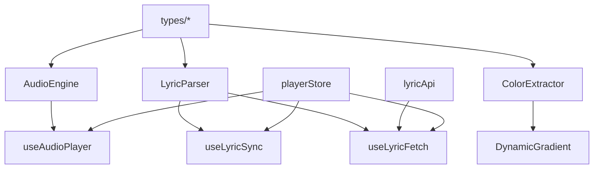

# 核心引擎

<cite>
**本文引用的文件**
- [AudioEngine.ts](file://src/core/AudioEngine.ts)
- [LyricParser.ts](file://src/core/LyricParser.ts)
- [ColorExtractor.ts](file://src/core/ColorExtractor.ts)
- [player.ts](file://src/types/player.ts)
- [lyric.ts](file://src/types/lyric.ts)
- [song.ts](file://src/types/song.ts)
- [playerStore.ts](file://src/store/playerStore.ts)
- [useAudioPlayer.ts](file://src/hooks/useAudioPlayer.ts)
- [useLyricSync.ts](file://src/hooks/useLyricSync.ts)
- [DynamicGradient.tsx](file://src/components/Background/DynamicGradient.tsx)
- [lyricApi.ts](file://src/api/lyricApi.ts)
- [useLyricFetch.ts](file://src/hooks/useLyricFetch.ts)
- [timeFormat.ts](file://src/utils/timeFormat.ts)
</cite>

## 目录
1. [简介](#简介)
2. [项目结构](#项目结构)
3. [核心组件](#核心组件)
4. [架构总览](#架构总览)
5. [详细组件分析](#详细组件分析)
6. [依赖关系分析](#依赖关系分析)
7. [性能考量](#性能考量)
8. [故障排查指南](#故障排查指南)
9. [结论](#结论)

## 简介
本文件聚焦 My Music 2026 的核心引擎模块，系统化梳理以下关键能力：
- AudioEngine.ts 的单例设计与 HTMLAudioElement 封装、事件监听与播放控制
- LyricParser.ts 的 LRC 歌词解析算法（时间轴计算、歌词格式处理、同步逻辑）
- ColorExtractor.ts 的颜色提取算法与专辑封面到动态渐变背景的映射
- 核心引擎与状态管理、UI 组件、API 层之间的协作与数据流
- 设计模式、性能优化与扩展性建议

## 项目结构
核心引擎位于 src/core，配合 src/store、src/hooks、src/api、src/types 等模块协同工作，形成“状态驱动 + 事件驱动”的播放器内核。

图表来源
- [AudioEngine.ts](file://src/core/AudioEngine.ts#L1-L143)
- [LyricParser.ts](file://src/core/LyricParser.ts#L1-L101)
- [ColorExtractor.ts](file://src/core/ColorExtractor.ts#L1-L27)
- [playerStore.ts](file://src/store/playerStore.ts#L1-L95)
- [useAudioPlayer.ts](file://src/hooks/useAudioPlayer.ts#L1-L131)
- [useLyricSync.ts](file://src/hooks/useLyricSync.ts#L1-L33)
- [DynamicGradient.tsx](file://src/components/Background/DynamicGradient.tsx#L1-L22)
- [lyricApi.ts](file://src/api/lyricApi.ts#L1-L129)
- [useLyricFetch.ts](file://src/hooks/useLyricFetch.ts#L1-L95)
- [timeFormat.ts](file://src/utils/timeFormat.ts#L1-L7)

章节来源
- [AudioEngine.ts](file://src/core/AudioEngine.ts#L1-L143)
- [LyricParser.ts](file://src/core/LyricParser.ts#L1-L101)
- [ColorExtractor.ts](file://src/core/ColorExtractor.ts#L1-L27)
- [playerStore.ts](file://src/store/playerStore.ts#L1-L95)

## 核心组件
- 音频引擎 AudioEngine：封装 HTMLAudioElement，提供统一的播放控制、事件分发与资源管理；以单例暴露，便于全局共享。
- 歌词解析 LyricParser：解析 LRC 歌词文本，构建时间轴与元数据，支持二分查找定位当前行。
- 颜色提取 ColorExtractor：基于专辑封面提取主色调，生成三色渐变背景。
- 状态与 Hooks：通过 Zustand 管理播放状态，useAudioPlayer/useLyricSync/useLyricFetch 协调引擎与 UI。

章节来源
- [AudioEngine.ts](file://src/core/AudioEngine.ts#L1-L143)
- [LyricParser.ts](file://src/core/LyricParser.ts#L1-L101)
- [ColorExtractor.ts](file://src/core/ColorExtractor.ts#L1-L27)
- [playerStore.ts](file://src/store/playerStore.ts#L1-L95)
- [useAudioPlayer.ts](file://src/hooks/useAudioPlayer.ts#L1-L131)
- [useLyricSync.ts](file://src/hooks/useLyricSync.ts#L1-L33)
- [useLyricFetch.ts](file://src/hooks/useLyricFetch.ts#L1-L95)

## 架构总览
核心引擎围绕“状态驱动 + 事件驱动”展开：
- 状态驱动：Zustand store 统一维护播放状态（播放/暂停、当前时间、音量、循环模式等），React 组件订阅状态变化。
- 事件驱动：AudioEngine 将底层 HTMLAudioElement 事件转换为回调，派发给订阅者（如 useAudioPlayer）。
- 数据流：歌词由 API 获取并经 LyricParser 解析后写入 store；歌词同步 Hook 基于当前时间与歌词时间轴计算高亮行并滚动居中。

图表来源
- [useAudioPlayer.ts](file://src/hooks/useAudioPlayer.ts#L1-L131)
- [AudioEngine.ts](file://src/core/AudioEngine.ts#L1-L143)
- [playerStore.ts](file://src/store/playerStore.ts#L1-L95)
- [useLyricFetch.ts](file://src/hooks/useLyricFetch.ts#L1-L95)
- [lyricApi.ts](file://src/api/lyricApi.ts#L1-L129)
- [LyricParser.ts](file://src/core/LyricParser.ts#L1-L101)

## 详细组件分析

### AudioEngine.ts：单例设计与播放控制
- 单例模式：构造函数内部创建 HTMLAudioElement 并设置预加载策略；导出单例实例，避免重复创建音频上下文。
- 事件封装：将原生事件 timeupdate/durationchange/ended/play/pause/error 转换为回调，供上层订阅。
- 播放控制：提供 play/pause/loadSong/seek/setVolume/getVolume/getCurrentTime/getDuration/getIsPlaying/setMuted/isMuted 等方法。
- 资源管理：支持设置 Blob URL 并在销毁或切换歌曲时回收，避免内存泄漏。
- 错误处理：捕获底层错误并回调 onError，便于上层提示与降级处理。
- 调试支持：开发环境下挂载到 window.__audioEngine，便于浏览器控制台调试。

图表来源
- [AudioEngine.ts](file://src/core/AudioEngine.ts#L1-L143)

章节来源
- [AudioEngine.ts](file://src/core/AudioEngine.ts#L1-L143)

### LyricParser.ts：LRC 歌词解析与同步
- 时间戳解析：正则匹配形如 [mm:ss.xx] 或 [mm:ss.xxxx] 的时间标签，转换为秒数（毫秒按精度处理）。
- 元数据解析：识别 ar（艺术家）、ti（标题）、al（专辑）、by（作者）、ly（作词）、mu（作曲）、ar2（编曲）等标签。
- 行解析与去噪：去除空白行与不含时间戳的行；提取每行文本并移除时间标签。
- 排序与合并：按时间升序排序；合并同一时间戳的多行歌词（优先保留原文，后续行作为翻译）。
- 同步定位：二分查找当前时间对应的歌词行，返回索引，供 UI 滚动居中与高亮。

图表来源
- [LyricParser.ts](file://src/core/LyricParser.ts#L1-L101)

章节来源
- [LyricParser.ts](file://src/core/LyricParser.ts#L1-L101)
- [lyric.ts](file://src/types/lyric.ts#L1-L21)

### ColorExtractor.ts：专辑封面到动态渐变背景
- 图像加载：异步创建 Image 对象，设置跨域属性，监听 onload/onerror。
- 颜色提取：动态导入 colorthief，调用 getPalette 提取主色调数组（默认3色）。
- 回退策略：若加载失败或提取异常，返回一组默认安全色。
- 格式化输出：提供 rgbToString 将 RGB 数组转为 CSS 颜色字符串（支持透明度）。
- UI 映射：DynamicGradient 组件接收颜色数组，渲染径向渐变背景。

图表来源
- [ColorExtractor.ts](file://src/core/ColorExtractor.ts#L1-L27)
- [DynamicGradient.tsx](file://src/components/Background/DynamicGradient.tsx#L1-L22)

章节来源
- [ColorExtractor.ts](file://src/core/ColorExtractor.ts#L1-L27)
- [DynamicGradient.tsx](file://src/components/Background/DynamicGradient.tsx#L1-L22)

### 核心引擎协作与数据传递
- 状态中心：playerStore 统一管理播放状态、歌词、循环模式、音量等，React 组件通过订阅读取。
- 音频控制：useAudioPlayer 订阅 AudioEngine 事件，同步播放状态；根据循环模式与播放列表决定下一首。
- 歌词获取：useLyricFetch 在切歌时自动调用 lyricApi 搜索歌词，解析后写入 store；支持手动刷新与防抖。
- 歌词同步：useLyricSync 依据当前时间与歌词时间轴计算当前行索引，触发容器滚动居中。
- 时间格式化：timeFormat 提供通用的时间显示格式化工具。

图表来源
- [useAudioPlayer.ts](file://src/hooks/useAudioPlayer.ts#L1-L131)
- [playerStore.ts](file://src/store/playerStore.ts#L1-L95)
- [useLyricFetch.ts](file://src/hooks/useLyricFetch.ts#L1-L95)
- [LyricParser.ts](file://src/core/LyricParser.ts#L1-L101)
- [useLyricSync.ts](file://src/hooks/useLyricSync.ts#L1-L33)
- [ColorExtractor.ts](file://src/core/ColorExtractor.ts#L1-L27)
- [DynamicGradient.tsx](file://src/components/Background/DynamicGradient.tsx#L1-L22)

章节来源
- [useAudioPlayer.ts](file://src/hooks/useAudioPlayer.ts#L1-L131)
- [useLyricFetch.ts](file://src/hooks/useLyricFetch.ts#L1-L95)
- [useLyricSync.ts](file://src/hooks/useLyricSync.ts#L1-L33)
- [playerStore.ts](file://src/store/playerStore.ts#L1-L95)

## 依赖关系分析
- 类型依赖：song.ts 定义歌曲结构；lyric.ts 定义歌词数据模型；player.ts 定义播放模式枚举。
- 组件依赖：useAudioPlayer 依赖 AudioEngine 与 playerStore；useLyricSync 依赖 playerStore 与 LyricParser；useLyricFetch 依赖 lyricApi 与 LyricParser。
- 外部库：ColorExtractor 动态导入 colorthief；lyricApi 使用 fetch 与 localStorage 实现缓存与重试。

图表来源
- [song.ts](file://src/types/song.ts#L1-L14)
- [lyric.ts](file://src/types/lyric.ts#L1-L21)
- [player.ts](file://src/types/player.ts#L1-L4)
- [AudioEngine.ts](file://src/core/AudioEngine.ts#L1-L143)
- [LyricParser.ts](file://src/core/LyricParser.ts#L1-L101)
- [ColorExtractor.ts](file://src/core/ColorExtractor.ts#L1-L27)
- [useAudioPlayer.ts](file://src/hooks/useAudioPlayer.ts#L1-L131)
- [useLyricSync.ts](file://src/hooks/useLyricSync.ts#L1-L33)
- [useLyricFetch.ts](file://src/hooks/useLyricFetch.ts#L1-L95)
- [lyricApi.ts](file://src/api/lyricApi.ts#L1-L129)
- [playerStore.ts](file://src/store/playerStore.ts#L1-L95)
- [DynamicGradient.tsx](file://src/components/Background/DynamicGradient.tsx#L1-L22)

章节来源
- [song.ts](file://src/types/song.ts#L1-L14)
- [lyric.ts](file://src/types/lyric.ts#L1-L21)
- [player.ts](file://src/types/player.ts#L1-L4)

## 性能考量
- 音频事件频率高：timeupdate 可能高频触发，建议在 UI 中进行节流或使用 requestAnimationFrame 优化滚动与高亮更新。
- 歌词解析成本：LRC 文本通常较小，解析开销低；但需注意大段歌词的 DOM 操作（滚动居中）应避免频繁布局抖动。
- 颜色提取：ColorThief 会进行像素采样，建议在封面变更时触发，避免频繁重复提取。
- 网络请求：歌词搜索采用超时与重试策略，结合 fetchId 防止快速切歌导致的竞态与重复渲染。
- 存储与缓存：歌词缓存使用 localStorage，注意容量上限与序列化失败的兜底处理。

## 故障排查指南
- 播放失败（浏览器自动播放限制）：AudioEngine.play() 捕获异常并抛出，上层应提示用户交互后再尝试播放。
- 歌词未显示：检查 useLyricFetch 是否正确调用 API 且解析成功；确认 store 中 lyricSource 与 lyric 数据已写入。
- 歌词滚动不同步：确认 useLyricSync 的当前时间来自 playerStore，findCurrentLine 返回的索引有效。
- 颜色提取失败：检查封面 URL 可访问性与跨域设置；确保 ColorExtractor 的回退颜色正常渲染。
- 循环模式异常：核对 useAudioPlayer 的 handleSongEnd 分支逻辑与播放列表长度。

章节来源
- [AudioEngine.ts](file://src/core/AudioEngine.ts#L54-L61)
- [useLyricFetch.ts](file://src/hooks/useLyricFetch.ts#L23-L58)
- [useLyricSync.ts](file://src/hooks/useLyricSync.ts#L11-L29)
- [ColorExtractor.ts](file://src/core/ColorExtractor.ts#L5-L18)
- [useAudioPlayer.ts](file://src/hooks/useAudioPlayer.ts#L47-L62)

## 结论
本核心引擎以 AudioEngine 为播放中枢，结合 LyricParser 的歌词解析与 ColorExtractor 的视觉增强，通过 Zustand 状态与 React Hooks 实现清晰的数据流与事件流。整体设计遵循单一职责与松耦合原则，具备良好的扩展性：可新增播放器模式、歌词来源、颜色提取策略与 UI 组件，同时保持现有模块稳定运行。