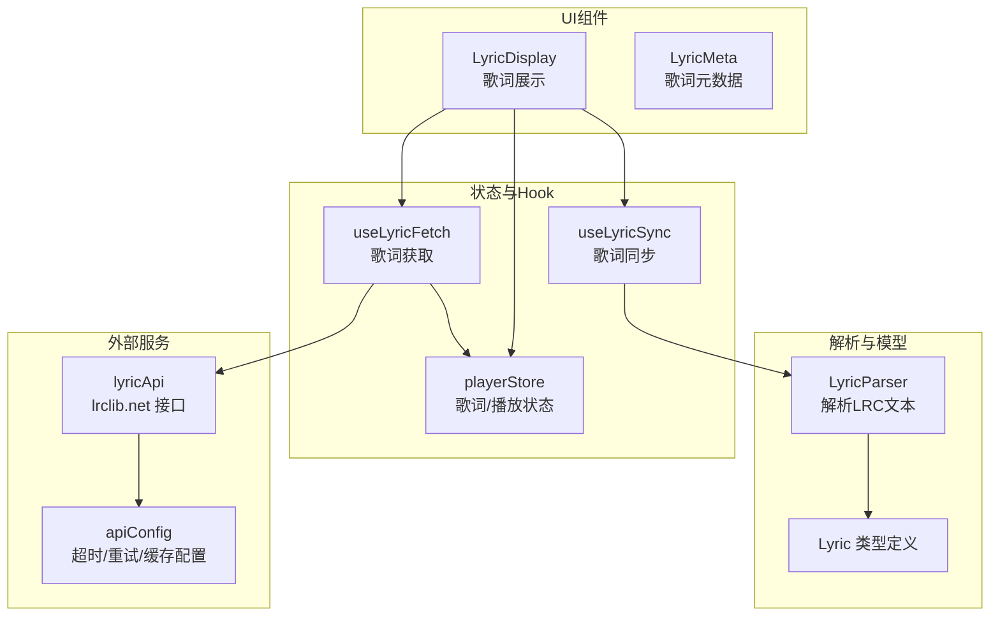
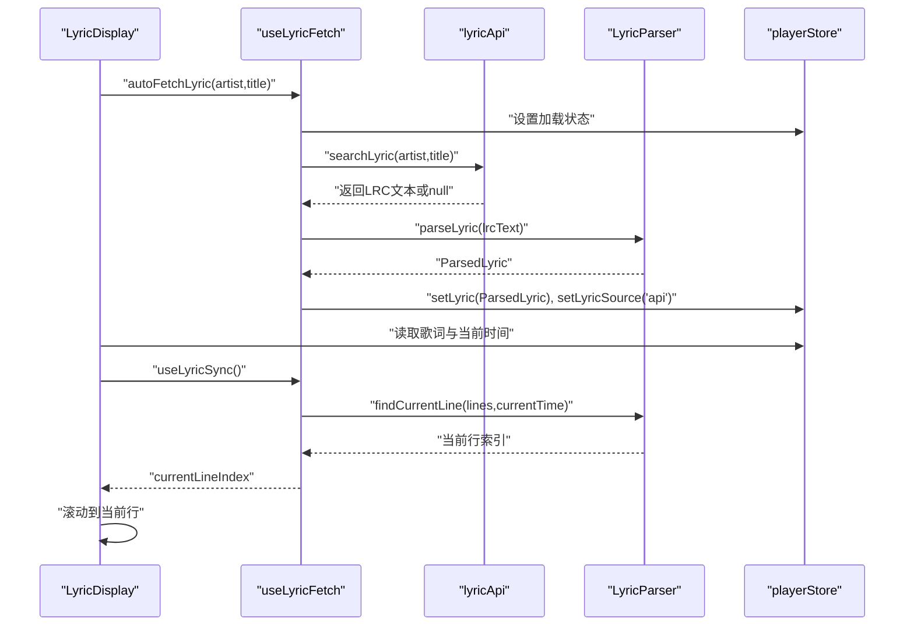
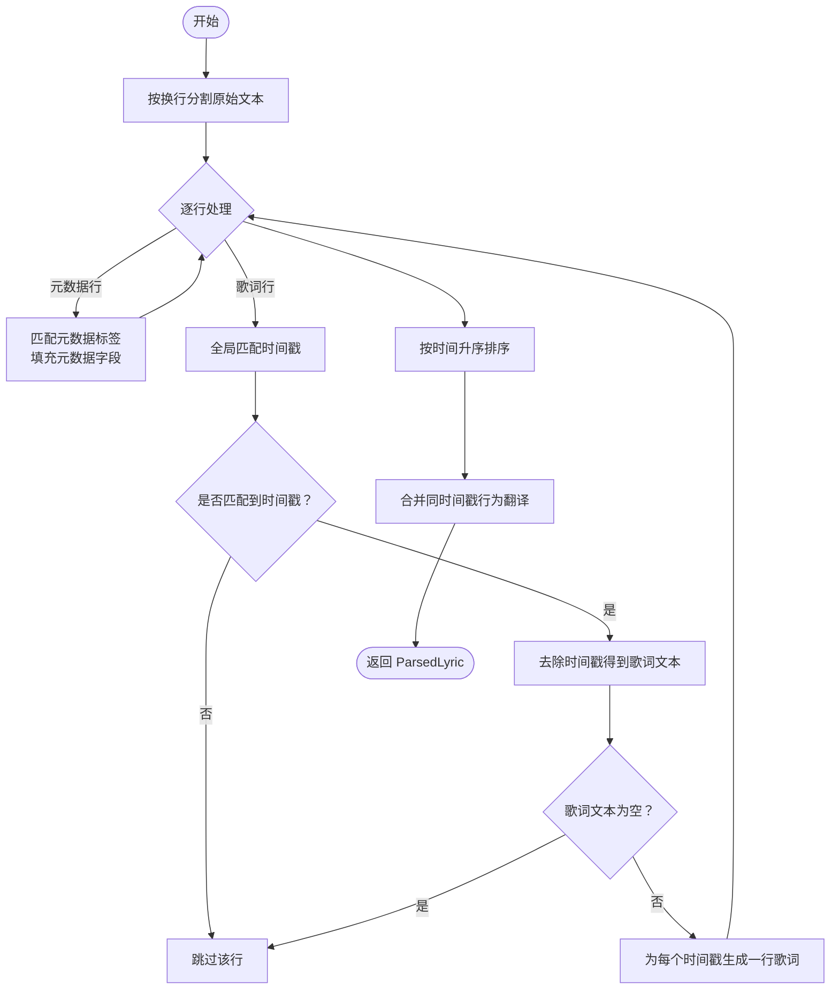
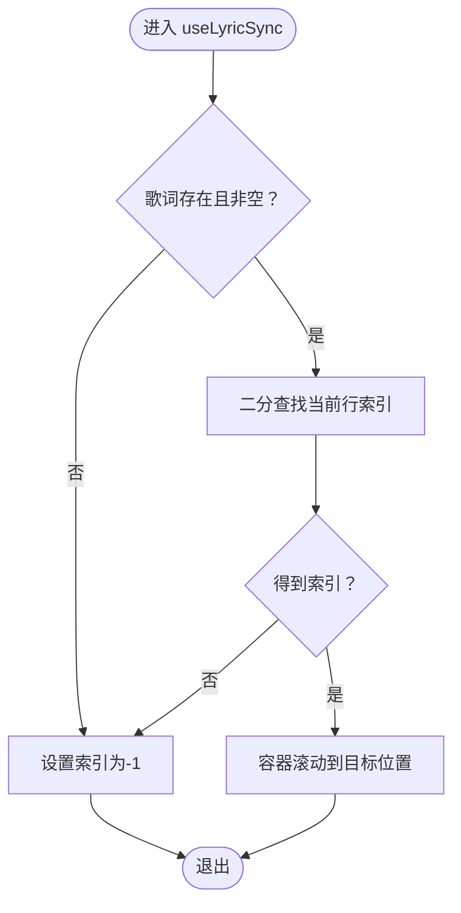
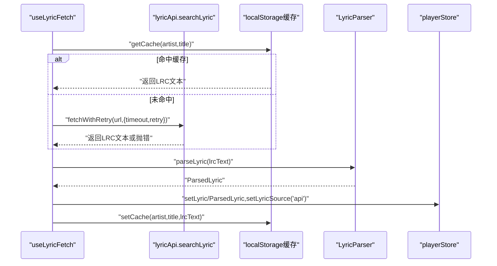
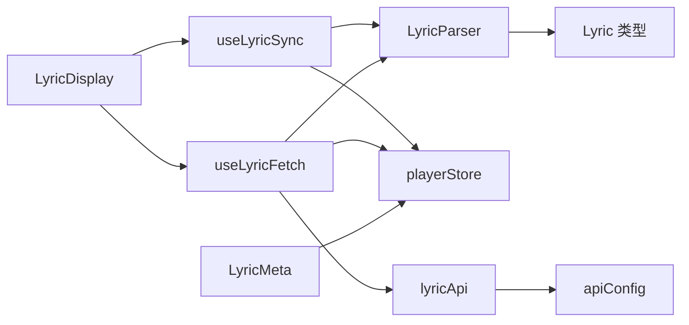

# 歌词解析器

<cite>
**本文引用的文件**
- [src/core/LyricParser.ts](file://src/core/LyricParser.ts)
- [src/types/lyric.ts](file://src/types/lyric.ts)
- [src/hooks/useLyricSync.ts](file://src/hooks/useLyricSync.ts)
- [src/components/Lyrics/LyricDisplay.tsx](file://src/components/Lyrics/LyricDisplay.tsx)
- [src/components/Lyrics/LyricMeta.tsx](file://src/components/Lyrics/LyricMeta.tsx)
- [src/hooks/useLyricFetch.ts](file://src/hooks/useLyricFetch.ts)
- [src/api/lyricApi.ts](file://src/api/lyricApi.ts)
- [src/store/playerStore.ts](file://src/store/playerStore.ts)
- [src/utils/timeFormat.ts](file://src/utils/timeFormat.ts)
- [src/config/apiConfig.ts](file://src/config/apiConfig.ts)
- [src/api/types.ts](file://src/api/types.ts)
</cite>

## 目录
1. [简介](#简介)
2. [项目结构](#项目结构)
3. [核心组件](#核心组件)
4. [架构总览](#架构总览)
5. [详细组件分析](#详细组件分析)
6. [依赖关系分析](#依赖关系分析)
7. [性能考虑](#性能考虑)
8. [故障排查指南](#故障排查指南)
9. [结论](#结论)
10. [附录](#附录)

## 简介
本文件面向 My Music 2026 的歌词解析与同步模块，系统性梳理 LRC 歌词格式的解析算法、时间轴计算、歌词同步机制、元数据提取与处理、错误处理与兼容性策略，并给出实际使用场景与最佳实践。读者无需深入源码即可理解歌词从“获取—解析—渲染—同步”的完整流程。

## 项目结构
歌词相关功能围绕以下模块协同工作：
- 核心解析：负责 LRC 文本解析、时间戳归一化、元数据提取、当前行定位
- 状态管理：集中存储歌词对象、当前播放时间、加载状态等
- Hook 层：封装歌词获取、同步滚动、点击跳转等交互逻辑
- 组件层：展示歌词、高亮当前行、显示翻译行、支持点击跳转
- API 层：对接 lrclib.net，提供缓存、重试、超时控制
- 工具层：时间格式化等辅助函数

图表来源
- [src/core/LyricParser.ts](file://src/core/LyricParser.ts#L1-L101)
- [src/types/lyric.ts](file://src/types/lyric.ts#L1-L21)
- [src/hooks/useLyricFetch.ts](file://src/hooks/useLyricFetch.ts#L1-L95)
- [src/hooks/useLyricSync.ts](file://src/hooks/useLyricSync.ts#L1-L33)
- [src/components/Lyrics/LyricDisplay.tsx](file://src/components/Lyrics/LyricDisplay.tsx#L1-L102)
- [src/components/Lyrics/LyricMeta.tsx](file://src/components/Lyrics/LyricMeta.tsx#L1-L19)
- [src/api/lyricApi.ts](file://src/api/lyricApi.ts#L1-L129)
- [src/config/apiConfig.ts](file://src/config/apiConfig.ts#L1-L18)
- [src/store/playerStore.ts](file://src/store/playerStore.ts#L1-L95)

章节来源
- [src/core/LyricParser.ts](file://src/core/LyricParser.ts#L1-L101)
- [src/hooks/useLyricFetch.ts](file://src/hooks/useLyricFetch.ts#L1-L95)
- [src/hooks/useLyricSync.ts](file://src/hooks/useLyricSync.ts#L1-L33)
- [src/components/Lyrics/LyricDisplay.tsx](file://src/components/Lyrics/LyricDisplay.tsx#L1-L102)
- [src/components/Lyrics/LyricMeta.tsx](file://src/components/Lyrics/LyricMeta.tsx#L1-L19)
- [src/api/lyricApi.ts](file://src/api/lyricApi.ts#L1-L129)
- [src/config/apiConfig.ts](file://src/config/apiConfig.ts#L1-L18)
- [src/store/playerStore.ts](file://src/store/playerStore.ts#L1-L95)

## 核心组件
- 歌词解析器：解析 LRC 文本，提取元数据与时间轴，生成标准化的歌词对象
- 歌词同步 Hook：根据当前播放时间定位当前行并触发容器滚动
- 歌词获取 Hook：封装 API 调用、缓存、防抖与竞态控制
- 歌词展示组件：渲染歌词行、翻译行、高亮当前行、支持点击跳转
- 歌词元数据显示：展示词、曲、编曲等元信息
- 状态管理：统一维护歌词对象、来源、加载状态与播放时间
- 时间格式化工具：将秒数格式化为分:秒字符串

章节来源
- [src/core/LyricParser.ts](file://src/core/LyricParser.ts#L1-L101)
- [src/hooks/useLyricSync.ts](file://src/hooks/useLyricSync.ts#L1-L33)
- [src/hooks/useLyricFetch.ts](file://src/hooks/useLyricFetch.ts#L1-L95)
- [src/components/Lyrics/LyricDisplay.tsx](file://src/components/Lyrics/LyricDisplay.tsx#L1-L102)
- [src/components/Lyrics/LyricMeta.tsx](file://src/components/Lyrics/LyricMeta.tsx#L1-L19)
- [src/store/playerStore.ts](file://src/store/playerStore.ts#L1-L95)
- [src/utils/timeFormat.ts](file://src/utils/timeFormat.ts#L1-L7)

## 架构总览
歌词从“获取—解析—渲染—同步”形成闭环：
- 获取：通过 useLyricFetch 自动或手动从 lrclib.net 拉取 LRC 文本，命中本地缓存则直接返回
- 解析：LyricParser 将 LRC 文本解析为标准化结构，包含元数据与按时间排序的歌词行
- 渲染：LyricDisplay 展示歌词列表，高亮当前行并支持平滑滚动；LyricMeta 展示词/曲/编曲信息
- 同步：useLyricSync 基于当前播放时间二分查找当前歌词索引，并驱动容器滚动

图表来源
- [src/hooks/useLyricFetch.ts](file://src/hooks/useLyricFetch.ts#L1-L95)
- [src/api/lyricApi.ts](file://src/api/lyricApi.ts#L1-L129)
- [src/core/LyricParser.ts](file://src/core/LyricParser.ts#L1-L101)
- [src/store/playerStore.ts](file://src/store/playerStore.ts#L1-L95)
- [src/components/Lyrics/LyricDisplay.tsx](file://src/components/Lyrics/LyricDisplay.tsx#L1-L102)
- [src/hooks/useLyricSync.ts](file://src/hooks/useLyricSync.ts#L1-L33)

## 详细组件分析

### 歌词解析器（LyricParser）
职责与流程：
- 元数据解析：识别形如 [ar:艺术家]、[ti:标题]、[al:专辑]、[by:歌词作者]、[ly:作词]、[mu:作曲]、[ar2:编曲] 等标签，仅在不含时间戳的行中生效
- 时间戳解析：支持 mm:ss 或 mm:ss.xx（两位小数）与 mm:ss.xxx（三位小数）两种格式，统一转换为秒级浮点数
- 歌词文本提取：去除所有时间戳后得到纯文本，若为空则丢弃该行
- 行合并：对同一时间戳的多行歌词进行合并，第二段作为翻译行
- 排序与去重：按时间升序排序，微小时间差（小于 0.01 秒）视为同一时间点，优先保留第一条歌词的翻译

关键算法与复杂度：
- 时间戳匹配采用全局正则，单行复杂度 O(k)，k 为时间戳数量
- 整体复杂度 O(n·m + n log n)，n 为行数，m 为平均每行时间戳数
- 合并阶段线性扫描，O(n)
- 当前行定位采用二分查找，O(log n)

图表来源
- [src/core/LyricParser.ts](file://src/core/LyricParser.ts#L18-L81)

章节来源
- [src/core/LyricParser.ts](file://src/core/LyricParser.ts#L1-L101)
- [src/types/lyric.ts](file://src/types/lyric.ts#L1-L21)

### 歌词同步机制（useLyricSync）
职责与流程：
- 订阅播放时间与歌词数据，当任一变化时重新定位当前行
- 使用二分查找在已排序的歌词行中确定当前索引
- 容器滚动：将当前行滚动至容器可视区域约三分之一处，实现自然滚动效果

图表来源
- [src/hooks/useLyricSync.ts](file://src/hooks/useLyricSync.ts#L1-L33)
- [src/core/LyricParser.ts](file://src/core/LyricParser.ts#L83-L100)

章节来源
- [src/hooks/useLyricSync.ts](file://src/hooks/useLyricSync.ts#L1-L33)
- [src/core/LyricParser.ts](file://src/core/LyricParser.ts#L83-L100)

### 歌词获取与缓存（useLyricFetch + lyricApi）
职责与流程：
- 自动获取：切歌时若无本地歌词则发起 API 请求
- 手动刷新：用户点击“重新获取”时强制拉取
- 防抖与竞态：使用自增 ID 控制请求顺序，避免快速切歌导致的竞态
- 缓存：基于 localStorage 的键值缓存，带过期时间
- 错误处理：超时/网络错误/HTTP 异常均被吞并并回退到空歌词

图表来源
- [src/hooks/useLyricFetch.ts](file://src/hooks/useLyricFetch.ts#L1-L95)
- [src/api/lyricApi.ts](file://src/api/lyricApi.ts#L1-L129)

章节来源
- [src/hooks/useLyricFetch.ts](file://src/hooks/useLyricFetch.ts#L1-L95)
- [src/api/lyricApi.ts](file://src/api/lyricApi.ts#L1-L129)
- [src/config/apiConfig.ts](file://src/config/apiConfig.ts#L1-L18)
- [src/api/types.ts](file://src/api/types.ts#L1-L26)

### 歌词展示与交互（LyricDisplay + LyricMeta）
职责与流程：
- LyricDisplay：根据加载状态显示“加载中/暂无歌词”，否则渲染歌词列表；支持点击某行跳转到对应时间点
- LyricMeta：仅在存在有效元数据时显示，展示词、曲、编曲信息
- 滚动与高亮：当前行高亮并居中，其他行半透明悬停提升不透明度

章节来源
- [src/components/Lyrics/LyricDisplay.tsx](file://src/components/Lyrics/LyricDisplay.tsx#L1-L102)
- [src/components/Lyrics/LyricMeta.tsx](file://src/components/Lyrics/LyricMeta.tsx#L1-L19)
- [src/store/playerStore.ts](file://src/store/playerStore.ts#L1-L95)

### 数据模型（Lyric 类型）
- LyricLine：包含时间（秒）、文本、可选翻译
- LyricMeta：包含艺术家、标题、专辑、歌词作者、作词、作曲、编曲等字段
- ParsedLyric：由解析器输出的整体结构

章节来源
- [src/types/lyric.ts](file://src/types/lyric.ts#L1-L21)

## 依赖关系分析
- LyricParser 依赖 Lyric 类型定义，提供解析与定位能力
- useLyricSync 依赖 LyricParser 的定位函数，依赖 playerStore 的当前时间与歌词数据
- LyricDisplay 依赖 useLyricSync 与 useLyricFetch，依赖 playerStore 的歌词与加载状态
- useLyricFetch 依赖 lyricApi 与 LyricParser，依赖 playerStore 写入解析后的歌词
- lyricApi 依赖 apiConfig 进行超时/重试/缓存配置
- LyricMeta 依赖 playerStore 的歌词元数据

图表来源
- [src/core/LyricParser.ts](file://src/core/LyricParser.ts#L1-L101)
- [src/hooks/useLyricSync.ts](file://src/hooks/useLyricSync.ts#L1-L33)
- [src/hooks/useLyricFetch.ts](file://src/hooks/useLyricFetch.ts#L1-L95)
- [src/components/Lyrics/LyricDisplay.tsx](file://src/components/Lyrics/LyricDisplay.tsx#L1-L102)
- [src/components/Lyrics/LyricMeta.tsx](file://src/components/Lyrics/LyricMeta.tsx#L1-L19)
- [src/api/lyricApi.ts](file://src/api/lyricApi.ts#L1-L129)
- [src/config/apiConfig.ts](file://src/config/apiConfig.ts#L1-L18)
- [src/store/playerStore.ts](file://src/store/playerStore.ts#L1-L95)
- [src/types/lyric.ts](file://src/types/lyric.ts#L1-L21)

章节来源
- [src/core/LyricParser.ts](file://src/core/LyricParser.ts#L1-L101)
- [src/hooks/useLyricSync.ts](file://src/hooks/useLyricSync.ts#L1-L33)
- [src/hooks/useLyricFetch.ts](file://src/hooks/useLyricFetch.ts#L1-L95)
- [src/components/Lyrics/LyricDisplay.tsx](file://src/components/Lyrics/LyricDisplay.tsx#L1-L102)
- [src/components/Lyrics/LyricMeta.tsx](file://src/components/Lyrics/LyricMeta.tsx#L1-L19)
- [src/api/lyricApi.ts](file://src/api/lyricApi.ts#L1-L129)
- [src/config/apiConfig.ts](file://src/config/apiConfig.ts#L1-L18)
- [src/store/playerStore.ts](file://src/store/playerStore.ts#L1-L95)
- [src/types/lyric.ts](file://src/types/lyric.ts#L1-L21)

## 性能考虑
- 解析阶段
  - 时间戳匹配为线性复杂度，建议限制每行时间戳数量或预处理输入
  - 合并阶段线性扫描，整体开销可控
- 查找阶段
  - 二分查找 O(log n)，n 通常较小（数百行），延迟可忽略
- 渲染阶段
  - 使用滚动容器与 maskImage 实现局部遮罩，减少重绘范围
  - 高亮与透明度切换为轻量 DOM 操作
- 网络与缓存
  - 本地缓存命中可避免网络请求，显著降低延迟
  - 超时与重试策略平衡稳定性与用户体验
- 存储与内存
  - 仅在解析成功后写入 playerStore，避免无效状态占用内存

[本节为通用性能建议，不直接分析具体文件]

## 故障排查指南
- 无法显示歌词
  - 检查歌词来源：是否来自 API 成功解析并写入 store
  - 检查加载状态：LyricDisplay 在 loading 时会显示“歌词获取中”
  - 检查网络：确认 lrclib.net 可达，超时/重试配置合理
- 歌词不滚动或滚动异常
  - 确认容器存在子元素且索引有效
  - 检查容器高度与目标滚动位置计算
- 时间戳解析错误
  - 确认 LRC 时间格式为 mm:ss、mm:ss.xx 或 mm:ss.xxx
  - 检查是否存在重复时间戳导致合并逻辑影响预期
- 元数据不显示
  - 确认解析出的元数据字段存在且非空
- 竞态与闪烁
  - 快速切歌时确保 useLyricFetch 的请求 ID 控制生效

章节来源
- [src/components/Lyrics/LyricDisplay.tsx](file://src/components/Lyrics/LyricDisplay.tsx#L1-L102)
- [src/hooks/useLyricFetch.ts](file://src/hooks/useLyricFetch.ts#L1-L95)
- [src/api/lyricApi.ts](file://src/api/lyricApi.ts#L1-L129)
- [src/hooks/useLyricSync.ts](file://src/hooks/useLyricSync.ts#L1-L33)

## 结论
本模块以 LyricParser 为核心，结合 useLyricFetch 与 useLyricSync，实现了从 LRC 文本到可视化歌词的完整链路。解析器对 LRC 格式具备良好兼容性，支持多时间戳与翻译行合并；同步机制通过二分查找与平滑滚动保证流畅体验；API 层提供缓存、重试与超时控制，兼顾稳定性与性能。整体设计清晰、解耦良好，便于扩展与维护。

[本节为总结性内容，不直接分析具体文件]

## 附录

### LRC 格式要点与兼容性
- 元数据标签：仅在不含时间戳的行中识别，支持 ar/ti/al/by/ly/mu/ar2 等常见字段
- 时间戳格式：支持 mm:ss、mm:ss.xx、mm:ss.xxx，统一转换为秒
- 多时间戳：同一行多个时间戳将生成多条歌词行
- 翻译行：同一时间点的后续歌词作为翻译行显示
- 空行与空白：会被忽略，避免无效数据污染

章节来源
- [src/core/LyricParser.ts](file://src/core/LyricParser.ts#L18-L81)
- [src/types/lyric.ts](file://src/types/lyric.ts#L1-L21)

### 使用场景示例
- 自动获取：切歌时若无本地歌词，自动从 lrclib.net 拉取并解析
- 手动刷新：歌词为空时提供“重新获取”按钮
- 点击跳转：点击任意歌词行跳转到对应时间点
- 滚动对齐：当前行滚动至容器三分之一处，保持视觉焦点稳定

章节来源
- [src/hooks/useLyricFetch.ts](file://src/hooks/useLyricFetch.ts#L62-L91)
- [src/components/Lyrics/LyricDisplay.tsx](file://src/components/Lyrics/LyricDisplay.tsx#L72-L96)
- [src/hooks/useLyricSync.ts](file://src/hooks/useLyricSync.ts#L20-L29)