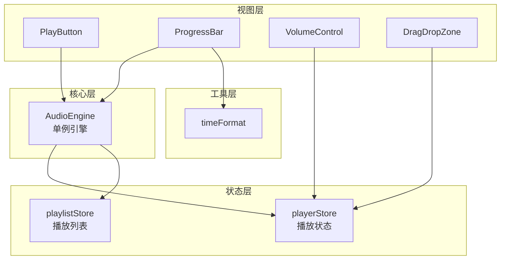
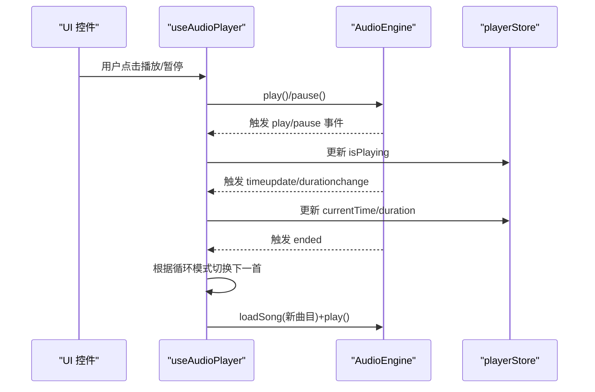
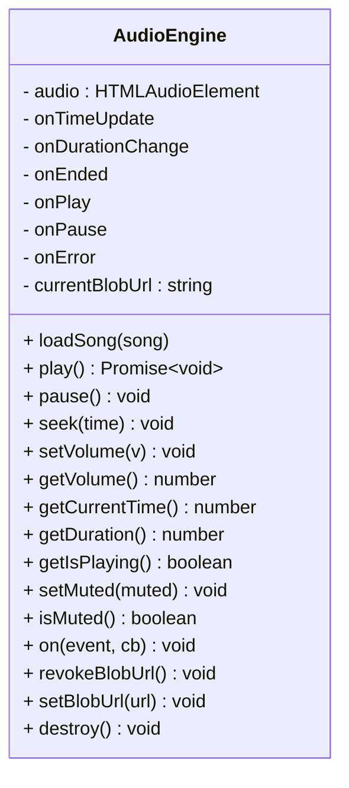
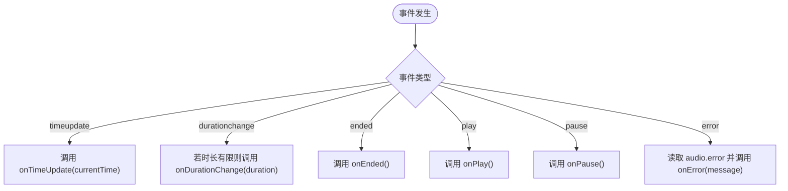
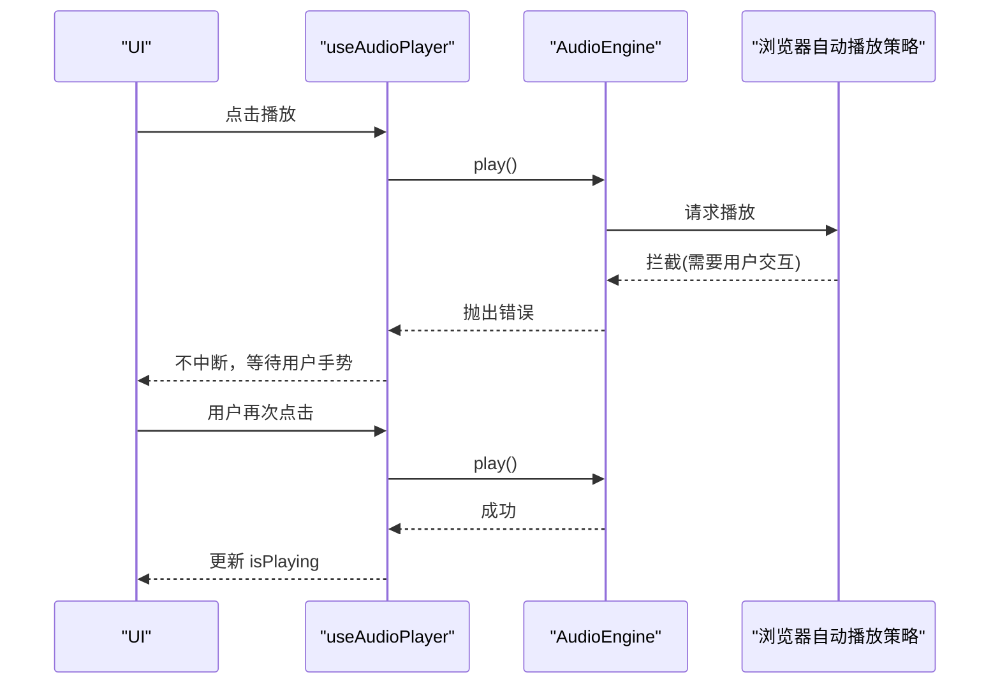
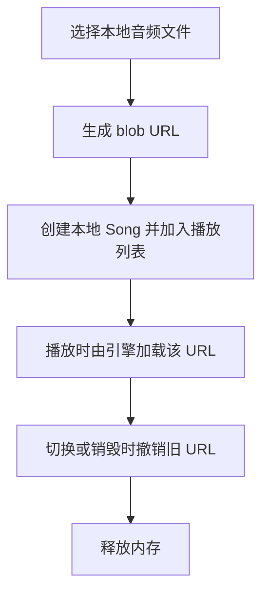
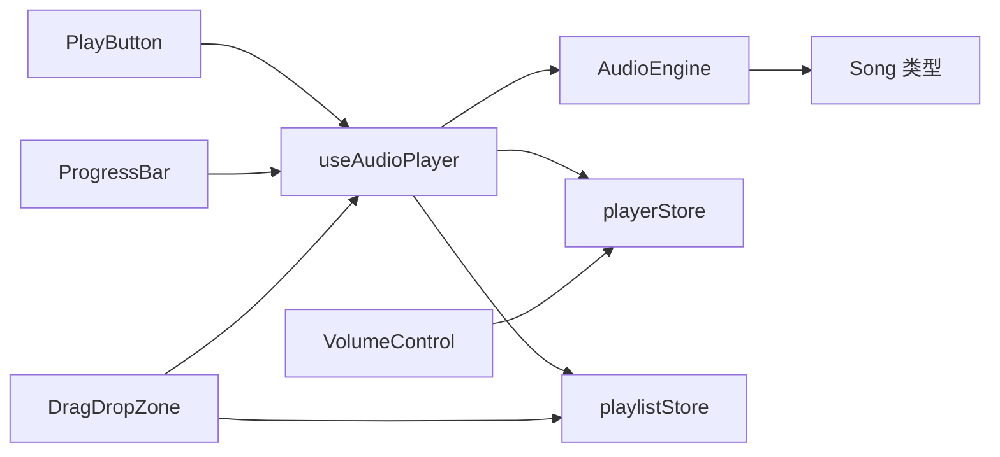

# 音频引擎

<cite>
**本文引用的文件**
- [src/core/AudioEngine.ts](file://src/core/AudioEngine.ts)
- [src/hooks/useAudioPlayer.ts](file://src/hooks/useAudioPlayer.ts)
- [src/store/playerStore.ts](file://src/store/playerStore.ts)
- [src/store/playlistStore.ts](file://src/store/playlistStore.ts)
- [src/types/song.ts](file://src/types/song.ts)
- [src/types/player.ts](file://src/types/player.ts)
- [src/components/Controls/PlayButton.tsx](file://src/components/Controls/PlayButton.tsx)
- [src/components/Controls/ProgressBar.tsx](file://src/components/Controls/ProgressBar.tsx)
- [src/components/Controls/VolumeControl.tsx](file://src/components/Controls/VolumeControl.tsx)
- [src/components/FileImport/DragDropZone.tsx](file://src/components/FileImport/DragDropZone.tsx)
- [src/hooks/useFileImport.ts](file://src/hooks/useFileImport.ts)
- [src/utils/timeFormat.ts](file://src/utils/timeFormat.ts)
- [src/App.tsx](file://src/App.tsx)
- [package.json](file://package.json)
</cite>

## 目录
1. [简介](#简介)
2. [项目结构](#项目结构)
3. [核心组件](#核心组件)
4. [架构总览](#架构总览)
5. [详细组件分析](#详细组件分析)
6. [依赖关系分析](#依赖关系分析)
7. [性能考量](#性能考量)
8. [故障排查指南](#故障排查指南)
9. [结论](#结论)
10. [附录](#附录)

## 简介
本文件针对 My Music 2026 的音频引擎模块进行系统化技术文档整理，重点围绕 AudioEngine 类的单例设计与对 HTMLAudioElement 的完整封装展开，涵盖事件监听机制、播放控制 API（play、pause、seek）、音量与静音控制、事件回调体系、blob URL 管理与内存清理策略，并结合播放器前端组件与状态管理，给出错误处理、用户交互限制与调试支持的最佳实践与使用示例。

## 项目结构
音频引擎位于核心层，通过 React Hooks 与 Zustand 状态管理连接 UI 控件，形成“引擎-状态-视图”的清晰分层：

- 核心层
  - AudioEngine：单例音频引擎，封装 HTMLAudioElement 并暴露统一 API
- 状态层
  - playerStore：播放器全局状态（播放/暂停、时间轴、音量、循环模式等）
  - playlistStore：播放列表与收藏等持久化状态
- 视图层
  - 控制组件：播放按钮、进度条、音量控制
  - 文件导入：拖拽/选择本地音频文件，生成本地 Song 并加入播放列表
- 工具层
  - timeFormat：时间格式化工具

图表来源
- [src/core/AudioEngine.ts](file://src/core/AudioEngine.ts#L1-L143)
- [src/hooks/useAudioPlayer.ts](file://src/hooks/useAudioPlayer.ts#L1-L131)
- [src/store/playerStore.ts](file://src/store/playerStore.ts#L1-L95)
- [src/store/playlistStore.ts](file://src/store/playlistStore.ts#L1-L88)
- [src/components/Controls/PlayButton.tsx](file://src/components/Controls/PlayButton.tsx#L1-L17)
- [src/components/Controls/ProgressBar.tsx](file://src/components/Controls/ProgressBar.tsx#L1-L83)
- [src/components/Controls/VolumeControl.tsx](file://src/components/Controls/VolumeControl.tsx#L1-L59)
- [src/components/FileImport/DragDropZone.tsx](file://src/components/FileImport/DragDropZone.tsx#L1-L67)
- [src/utils/timeFormat.ts](file://src/utils/timeFormat.ts#L1-L7)

章节来源
- [src/core/AudioEngine.ts](file://src/core/AudioEngine.ts#L1-L143)
- [src/hooks/useAudioPlayer.ts](file://src/hooks/useAudioPlayer.ts#L1-L131)
- [src/store/playerStore.ts](file://src/store/playerStore.ts#L1-L95)
- [src/store/playlistStore.ts](file://src/store/playlistStore.ts#L1-L88)
- [src/components/Controls/PlayButton.tsx](file://src/components/Controls/PlayButton.tsx#L1-L17)
- [src/components/Controls/ProgressBar.tsx](file://src/components/Controls/ProgressBar.tsx#L1-L83)
- [src/components/Controls/VolumeControl.tsx](file://src/components/Controls/VolumeControl.tsx#L1-L59)
- [src/components/FileImport/DragDropZone.tsx](file://src/components/FileImport/DragDropZone.tsx#L1-L67)
- [src/utils/timeFormat.ts](file://src/utils/timeFormat.ts#L1-L7)

## 核心组件
- AudioEngine 单例
  - 负责封装 HTMLAudioElement，提供统一的播放控制与事件回调接口
  - 内置 blob URL 管理与销毁，避免内存泄漏
- useAudioPlayer Hook
  - 将引擎事件映射到播放器状态，同步播放控制与 UI
  - 实现播放列表切换、循环/随机播放逻辑
- playerStore/playlistStore
  - 维护播放状态、当前曲目、音量、循环模式、播放列表等
- 控制组件
  - PlayButton：触发播放/暂停
  - ProgressBar：拖拽/悬停预览跳转
  - VolumeControl：音量调节与静音切换
- 文件导入
  - DragDropZone：本地音频文件拖拽/选择
  - useFileImport：生成本地 Song（含 blob URL），加入播放列表

章节来源
- [src/core/AudioEngine.ts](file://src/core/AudioEngine.ts#L1-L143)
- [src/hooks/useAudioPlayer.ts](file://src/hooks/useAudioPlayer.ts#L1-L131)
- [src/store/playerStore.ts](file://src/store/playerStore.ts#L1-L95)
- [src/store/playlistStore.ts](file://src/store/playlistStore.ts#L1-L88)
- [src/components/Controls/PlayButton.tsx](file://src/components/Controls/PlayButton.tsx#L1-L17)
- [src/components/Controls/ProgressBar.tsx](file://src/components/Controls/ProgressBar.tsx#L1-L83)
- [src/components/Controls/VolumeControl.tsx](file://src/components/Controls/VolumeControl.tsx#L1-L59)
- [src/components/FileImport/DragDropZone.tsx](file://src/components/FileImport/DragDropZone.tsx#L1-L67)
- [src/hooks/useFileImport.ts](file://src/hooks/useFileImport.ts#L1-L77)

## 架构总览
AudioEngine 作为单例，向上提供统一 API，向下订阅 HTMLAudioElement 事件并通过 on 回调转发给上层；useAudioPlayer 将引擎事件与播放器状态绑定，UI 控件通过状态驱动渲染与交互。

图表来源
- [src/hooks/useAudioPlayer.ts](file://src/hooks/useAudioPlayer.ts#L1-L131)
- [src/core/AudioEngine.ts](file://src/core/AudioEngine.ts#L1-L143)
- [src/store/playerStore.ts](file://src/store/playerStore.ts#L1-L95)

## 详细组件分析

### AudioEngine 类与单例设计
- 单例导出：通过命名导出单例实例，确保全局唯一音频上下文
- 封装 HTMLAudioElement
  - 预加载策略：设置 preload 为 auto
  - 事件桥接：timeupdate/durationchange/ended/play/pause/error
- 播放控制 API
  - play：异步播放，捕获浏览器自动播放限制错误
  - pause：暂停
  - seek：安全设置 currentTime，限制在 [0, duration]
  - loadSong：重置播放位置并加载新曲目
- 音量与静音
  - setVolume/getVolume：范围约束在 [0,1]
  - setMuted/isMuted：静音开关
- 事件回调系统
  - on 接口重载：timeupdate/durationchange/ended/play/pause/error
  - 回调存储：内部字段保存对应事件回调
- Blob URL 管理与内存清理
  - setBlobUrl：设置当前 blob URL 前先撤销旧 URL
  - revokeBlobUrl：按需撤销当前 blob URL
  - destroy：停止播放、清空 src、撤销 blob URL
- 调试支持
  - 开发环境将引擎挂载至 window 对象，便于调试

图表来源
- [src/core/AudioEngine.ts](file://src/core/AudioEngine.ts#L1-L143)

章节来源
- [src/core/AudioEngine.ts](file://src/core/AudioEngine.ts#L1-L143)

### 事件监听机制与回调系统
- 事件桥接
  - timeupdate：向回调传递当前时间
  - durationchange：仅在有效时长下触发
  - ended：播放结束
  - play/pause：播放状态变更
  - error：读取 HTMLAudioElement.error 并上报
- 回调注册
  - on 方法根据事件类型设置对应回调字段
  - 支持多次注册，后注册覆盖前一次

图表来源
- [src/core/AudioEngine.ts](file://src/core/AudioEngine.ts#L23-L44)

章节来源
- [src/core/AudioEngine.ts](file://src/core/AudioEngine.ts#L23-L44)

### 播放控制 API 与用户交互限制
- play
  - 异步执行，捕获错误并提示需要用户交互
- pause/seek/loadSong
  - 基础控制方法，seek 内部做边界校验
- 用户交互限制
  - 若首次播放被浏览器拦截，需等待用户手势后再尝试播放
  - useAudioPlayer 中对异常进行吞吐处理，避免中断 UI

图表来源
- [src/hooks/useAudioPlayer.ts](file://src/hooks/useAudioPlayer.ts#L70-L75)
- [src/core/AudioEngine.ts](file://src/core/AudioEngine.ts#L54-L61)

章节来源
- [src/hooks/useAudioPlayer.ts](file://src/hooks/useAudioPlayer.ts#L70-L75)
- [src/core/AudioEngine.ts](file://src/core/AudioEngine.ts#L54-L61)

### 音量控制与静音功能
- 音量范围约束：setVolume 将输入限制在 [0,1]
- 静音：setMuted 切换静音；isMuted 查询状态
- UI 同步：VolumeControl 通过 playerStore 的 setVolume/setIsMuted 更新引擎

章节来源
- [src/core/AudioEngine.ts](file://src/core/AudioEngine.ts#L73-L99)
- [src/components/Controls/VolumeControl.tsx](file://src/components/Controls/VolumeControl.tsx#L1-L59)
- [src/store/playerStore.ts](file://src/store/playerStore.ts#L24-L40)

### blob URL 管理与内存清理
- 生成：useFileImport 使用 URL.createObjectURL 为本地文件生成 URL
- 设置：AudioEngine.setBlobUrl 在设置新 URL 前撤销旧 URL
- 销毁：revokeBlobUrl 主动撤销；destroy 在引擎销毁时一并清理

图表来源
- [src/hooks/useFileImport.ts](file://src/hooks/useFileImport.ts#L7-L31)
- [src/core/AudioEngine.ts](file://src/core/AudioEngine.ts#L118-L134)

章节来源
- [src/hooks/useFileImport.ts](file://src/hooks/useFileImport.ts#L7-L31)
- [src/core/AudioEngine.ts](file://src/core/AudioEngine.ts#L118-L134)

### 播放列表与循环模式
- 切歌逻辑：根据循环模式（列表/单曲/随机）计算下一首索引
- 自动播放：当播放列表为空而点击播放时，优先播放第一首

章节来源
- [src/hooks/useAudioPlayer.ts](file://src/hooks/useAudioPlayer.ts#L47-L62)
- [src/hooks/useAudioPlayer.ts](file://src/hooks/useAudioPlayer.ts#L64-L75)
- [src/types/player.ts](file://src/types/player.ts#L1-L4)

### UI 与状态联动
- ProgressBar
  - 鼠标拖拽计算比例并调用引擎 seek
  - hover 显示预览时间
- PlayButton
  - 根据 isPlaying 渲染图标
- App
  - 根据播放器模式切换布局（迷你/全屏）

章节来源
- [src/components/Controls/ProgressBar.tsx](file://src/components/Controls/ProgressBar.tsx#L1-L83)
- [src/components/Controls/PlayButton.tsx](file://src/components/Controls/PlayButton.tsx#L1-L17)
- [src/App.tsx](file://src/App.tsx#L1-L98)

## 依赖关系分析
- AudioEngine 依赖
  - HTMLAudioElement：底层播放能力
  - Song 类型：loadSong 参数
- useAudioPlayer 依赖
  - AudioEngine：播放控制
  - playerStore/playlistStore：状态同步与循环逻辑
- 组件依赖
  - ProgressBar/PlayButton/VolumeControl：通过状态与 Hook 与引擎交互
- 文件导入
  - useFileImport：生成本地 Song（含 blob URL）

图表来源
- [src/core/AudioEngine.ts](file://src/core/AudioEngine.ts#L1-L143)
- [src/hooks/useAudioPlayer.ts](file://src/hooks/useAudioPlayer.ts#L1-L131)
- [src/store/playerStore.ts](file://src/store/playerStore.ts#L1-L95)
- [src/store/playlistStore.ts](file://src/store/playlistStore.ts#L1-L88)
- [src/components/Controls/PlayButton.tsx](file://src/components/Controls/PlayButton.tsx#L1-L17)
- [src/components/Controls/ProgressBar.tsx](file://src/components/Controls/ProgressBar.tsx#L1-L83)
- [src/components/Controls/VolumeControl.tsx](file://src/components/Controls/VolumeControl.tsx#L1-L59)
- [src/components/FileImport/DragDropZone.tsx](file://src/components/FileImport/DragDropZone.tsx#L1-L67)
- [src/hooks/useFileImport.ts](file://src/hooks/useFileImport.ts#L1-L77)
- [src/types/song.ts](file://src/types/song.ts#L1-L14)

章节来源
- [src/core/AudioEngine.ts](file://src/core/AudioEngine.ts#L1-L143)
- [src/hooks/useAudioPlayer.ts](file://src/hooks/useAudioPlayer.ts#L1-L131)
- [src/store/playerStore.ts](file://src/store/playerStore.ts#L1-L95)
- [src/store/playlistStore.ts](file://src/store/playlistStore.ts#L1-L88)
- [src/components/Controls/PlayButton.tsx](file://src/components/Controls/PlayButton.tsx#L1-L17)
- [src/components/Controls/ProgressBar.tsx](file://src/components/Controls/ProgressBar.tsx#L1-L83)
- [src/components/Controls/VolumeControl.tsx](file://src/components/Controls/VolumeControl.tsx#L1-L59)
- [src/components/FileImport/DragDropZone.tsx](file://src/components/FileImport/DragDropZone.tsx#L1-L67)
- [src/hooks/useFileImport.ts](file://src/hooks/useFileImport.ts#L1-L77)
- [src/types/song.ts](file://src/types/song.ts#L1-L14)

## 性能考量
- 预加载策略：AudioEngine 构造时设置 preload 为 auto，有助于减少首帧卡顿
- 事件频率：timeupdate 事件频繁，建议在 UI 层做节流或最小化重渲染
- blob URL：及时撤销旧 URL，避免内存累积
- 循环模式：随机模式存在额外随机数生成，注意在大列表场景下的开销

## 故障排查指南
- 播放失败（浏览器自动播放限制）
  - 现象：首次播放抛错，提示需要用户交互
  - 处理：等待用户手势后重试播放
- 无法跳转
  - 现象：seek 不生效
  - 排查：确认 duration 是否有效；seek 边界是否正确
- 时长异常
  - 现象：durationchange 未触发或值异常
  - 排查：检查音频资源是否可正常加载；确保事件监听已建立
- 静音无效
  - 现象：切换静音后声音仍响
  - 排查：确认 setMuted/isMuted 与 UI 同步；检查音量是否被设为 0
- 内存泄漏
  - 现象：频繁切换本地文件后内存上升
  - 处理：确保每次 setBlobUrl 前撤销旧 URL；退出页面时调用 destroy

章节来源
- [src/hooks/useAudioPlayer.ts](file://src/hooks/useAudioPlayer.ts#L70-L75)
- [src/core/AudioEngine.ts](file://src/core/AudioEngine.ts#L67-L71)
- [src/core/AudioEngine.ts](file://src/core/AudioEngine.ts#L27-L31)
- [src/core/AudioEngine.ts](file://src/core/AudioEngine.ts#L93-L99)
- [src/core/AudioEngine.ts](file://src/core/AudioEngine.ts#L118-L134)

## 结论
AudioEngine 以单例形式封装 HTMLAudioElement，提供简洁一致的播放控制与事件回调接口，并通过 blob URL 管理与内存清理保障运行稳定性。配合 useAudioPlayer 与播放器状态，实现了从 UI 到引擎的高效联动。遵循本文最佳实践，可在保证用户体验的同时提升系统健壮性与可维护性。

## 附录

### 使用示例与最佳实践
- 加载并播放本地文件
  - 步骤：选择文件 → 生成 blob URL → 创建本地 Song → 加入播放列表 → 调用引擎 loadSong + play
  - 参考路径
    - [src/hooks/useFileImport.ts](file://src/hooks/useFileImport.ts#L37-L49)
    - [src/components/FileImport/DragDropZone.tsx](file://src/components/FileImport/DragDropZone.tsx#L12-L23)
    - [src/hooks/useAudioPlayer.ts](file://src/hooks/useAudioPlayer.ts#L64-L75)
- 拖拽进度条跳转
  - 步骤：计算比例 → 调用引擎 seek → 同步更新当前时间
  - 参考路径
    - [src/components/Controls/ProgressBar.tsx](file://src/components/Controls/ProgressBar.tsx#L14-L25)
- 音量与静音
  - 步骤：拖动音量条 → setVolume → 若音量>0 且处于静音则取消静音
  - 参考路径
    - [src/components/Controls/VolumeControl.tsx](file://src/components/Controls/VolumeControl.tsx#L14-L20)
    - [src/store/playerStore.ts](file://src/store/playerStore.ts#L63-L71)
- 循环模式切换
  - 步骤：根据模式计算下一首索引 → 加载并播放
  - 参考路径
    - [src/hooks/useAudioPlayer.ts](file://src/hooks/useAudioPlayer.ts#L47-L62)
    - [src/types/player.ts](file://src/types/player.ts#L1-L4)

### 关键 API 一览
- 播放控制
  - loadSong(song)
  - play()
  - pause()
  - seek(time)
- 音量与静音
  - setVolume(volume)
  - getVolume()
  - setMuted(muted)
  - isMuted()
- 事件回调
  - on("timeupdate", cb)
  - on("durationchange", cb)
  - on("ended", cb)
  - on("play", cb)
  - on("pause", cb)
  - on("error", cb)
- 资源管理
  - setBlobUrl(url)
  - revokeBlobUrl()
  - destroy()

章节来源
- [src/core/AudioEngine.ts](file://src/core/AudioEngine.ts#L47-L134)
- [src/hooks/useAudioPlayer.ts](file://src/hooks/useAudioPlayer.ts#L64-L75)
- [src/components/Controls/ProgressBar.tsx](file://src/components/Controls/ProgressBar.tsx#L14-L25)
- [src/components/Controls/VolumeControl.tsx](file://src/components/Controls/VolumeControl.tsx#L14-L20)
- [src/hooks/useFileImport.ts](file://src/hooks/useFileImport.ts#L37-L49)