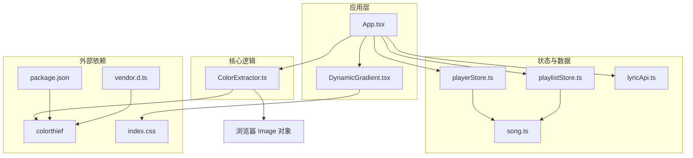
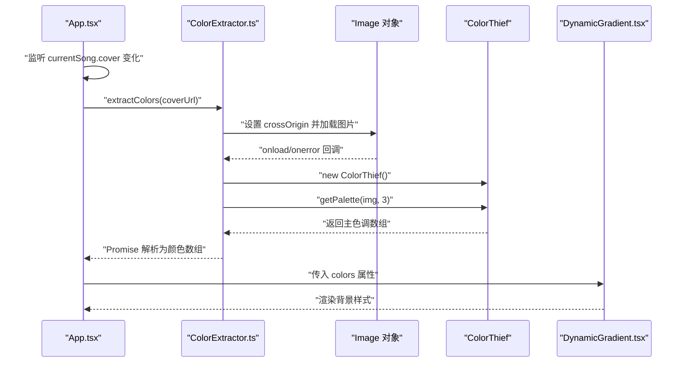
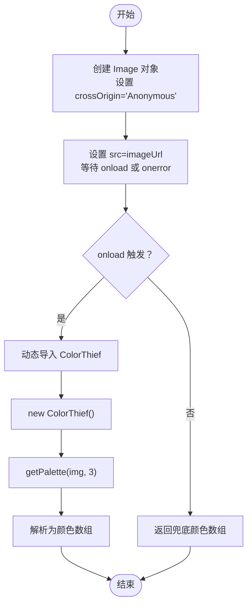
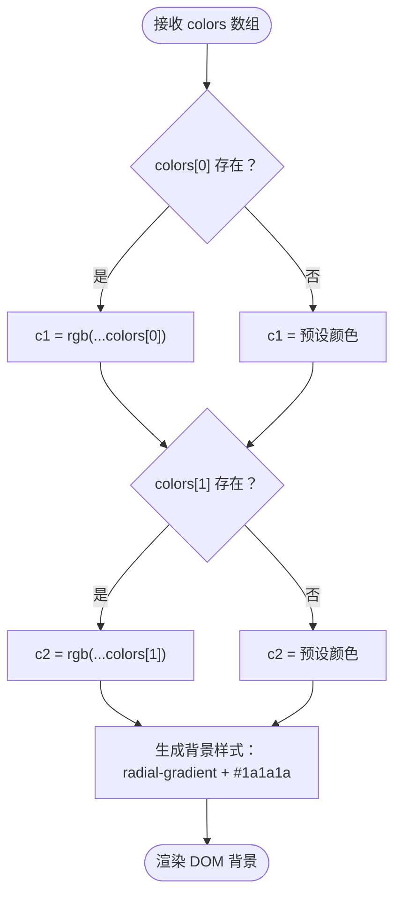
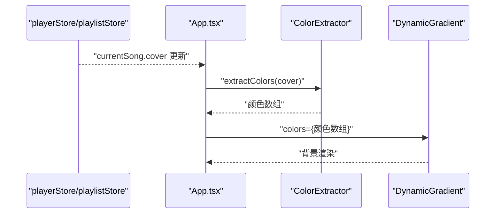
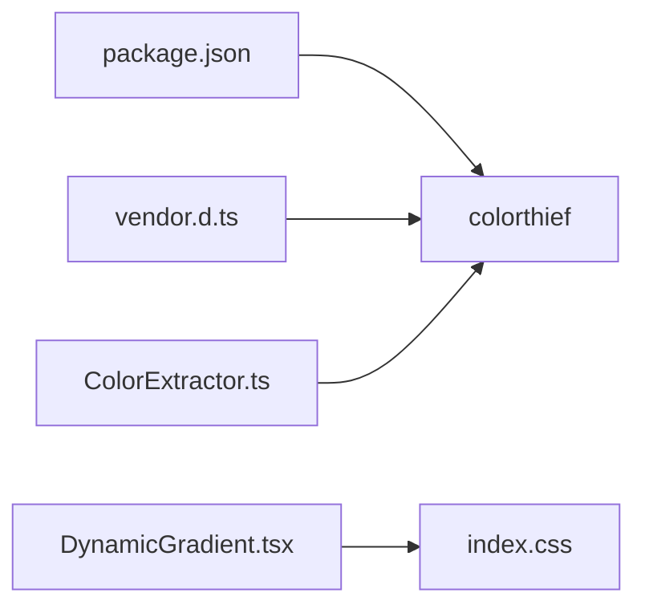

# 颜色提取器

<cite>
**本文引用的文件**
- [src/core/ColorExtractor.ts](file://src/core/ColorExtractor.ts)
- [src/components/Background/DynamicGradient.tsx](file://src/components/Background/DynamicGradient.tsx)
- [src/App.tsx](file://src/App.tsx)
- [src/store/playerStore.ts](file://src/store/playerStore.ts)
- [src/store/playlistStore.ts](file://src/store/playlistStore.ts)
- [src/types/song.ts](file://src/types/song.ts)
- [src/api/lyricApi.ts](file://src/api/lyricApi.ts)
- [package.json](file://package.json)
- [src/index.css](file://src/index.css)
- [src/types/vendor.d.ts](file://src/types/vendor.d.ts)
</cite>

## 目录
1. [简介](#简介)
2. [项目结构](#项目结构)
3. [核心组件](#核心组件)
4. [架构总览](#架构总览)
5. [详细组件分析](#详细组件分析)
6. [依赖关系分析](#依赖关系分析)
7. [性能考量](#性能考量)
8. [可访问性与主题适配](#可访问性与主题适配)
9. [故障排查指南](#故障排查指南)
10. [结论](#结论)
11. [附录](#附录)

## 简介
本文件针对 My Music 2026 的“颜色提取器”模块进行系统化技术文档整理，重点覆盖以下方面：
- 基于专辑封面的主色调提取流程与算法要点（颜色聚类、色彩空间转换、渐变背景生成）
- ColorThief 库的集成方式、参数调优与结果优化建议
- 动态渐变背景的生成逻辑（颜色插值、渐变方向与视觉效果）
- 性能考虑与缓存策略
- 可访问性与主题适配
- 实际应用场景与视觉效果说明

## 项目结构
颜色提取器相关代码主要分布在如下位置：
- 核心提取：src/core/ColorExtractor.ts
- 渐变背景渲染：src/components/Background/DynamicGradient.tsx
- 应用入口与触发点：src/App.tsx
- 状态管理（当前歌曲与封面更新）：src/store/playerStore.ts、src/store/playlistStore.ts
- 类型定义（歌曲字段含封面）：src/types/song.ts
- 封面获取（备用来源）：src/api/lyricApi.ts
- 依赖声明：package.json
- 主题与颜色变量：src/index.css
- 外部库类型声明：src/types/vendor.d.ts

图表来源
- [src/App.tsx](file://src/App.tsx#L15-L31)
- [src/core/ColorExtractor.ts](file://src/core/ColorExtractor.ts#L1-L20)
- [src/components/Background/DynamicGradient.tsx](file://src/components/Background/DynamicGradient.tsx#L5-L21)
- [src/store/playerStore.ts](file://src/store/playerStore.ts#L39-L81)
- [src/store/playlistStore.ts](file://src/store/playlistStore.ts#L73-L77)
- [src/types/song.ts](file://src/types/song.ts#L1-L13)
- [src/api/lyricApi.ts](file://src/api/lyricApi.ts#L126-L128)
- [package.json](file://package.json#L12-L21)
- [src/index.css](file://src/index.css#L3-L15)
- [src/types/vendor.d.ts](file://src/types/vendor.d.ts#L1-L2)

章节来源
- [src/App.tsx](file://src/App.tsx#L15-L31)
- [src/core/ColorExtractor.ts](file://src/core/ColorExtractor.ts#L1-L20)
- [src/components/Background/DynamicGradient.tsx](file://src/components/Background/DynamicGradient.tsx#L5-L21)
- [src/store/playerStore.ts](file://src/store/playerStore.ts#L39-L81)
- [src/store/playlistStore.ts](file://src/store/playlistStore.ts#L73-L77)
- [src/types/song.ts](file://src/types/song.ts#L1-L13)
- [src/api/lyricApi.ts](file://src/api/lyricApi.ts#L126-L128)
- [package.json](file://package.json#L12-L21)
- [src/index.css](file://src/index.css#L3-L15)
- [src/types/vendor.d.ts](file://src/types/vendor.d.ts#L1-L2)

## 核心组件
- 颜色提取函数：从给定图片 URL 异步加载图像，使用 ColorThief 提取主色调（默认提取 3 色），并提供兜底颜色数组。
- RGB 字符串转换：将三通道 RGB 数组转为 CSS 颜色字符串（支持透明度）。
- 动态渐变背景：接收提取到的颜色数组，渲染双环形径向渐变叠加深色背景，实现柔和的视觉过渡。

章节来源
- [src/core/ColorExtractor.ts](file://src/core/ColorExtractor.ts#L1-L26)
- [src/components/Background/DynamicGradient.tsx](file://src/components/Background/DynamicGradient.tsx#L5-L21)

## 架构总览
颜色提取器在应用中的工作流如下：
- 当前歌曲封面变更时，App 组件触发颜色提取
- 提取完成后，将颜色数组传递给 DynamicGradient 组件
- DynamicGradient 根据颜色生成背景样式，实现页面整体视觉基调

图表来源
- [src/App.tsx](file://src/App.tsx#L24-L31)
- [src/core/ColorExtractor.ts](file://src/core/ColorExtractor.ts#L1-L20)
- [src/components/Background/DynamicGradient.tsx](file://src/components/Background/DynamicGradient.tsx#L5-L21)

## 详细组件分析

### 颜色提取器（ColorExtractor）
- 输入：图片 URL（通常为专辑封面）
- 处理流程：
  - 创建匿名跨域的 Image 对象并加载
  - 异步按需引入 ColorThief，实例化后调用 getPalette 提取主色调
  - 默认提取 3 色；若失败或加载失败，返回预设兜底颜色数组
- 输出：RGB 三元组数组（每个元素为 [r, g, b]）

图表来源
- [src/core/ColorExtractor.ts](file://src/core/ColorExtractor.ts#L1-L20)

章节来源
- [src/core/ColorExtractor.ts](file://src/core/ColorExtractor.ts#L1-L20)

### 动态渐变背景（DynamicGradient）
- 接收颜色数组（最多 2 个颜色用于渐变）
- 渲染规则：
  - 若提供颜色则使用第一个颜色作为第一个径向渐变的中心色，第二个颜色作为第二个径向渐变的中心色
  - 两个径向渐变叠加深色背景，形成柔和的背景氛围
  - 使用固定定位与 z-index 控制层级，配合过渡动画实现平滑切换

图表来源
- [src/components/Background/DynamicGradient.tsx](file://src/components/Background/DynamicGradient.tsx#L5-L21)

章节来源
- [src/components/Background/DynamicGradient.tsx](file://src/components/Background/DynamicGradient.tsx#L5-L21)

### 应用集成点（App）
- 监听当前歌曲封面变化，触发颜色提取
- 若无封面，尝试通过 API 获取封面并回写到状态中
- 将提取到的颜色数组传递给 DynamicGradient 组件

图表来源
- [src/App.tsx](file://src/App.tsx#L24-L31)
- [src/store/playerStore.ts](file://src/store/playerStore.ts#L39-L81)
- [src/store/playlistStore.ts](file://src/store/playlistStore.ts#L73-L77)
- [src/api/lyricApi.ts](file://src/api/lyricApi.ts#L126-L128)

章节来源
- [src/App.tsx](file://src/App.tsx#L24-L31)
- [src/store/playerStore.ts](file://src/store/playerStore.ts#L39-L81)
- [src/store/playlistStore.ts](file://src/store/playlistStore.ts#L73-L77)
- [src/api/lyricApi.ts](file://src/api/lyricApi.ts#L126-L128)

## 依赖关系分析
- 外部库依赖：colorthief 由 npm 管理并在运行时按需动态导入
- 类型声明：通过 vendor.d.ts 声明 colorthief 模块，确保 TS 类型安全
- 样式依赖：渐变背景使用 CSS 变量与 Tailwind 定义的主题色，保证全局一致性

图表来源
- [package.json](file://package.json#L12-L21)
- [src/types/vendor.d.ts](file://src/types/vendor.d.ts#L1-L2)
- [src/core/ColorExtractor.ts](file://src/core/ColorExtractor.ts#L7-L8)
- [src/components/Background/DynamicGradient.tsx](file://src/components/Background/DynamicGradient.tsx#L11-L18)
- [src/index.css](file://src/index.css#L3-L15)

章节来源
- [package.json](file://package.json#L12-L21)
- [src/types/vendor.d.ts](file://src/types/vendor.d.ts#L1-L2)
- [src/core/ColorExtractor.ts](file://src/core/ColorExtractor.ts#L7-L8)
- [src/components/Background/DynamicGradient.tsx](file://src/components/Background/DynamicGradient.tsx#L11-L18)
- [src/index.css](file://src/index.css#L3-L15)

## 性能考量
- 图像加载与跨域：
  - 使用匿名跨域加载，避免污染画布导致无法提取颜色的问题
- 按需加载 ColorThief：
  - 在回调内动态 import，减少首屏包体与初始化开销
- 颜色提取参数：
  - 默认提取 3 色，兼顾代表性与性能；如需更丰富色彩可提升数量，但会增加处理时间
- 渐变渲染：
  - 使用固定定位与过渡动画，避免频繁重排；径向渐变半径与透明度控制可降低视觉噪点
- 缓存策略：
  - 当前未实现颜色级缓存；可在应用层维护“封面URL -> 颜色数组”的映射以复用结果
  - 封面获取已通过 API 层缓存歌词的思路进行本地持久化，可借鉴该模式缓存封面 URL

章节来源
- [src/core/ColorExtractor.ts](file://src/core/ColorExtractor.ts#L3-L8)
- [src/components/Background/DynamicGradient.tsx](file://src/components/Background/DynamicGradient.tsx#L11-L18)
- [src/api/lyricApi.ts](file://src/api/lyricApi.ts#L55-L78)

## 可访问性与主题适配
- 颜色对比度：
  - 渐变背景叠加深色背景，确保前景文字与控件具备足够对比度
  - 可根据提取主色调整文字与边框颜色，遵循 WCAG 对比度标准
- 主题适配：
  - 使用 CSS 变量统一管理主色与文本色，便于在不同模式下切换
  - 渐变背景采用半透明与深色基底，避免与浅色前景产生刺眼冲突
- 动画与感知：
  - 背景过渡时长适中，避免影响音频播放器操作的专注度

章节来源
- [src/index.css](file://src/index.css#L3-L15)
- [src/components/Background/DynamicGradient.tsx](file://src/components/Background/DynamicGradient.tsx#L11-L18)

## 故障排查指南
- 图片加载失败：
  - 现有兜底颜色数组确保 UI 不中断；检查网络与跨域配置
- ColorThief 导入异常：
  - 确认按需导入路径正确；检查运行环境是否支持动态 import
- 颜色提取结果不理想：
  - 调整提取色数或更换图片源；确认图片清晰度与亮度分布
- 渐变背景不生效：
  - 检查传入颜色数组长度与格式；确认 DOM 层级与 z-index 设置

章节来源
- [src/core/ColorExtractor.ts](file://src/core/ColorExtractor.ts#L11-L17)
- [src/components/Background/DynamicGradient.tsx](file://src/components/Background/DynamicGradient.tsx#L5-L21)

## 结论
颜色提取器模块通过“按需加载 + 异步提取 + 渐变渲染”的组合，实现了从专辑封面到页面主色调的自然过渡。结合状态管理与 API 封面回填机制，整体流程简洁可靠。后续可在应用层引入颜色级缓存与对比度校验，进一步提升性能与可访问性。

## 附录

### 参数与配置建议
- 颜色提取色数：默认 3，可根据视觉需求提升至 5，注意性能权衡
- 渐变参数：中心点坐标与透明度可微调，以适配不同画面构图
- 动画时长：当前 1 秒过渡，可根据设备性能与用户偏好调整

### 实际应用场景
- 音乐播放器全屏模式：背景随封面动态变化，增强沉浸感
- 歌曲信息面板：主色调与文字/图标颜色保持一致，提升一致性
- 播放列表与迷你模式：在小尺寸场景下仍保持可辨识的视觉基调