# 播放列表状态管理

<cite>
**本文档引用的文件**
- [playlistStore.ts](file://src/store/playlistStore.ts)
- [playerStore.ts](file://src/store/playerStore.ts)
- [song.ts](file://src/types/song.ts)
- [player.ts](file://src/types/player.ts)
- [vendor.d.ts](file://src/types/vendor.d.ts)
- [PlaylistDrawer.tsx](file://src/components/Playlist/PlaylistDrawer.tsx)
- [FavoriteButton.tsx](file://src/components/SongInfo/FavoriteButton.tsx)
- [AddToPlaylist.tsx](file://src/components/Playlist/AddToPlaylist.tsx)
- [useAudioPlayer.ts](file://src/hooks/useAudioPlayer.ts)
- [App.tsx](file://src/App.tsx)
</cite>

## 目录
1. [简介](#简介)
2. [项目结构](#项目结构)
3. [核心组件](#核心组件)
4. [架构概览](#架构概览)
5. [详细组件分析](#详细组件分析)
6. [依赖关系分析](#依赖关系分析)
7. [性能考虑](#性能考虑)
8. [故障排除指南](#故障排除指南)
9. [结论](#结论)

## 简介

My Music 2026 是一个现代化的音乐播放器应用，采用 React 和 TypeScript 构建。本文档深入解析播放列表状态管理系统，特别是 `playlistStore.ts` 中的状态设计和实现。该系统负责管理歌曲队列、用户歌单、收藏功能和播放历史记录，为用户提供完整的音乐播放体验。

播放列表状态管理是整个应用的核心，它通过 Zustand 状态管理库实现了响应式的状态更新，并通过持久化中间件确保用户数据在页面刷新后仍能保持。

## 项目结构

My Music 2026 的播放列表相关文件主要分布在以下目录结构中：

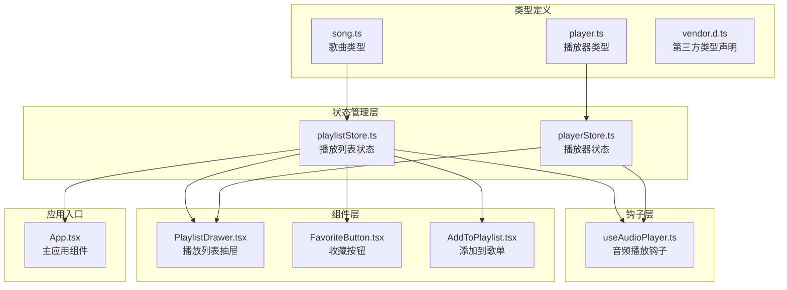

**图表来源**
- [playlistStore.ts](file://src/store/playlistStore.ts#L1-L88)
- [playerStore.ts](file://src/store/playerStore.ts#L1-L95)
- [song.ts](file://src/types/song.ts#L1-L14)
- [player.ts](file://src/types/player.ts#L1-L4)

**章节来源**
- [playlistStore.ts](file://src/store/playlistStore.ts#L1-L88)
- [playerStore.ts](file://src/store/playerStore.ts#L1-L95)
- [song.ts](file://src/types/song.ts#L1-L14)
- [player.ts](file://src/types/player.ts#L1-L4)

## 核心组件

### 播放列表状态接口设计

播放列表状态管理器定义了完整的状态接口，包括歌曲队列、收藏夹和用户歌单管理功能：

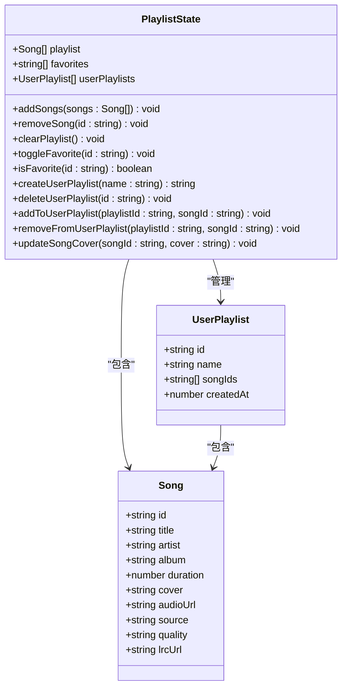

**图表来源**
- [playlistStore.ts](file://src/store/playlistStore.ts#L5-L27)
- [song.ts](file://src/types/song.ts#L1-L14)

### 数据持久化策略

播放列表状态通过 Zustand 的持久化中间件实现数据持久化，确保用户偏好和自定义数据在浏览器会话间保持：

- **持久化字段**：仅保存收藏夹和用户歌单，不保存当前播放列表
- **存储键名**：`music-player-playlist`
- **部分化策略**：只保存必要的用户数据，避免存储大量临时播放数据

**章节来源**
- [playlistStore.ts](file://src/store/playlistStore.ts#L29-L87)

## 架构概览

播放列表状态管理系统采用分层架构设计，各组件职责明确，相互协作：

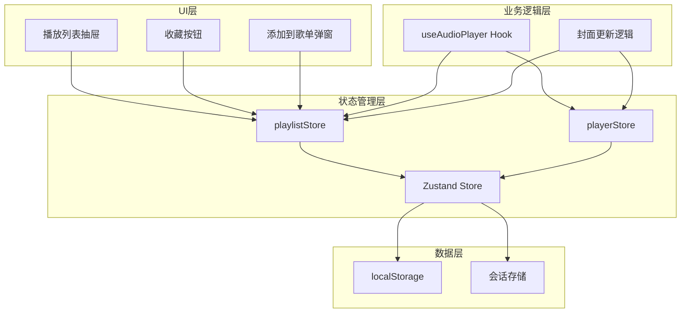

**图表来源**
- [playlistStore.ts](file://src/store/playlistStore.ts#L29-L87)
- [playerStore.ts](file://src/store/playerStore.ts#L42-L94)
- [useAudioPlayer.ts](file://src/hooks/useAudioPlayer.ts#L1-L131)

## 详细组件分析

### 播放列表队列管理

播放列表队列是音乐播放的核心数据结构，负责管理当前播放的歌曲序列。

#### 数据结构设计

播放列表采用简单的数组结构，每个元素都是完整的 Song 对象：

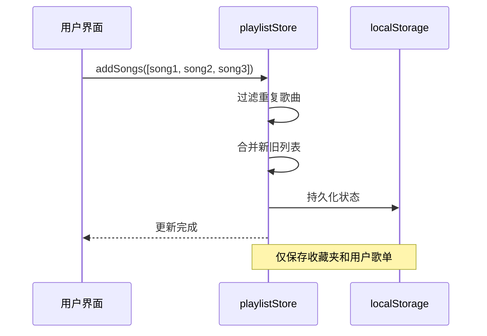

**图表来源**
- [playlistStore.ts](file://src/store/playlistStore.ts#L36-L38)

#### 队列操作实现

系统提供了完整的队列操作功能：

| 操作方法 | 功能描述 | 时间复杂度 | 实现要点 |
|---------|----------|------------|----------|
| `addSongs` | 添加歌曲到队列末尾 | O(n*m) | 使用过滤去重，n为新歌曲数，m为现有队列长度 |
| `removeSong` | 从队列中移除指定歌曲 | O(n) | 线性搜索匹配ID并过滤 |
| `clearPlaylist` | 清空整个播放列表 | O(1) | 直接设置为空数组 |
| `updateSongCover` | 更新歌曲封面信息 | O(n) | 遍历查找并替换匹配项 |

**章节来源**
- [playlistStore.ts](file://src/store/playlistStore.ts#L36-L42)
- [playlistStore.ts](file://src/store/playlistStore.ts#L73-L77)

### 用户歌单系统

用户歌单系统允许用户创建自定义播放列表，管理个人音乐收藏。

#### 歌单数据模型

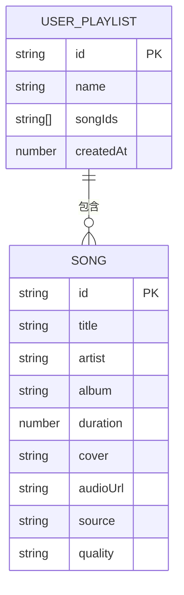

**图表来源**
- [playlistStore.ts](file://src/store/playlistStore.ts#L5-L10)
- [song.ts](file://src/types/song.ts#L1-L14)

#### 歌单管理功能

用户歌单系统提供了完整的 CRUD 操作：

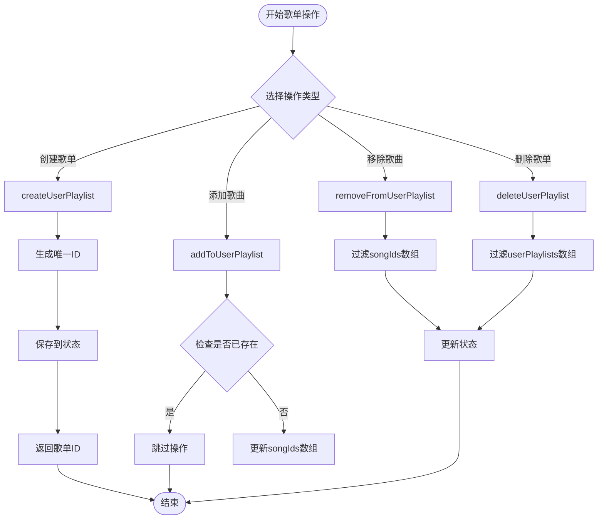

**图表来源**
- [playlistStore.ts](file://src/store/playlistStore.ts#L49-L72)

**章节来源**
- [playlistStore.ts](file://src/store/playlistStore.ts#L49-L72)

### 收藏系统实现

收藏系统为用户提供快速访问喜欢歌曲的功能，采用简单高效的字符串ID集合存储。

#### 收藏状态管理

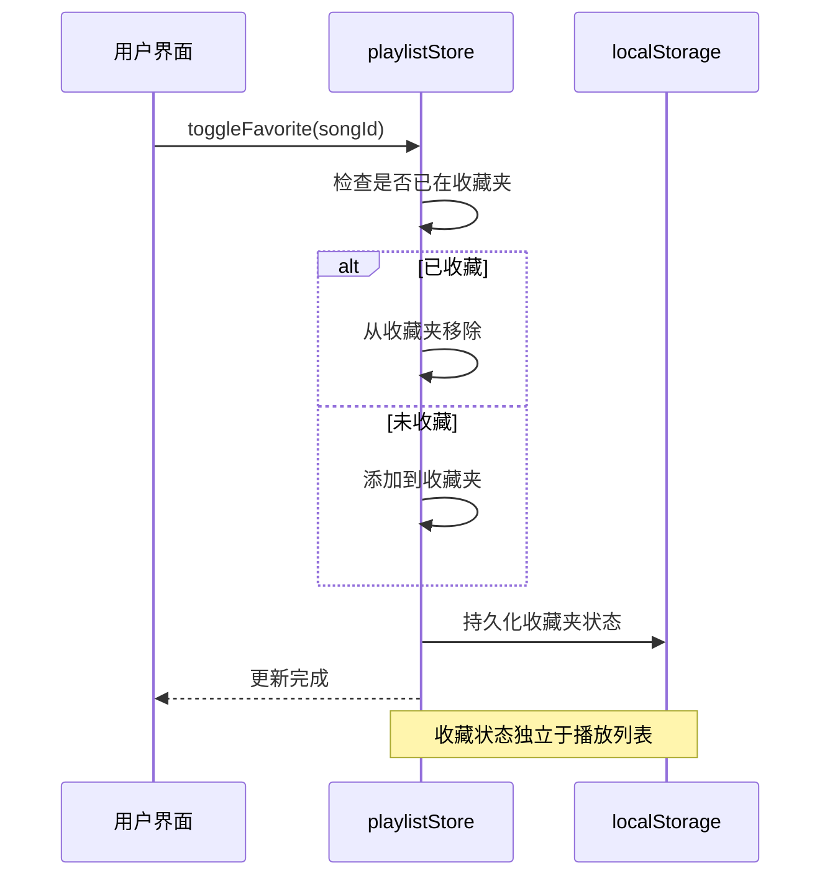

**图表来源**
- [playlistStore.ts](file://src/store/playlistStore.ts#L43-L47)

#### 收藏功能特性

- **状态维护**：使用字符串数组存储歌曲ID
- **快速查询**：通过 `includes()` 方法实现O(n)查找
- **状态同步**：与播放列表状态分离，独立持久化
- **UI反馈**：支持实时状态变化的组件更新

**章节来源**
- [playlistStore.ts](file://src/store/playlistStore.ts#L43-L48)

### 播放历史记录机制

虽然播放列表状态中没有专门的历史记录字段，但系统通过播放器状态与播放列表状态的协同工作实现了播放历史的跟踪。

#### 历史记录实现策略

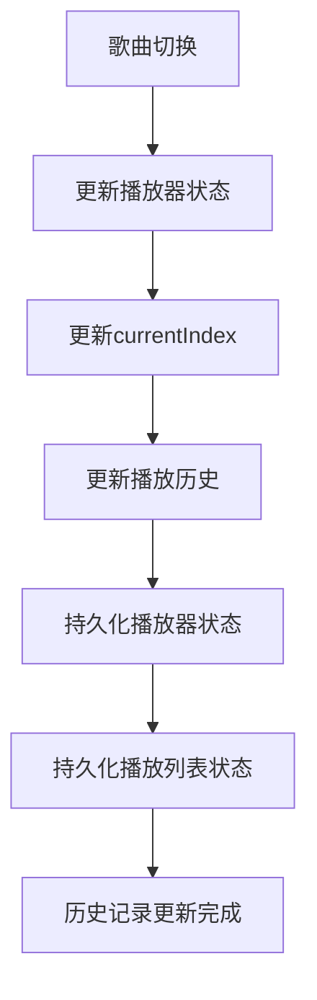

**图表来源**
- [useAudioPlayer.ts](file://src/hooks/useAudioPlayer.ts#L64-L75)
- [playerStore.ts](file://src/store/playerStore.ts#L65-L65)

**章节来源**
- [useAudioPlayer.ts](file://src/hooks/useAudioPlayer.ts#L47-L62)
- [playerStore.ts](file://src/store/playerStore.ts#L65-L65)

### 组件集成与使用

#### 播放列表抽屉组件

播放列表抽屉组件展示了完整的播放列表状态使用方式：

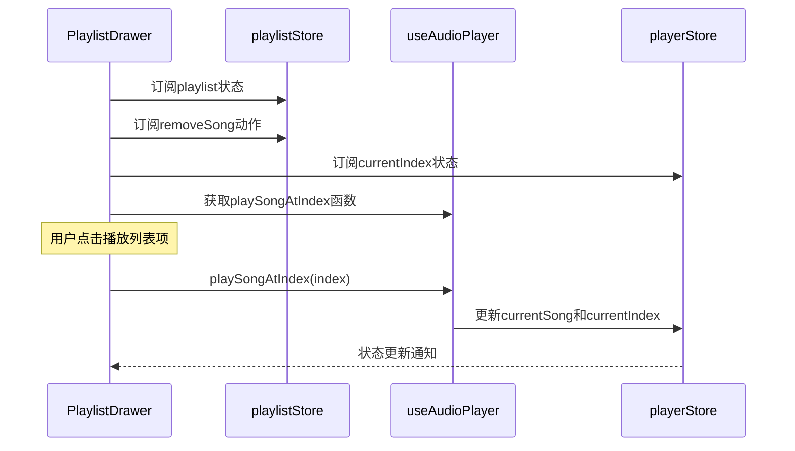

**图表来源**
- [PlaylistDrawer.tsx](file://src/components/Playlist/PlaylistDrawer.tsx#L6-L12)
- [useAudioPlayer.ts](file://src/hooks/useAudioPlayer.ts#L64-L75)

#### 收藏按钮组件

收藏按钮组件演示了收藏状态的双向绑定：

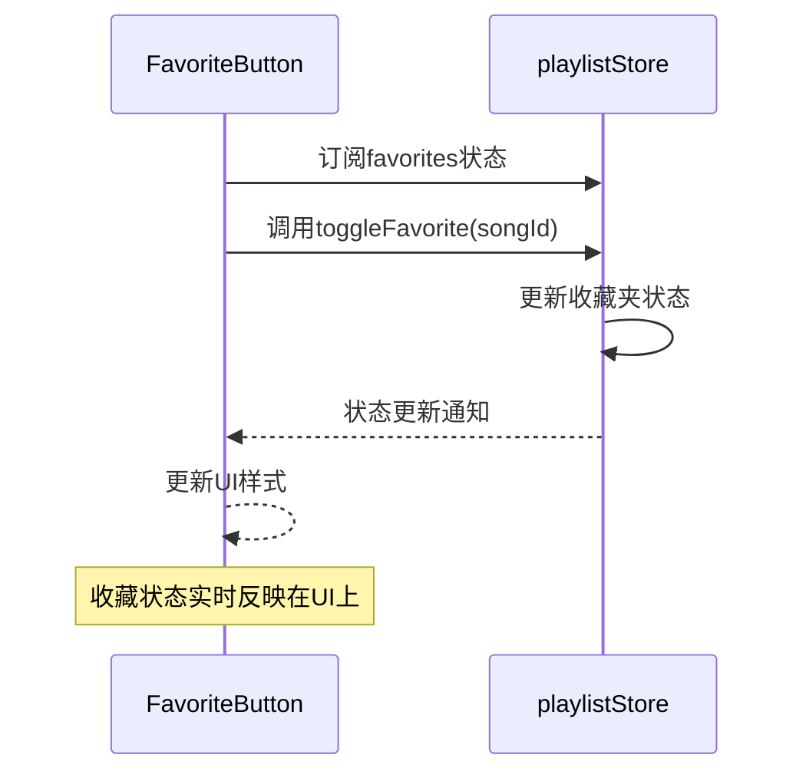

**图表来源**
- [FavoriteButton.tsx](file://src/components/SongInfo/FavoriteButton.tsx#L5-L8)

**章节来源**
- [PlaylistDrawer.tsx](file://src/components/Playlist/PlaylistDrawer.tsx#L6-L12)
- [FavoriteButton.tsx](file://src/components/SongInfo/FavoriteButton.tsx#L5-L8)

### 实际代码示例

#### 在组件中使用播放列表状态

以下是在React组件中正确使用播放列表状态的示例模式：

```typescript
// 基本状态订阅模式
const playlist = usePlaylistStore((state) => state.playlist)
const removeSong = usePlaylistStore((state) => state.removeSong)

// 动作函数调用
const handleRemoveSong = (songId: string) => {
  removeSong(songId)
}

// 批量操作示例
const addToPlaylist = (songs: Song[]) => {
  usePlaylistStore.getState().addSongs(songs)
}
```

**章节来源**
- [PlaylistDrawer.tsx](file://src/components/Playlist/PlaylistDrawer.tsx#L9-L10)
- [AddToPlaylist.tsx](file://src/components/Playlist/AddToPlaylist.tsx#L11-L13)

#### 播放列表与播放器状态的交互

播放列表状态与播放器状态之间存在紧密的协作关系：

```mermaid
graph LR
subgraph "播放列表状态"
PL[playlist: Song[]]
FAV[favorites: string[]]
UPL[userPlaylists: UserPlaylist[]]
end
subgraph "播放器状态"
CS[currentSong: Song]
CI[currentIndex: number]
LM[loopMode: LoopMode]
end
subgraph "交互关系"
PL --> CS
PL --> CI
PL --> LM
CS --> PL
CI --> PL
LM --> PL
end
```

**图表来源**
- [playlistStore.ts](file://src/store/playlistStore.ts#L12-L15)
- [playerStore.ts](file://src/store/playerStore.ts#L8-L22)

**章节来源**
- [useAudioPlayer.ts](file://src/hooks/useAudioPlayer.ts#L92-L114)
- [App.tsx](file://src/App.tsx#L38-L46)

## 依赖关系分析

播放列表状态管理系统与其他组件的依赖关系如下：

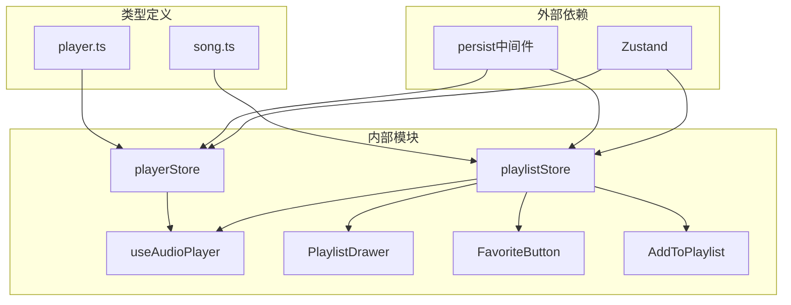

**图表来源**
- [playlistStore.ts](file://src/store/playlistStore.ts#L1-L3)
- [playerStore.ts](file://src/store/playerStore.ts#L1-L6)

### 组件耦合度分析

- **低耦合设计**：各组件通过状态订阅而非直接依赖实现松耦合
- **单一职责**：每个组件专注于特定功能，避免功能混杂
- **状态共享**：通过Zustand实现跨组件状态共享，减少props传递

**章节来源**
- [playlistStore.ts](file://src/store/playlistStore.ts#L29-L87)
- [playerStore.ts](file://src/store/playerStore.ts#L42-L94)

## 性能考虑

### 状态更新优化

播放列表状态管理采用了多项性能优化策略：

1. **选择性订阅**：组件只订阅需要的状态片段，减少不必要的重渲染
2. **批量更新**：使用状态函数模式进行批量状态更新
3. **去重算法**：在添加歌曲时自动过滤重复项，避免重复渲染

### 内存管理

- **状态清理**：播放列表状态不包含大型二进制数据，内存占用可控
- **持久化策略**：仅持久化必要的用户数据，避免存储临时播放信息
- **组件卸载**：React组件自动清理事件监听器和定时器

### 渲染性能

- **虚拟滚动**：播放列表抽屉使用虚拟滚动技术处理大量歌曲
- **条件渲染**：空状态和加载状态的条件渲染减少DOM节点数量
- **CSS动画**：使用硬件加速的CSS动画提升用户体验

## 故障排除指南

### 常见问题及解决方案

#### 播放列表不更新

**问题现象**：添加歌曲后播放列表不显示新歌曲

**可能原因**：
1. 歌曲ID重复导致被过滤
2. 状态订阅不正确
3. 组件未重新渲染

**解决方法**：
```typescript
// 确保正确订阅状态
const playlist = usePlaylistStore((state) => state.playlist)

// 检查歌曲ID是否唯一
const uniqueSongs = songs.filter((song, index) => 
  songs.findIndex(s => s.id === song.id) === index
)
```

#### 收藏状态不同步

**问题现象**：收藏按钮状态与实际收藏状态不一致

**解决方法**：
```typescript
// 使用状态函数确保获取最新状态
const isFavorite = usePlaylistStore((state) => state.isFavorite(songId))
```

#### 歌单操作失败

**问题现象**：添加歌曲到歌单或从歌单移除失败

**解决方法**：
```typescript
// 检查歌单是否存在
const userPlaylists = usePlaylistStore.getState().userPlaylists
const playlistExists = userPlaylists.some(p => p.id === playlistId)

if (playlistExists) {
  addToUserPlaylist(playlistId, songId)
}
```

**章节来源**
- [playlistStore.ts](file://src/store/playlistStore.ts#L36-L38)
- [playlistStore.ts](file://src/store/playlistStore.ts#L60-L64)

## 结论

My Music 2026 的播放列表状态管理系统展现了现代前端应用的最佳实践：

### 设计优势

1. **清晰的职责分离**：播放列表、播放器、收藏等状态各自独立管理
2. **高效的性能表现**：通过选择性订阅和批量更新优化渲染性能
3. **良好的扩展性**：模块化的状态设计便于功能扩展和维护
4. **完善的用户体验**：实时状态更新和持久化存储确保用户数据安全

### 技术亮点

- **Zustand 状态管理**：轻量级且高性能的状态管理方案
- **TypeScript 类型安全**：完整的类型定义确保开发时的类型安全
- **React Hooks 集成**：与 React 生态系统无缝集成
- **持久化存储**：智能的数据持久化策略平衡性能和用户体验

### 改进建议

1. **播放历史记录**：可以考虑添加专门的历史记录状态管理
2. **搜索功能**：为播放列表和歌单添加搜索和过滤功能
3. **导入导出**：支持歌单的导入导出功能
4. **云同步**：实现多设备间的播放列表同步

该播放列表状态管理系统为 My Music 2026 提供了稳定可靠的基础，为用户提供了流畅的音乐播放体验。