# 播放器状态管理

<cite>
**本文档引用的文件**
- [playerStore.ts](file://src/store/playerStore.ts)
- [player.ts](file://src/types/player.ts)
- [song.ts](file://src/types/song.ts)
- [lyric.ts](file://src/types/lyric.ts)
- [types.ts](file://src/api/types.ts)
- [useAudioPlayer.ts](file://src/hooks/useAudioPlayer.ts)
- [useLyricFetch.ts](file://src/hooks/useLyricFetch.ts)
- [useLyricSync.ts](file://src/hooks/useLyricSync.ts)
- [LyricParser.ts](file://src/core/LyricParser.ts)
- [PlayButton.tsx](file://src/components/Controls/PlayButton.tsx)
- [ProgressBar.tsx](file://src/components/Controls/ProgressBar.tsx)
- [VolumeControl.tsx](file://src/components/Controls/VolumeControl.tsx)
- [LoopModeButton.tsx](file://src/components/Controls/LoopModeButton.tsx)
- [PlaylistDrawer.tsx](file://src/components/Playlist/PlaylistDrawer.tsx)
</cite>

## 目录
1. [简介](#简介)
2. [项目结构](#项目结构)
3. [核心组件](#核心组件)
4. [架构概览](#架构概览)
5. [详细组件分析](#详细组件分析)
6. [依赖关系分析](#依赖关系分析)
7. [性能考虑](#性能考虑)
8. [故障排除指南](#故障排除指南)
9. [结论](#结论)

## 简介

My Music 2026 的播放器状态管理系统基于 Zustand 库构建，采用现代 React 状态管理模式。该系统通过单一状态源管理所有播放器相关的状态，包括播放控制、音频参数、歌词显示和播放列表等。系统设计遵循以下核心原则：

- **单一真相源**：所有播放器状态集中在一个 store 中
- **不可变性**：状态更新通过纯函数进行
- **持久化存储**：关键配置状态自动保存到浏览器存储
- **模块化设计**：状态管理与 UI 组件解耦

## 项目结构

播放器状态管理相关的文件组织结构如下：

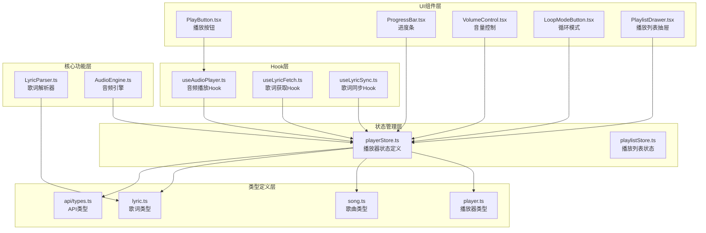

**图表来源**
- [playerStore.ts](file://src/store/playerStore.ts#L1-L95)
- [useAudioPlayer.ts](file://src/hooks/useAudioPlayer.ts#L1-L131)

**章节来源**
- [playerStore.ts](file://src/store/playerStore.ts#L1-L95)
- [player.ts](file://src/types/player.ts#L1-L4)

## 核心组件

### 播放器状态接口定义

播放器状态管理器定义了完整的状态接口，包含以下主要状态字段：

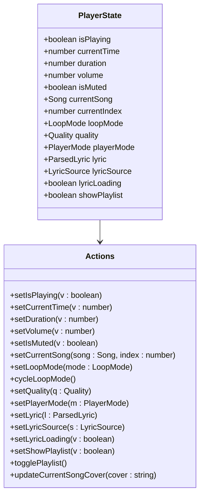

**图表来源**
- [playerStore.ts](file://src/store/playerStore.ts#L8-L40)

### 状态初始化配置

系统提供了完整的默认状态初始化，确保应用启动时具备合理的初始值：

| 状态字段 | 默认值 | 类型 | 描述 |
|---------|--------|------|------|
| isPlaying | false | boolean | 播放状态标志 |
| currentTime | 0 | number | 当前播放时间（秒） |
| duration | 0 | number | 歌曲总时长（秒） |
| volume | 0.7 | number | 音量级别（0-1） |
| isMuted | false | boolean | 静音状态 |
| currentSong | null | Song \| null | 当前播放歌曲 |
| currentIndex | -1 | number | 当前歌曲在播放列表中的索引 |
| loopMode | 'list' | LoopMode | 循环模式 |
| quality | 'high' | Quality | 音质设置 |
| playerMode | 'fullscreen' | PlayerMode | 播放器模式 |
| lyric | null | ParsedLyric \| null | 解析后的歌词数据 |
| lyricSource | null | LyricSource | 歌词来源标识 |
| lyricLoading | false | boolean | 歌词加载状态 |
| showPlaylist | false | boolean | 播放列表显示状态 |

**章节来源**
- [playerStore.ts](file://src/store/playerStore.ts#L42-L58)

## 架构概览

播放器状态管理系统采用分层架构设计，各层职责明确：

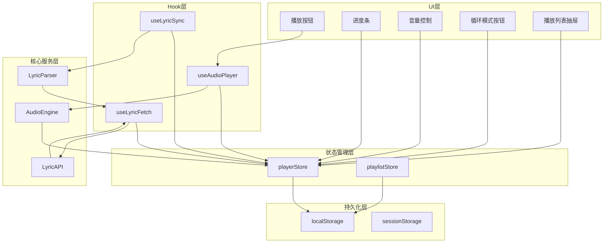

**图表来源**
- [playerStore.ts](file://src/store/playerStore.ts#L42-L94)
- [useAudioPlayer.ts](file://src/hooks/useAudioPlayer.ts#L6-L130)

## 详细组件分析

### 播放器状态管理器

#### 状态字段详解

**播放控制状态**
- `isPlaying`: 控制播放/暂停状态，直接影响音频引擎的播放状态
- `currentTime`: 实时播放进度，由音频引擎事件驱动更新
- `duration`: 歌曲总时长，通过音频引擎的 durationchange 事件更新

**音频参数状态**
- `volume`: 音量控制，范围 0-1，支持实时调整
- `isMuted`: 静音状态，与音量控制协同工作

**歌曲信息状态**
- `currentSong`: 当前播放歌曲对象，包含完整歌曲元数据
- `currentIndex`: 当前歌曲在播放列表中的位置索引

**播放模式状态**
- `loopMode`: 循环模式，支持列表循环、单曲循环、随机播放三种模式
- `quality`: 音质设置，支持标准、高、极致三个质量等级
- `playerMode`: 播放器界面模式，支持全屏和迷你两种模式

**歌词状态**
- `lyric`: 解析后的歌词数据结构
- `lyricSource`: 歌词来源标识（本地、API或空）
- `lyricLoading`: 歌词加载状态指示

**界面状态**
- `showPlaylist`: 播放列表抽屉显示状态

#### 状态更新机制

**直接状态更新**
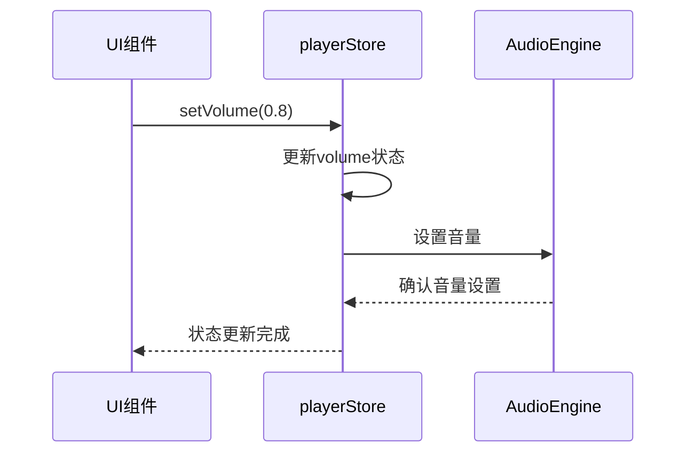

**复合状态更新**
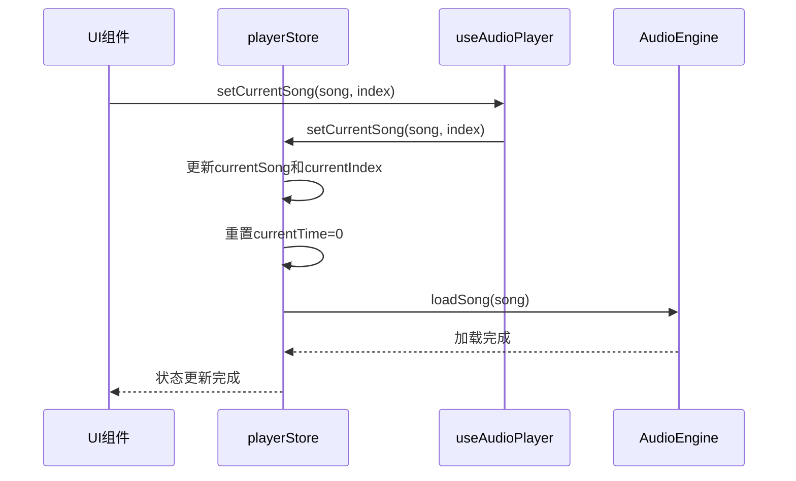

**章节来源**
- [playerStore.ts](file://src/store/playerStore.ts#L24-L81)

### 音频播放集成

#### 音频引擎事件绑定

音频引擎通过事件系统与播放器状态进行双向通信：

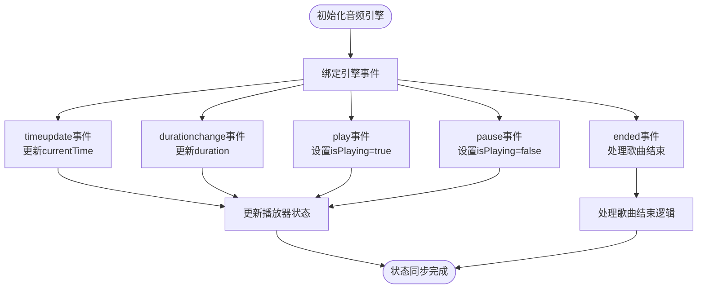

**图表来源**
- [useAudioPlayer.ts](file://src/hooks/useAudioPlayer.ts#L15-L36)

#### 播放控制流程

播放器提供了完整的播放控制功能，包括播放/暂停、下一首、上一首、跳转播放等功能：

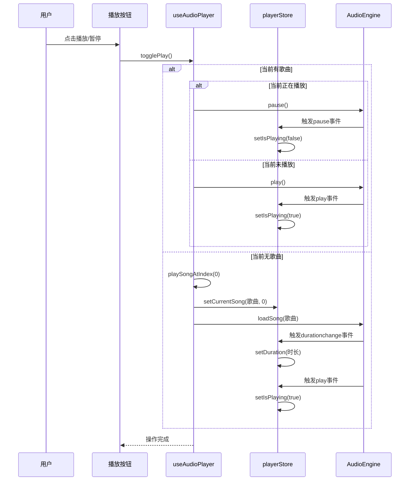

**图表来源**
- [useAudioPlayer.ts](file://src/hooks/useAudioPlayer.ts#L77-L90)

**章节来源**
- [useAudioPlayer.ts](file://src/hooks/useAudioPlayer.ts#L1-L131)

### 歌词系统集成

#### 歌词获取流程

歌词系统实现了智能获取机制，支持本地歌词和API歌词的自动切换：

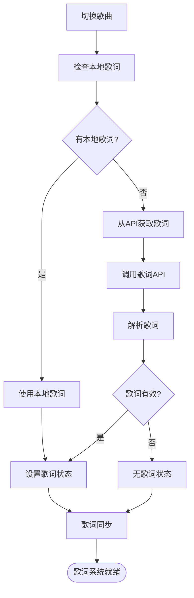

**图表来源**
- [useLyricFetch.ts](file://src/hooks/useLyricFetch.ts#L65-L79)
- [LyricParser.ts](file://src/core/LyricParser.ts#L18-L81)

#### 歌词同步机制

歌词同步系统根据播放进度实时更新当前歌词行：

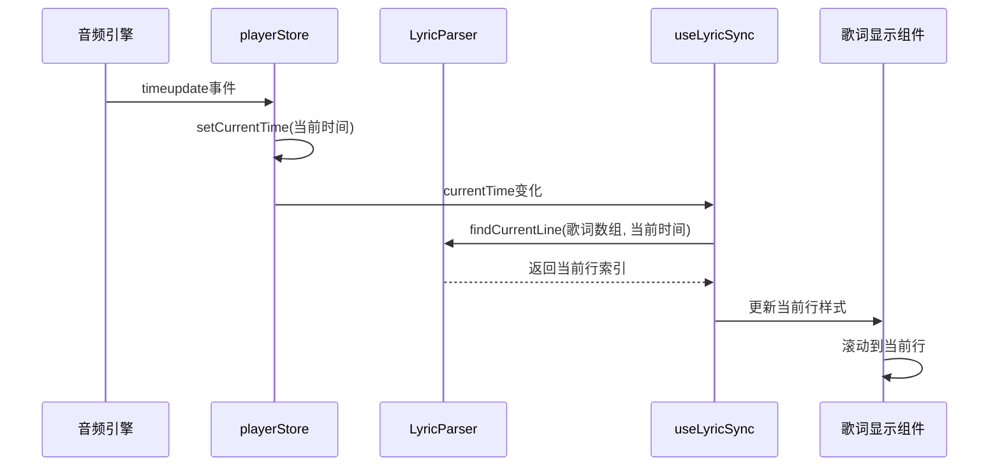

**图表来源**
- [useLyricSync.ts](file://src/hooks/useLyricSync.ts#L11-L29)

**章节来源**
- [useLyricFetch.ts](file://src/hooks/useLyricFetch.ts#L1-L95)
- [useLyricSync.ts](file://src/hooks/useLyricSync.ts#L1-L33)
- [LyricParser.ts](file://src/core/LyricParser.ts#L83-L100)

### UI组件集成

#### 播放控制组件

**播放按钮组件**
播放按钮组件通过 useAudioPlayer Hook 获取播放状态和控制函数：

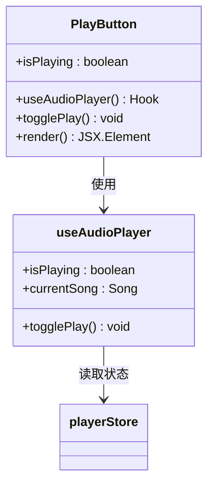

**图表来源**
- [PlayButton.tsx](file://src/components/Controls/PlayButton.tsx#L4-L16)
- [useAudioPlayer.ts](file://src/hooks/useAudioPlayer.ts#L6-L130)

**进度条组件**
进度条组件实现了拖拽跳转功能，支持实时预览和精确跳转：

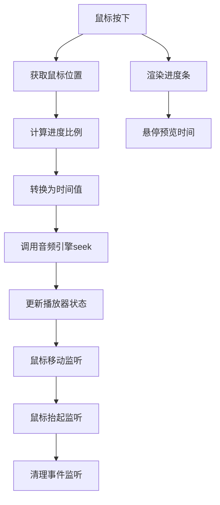

**图表来源**
- [ProgressBar.tsx](file://src/components/Controls/ProgressBar.tsx#L14-L37)

**音量控制组件**
音量控制组件提供了直观的音量调节界面：

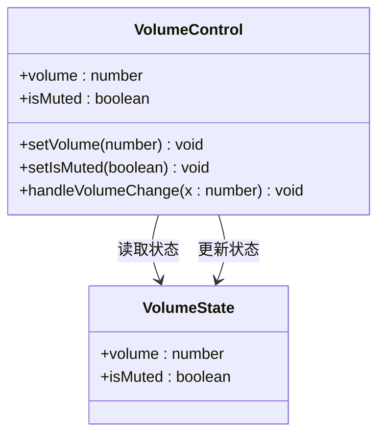

**图表来源**
- [VolumeControl.tsx](file://src/components/Controls/VolumeControl.tsx#L5-L21)

**章节来源**
- [PlayButton.tsx](file://src/components/Controls/PlayButton.tsx#L1-L17)
- [ProgressBar.tsx](file://src/components/Controls/ProgressBar.tsx#L1-L83)
- [VolumeControl.tsx](file://src/components/Controls/VolumeControl.tsx#L1-L59)

## 依赖关系分析

### 状态依赖图

播放器状态之间存在复杂的依赖关系，需要特别注意状态更新的顺序和一致性：

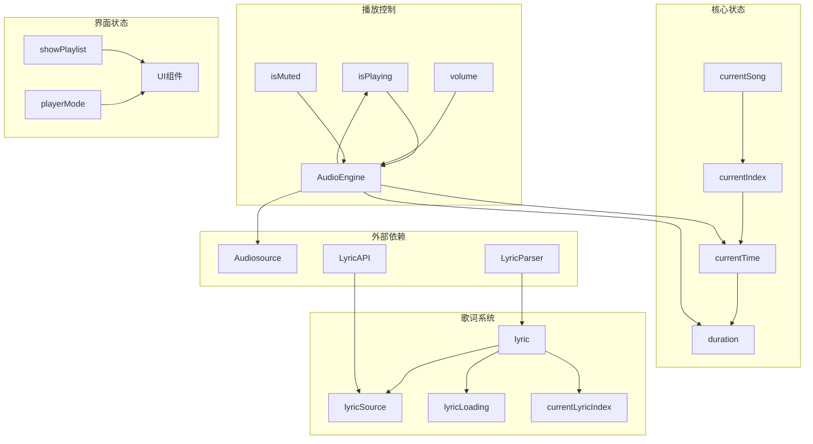

**图表来源**
- [playerStore.ts](file://src/store/playerStore.ts#L8-L40)
- [useAudioPlayer.ts](file://src/hooks/useAudioPlayer.ts#L6-L130)

### 状态更新同步机制

系统通过多种机制确保状态更新的一致性和可靠性：

**事件驱动更新**
- 音频引擎事件触发的状态更新
- 用户交互事件触发的状态更新

**批量状态更新**
- setCurrentSong 同时更新多个相关状态
- cycleLoopMode 原子性地切换循环模式

**状态验证**
- 索引边界检查
- 播放列表有效性验证
- 歌词数据完整性检查

**章节来源**
- [playerStore.ts](file://src/store/playerStore.ts#L65-L71)
- [useAudioPlayer.ts](file://src/hooks/useAudioPlayer.ts#L47-L62)

## 性能考虑

### 状态持久化策略

系统采用部分化持久化策略，只保存必要的配置状态：

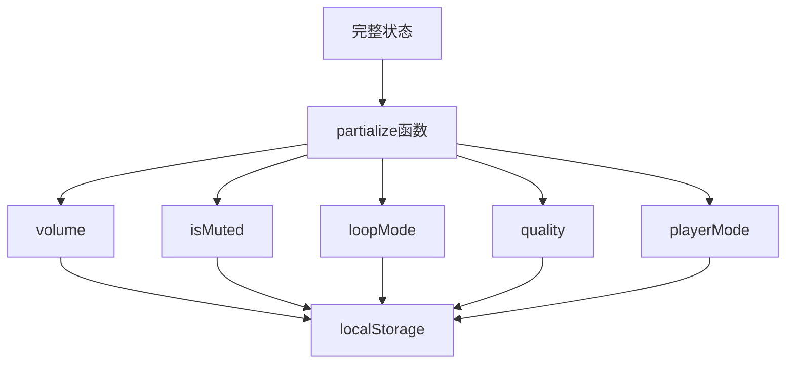

**图表来源**
- [playerStore.ts](file://src/store/playerStore.ts#L83-L92)

### 性能优化措施

**状态订阅优化**
- 使用选择器函数减少不必要的组件重渲染
- 合理拆分状态以避免全局状态变更

**异步操作优化**
- 歌词获取防抖机制
- 音频加载异步处理
- 内存泄漏防护

**渲染性能优化**
- 进度条拖拽事件节流
- 歌词滚动动画优化
- 图片资源懒加载

## 故障排除指南

### 常见问题及解决方案

**播放器无法启动**
- 检查浏览器自动播放策略
- 确认用户交互后才调用播放方法
- 验证音频源 URL 可访问性

**进度条不更新**
- 确认音频引擎事件绑定正常
- 检查 timeupdate 事件是否触发
- 验证状态更新函数调用链

**歌词显示异常**
- 检查歌词解析器是否正确处理时间戳
- 确认歌词数据格式符合预期
- 验证歌词同步算法正确性

**状态不同步**
- 检查状态更新函数的调用时机
- 确认事件监听器的生命周期管理
- 验证状态持久化机制正常工作

**章节来源**
- [useAudioPlayer.ts](file://src/hooks/useAudioPlayer.ts#L72-L75)
- [useLyricFetch.ts](file://src/hooks/useLyricFetch.ts#L27-L35)

## 结论

My Music 2026 的播放器状态管理系统展现了现代前端状态管理的最佳实践。通过精心设计的状态结构、完善的事件驱动机制和智能的持久化策略，系统实现了可靠的播放器功能。

**主要优势**：
- **模块化设计**：清晰的分层架构便于维护和扩展
- **事件驱动**：实时响应音频引擎状态变化
- **智能持久化**：只保存必要配置，提升性能
- **类型安全**：完整的 TypeScript 类型定义
- **用户体验**：流畅的交互和响应式设计

**改进建议**：
- 添加状态快照和撤销功能
- 实现更精细的状态订阅粒度
- 增加状态变更日志和调试工具
- 优化大量播放列表的性能表现

该系统为音乐播放器应用提供了一个坚实的技术基础，能够支持复杂的功能需求和良好的用户体验。