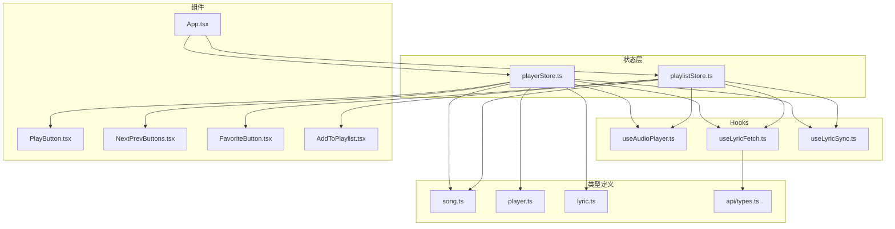
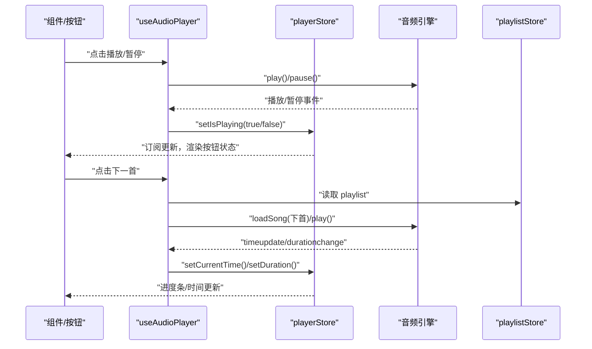
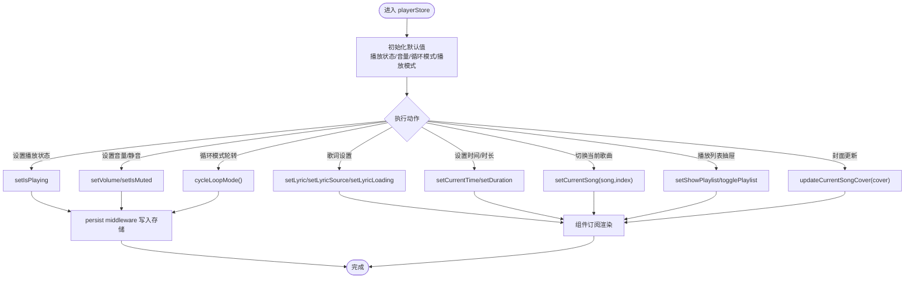
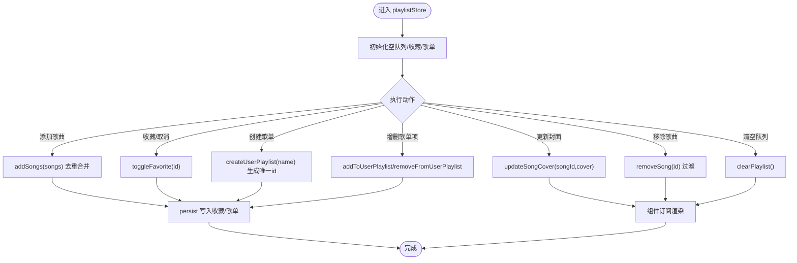
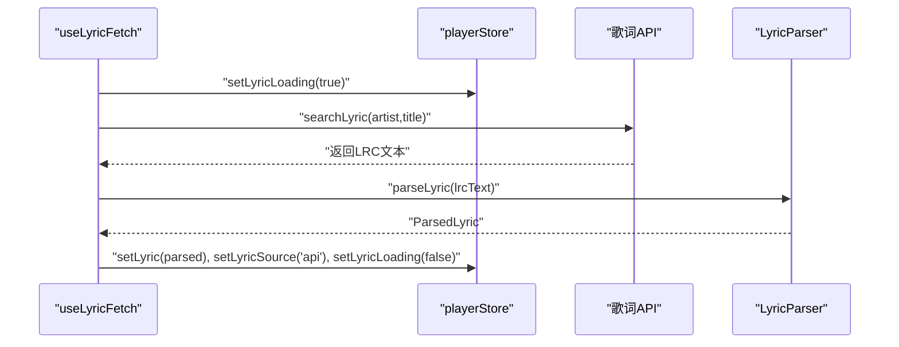
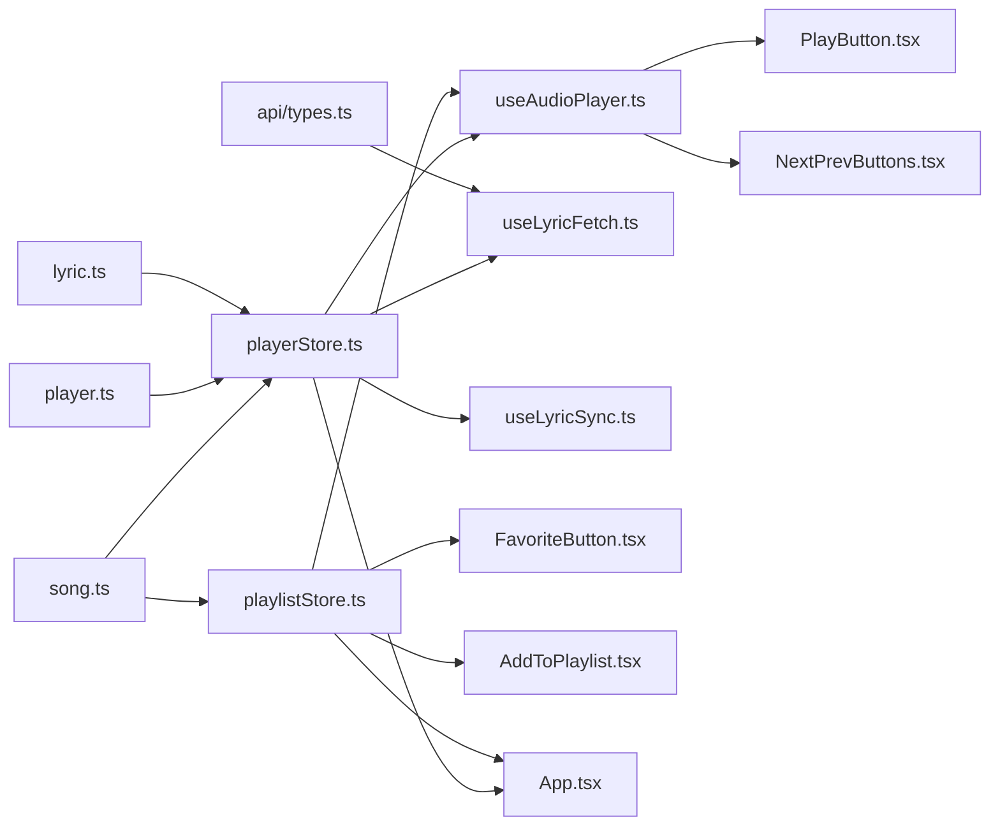

# 状态管理架构

<cite>
**本文引用的文件**
- [src/store/playerStore.ts](file://src/store/playerStore.ts)
- [src/store/playlistStore.ts](file://src/store/playlistStore.ts)
- [src/types/player.ts](file://src/types/player.ts)
- [src/types/song.ts](file://src/types/song.ts)
- [src/types/lyric.ts](file://src/types/lyric.ts)
- [src/types/vendor.d.ts](file://src/types/vendor.d.ts)
- [src/api/types.ts](file://src/api/types.ts)
- [src/hooks/useAudioPlayer.ts](file://src/hooks/useAudioPlayer.ts)
- [src/hooks/useLyricFetch.ts](file://src/hooks/useLyricFetch.ts)
- [src/hooks/useLyricSync.ts](file://src/hooks/useLyricSync.ts)
- [src/components/Controls/PlayButton.tsx](file://src/components/Controls/PlayButton.tsx)
- [src/components/Controls/NextPrevButtons.tsx](file://src/components/Controls/NextPrevButtons.tsx)
- [src/components/SongInfo/FavoriteButton.tsx](file://src/components/SongInfo/FavoriteButton.tsx)
- [src/components/Playlist/AddToPlaylist.tsx](file://src/components/Playlist/AddToPlaylist.tsx)
- [src/App.tsx](file://src/App.tsx)
</cite>

## 目录
1. [引言](#引言)
2. [项目结构](#项目结构)
3. [核心组件](#核心组件)
4. [架构总览](#架构总览)
5. [详细组件分析](#详细组件分析)
6. [依赖关系分析](#依赖关系分析)
7. [性能考虑](#性能考虑)
8. [故障排查指南](#故障排查指南)
9. [结论](#结论)
10. [附录](#附录)

## 引言
本文件系统性梳理 My Music 2026 的状态管理架构，重点围绕 Zustand 的设计理念与实现细节展开，覆盖以下主题：
- store 的创建、状态更新与订阅机制
- playerStore.ts 中播放器状态设计：播放状态、歌曲信息、歌词数据、播放模式
- playlistStore.ts 中播放列表状态管理：歌曲队列、用户歌单、收藏功能
- 状态之间的依赖关系与同步机制
- 状态持久化策略、性能优化与最佳实践
- 状态流转图与数据流示意图

## 项目结构
My Music 2026 的状态层位于 src/store 目录，采用“按域分层”的组织方式：
- playerStore.ts：播放器全局状态
- playlistStore.ts：播放列表与收藏等用户数据
- 类型定义位于 src/types：Song、PlayerMode、Lyric 等
- Hooks 层 src/hooks：封装与状态层交互的业务逻辑（如 useAudioPlayer、useLyricFetch、useLyricSync）
- 组件层 src/components：UI 组件通过 hooks 订阅状态并触发动作

图表来源
- [src/store/playerStore.ts](file://src/store/playerStore.ts#L1-L95)
- [src/store/playlistStore.ts](file://src/store/playlistStore.ts#L1-L88)
- [src/types/player.ts](file://src/types/player.ts#L1-L4)
- [src/types/song.ts](file://src/types/song.ts#L1-L14)
- [src/types/lyric.ts](file://src/types/lyric.ts#L1-L21)
- [src/api/types.ts](file://src/api/types.ts#L1-L26)
- [src/hooks/useAudioPlayer.ts](file://src/hooks/useAudioPlayer.ts#L1-L131)
- [src/hooks/useLyricFetch.ts](file://src/hooks/useLyricFetch.ts#L1-L95)
- [src/hooks/useLyricSync.ts](file://src/hooks/useLyricSync.ts#L1-L33)
- [src/components/Controls/PlayButton.tsx](file://src/components/Controls/PlayButton.tsx#L1-L17)
- [src/components/Controls/NextPrevButtons.tsx](file://src/components/Controls/NextPrevButtons.tsx#L1-L55)
- [src/components/SongInfo/FavoriteButton.tsx](file://src/components/SongInfo/FavoriteButton.tsx#L1-L30)
- [src/components/Playlist/AddToPlaylist.tsx](file://src/components/Playlist/AddToPlaylist.tsx#L1-L131)
- [src/App.tsx](file://src/App.tsx#L1-L98)

章节来源
- [src/store/playerStore.ts](file://src/store/playerStore.ts#L1-L95)
- [src/store/playlistStore.ts](file://src/store/playlistStore.ts#L1-L88)
- [src/types/player.ts](file://src/types/player.ts#L1-L4)
- [src/types/song.ts](file://src/types/song.ts#L1-L14)
- [src/types/lyric.ts](file://src/types/lyric.ts#L1-L21)
- [src/api/types.ts](file://src/api/types.ts#L1-L26)
- [src/hooks/useAudioPlayer.ts](file://src/hooks/useAudioPlayer.ts#L1-L131)
- [src/hooks/useLyricFetch.ts](file://src/hooks/useLyricFetch.ts#L1-L95)
- [src/hooks/useLyricSync.ts](file://src/hooks/useLyricSync.ts#L1-L33)
- [src/components/Controls/PlayButton.tsx](file://src/components/Controls/PlayButton.tsx#L1-L17)
- [src/components/Controls/NextPrevButtons.tsx](file://src/components/Controls/NextPrevButtons.tsx#L1-L55)
- [src/components/SongInfo/FavoriteButton.tsx](file://src/components/SongInfo/FavoriteButton.tsx#L1-L30)
- [src/components/Playlist/AddToPlaylist.tsx](file://src/components/Playlist/AddToPlaylist.tsx#L1-L131)
- [src/App.tsx](file://src/App.tsx#L1-L98)

## 核心组件
本节聚焦两个核心 store 的职责边界与接口设计。

- playerStore.ts
  - 职责：统一管理播放器运行时状态，包括播放控制、进度、音量、歌词、播放模式、当前歌曲索引与播放列表可见性等
  - 关键字段：播放状态、当前时间、时长、音量、静音、当前歌曲与索引、循环模式、音质、播放模式、歌词对象与来源、歌词加载状态、播放列表抽屉显隐
  - 关键方法：设置播放状态、时间、时长、音量、静音；切换当前歌曲与索引；循环模式轮转；设置音质与播放模式；歌词设置、来源与加载状态；播放列表抽屉显隐控制；更新当前歌曲封面
  - 持久化：仅持久化播放器设置类字段（音量、静音、循环模式、音质、播放模式），不持久化播放列表与歌词，避免污染用户数据

- playlistStore.ts
  - 职责：管理播放队列、用户歌单与收藏夹
  - 关键字段：播放队列（Song[]）、收藏歌曲 ID 列表、用户歌单集合（含 id、name、songIds、创建时间）
  - 关键方法：批量添加歌曲、移除歌曲、清空队列；收藏/取消收藏；创建/删除用户歌单；向歌单添加/移除歌曲；更新歌曲封面
  - 持久化：持久化收藏与用户歌单，不持久化播放队列，保证每次会话独立的播放体验

章节来源
- [src/store/playerStore.ts](file://src/store/playerStore.ts#L8-L40)
- [src/store/playerStore.ts](file://src/store/playerStore.ts#L42-L94)
- [src/store/playlistStore.ts](file://src/store/playlistStore.ts#L12-L27)
- [src/store/playlistStore.ts](file://src/store/playlistStore.ts#L29-L87)

## 架构总览
Zustand 在本项目中采用“函数式 store + middleware”的模式：
- 使用 create 定义 store，内部通过 set/get 实现状态更新与读取
- 使用 persist middleware 实现状态持久化，分别配置存储键名与持久化字段集
- Hooks 作为状态与 UI 的桥梁，负责：
  - 与音频引擎对接（播放、暂停、seek、时长变化等）
  - 与歌词服务对接（拉取、解析、同步）
  - 与 UI 组件协作（按钮点击、抽屉显隐、封面更新）

图表来源
- [src/hooks/useAudioPlayer.ts](file://src/hooks/useAudioPlayer.ts#L1-L131)
- [src/store/playerStore.ts](file://src/store/playerStore.ts#L42-L94)
- [src/store/playlistStore.ts](file://src/store/playlistStore.ts#L29-L87)

## 详细组件分析

### playerStore.ts：播放器状态设计
- 数据模型
  - 播放状态：isPlaying、currentTime、duration、volume、isMuted
  - 当前曲目：currentSong（Song | null）、currentIndex（数字）
  - 播放控制：loopMode（循环模式）、quality（音质）、playerMode（全屏/迷你）、showPlaylist（播放列表抽屉）
  - 歌词：lyric（ParsedLyric | null）、lyricSource（歌词来源）、lyricLoading（加载中）
- 更新机制
  - 基于 set 的原子更新，部分复杂逻辑使用 set((state) => ...) 返回新对象
  - 提供循环模式轮转与播放列表抽屉显隐的复合操作
- 订阅机制
  - 组件通过 usePlayerStore(selector) 订阅所需字段，减少重渲染
- 持久化策略
  - 仅持久化播放器设置类字段，避免持久化播放队列与歌词，降低耦合与隐私风险

图表来源
- [src/store/playerStore.ts](file://src/store/playerStore.ts#L42-L94)
- [src/types/player.ts](file://src/types/player.ts#L1-L4)
- [src/types/song.ts](file://src/types/song.ts#L1-L14)
- [src/types/lyric.ts](file://src/types/lyric.ts#L1-L21)

章节来源
- [src/store/playerStore.ts](file://src/store/playerStore.ts#L8-L40)
- [src/store/playerStore.ts](file://src/store/playerStore.ts#L42-L94)
- [src/types/player.ts](file://src/types/player.ts#L1-L4)
- [src/types/song.ts](file://src/types/song.ts#L1-L14)
- [src/types/lyric.ts](file://src/types/lyric.ts#L1-L21)

### playlistStore.ts：播放列表与收藏
- 数据模型
  - playlist：Song[]，去重追加
  - favorites：string[]，歌曲 ID 集合
  - userPlaylists：UserPlaylist[]，包含 id、name、songIds、createdAt
- 更新机制
  - addSongs：去重合并
  - removeSong：按 id 过滤
  - clearPlaylist：清空队列
  - toggleFavorite：存在即移除，否则新增
  - createUserPlaylist：生成唯一 id 并创建歌单
  - addToUserPlaylist/removeFromUserPlaylist：对指定歌单增删
  - updateSongCover：更新队列内歌曲封面
- 订阅机制
  - 组件通过 usePlaylistStore(selector) 订阅 favorites、userPlaylists 等字段
- 持久化策略
  - 持久化 favorites 与 userPlaylists，不持久化 playlist，确保会话隔离

图表来源
- [src/store/playlistStore.ts](file://src/store/playlistStore.ts#L29-L87)

章节来源
- [src/store/playlistStore.ts](file://src/store/playlistStore.ts#L5-L27)
- [src/store/playlistStore.ts](file://src/store/playlistStore.ts#L29-L87)

### Hooks 与状态联动
- useAudioPlayer.ts
  - 订阅 playerStore 的播放状态与当前歌曲，订阅 playlistStore 的播放队列
  - 监听音频引擎事件（timeupdate/durationchange/play/pause/ended），驱动 playerStore 状态更新
  - 实现播放/暂停、上一首/下一首、seek、根据循环模式处理切歌逻辑
- useLyricFetch.ts
  - 通过 playerStore 设置歌词、来源与加载状态
  - 防抖与竞态控制：使用 fetchIdRef 避免快速切歌导致的请求竞态
  - 自动获取：若无本地歌词则自动从 API 获取
- useLyricSync.ts
  - 基于当前时间与歌词行数组计算当前高亮行，并滚动至居中位置

图表来源
- [src/hooks/useLyricFetch.ts](file://src/hooks/useLyricFetch.ts#L12-L94)
- [src/store/playerStore.ts](file://src/store/playerStore.ts#L34-L36)

章节来源
- [src/hooks/useAudioPlayer.ts](file://src/hooks/useAudioPlayer.ts#L6-L129)
- [src/hooks/useLyricFetch.ts](file://src/hooks/useLyricFetch.ts#L12-L94)
- [src/hooks/useLyricSync.ts](file://src/hooks/useLyricSync.ts#L5-L32)

### 组件与状态的绑定
- 控制按钮
  - PlayButton.tsx：订阅 isPlaying，调用 useAudioPlayer().togglePlay
  - NextPrevButtons.tsx：订阅 prevSong/nextSong
- 收藏与歌单
  - FavoriteButton.tsx：订阅 favorites 与 toggleFavorite
  - AddToPlaylist.tsx：订阅 userPlaylists、createUserPlaylist、addToUserPlaylist
- App.tsx
  - 订阅 currentSong、playerMode、playlist，处理封面颜色提取与缺失封面时的自动补全

章节来源
- [src/components/Controls/PlayButton.tsx](file://src/components/Controls/PlayButton.tsx#L4-L15)
- [src/components/Controls/NextPrevButtons.tsx](file://src/components/Controls/NextPrevButtons.tsx#L9-L52)
- [src/components/SongInfo/FavoriteButton.tsx](file://src/components/SongInfo/FavoriteButton.tsx#L5-L27)
- [src/components/Playlist/AddToPlaylist.tsx](file://src/components/Playlist/AddToPlaylist.tsx#L10-L44)
- [src/App.tsx](file://src/App.tsx#L15-L46)

## 依赖关系分析
- 类型依赖
  - playerStore.ts 依赖 Song、LoopMode、Quality、PlayerMode、ParsedLyric、LyricSource
  - playlistStore.ts 依赖 Song
  - useLyricFetch.ts 依赖 LyricApiResponse、LyricFetchStatus、LyricCacheEntry
- 运行时依赖
  - useAudioPlayer.ts 依赖音频引擎与两个 store
  - useLyricFetch.ts 依赖歌词 API 与歌词解析器
  - useLyricSync.ts 依赖歌词解析器的行定位能力
- 组件依赖
  - 控制按钮依赖 useAudioPlayer
  - 收藏与歌单依赖 usePlaylistStore
  - App.tsx 同时依赖两个 store 并触发封面补全

图表来源
- [src/types/song.ts](file://src/types/song.ts#L1-L14)
- [src/types/player.ts](file://src/types/player.ts#L1-L4)
- [src/types/lyric.ts](file://src/types/lyric.ts#L1-L21)
- [src/api/types.ts](file://src/api/types.ts#L1-L26)
- [src/store/playerStore.ts](file://src/store/playerStore.ts#L3-L6)
- [src/store/playlistStore.ts](file://src/store/playlistStore.ts#L3-L3)
- [src/hooks/useAudioPlayer.ts](file://src/hooks/useAudioPlayer.ts#L3-L4)
- [src/hooks/useLyricFetch.ts](file://src/hooks/useLyricFetch.ts#L2-L4)
- [src/hooks/useLyricSync.ts](file://src/hooks/useLyricSync.ts#L2-L3)
- [src/components/Controls/PlayButton.tsx](file://src/components/Controls/PlayButton.tsx#L2)
- [src/components/Controls/NextPrevButtons.tsx](file://src/components/Controls/NextPrevButtons.tsx#L2)
- [src/components/SongInfo/FavoriteButton.tsx](file://src/components/SongInfo/FavoriteButton.tsx#L2)
- [src/components/Playlist/AddToPlaylist.tsx](file://src/components/Playlist/AddToPlaylist.tsx#L3)
- [src/App.tsx](file://src/App.tsx#L9-L10)

章节来源
- [src/types/song.ts](file://src/types/song.ts#L1-L14)
- [src/types/player.ts](file://src/types/player.ts#L1-L4)
- [src/types/lyric.ts](file://src/types/lyric.ts#L1-L21)
- [src/api/types.ts](file://src/api/types.ts#L1-L26)
- [src/store/playerStore.ts](file://src/store/playerStore.ts#L3-L6)
- [src/store/playlistStore.ts](file://src/store/playlistStore.ts#L3-L3)
- [src/hooks/useAudioPlayer.ts](file://src/hooks/useAudioPlayer.ts#L3-L4)
- [src/hooks/useLyricFetch.ts](file://src/hooks/useLyricFetch.ts#L2-L4)
- [src/hooks/useLyricSync.ts](file://src/hooks/useLyricSync.ts#L2-L3)
- [src/components/Controls/PlayButton.tsx](file://src/components/Controls/PlayButton.tsx#L2)
- [src/components/Controls/NextPrevButtons.tsx](file://src/components/Controls/NextPrevButtons.tsx#L2)
- [src/components/SongInfo/FavoriteButton.tsx](file://src/components/SongInfo/FavoriteButton.tsx#L2)
- [src/components/Playlist/AddToPlaylist.tsx](file://src/components/Playlist/AddToPlaylist.tsx#L3)
- [src/App.tsx](file://src/App.tsx#L9-L10)

## 性能考虑
- 订阅粒度最小化
  - 组件通过 selector 订阅所需字段，避免不必要的重渲染
  - 示例：按钮仅订阅 isPlaying，不订阅整个 store
- 状态持久化范围控制
  - playerStore 仅持久化播放器设置类字段，playlistStore 持久化收藏与歌单，不持久化播放队列，降低存储体积与同步成本
- 防抖与竞态控制
  - useLyricFetch 使用 fetchIdRef 防止快速切歌导致的请求竞态，确保最终状态一致
- 事件驱动的 UI 更新
  - 音频引擎事件通过 store 推送，避免轮询带来的性能损耗
- 复杂逻辑拆分
  - 将歌词获取、解析、同步拆分为独立 hooks，便于测试与维护

## 故障排查指南
- 歌词未显示
  - 检查歌词来源是否为 API 或本地，确认 useLyricFetch 是否正确设置 lyricSource
  - 确认歌词解析器返回有效 lines
- 切歌后播放异常
  - 检查循环模式与队列长度，确认 useAudioPlayer 的切歌逻辑
  - 确认音频引擎事件回调已正确设置 currentTime 与 duration
- 收藏/歌单无效
  - 检查 toggleFavorite 与 addToUserPlaylist 的调用路径
  - 确认 persist middleware 已写入收藏与歌单字段
- 封面未更新
  - 检查 App.tsx 中封面补全逻辑与 updateCurrentSongCover/updateSongCover 的调用链

章节来源
- [src/hooks/useLyricFetch.ts](file://src/hooks/useLyricFetch.ts#L17-L58)
- [src/hooks/useAudioPlayer.ts](file://src/hooks/useAudioPlayer.ts#L47-L75)
- [src/store/playerStore.ts](file://src/store/playerStore.ts#L79-L81)
- [src/store/playlistStore.ts](file://src/store/playlistStore.ts#L73-L77)
- [src/App.tsx](file://src/App.tsx#L34-L46)

## 结论
本项目采用轻量、直观的 Zustand 架构，结合 persist middleware 实现关键状态的持久化，配合自定义 hooks 将播放器、歌词与 UI 解耦。playerStore 与 playlistStore 分别承担“播放器运行时状态”和“用户数据”，职责清晰、边界明确。通过事件驱动与细粒度订阅，系统在易用性与性能之间取得良好平衡。

## 附录
- 类型声明补充
  - vendor.d.ts 声明第三方库模块，确保类型检查通过

章节来源
- [src/types/vendor.d.ts](file://src/types/vendor.d.ts#L1-L3)