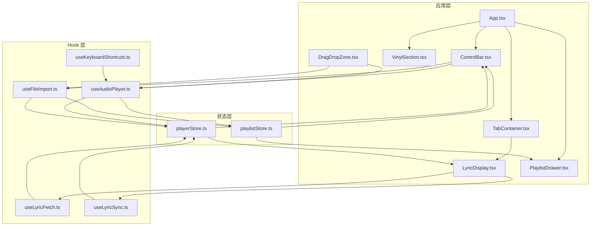
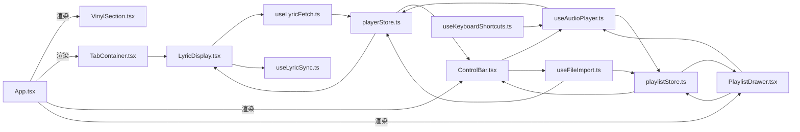
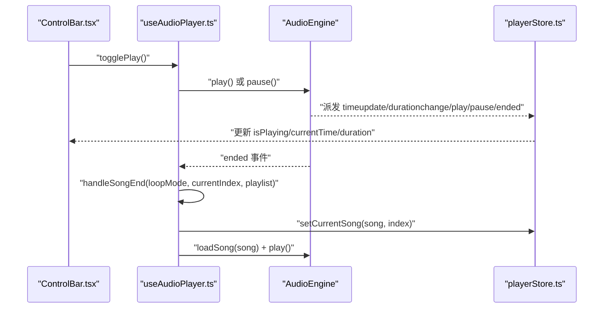
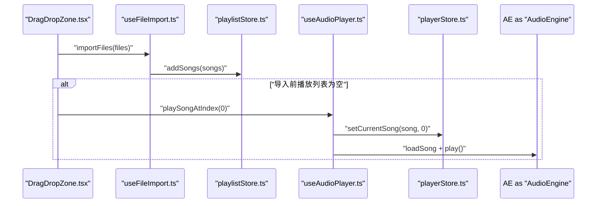
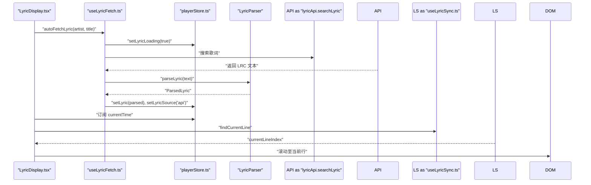
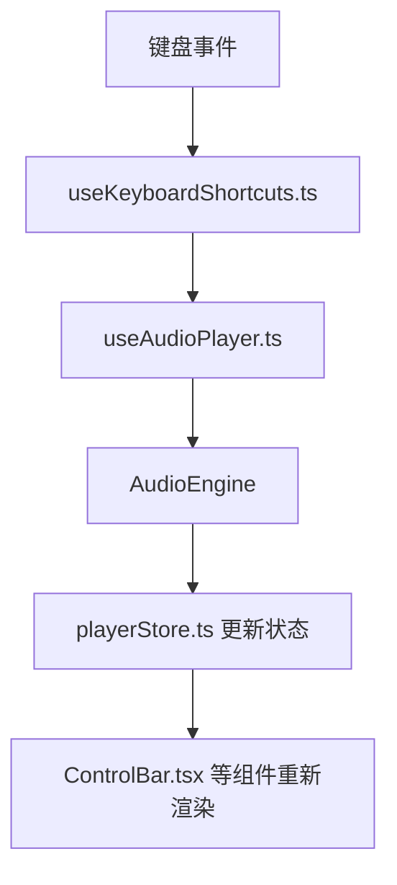
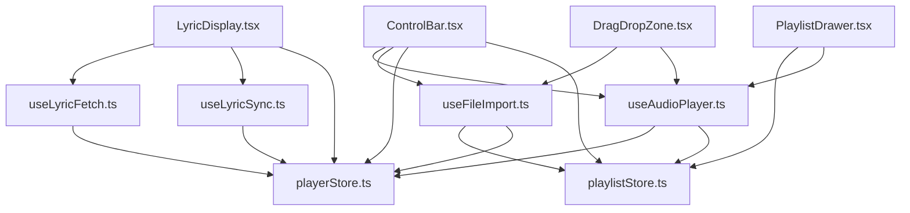

# 组件通信机制

<cite>
**本文引用的文件**
- [src/App.tsx](file://src/App.tsx)
- [src/main.tsx](file://src/main.tsx)
- [src/hooks/useAudioPlayer.ts](file://src/hooks/useAudioPlayer.ts)
- [src/hooks/useFileImport.ts](file://src/hooks/useFileImport.ts)
- [src/hooks/useLyricFetch.ts](file://src/hooks/useLyricFetch.ts)
- [src/hooks/useLyricSync.ts](file://src/hooks/useLyricSync.ts)
- [src/hooks/useKeyboardShortcuts.ts](file://src/hooks/useKeyboardShortcuts.ts)
- [src/store/playerStore.ts](file://src/store/playerStore.ts)
- [src/store/playlistStore.ts](file://src/store/playlistStore.ts)
- [src/components/Controls/ControlBar.tsx](file://src/components/Controls/ControlBar.tsx)
- [src/components/Player/VinylSection.tsx](file://src/components/Player/VinylSection.tsx)
- [src/components/ContentTabs/TabContainer.tsx](file://src/components/ContentTabs/TabContainer.tsx)
- [src/components/Lyrics/LyricDisplay.tsx](file://src/components/Lyrics/LyricDisplay.tsx)
- [src/components/Playlist/PlaylistDrawer.tsx](file://src/components/Playlist/PlaylistDrawer.tsx)
- [src/components/FileImport/DragDropZone.tsx](file://src/components/FileImport/DragDropZone.tsx)
</cite>

## 目录
1. [引言](#引言)
2. [项目结构](#项目结构)
3. [核心组件](#核心组件)
4. [架构总览](#架构总览)
5. [详细组件分析](#详细组件分析)
6. [依赖关系分析](#依赖关系分析)
7. [性能考量](#性能考量)
8. [故障排查指南](#故障排查指南)
9. [结论](#结论)
10. [附录](#附录)

## 引言
本文件系统性梳理 My Music 2026 的组件通信机制，覆盖父子组件通信、兄弟组件通信与跨层级通信；深入讲解 Hook 模式的应用与设计原则；重点阐述 useAudioPlayer.ts、useFileImport.ts、useLyricFetch.ts 等 Hook 的功能与使用场景；总结 props 传递、状态提升与事件冒泡的实践；并提供组件解耦策略、性能优化与错误处理建议，以及关键流程与数据流图。

## 项目结构
- 应用入口通过 main.tsx 渲染根组件 App.tsx。
- App.tsx 作为顶层容器，协调播放器主界面、迷你模式、背景渐变、播放列表抽屉与底部控制条。
- 控制条 ControlBar.tsx 聚合播放控制、导入、收藏、添加到歌单等功能，是与播放器状态交互最频繁的组件之一。
- TabContainer.tsx 提供歌词、百科、相似推荐三个标签页，其中歌词页由 LyricDisplay.tsx 实现。
- VinylSection.tsx 展示黑胶转盘与唱臂的视觉组件。
- 文件导入通过 DragDropZone.tsx 完成拖拽与文件选择，随后由 useFileImport.ts 解析并写入播放列表。
- 歌词获取与同步由 useLyricFetch.ts 与 useLyricSync.ts 协作完成，LyricDisplay.tsx 负责渲染与交互。
- 键盘快捷键由 useKeyboardShortcuts.ts 统一处理，委托给 useAudioPlayer.ts 的播放控制方法。
- 全局状态通过 Zustand 的 playerStore.ts 与 playlistStore.ts 管理，实现跨组件共享与持久化。

图表来源
- [src/App.tsx](file://src/App.tsx#L15-L95)
- [src/components/Controls/ControlBar.tsx](file://src/components/Controls/ControlBar.tsx#L16-L104)
- [src/components/ContentTabs/TabContainer.tsx](file://src/components/ContentTabs/TabContainer.tsx#L15-L50)
- [src/components/Lyrics/LyricDisplay.tsx](file://src/components/Lyrics/LyricDisplay.tsx#L7-L101)
- [src/components/Player/VinylSection.tsx](file://src/components/Player/VinylSection.tsx#L4-L11)
- [src/components/FileImport/DragDropZone.tsx](file://src/components/FileImport/DragDropZone.tsx#L7-L66)
- [src/components/Playlist/PlaylistDrawer.tsx](file://src/components/Playlist/PlaylistDrawer.tsx#L6-L69)
- [src/hooks/useAudioPlayer.ts](file://src/hooks/useAudioPlayer.ts#L6-L130)
- [src/hooks/useFileImport.ts](file://src/hooks/useFileImport.ts#L33-L77)
- [src/hooks/useLyricFetch.ts](file://src/hooks/useLyricFetch.ts#L12-L94)
- [src/hooks/useLyricSync.ts](file://src/hooks/useLyricSync.ts#L5-L32)
- [src/hooks/useKeyboardShortcuts.ts](file://src/hooks/useKeyboardShortcuts.ts#L6-L72)
- [src/store/playerStore.ts](file://src/store/playerStore.ts#L42-L94)
- [src/store/playlistStore.ts](file://src/store/playlistStore.ts#L29-L87)

章节来源
- [src/main.tsx](file://src/main.tsx#L1-L11)
- [src/App.tsx](file://src/App.tsx#L15-L95)

## 核心组件
- App.tsx：顶层容器，负责根据播放器模式切换布局（全屏/迷你/空状态），订阅播放器与播放列表状态，响应封面颜色提取与自动封面拉取。
- ControlBar.tsx：底部控制条，聚合播放控制、导入、收藏、添加到歌单、循环模式、音质与模式切换等能力，直接消费 playerStore 与 playlistStore。
- TabContainer.tsx：标签页容器，内部维护活动标签状态，按需渲染歌词、百科与推荐内容。
- LyricDisplay.tsx：歌词展示与交互，订阅歌词状态与加载状态，触发歌词刷新与点击跳转。
- VinylSection.tsx：黑胶视觉组件组合。
- DragDropZone.tsx：文件导入入口，支持拖拽与文件选择，导入后在必要时自动播放第一首。
- PlaylistDrawer.tsx：播放列表抽屉，展示当前播放队列，支持移除与点击播放指定索引。

章节来源
- [src/App.tsx](file://src/App.tsx#L15-L95)
- [src/components/Controls/ControlBar.tsx](file://src/components/Controls/ControlBar.tsx#L16-L104)
- [src/components/ContentTabs/TabContainer.tsx](file://src/components/ContentTabs/TabContainer.tsx#L15-L50)
- [src/components/Lyrics/LyricDisplay.tsx](file://src/components/Lyrics/LyricDisplay.tsx#L7-L101)
- [src/components/Player/VinylSection.tsx](file://src/components/Player/VinylSection.tsx#L4-L11)
- [src/components/FileImport/DragDropZone.tsx](file://src/components/FileImport/DragDropZone.tsx#L7-L66)
- [src/components/Playlist/PlaylistDrawer.tsx](file://src/components/Playlist/PlaylistDrawer.tsx#L6-L69)

## 架构总览
My Music 2026 采用“组件 + Hook + Zustand Store”的分层通信架构：
- 组件层：负责 UI 呈现与用户交互，通过 props 接收数据，通过事件回调与上下文通信。
- Hook 层：封装业务逻辑与副作用，统一管理播放、导入、歌词获取与同步、快捷键等能力。
- 状态层：Zustand Store 提供全局状态与持久化，避免跨层级重复传递 props。

图表来源
- [src/App.tsx](file://src/App.tsx#L50-L94)
- [src/components/Controls/ControlBar.tsx](file://src/components/Controls/ControlBar.tsx#L16-L104)
- [src/components/ContentTabs/TabContainer.tsx](file://src/components/ContentTabs/TabContainer.tsx#L15-L50)
- [src/components/Lyrics/LyricDisplay.tsx](file://src/components/Lyrics/LyricDisplay.tsx#L7-L101)
- [src/components/Playlist/PlaylistDrawer.tsx](file://src/components/Playlist/PlaylistDrawer.tsx#L6-L69)
- [src/hooks/useAudioPlayer.ts](file://src/hooks/useAudioPlayer.ts#L6-L130)
- [src/hooks/useFileImport.ts](file://src/hooks/useFileImport.ts#L33-L77)
- [src/hooks/useLyricFetch.ts](file://src/hooks/useLyricFetch.ts#L12-L94)
- [src/hooks/useLyricSync.ts](file://src/hooks/useLyricSync.ts#L5-L32)
- [src/hooks/useKeyboardShortcuts.ts](file://src/hooks/useKeyboardShortcuts.ts#L6-L72)
- [src/store/playerStore.ts](file://src/store/playerStore.ts#L42-L94)
- [src/store/playlistStore.ts](file://src/store/playlistStore.ts#L29-L87)

## 详细组件分析

### 组件间通信模式

- 父子组件通信
  - App.tsx 作为父容器，向子组件传递条件渲染与布局控制（如播放器模式、是否为空状态）。
  - ControlBar.tsx 作为底部控制条的父组件，向其子控件（播放按钮、进度条、音量、循环模式、音质、模式切换）注入行为与状态。
  - TabContainer.tsx 作为标签页容器，向各标签页组件（歌词、百科、推荐）注入活动状态与切换逻辑。
  - VinylSection.tsx 作为视觉容器，向其子组件（唱臂、黑胶盘）注入动画与状态。

- 兄弟组件通信
  - ControlBar.tsx 与 PlaylistDrawer.tsx 通过共享的 playerStore 与 playlistStore 进行通信：前者负责打开抽屉，后者负责关闭抽屉与执行播放操作。
  - DragDropZone.tsx 与 useAudioPlayer.ts 之间通过导入后的播放列表长度判断决定是否自动播放第一首歌曲，形成兄弟组件协作。

- 跨层级通信
  - 大部分跨层级通信通过 Zustand Store 实现：playerStore 与 playlistStore 在多处被读取与更新，避免层层 props 下传。
  - useKeyboardShortcuts.ts 通过 useAudioPlayer.ts 的播放控制方法实现全局快捷键，属于跨层级事件驱动。

章节来源
- [src/App.tsx](file://src/App.tsx#L50-L94)
- [src/components/Controls/ControlBar.tsx](file://src/components/Controls/ControlBar.tsx#L16-L104)
- [src/components/ContentTabs/TabContainer.tsx](file://src/components/ContentTabs/TabContainer.tsx#L15-L50)
- [src/components/Player/VinylSection.tsx](file://src/components/Player/VinylSection.tsx#L4-L11)
- [src/components/Playlist/PlaylistDrawer.tsx](file://src/components/Playlist/PlaylistDrawer.tsx#L6-L69)
- [src/components/FileImport/DragDropZone.tsx](file://src/components/FileImport/DragDropZone.tsx#L7-L66)
- [src/hooks/useKeyboardShortcuts.ts](file://src/hooks/useKeyboardShortcuts.ts#L6-L72)
- [src/hooks/useAudioPlayer.ts](file://src/hooks/useAudioPlayer.ts#L6-L130)
- [src/store/playerStore.ts](file://src/store/playerStore.ts#L42-L94)
- [src/store/playlistStore.ts](file://src/store/playlistStore.ts#L29-L87)

### Hook 模式与设计原则
- 设计原则
  - 单一职责：每个 Hook 聚焦一个业务域（播放、导入、歌词、同步、快捷键）。
  - 依赖注入：Hook 通过参数或 store 订阅获取外部依赖，避免硬编码。
  - 副作用隔离：将异步与副作用封装在 useEffect 或回调中，暴露稳定接口。
  - 可复用性：返回纯函数与状态片段，便于多组件复用。
  - 性能优化：合理使用 useCallback/useMemo，避免不必要的重渲染与重复计算。

- 关键 Hook 功能与使用场景
  - useAudioPlayer.ts：封装音频引擎事件监听、播放/暂停、切歌、seek、音量与静音同步、循环模式处理。适用于 ControlBar.tsx、LyricDisplay.tsx、DragDropZone.tsx 等需要播放控制的组件。
  - useFileImport.ts：解析本地音频文件与 LRC 歌词，批量导入到播放列表，设置歌词与来源标记。适用于 DragDropZone.tsx 与 ControlBar.tsx 的文件导入入口。
  - useLyricFetch.ts：从 API 获取歌词，支持防抖与竞态控制，提供自动获取与手动刷新能力。适用于 LyricDisplay.tsx 的歌词获取与刷新。
  - useLyricSync.ts：根据播放时间计算当前歌词行并滚动至可视区域，提供容器引用与索引。适用于 LyricDisplay.tsx 的歌词高亮与滚动。
  - useKeyboardShortcuts.ts：全局键盘事件处理，委托给 useAudioPlayer.ts 的播放控制方法。适用于 App.tsx 的全局快捷键注册。

章节来源
- [src/hooks/useAudioPlayer.ts](file://src/hooks/useAudioPlayer.ts#L6-L130)
- [src/hooks/useFileImport.ts](file://src/hooks/useFileImport.ts#L33-L77)
- [src/hooks/useLyricFetch.ts](file://src/hooks/useLyricFetch.ts#L12-L94)
- [src/hooks/useLyricSync.ts](file://src/hooks/useLyricSync.ts#L5-L32)
- [src/hooks/useKeyboardShortcuts.ts](file://src/hooks/useKeyboardShortcuts.ts#L6-L72)

### 数据传递机制
- Props 传递
  - ControlBar.tsx 向子组件传递行为与状态（如 currentSong、playlist），子组件通过回调更新状态。
  - TabContainer.tsx 向标签页组件传递活动状态与切换逻辑，标签页组件仅负责渲染。

- 状态提升
  - App.tsx 通过订阅 playerStore 与 playlistStore 的状态，实现对播放器模式、封面颜色、播放列表等的集中管理。

- 事件冒泡
  - PlaylistDrawer.tsx 在列表项点击时调用 playSongAtIndex，事件向上冒泡至 useAudioPlayer.ts，再由音频引擎执行播放。

章节来源
- [src/components/Controls/ControlBar.tsx](file://src/components/Controls/ControlBar.tsx#L16-L104)
- [src/components/Playlist/PlaylistDrawer.tsx](file://src/components/Playlist/PlaylistDrawer.tsx#L41-L65)
- [src/App.tsx](file://src/App.tsx#L15-L95)

### 组件解耦策略
- 通过 Hook 将业务逻辑与 UI 解耦，UI 仅关注渲染与事件，逻辑集中在 Hook 中。
- 通过 Zustand Store 提供全局状态访问点，避免跨层级 props 传递带来的紧耦合。
- 通过事件委托与回调（如 playSongAtIndex）实现组件间低耦合协作。

章节来源
- [src/hooks/useAudioPlayer.ts](file://src/hooks/useAudioPlayer.ts#L6-L130)
- [src/store/playerStore.ts](file://src/store/playerStore.ts#L42-L94)
- [src/store/playlistStore.ts](file://src/store/playlistStore.ts#L29-L87)

### 性能优化
- 使用 useCallback 缓存回调，减少子组件重渲染（如 useAudioPlayer.ts 的播放控制方法）。
- 通过 useRef 存储 fetchId，实现歌词请求的防抖与竞态控制（useLyricFetch.ts）。
- 条件渲染与懒加载：App.tsx 根据播放器模式与空状态进行条件渲染，减少不必要的 DOM 结构。
- 滚动优化：useLyricSync.ts 在当前行变更时平滑滚动，避免频繁重排。

章节来源
- [src/hooks/useAudioPlayer.ts](file://src/hooks/useAudioPlayer.ts#L77-L114)
- [src/hooks/useLyricFetch.ts](file://src/hooks/useLyricFetch.ts#L17-L58)
- [src/App.tsx](file://src/App.tsx#L54-L86)
- [src/hooks/useLyricSync.ts](file://src/hooks/useLyricSync.ts#L20-L29)

### 错误处理机制
- 自动播放限制：useAudioPlayer.ts 在播放失败时捕获异常，等待用户交互以恢复播放。
- 歌词获取异常：useLyricFetch.ts 在网络异常或解析失败时设置歌词来源为 null，并结束加载状态。
- 竞态控制：通过 fetchIdRef 防止快速切歌导致的请求竞态，确保只接受最新请求的结果。
- 输入过滤：useFileImport.ts 对文件类型进行严格校验，避免非音频文件进入播放列表。

章节来源
- [src/hooks/useAudioPlayer.ts](file://src/hooks/useAudioPlayer.ts#L70-L75)
- [src/hooks/useLyricFetch.ts](file://src/hooks/useLyricFetch.ts#L48-L57)
- [src/hooks/useFileImport.ts](file://src/hooks/useFileImport.ts#L37-L49)

### 关键流程图与数据流向图

#### 播放控制流程（从 UI 到引擎）

图表来源
- [src/components/Controls/ControlBar.tsx](file://src/components/Controls/ControlBar.tsx#L84-L88)
- [src/hooks/useAudioPlayer.ts](file://src/hooks/useAudioPlayer.ts#L77-L90)
- [src/store/playerStore.ts](file://src/store/playerStore.ts#L65-L65)

#### 文件导入与自动播放流程

图表来源
- [src/components/FileImport/DragDropZone.tsx](file://src/components/FileImport/DragDropZone.tsx#L12-L23)
- [src/hooks/useFileImport.ts](file://src/hooks/useFileImport.ts#L37-L49)
- [src/hooks/useAudioPlayer.ts](file://src/hooks/useAudioPlayer.ts#L64-L75)
- [src/store/playlistStore.ts](file://src/store/playlistStore.ts#L36-L38)

#### 歌词获取与同步流程

图表来源
- [src/components/Lyrics/LyricDisplay.tsx](file://src/components/Lyrics/LyricDisplay.tsx#L15-L20)
- [src/hooks/useLyricFetch.ts](file://src/hooks/useLyricFetch.ts#L65-L79)
- [src/hooks/useLyricSync.ts](file://src/hooks/useLyricSync.ts#L11-L29)

#### 键盘快捷键到播放控制

图表来源
- [src/hooks/useKeyboardShortcuts.ts](file://src/hooks/useKeyboardShortcuts.ts#L9-L71)
- [src/hooks/useAudioPlayer.ts](file://src/hooks/useAudioPlayer.ts#L77-L90)
- [src/store/playerStore.ts](file://src/store/playerStore.ts#L65-L65)

## 依赖关系分析
- 组件依赖
  - ControlBar.tsx 依赖 useAudioPlayer.ts 与 useFileImport.ts，同时读取 playerStore 与 playlistStore。
  - LyricDisplay.tsx 依赖 useLyricFetch.ts 与 useLyricSync.ts，读取 playerStore。
  - PlaylistDrawer.tsx 依赖 usePlaylistStore 与 useAudioPlayer。
  - DragDropZone.tsx 依赖 useFileImport.ts 与 useAudioPlayer.ts。
- Hook 依赖
  - useAudioPlayer.ts 依赖 AudioEngine、playerStore、playlistStore。
  - useFileImport.ts 依赖 playlistStore、playerStore、LyricParser。
  - useLyricFetch.ts 依赖 playerStore、lyricApi、LyricParser。
  - useLyricSync.ts 依赖 playerStore、LyricParser。
  - useKeyboardShortcuts.ts 依赖 useAudioPlayer.ts 与 playerStore。

图表来源
- [src/components/Controls/ControlBar.tsx](file://src/components/Controls/ControlBar.tsx#L16-L104)
- [src/components/Lyrics/LyricDisplay.tsx](file://src/components/Lyrics/LyricDisplay.tsx#L7-L101)
- [src/components/Playlist/PlaylistDrawer.tsx](file://src/components/Playlist/PlaylistDrawer.tsx#L6-L69)
- [src/components/FileImport/DragDropZone.tsx](file://src/components/FileImport/DragDropZone.tsx#L7-L66)
- [src/hooks/useAudioPlayer.ts](file://src/hooks/useAudioPlayer.ts#L6-L130)
- [src/hooks/useFileImport.ts](file://src/hooks/useFileImport.ts#L33-L77)
- [src/hooks/useLyricFetch.ts](file://src/hooks/useLyricFetch.ts#L12-L94)
- [src/hooks/useLyricSync.ts](file://src/hooks/useLyricSync.ts#L5-L32)
- [src/store/playerStore.ts](file://src/store/playerStore.ts#L42-L94)
- [src/store/playlistStore.ts](file://src/store/playlistStore.ts#L29-L87)

章节来源
- [src/components/Controls/ControlBar.tsx](file://src/components/Controls/ControlBar.tsx#L16-L104)
- [src/components/Lyrics/LyricDisplay.tsx](file://src/components/Lyrics/LyricDisplay.tsx#L7-L101)
- [src/components/Playlist/PlaylistDrawer.tsx](file://src/components/Playlist/PlaylistDrawer.tsx#L6-L69)
- [src/components/FileImport/DragDropZone.tsx](file://src/components/FileImport/DragDropZone.tsx#L7-L66)
- [src/hooks/useAudioPlayer.ts](file://src/hooks/useAudioPlayer.ts#L6-L130)
- [src/hooks/useFileImport.ts](file://src/hooks/useFileImport.ts#L33-L77)
- [src/hooks/useLyricFetch.ts](file://src/hooks/useLyricFetch.ts#L12-L94)
- [src/hooks/useLyricSync.ts](file://src/hooks/useLyricSync.ts#L5-L32)
- [src/store/playerStore.ts](file://src/store/playerStore.ts#L42-L94)
- [src/store/playlistStore.ts](file://src/store/playlistStore.ts#L29-L87)

## 性能考量
- 回调缓存：useAudioPlayer.ts 中大量使用 useCallback 缓存播放控制方法，降低子组件重渲染频率。
- 状态订阅粒度：各组件仅订阅所需字段，避免不必要的全局状态更新导致的重渲染。
- 异步防抖：useLyricFetch.ts 通过 fetchIdRef 防止快速切歌产生的多余请求。
- 条件渲染：App.tsx 根据播放器模式与空状态进行条件渲染，减少 DOM 结构与计算开销。
- 滚动优化：useLyricSync.ts 仅在当前行索引变化时滚动，避免频繁滚动操作。

[本节为通用性能指导，无需特定文件引用]

## 故障排查指南
- 自动播放失败
  - 现象：首次播放无声音。
  - 原因：浏览器自动播放限制。
  - 处理：等待用户交互后再次尝试播放，或引导用户主动点击播放按钮。
  - 参考路径：[src/hooks/useAudioPlayer.ts](file://src/hooks/useAudioPlayer.ts#L70-L75)

- 歌词未显示
  - 现象：歌词区域显示“暂无歌词”或加载中。
  - 原因：API 未返回歌词或解析失败；或存在本地歌词但未自动刷新。
  - 处理：点击“重新获取”手动刷新；检查歌曲信息是否完整。
  - 参考路径：[src/components/Lyrics/LyricDisplay.tsx](file://src/components/Lyrics/LyricDisplay.tsx#L33-L49), [src/hooks/useLyricFetch.ts](file://src/hooks/useLyricFetch.ts#L48-L57)

- 快捷键无效
  - 现象：键盘按键无反应。
  - 原因：焦点在输入框内；未正确注册事件。
  - 处理：确保不在输入框中；确认 useKeyboardShortcuts.ts 已在 App.tsx 中初始化。
  - 参考路径：[src/hooks/useKeyboardShortcuts.ts](file://src/hooks/useKeyboardShortcuts.ts#L9-L71), [src/App.tsx](file://src/App.tsx#L22-L22)

- 播放列表为空时无法播放
  - 现象：导入后点击播放无效果。
  - 原因：播放列表为空，未触发自动播放。
  - 处理：先导入音频文件，再点击播放；或在导入后调用 playSongAtIndex(0)。
  - 参考路径：[src/components/FileImport/DragDropZone.tsx](file://src/components/FileImport/DragDropZone.tsx#L19-L21)

章节来源
- [src/hooks/useAudioPlayer.ts](file://src/hooks/useAudioPlayer.ts#L70-L75)
- [src/components/Lyrics/LyricDisplay.tsx](file://src/components/Lyrics/LyricDisplay.tsx#L33-L49)
- [src/hooks/useLyricFetch.ts](file://src/hooks/useLyricFetch.ts#L48-L57)
- [src/hooks/useKeyboardShortcuts.ts](file://src/hooks/useKeyboardShortcuts.ts#L9-L71)
- [src/App.tsx](file://src/App.tsx#L22-L22)
- [src/components/FileImport/DragDropZone.tsx](file://src/components/FileImport/DragDropZone.tsx#L19-L21)

## 结论
My Music 2026 通过清晰的分层架构与 Hook 模式实现了组件间高效、可维护的通信。Zustand Store 作为状态中心，有效降低了跨层级通信的成本；useAudioPlayer.ts、useFileImport.ts、useLyricFetch.ts 等 Hook 将复杂业务逻辑封装，提升了代码复用性与可测试性。配合合理的性能优化与错误处理策略，整体系统具备良好的扩展性与用户体验。

[本节为总结性内容，无需特定文件引用]

## 附录
- 关键 Hook 功能速览
  - useAudioPlayer.ts：播放控制、切歌、seek、音量/静音同步、循环模式处理。
  - useFileImport.ts：音频与 LRC 导入、解析与去重、歌词来源标记。
  - useLyricFetch.ts：歌词自动获取、手动刷新、防抖与竞态控制。
  - useLyricSync.ts：歌词行定位与滚动同步。
  - useKeyboardShortcuts.ts：全局快捷键到播放控制的映射。

- 状态模型概览
  - playerStore.ts：播放状态、歌词状态、播放列表索引、播放器模式与持久化配置。
  - playlistStore.ts：播放列表、收藏、用户歌单与持久化配置。

章节来源
- [src/hooks/useAudioPlayer.ts](file://src/hooks/useAudioPlayer.ts#L6-L130)
- [src/hooks/useFileImport.ts](file://src/hooks/useFileImport.ts#L33-L77)
- [src/hooks/useLyricFetch.ts](file://src/hooks/useLyricFetch.ts#L12-L94)
- [src/hooks/useLyricSync.ts](file://src/hooks/useLyricSync.ts#L5-L32)
- [src/hooks/useKeyboardShortcuts.ts](file://src/hooks/useKeyboardShortcuts.ts#L6-L72)
- [src/store/playerStore.ts](file://src/store/playerStore.ts#L8-L40)
- [src/store/playlistStore.ts](file://src/store/playlistStore.ts#L12-L27)