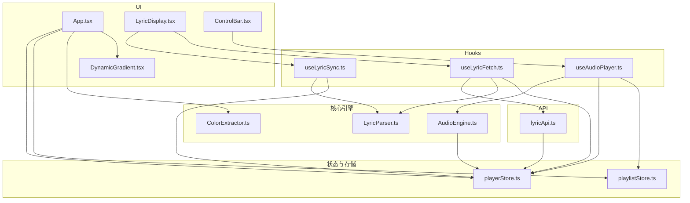
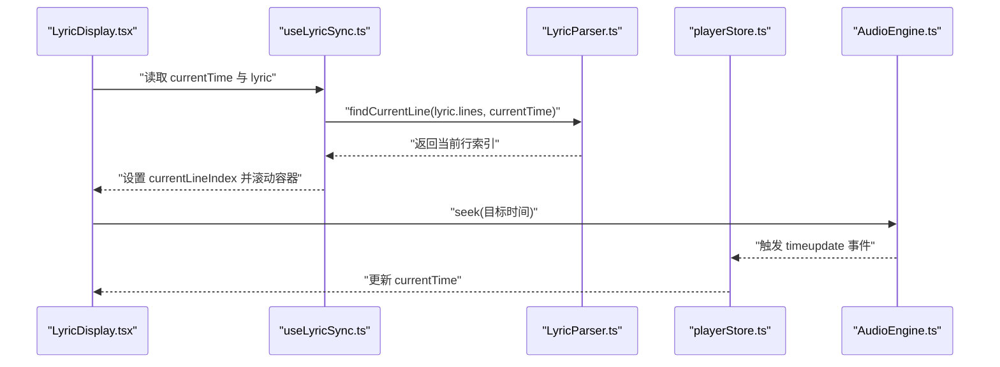
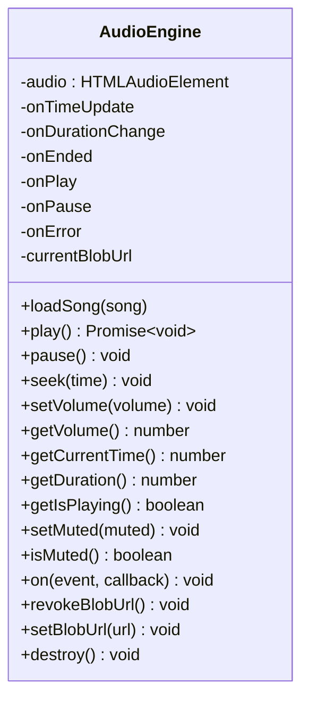
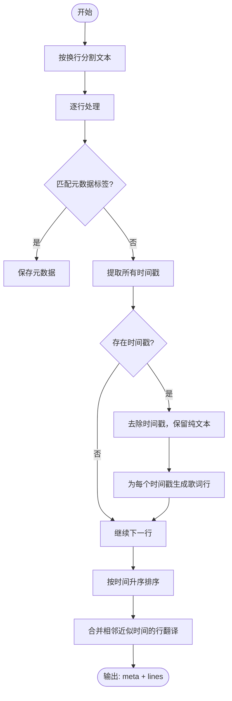
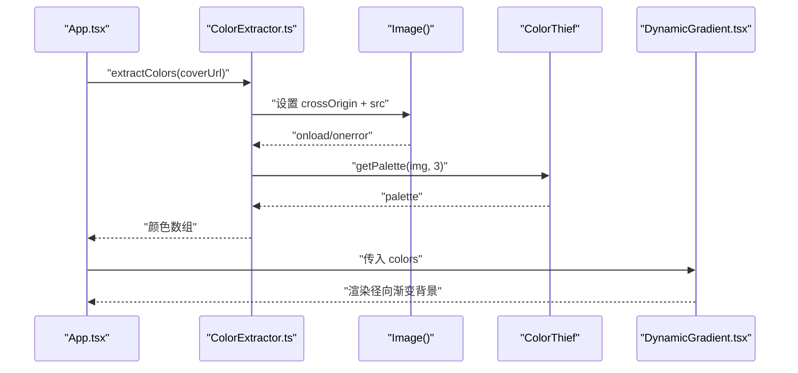
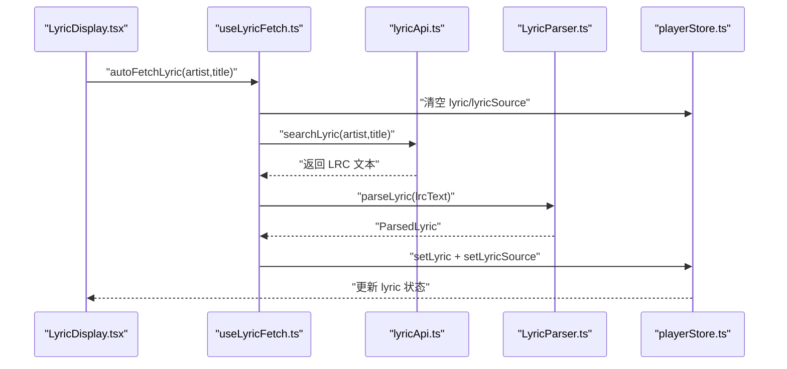
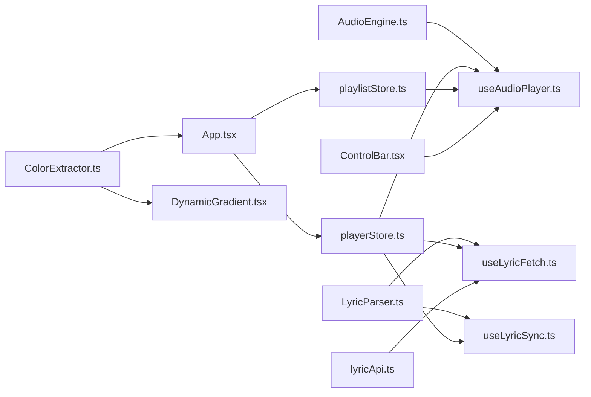

# 核心模块

<cite>
**本文引用的文件**
- [src/core/AudioEngine.ts](file://src/core/AudioEngine.ts)
- [src/core/LyricParser.ts](file://src/core/LyricParser.ts)
- [src/core/ColorExtractor.ts](file://src/core/ColorExtractor.ts)
- [src/hooks/useAudioPlayer.ts](file://src/hooks/useAudioPlayer.ts)
- [src/hooks/useLyricFetch.ts](file://src/hooks/useLyricFetch.ts)
- [src/hooks/useLyricSync.ts](file://src/hooks/useLyricSync.ts)
- [src/api/lyricApi.ts](file://src/api/lyricApi.ts)
- [src/store/playerStore.ts](file://src/store/playerStore.ts)
- [src/store/playlistStore.ts](file://src/store/playlistStore.ts)
- [src/types/lyric.ts](file://src/types/lyric.ts)
- [src/types/player.ts](file://src/types/player.ts)
- [src/components/Background/DynamicGradient.tsx](file://src/components/Background/DynamicGradient.tsx)
- [src/components/Lyrics/LyricDisplay.tsx](file://src/components/Lyrics/LyricDisplay.tsx)
- [src/components/Controls/ControlBar.tsx](file://src/components/Controls/ControlBar.tsx)
- [src/App.tsx](file://src/App.tsx)
- [src/utils/timeFormat.ts](file://src/utils/timeFormat.ts)
- [package.json](file://package.json)
</cite>

## 目录
1. [简介](#简介)
2. [项目结构](#项目结构)
3. [核心组件](#核心组件)
4. [架构总览](#架构总览)
5. [详细组件分析](#详细组件分析)
6. [依赖分析](#依赖分析)
7. [性能考虑](#性能考虑)
8. [故障排查指南](#故障排查指南)
9. [结论](#结论)
10. [附录](#附录)

## 简介
本文件聚焦 My Music 2026 的核心模块，系统性梳理以下能力：
- 音频引擎（AudioEngine）：对 HTMLAudioElement 的完整封装，覆盖播放控制、事件监听、错误处理与资源管理。
- 歌词解析器（LyricParser）：LRC 格式解析、元数据提取、时间轴归一化与二分查找定位当前行。
- 颜色提取器（ColorExtractor）：基于封面图提取主色调，生成动态背景。
- 自定义 Hook 设计模式：useAudioPlayer、useLyricFetch、useLyricSync 的职责划分与业务封装。
- 模块协作关系：从播放器到歌词、从歌词到 UI 的端到端流程。
- 接口定义与使用示例：通过路径引用而非代码片段展示关键 API。
- 性能优化与最佳实践：缓存、防抖、内存释放与跨域策略。

## 项目结构
围绕“核心模块”的关键目录与文件如下：
- 核心引擎与解析：src/core/AudioEngine.ts、LyricParser.ts、ColorExtractor.ts
- 状态管理：src/store/playerStore.ts、playlistStore.ts
- Hooks：src/hooks/useAudioPlayer.ts、useLyricFetch.ts、useLyricSync.ts
- API：src/api/lyricApi.ts
- 类型定义：src/types/lyric.ts、player.ts
- UI 组件：App.tsx、DynamicGradient.tsx、LyricDisplay.tsx、ControlBar.tsx
- 工具函数：src/utils/timeFormat.ts
- 依赖：package.json

图表来源
- [src/core/AudioEngine.ts](file://src/core/AudioEngine.ts#L1-L143)
- [src/core/LyricParser.ts](file://src/core/LyricParser.ts#L1-L101)
- [src/core/ColorExtractor.ts](file://src/core/ColorExtractor.ts#L1-L27)
- [src/hooks/useAudioPlayer.ts](file://src/hooks/useAudioPlayer.ts#L1-L131)
- [src/hooks/useLyricFetch.ts](file://src/hooks/useLyricFetch.ts#L1-L95)
- [src/hooks/useLyricSync.ts](file://src/hooks/useLyricSync.ts#L1-L33)
- [src/api/lyricApi.ts](file://src/api/lyricApi.ts#L1-L129)
- [src/store/playerStore.ts](file://src/store/playerStore.ts#L1-L95)
- [src/store/playlistStore.ts](file://src/store/playlistStore.ts#L1-L88)
- [src/App.tsx](file://src/App.tsx#L1-L98)
- [src/components/Background/DynamicGradient.tsx](file://src/components/Background/DynamicGradient.tsx#L1-L22)
- [src/components/Lyrics/LyricDisplay.tsx](file://src/components/Lyrics/LyricDisplay.tsx#L1-L102)
- [src/components/Controls/ControlBar.tsx](file://src/components/Controls/ControlBar.tsx#L1-L105)

章节来源
- [src/core/AudioEngine.ts](file://src/core/AudioEngine.ts#L1-L143)
- [src/core/LyricParser.ts](file://src/core/LyricParser.ts#L1-L101)
- [src/core/ColorExtractor.ts](file://src/core/ColorExtractor.ts#L1-L27)
- [src/hooks/useAudioPlayer.ts](file://src/hooks/useAudioPlayer.ts#L1-L131)
- [src/hooks/useLyricFetch.ts](file://src/hooks/useLyricFetch.ts#L1-L95)
- [src/hooks/useLyricSync.ts](file://src/hooks/useLyricSync.ts#L1-L33)
- [src/api/lyricApi.ts](file://src/api/lyricApi.ts#L1-L129)
- [src/store/playerStore.ts](file://src/store/playerStore.ts#L1-L95)
- [src/store/playlistStore.ts](file://src/store/playlistStore.ts#L1-L88)
- [src/App.tsx](file://src/App.tsx#L1-L98)
- [src/components/Background/DynamicGradient.tsx](file://src/components/Background/DynamicGradient.tsx#L1-L22)
- [src/components/Lyrics/LyricDisplay.tsx](file://src/components/Lyrics/LyricDisplay.tsx#L1-L102)
- [src/components/Controls/ControlBar.tsx](file://src/components/Controls/ControlBar.tsx#L1-L105)

## 核心组件
- 音频引擎（AudioEngine）
  - 职责：封装 HTMLAudioElement，统一播放控制、事件转发、音量/静音、进度跳转、错误上报与资源回收。
  - 关键方法：loadSong、play、pause、seek、setVolume、getVolume、getCurrentTime、getDuration、getIsPlaying、setMuted、isMuted、on、destroy、revokeBlobUrl、setBlobUrl。
  - 事件：timeupdate、durationchange、ended、play、pause、error。
- 歌词解析器（LyricParser）
  - 职责：解析 LRC 文本，提取元数据与时间戳歌词，合并同时间行，提供二分查找定位当前行。
  - 关键函数：parseLyric、findCurrentLine。
- 颜色提取器（ColorExtractor）
  - 职责：异步提取封面图主色调，回退默认配色；提供 RGB 字符串转换。
  - 关键函数：extractColors、rgbToString。
- 自定义 Hook
  - useAudioPlayer：绑定播放器状态与 AudioEngine，处理循环模式、随机播放、切歌、播放/暂停、拖动进度。
  - useLyricFetch：从 API 拉取歌词，带缓存、防抖与竞态控制，支持自动获取与手动刷新。
  - useLyricSync：根据播放时间同步歌词高亮滚动。
- 状态管理
  - playerStore：播放状态、歌词、音量、循环模式、音质、播放列表索引等。
  - playlistStore：播放列表、收藏、用户歌单与封面更新。
- UI 组件
  - App：封面变更时提取颜色，渲染动态背景；必要时从 API 获取封面。
  - DynamicGradient：基于提取的颜色生成径向渐变背景。
  - LyricDisplay：展示歌词、来源标识、刷新按钮；点击歌词跳转播放时间。
  - ControlBar：底部控制栏，集成播放/暂停、上一首/下一首、音量、循环模式、音质切换、导入文件等。

章节来源
- [src/core/AudioEngine.ts](file://src/core/AudioEngine.ts#L1-L143)
- [src/core/LyricParser.ts](file://src/core/LyricParser.ts#L1-L101)
- [src/core/ColorExtractor.ts](file://src/core/ColorExtractor.ts#L1-L27)
- [src/hooks/useAudioPlayer.ts](file://src/hooks/useAudioPlayer.ts#L1-L131)
- [src/hooks/useLyricFetch.ts](file://src/hooks/useLyricFetch.ts#L1-L95)
- [src/hooks/useLyricSync.ts](file://src/hooks/useLyricSync.ts#L1-L33)
- [src/store/playerStore.ts](file://src/store/playerStore.ts#L1-L95)
- [src/store/playlistStore.ts](file://src/store/playlistStore.ts#L1-L88)
- [src/App.tsx](file://src/App.tsx#L1-L98)
- [src/components/Background/DynamicGradient.tsx](file://src/components/Background/DynamicGradient.tsx#L1-L22)
- [src/components/Lyrics/LyricDisplay.tsx](file://src/components/Lyrics/LyricDisplay.tsx#L1-L102)
- [src/components/Controls/ControlBar.tsx](file://src/components/Controls/ControlBar.tsx#L1-L105)

## 架构总览
下图展示了从播放器到歌词与 UI 的端到端协作流程。

图表来源
- [src/components/Lyrics/LyricDisplay.tsx](file://src/components/Lyrics/LyricDisplay.tsx#L1-L102)
- [src/hooks/useLyricSync.ts](file://src/hooks/useLyricSync.ts#L1-L33)
- [src/core/LyricParser.ts](file://src/core/LyricParser.ts#L83-L100)
- [src/store/playerStore.ts](file://src/store/playerStore.ts#L1-L95)
- [src/core/AudioEngine.ts](file://src/core/AudioEngine.ts#L23-L45)

## 详细组件分析

### 音频引擎（AudioEngine）设计与实现
- 封装策略
  - 单例模式：导出全局实例，便于跨组件共享。
  - 事件桥接：将原生事件映射为统一回调签名，屏蔽浏览器差异。
  - 安全边界：播放前捕获异常并提示用户交互需求；seek 与 volume 做边界校验。
  - 资源管理：支持撤销 Blob URL，避免内存泄漏。
- 关键流程
  - 加载：暂停、重置时间、设置 URL、触发 load。
  - 播放：play 返回 Promise，捕获拒绝以处理自动播放策略。
  - 时间轴：timeupdate/durationchange 事件驱动状态更新。
  - 错误处理：error 事件统一上报消息。
- 使用示例（路径）
  - [加载歌曲](file://src/hooks/useAudioPlayer.ts#L64-L75)
  - [播放/暂停切换](file://src/hooks/useAudioPlayer.ts#L77-L90)
  - [拖动进度](file://src/hooks/useAudioPlayer.ts#L116-L119)
  - [歌词点击跳转](file://src/components/Lyrics/LyricDisplay.tsx#L80-L85)

图表来源
- [src/core/AudioEngine.ts](file://src/core/AudioEngine.ts#L7-L135)

章节来源
- [src/core/AudioEngine.ts](file://src/core/AudioEngine.ts#L1-L143)
- [src/hooks/useAudioPlayer.ts](file://src/hooks/useAudioPlayer.ts#L64-L119)
- [src/components/Lyrics/LyricDisplay.tsx](file://src/components/Lyrics/LyricDisplay.tsx#L80-L85)

### 歌词解析器（LyricParser）算法
- LRC 解析步骤
  - 分割行并剔除空白。
  - 匹配元数据标签（如艺术家、标题、专辑等），排除同时包含时间戳的行。
  - 多时间戳支持：同一句可包含多个时间戳，逐一解析为秒数。
  - 文本清理：移除时间戳后得到纯歌词文本。
  - 排序与合并：按时间升序排序；若相邻时间差小于阈值，则合并为翻译行（translation）。
- 时间轴定位
  - 二分查找：在有序时间轴中快速定位当前行索引，避免线性扫描。
- 使用示例（路径）
  - [解析歌词文本](file://src/hooks/useLyricFetch.ts#L37-L42)
  - [定位当前行](file://src/hooks/useLyricSync.ts#L16-L18)

图表来源
- [src/core/LyricParser.ts](file://src/core/LyricParser.ts#L18-L81)

章节来源
- [src/core/LyricParser.ts](file://src/core/LyricParser.ts#L1-L101)
- [src/hooks/useLyricFetch.ts](file://src/hooks/useLyricFetch.ts#L37-L42)
- [src/hooks/useLyricSync.ts](file://src/hooks/useLyricSync.ts#L16-L18)

### 颜色提取器（ColorExtractor）与动态背景
- 提取流程
  - 创建 Image 对象，设置跨域属性，加载图片。
  - 异步导入 colorthief，调用 getPalette 提取主色调（默认 3 色）。
  - 失败或跨域错误时回退默认配色。
- 动态背景
  - App 在封面变化时调用 extractColors，并将结果传入 DynamicGradient。
  - DynamicGradient 使用径向渐变合成背景，支持过渡动画。
- 使用示例（路径）
  - [封面变更提取颜色](file://src/App.tsx#L25-L31)
  - [渲染动态背景](file://src/App.tsx#L52-L52)
  - [回退配色与字符串转换](file://src/core/ColorExtractor.ts#L22-L26)

图表来源
- [src/App.tsx](file://src/App.tsx#L25-L31)
- [src/core/ColorExtractor.ts](file://src/core/ColorExtractor.ts#L1-L27)
- [src/components/Background/DynamicGradient.tsx](file://src/components/Background/DynamicGradient.tsx#L5-L21)

章节来源
- [src/App.tsx](file://src/App.tsx#L1-L98)
- [src/core/ColorExtractor.ts](file://src/core/ColorExtractor.ts#L1-L27)
- [src/components/Background/DynamicGradient.tsx](file://src/components/Background/DynamicGradient.tsx#L1-L22)

### 自定义 Hook 的设计模式与业务封装
- useAudioPlayer
  - 职责：连接 AudioEngine 与 playerStore，处理播放/暂停、切歌、循环与随机播放、音量/静音同步、播放结束事件。
  - 关键点：初始化阶段一次性绑定事件；根据循环模式决定下一首索引；playSongAtIndex 负责加载与尝试播放。
- useLyricFetch
  - 职责：从 lyricApi 拉取歌词，带缓存、防抖与竞态控制；支持自动获取与手动刷新。
  - 关键点：fetchIdRef 防止快速切歌导致的竞态；parseLyric 后写入 store；缓存过期自动清理。
- useLyricSync
  - 职责：根据 currentTime 与歌词时间轴定位当前行，滚动容器至居中位置。
  - 关键点：useEffect 监听 lyric 与 currentTime；滚动采用平滑行为。
- 使用示例（路径）
  - [播放/暂停与切歌](file://src/hooks/useAudioPlayer.ts#L77-L114)
  - [歌词自动获取与刷新](file://src/hooks/useLyricFetch.ts#L65-L91)
  - [歌词高亮与滚动](file://src/hooks/useLyricSync.ts#L11-L29)

图表来源
- [src/components/Lyrics/LyricDisplay.tsx](file://src/components/Lyrics/LyricDisplay.tsx#L15-L20)
- [src/hooks/useLyricFetch.ts](file://src/hooks/useLyricFetch.ts#L65-L79)
- [src/api/lyricApi.ts](file://src/api/lyricApi.ts#L86-L119)
- [src/core/LyricParser.ts](file://src/core/LyricParser.ts#L18-L81)
- [src/store/playerStore.ts](file://src/store/playerStore.ts#L74-L76)

章节来源
- [src/hooks/useAudioPlayer.ts](file://src/hooks/useAudioPlayer.ts#L1-L131)
- [src/hooks/useLyricFetch.ts](file://src/hooks/useLyricFetch.ts#L1-L95)
- [src/hooks/useLyricSync.ts](file://src/hooks/useLyricSync.ts#L1-L33)
- [src/components/Lyrics/LyricDisplay.tsx](file://src/components/Lyrics/LyricDisplay.tsx#L1-L102)
- [src/api/lyricApi.ts](file://src/api/lyricApi.ts#L1-L129)
- [src/store/playerStore.ts](file://src/store/playerStore.ts#L1-L95)

## 依赖分析
- 内部依赖
  - AudioEngine 作为播放器核心，被 useAudioPlayer 与 LyricDisplay 间接使用。
  - LyricParser 被 useLyricFetch 与 useLyricSync 使用。
  - ColorExtractor 被 App 与 DynamicGradient 使用。
  - playerStore/playlistStore 作为全局状态中心，被多个 Hook 与组件消费。
- 外部依赖
  - colorthief：用于提取主色调。
  - zustand：轻量状态管理。
  - jsmediatags：用于读取音频元数据（在当前核心模块未直接使用）。
- 依赖关系可视化

图表来源
- [src/core/AudioEngine.ts](file://src/core/AudioEngine.ts#L1-L143)
- [src/core/LyricParser.ts](file://src/core/LyricParser.ts#L1-L101)
- [src/core/ColorExtractor.ts](file://src/core/ColorExtractor.ts#L1-L27)
- [src/hooks/useAudioPlayer.ts](file://src/hooks/useAudioPlayer.ts#L1-L131)
- [src/hooks/useLyricFetch.ts](file://src/hooks/useLyricFetch.ts#L1-L95)
- [src/hooks/useLyricSync.ts](file://src/hooks/useLyricSync.ts#L1-L33)
- [src/api/lyricApi.ts](file://src/api/lyricApi.ts#L1-L129)
- [src/store/playerStore.ts](file://src/store/playerStore.ts#L1-L95)
- [src/store/playlistStore.ts](file://src/store/playlistStore.ts#L1-L88)
- [src/App.tsx](file://src/App.tsx#L1-L98)
- [src/components/Controls/ControlBar.tsx](file://src/components/Controls/ControlBar.tsx#L1-L105)
- [src/components/Background/DynamicGradient.tsx](file://src/components/Background/DynamicGradient.tsx#L1-L22)

章节来源
- [package.json](file://package.json#L12-L21)

## 性能考虑
- 歌词解析
  - 二分查找定位当前行的时间复杂度为 O(log n)，适合长歌词列表。
  - 合并同时间行减少渲染节点数量。
- 歌词获取
  - 本地缓存：LRU 风格的 localStorage 缓存，命中直接返回，避免重复网络请求。
  - 防抖与竞态：fetchIdRef 防止快速切歌导致的竞态；超时与重试提升稳定性。
- 颜色提取
  - 异步加载图片，避免阻塞主线程；失败回退默认配色，保证可用性。
- 播放器事件
  - 事件只绑定一次，避免重复监听造成性能损耗。
  - seek 与 volume 边界检查减少无效操作。
- 最佳实践
  - 优先使用缓存与懒加载策略。
  - 对高频 UI 更新（如滚动）采用节流/防抖。
  - 及时撤销 Blob URL 与取消未完成的请求，防止内存泄漏。

[本节为通用性能建议，无需特定文件引用]

## 故障排查指南
- 播放失败（自动播放限制）
  - 现象：首次播放抛出异常或无声。
  - 处理：等待用户交互后再尝试播放；确保 UI 显式引导用户点击。
  - 参考路径：[播放异常捕获](file://src/core/AudioEngine.ts#L54-L61)、[播放尝试](file://src/hooks/useAudioPlayer.ts#L70-L75)
- 歌词未显示
  - 现象：歌词为空或加载中。
  - 处理：确认当前歌曲非“未知歌手”；检查 lyricApi 是否返回内容；手动刷新歌词。
  - 参考路径：[歌词自动获取](file://src/hooks/useLyricFetch.ts#L65-L79)、[歌词刷新](file://src/hooks/useLyricFetch.ts#L84-L91)
- 歌词滚动不同步
  - 现象：高亮行与播放时间不一致。
  - 处理：确认 currentTime 来源一致；检查 findCurrentLine 的边界条件。
  - 参考路径：[滚动同步](file://src/hooks/useLyricSync.ts#L20-L29)
- 封面颜色不生效
  - 现象：背景仍为默认色。
  - 处理：检查跨域图片是否成功加载；确认 extractColors 成功返回颜色数组。
  - 参考路径：[跨域设置](file://src/core/ColorExtractor.ts#L4-L4)、[颜色提取](file://src/App.tsx#L25-L31)

章节来源
- [src/core/AudioEngine.ts](file://src/core/AudioEngine.ts#L54-L61)
- [src/hooks/useAudioPlayer.ts](file://src/hooks/useAudioPlayer.ts#L70-L75)
- [src/hooks/useLyricFetch.ts](file://src/hooks/useLyricFetch.ts#L65-L91)
- [src/hooks/useLyricSync.ts](file://src/hooks/useLyricSync.ts#L20-L29)
- [src/core/ColorExtractor.ts](file://src/core/ColorExtractor.ts#L4-L4)
- [src/App.tsx](file://src/App.tsx#L25-L31)

## 结论
本项目通过清晰的模块划分与自定义 Hook 封装，实现了从音频播放、歌词解析到动态背景的完整链路。AudioEngine 提供稳定可靠的播放内核，LyricParser 与 useLyricFetch 构建了健壮的歌词获取与同步机制，ColorExtractor 与 DynamicGradient 则为视觉体验提供了动态支持。整体架构具备良好的扩展性与可维护性，适合进一步引入更多媒体能力与 UI 交互。

[本节为总结性内容，无需特定文件引用]

## 附录
- 类型定义概览
  - 歌词行与元数据：LyricLine、LyricMeta、ParsedLyric
  - 播放器模式与音质：LoopMode、PlayerMode、Quality
  - 参考路径：[歌词类型](file://src/types/lyric.ts#L1-L21)、[播放器类型](file://src/types/player.ts#L1-L4)
- 工具函数
  - 时间格式化：formatTime
  - 参考路径：[时间格式化](file://src/utils/timeFormat.ts#L1-L7)
- 组件与 Hook 的典型调用路径
  - [播放控制与切歌](file://src/hooks/useAudioPlayer.ts#L77-L114)
  - [歌词获取与解析](file://src/hooks/useLyricFetch.ts#L23-L60)
  - [歌词高亮与滚动](file://src/hooks/useLyricSync.ts#L11-L29)
  - [动态背景渲染](file://src/App.tsx#L25-L31)

章节来源
- [src/types/lyric.ts](file://src/types/lyric.ts#L1-L21)
- [src/types/player.ts](file://src/types/player.ts#L1-L4)
- [src/utils/timeFormat.ts](file://src/utils/timeFormat.ts#L1-L7)
- [src/hooks/useAudioPlayer.ts](file://src/hooks/useAudioPlayer.ts#L77-L114)
- [src/hooks/useLyricFetch.ts](file://src/hooks/useLyricFetch.ts#L23-L60)
- [src/hooks/useLyricSync.ts](file://src/hooks/useLyricSync.ts#L11-L29)
- [src/App.tsx](file://src/App.tsx#L25-L31)