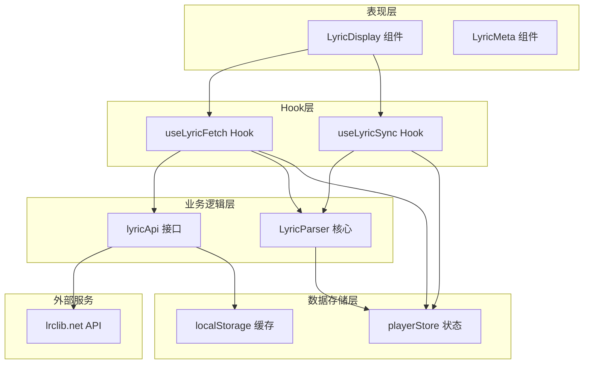
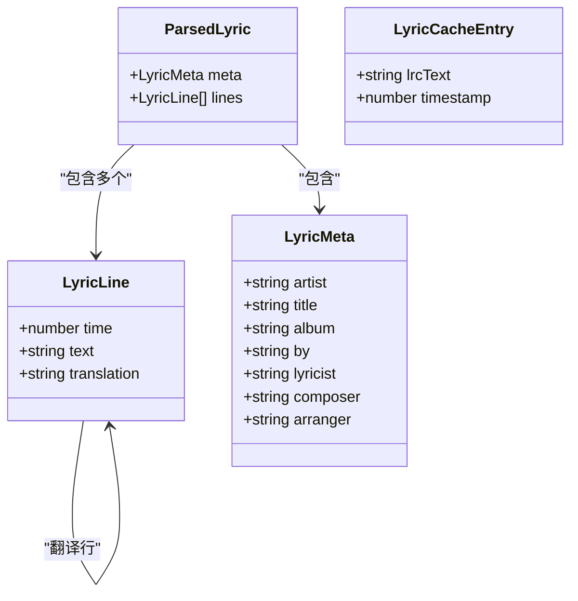
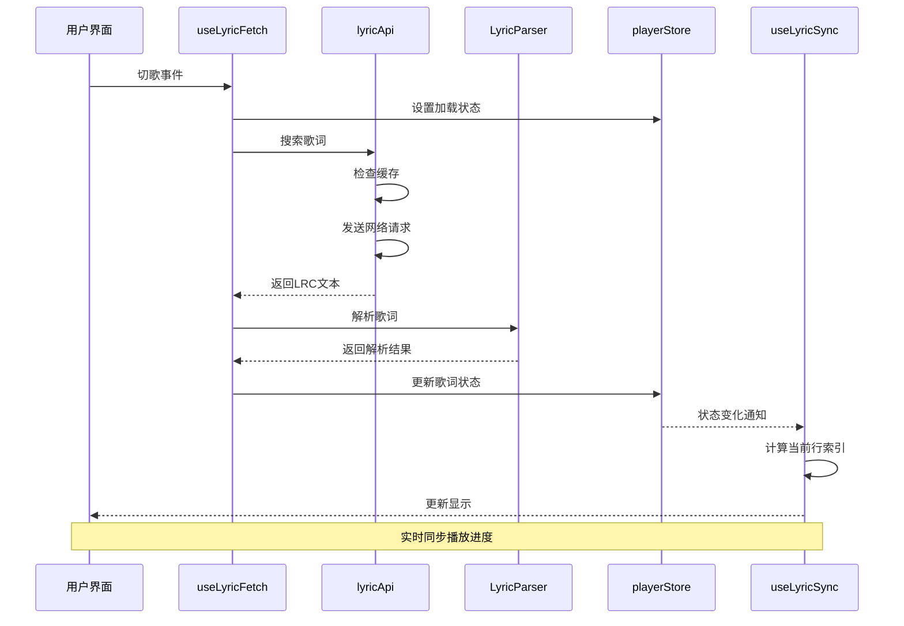
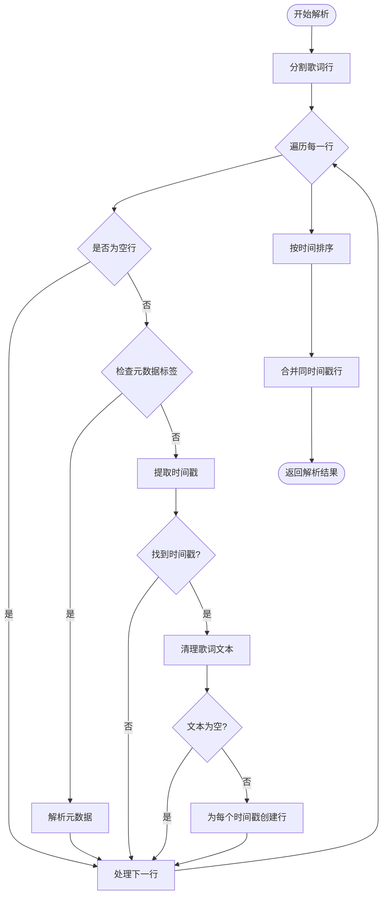
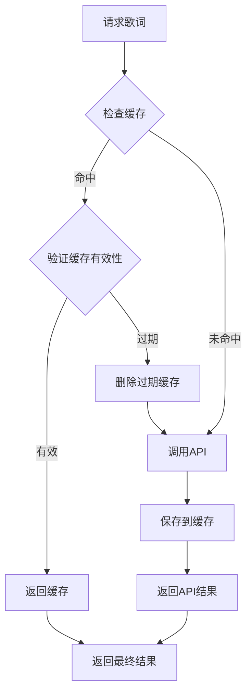
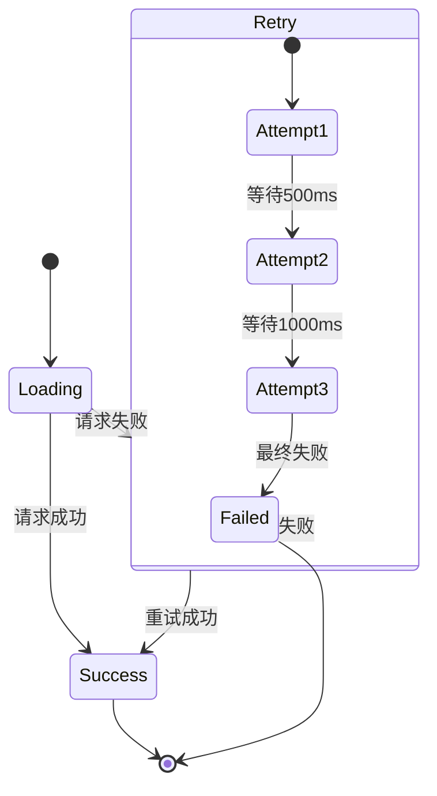
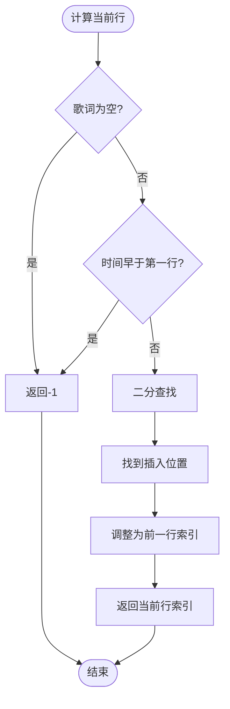
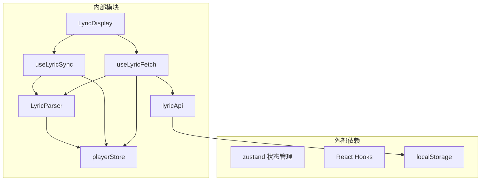

# 歌词解析模块

<cite>
**本文档引用的文件**
- [src/core/LyricParser.ts](file://src/core/LyricParser.ts)
- [src/types/lyric.ts](file://src/types/lyric.ts)
- [src/api/lyricApi.ts](file://src/api/lyricApi.ts)
- [src/hooks/useLyricFetch.ts](file://src/hooks/useLyricFetch.ts)
- [src/hooks/useLyricSync.ts](file://src/hooks/useLyricSync.ts)
- [src/store/playerStore.ts](file://src/store/playerStore.ts)
- [src/components/Lyrics/LyricDisplay.tsx](file://src/components/Lyrics/LyricDisplay.tsx)
- [src/components/Lyrics/LyricMeta.tsx](file://src/components/Lyrics/LyricMeta.tsx)
- [src/config/apiConfig.ts](file://src/config/apiConfig.ts)
- [src/api/types.ts](file://src/api/types.ts)
- [src/utils/timeFormat.ts](file://src/utils/timeFormat.ts)
- [src/core/AudioEngine.ts](file://src/core/AudioEngine.ts)
</cite>

## 目录
1. [简介](#简介)
2. [项目结构](#项目结构)
3. [核心组件](#核心组件)
4. [架构概览](#架构概览)
5. [详细组件分析](#详细组件分析)
6. [依赖关系分析](#依赖关系分析)
7. [性能考虑](#性能考虑)
8. [故障排除指南](#故障排除指南)
9. [结论](#结论)
10. [附录](#附录)

## 简介

歌词解析模块是音乐播放器系统中的重要组成部分，负责处理LRC格式歌词的解析、缓存和播放器状态同步。该模块实现了完整的歌词获取流程，从网络API获取歌词、解析LRC格式、缓存管理到播放器实时同步显示。

## 项目结构

歌词解析模块采用分层架构设计，主要包含以下层次：



**图表来源**
- [src/components/Lyrics/LyricDisplay.tsx](file://src/components/Lyrics/LyricDisplay.tsx#L1-L102)
- [src/hooks/useLyricFetch.ts](file://src/hooks/useLyricFetch.ts#L1-L95)
- [src/hooks/useLyricSync.ts](file://src/hooks/useLyricSync.ts#L1-L33)
- [src/core/LyricParser.ts](file://src/core/LyricParser.ts#L1-L101)
- [src/api/lyricApi.ts](file://src/api/lyricApi.ts#L1-L129)

**章节来源**
- [src/components/Lyrics/LyricDisplay.tsx](file://src/components/Lyrics/LyricDisplay.tsx#L1-L102)
- [src/hooks/useLyricFetch.ts](file://src/hooks/useLyricFetch.ts#L1-L95)
- [src/hooks/useLyricSync.ts](file://src/hooks/useLyricSync.ts#L1-L33)

## 核心组件

### 数据结构设计

歌词解析模块定义了清晰的数据结构来表示歌词信息：



**图表来源**
- [src/types/lyric.ts](file://src/types/lyric.ts#L1-L21)
- [src/api/types.ts](file://src/api/types.ts#L19-L26)

### 解析算法实现

歌词解析器实现了高效的LRC格式解析算法：

1. **正则表达式匹配**：使用预编译的正则表达式进行时间戳和元数据标签识别
2. **时间戳转换**：支持分钟:秒.毫秒和分钟:秒两种格式
3. **多时间戳处理**：单行歌词可包含多个时间戳
4. **翻译合并**：自动合并同时间戳的翻译行

**章节来源**
- [src/core/LyricParser.ts](file://src/core/LyricParser.ts#L1-L101)
- [src/types/lyric.ts](file://src/types/lyric.ts#L1-L21)

## 架构概览

歌词解析模块采用事件驱动的架构模式，通过React Hooks实现状态管理和组件通信：



**图表来源**
- [src/hooks/useLyricFetch.ts](file://src/hooks/useLyricFetch.ts#L23-L58)
- [src/api/lyricApi.ts](file://src/api/lyricApi.ts#L86-L119)
- [src/core/LyricParser.ts](file://src/core/LyricParser.ts#L18-L81)
- [src/hooks/useLyricSync.ts](file://src/hooks/useLyricSync.ts#L11-L18)

## 详细组件分析

### LyricParser 核心解析器

LyricParser是整个模块的核心，负责LRC格式歌词的完整解析过程：

#### 时间戳提取算法



**图表来源**
- [src/core/LyricParser.ts](file://src/core/LyricParser.ts#L18-L81)

#### 时间戳解析函数

时间戳解析函数支持多种LRC格式的时间表示：

- `[mm:ss]` - 分钟:秒格式
- `[mm:ss.xx]` - 分钟:秒.百分秒格式
- `[mm:ss.xxx]` - 分钟:秒.毫秒格式

解析精度处理：
- 2位小数：转换为毫秒（乘以10）
- 3位小数：直接作为毫秒值
- 无小数：毫秒为0

**章节来源**
- [src/core/LyricParser.ts](file://src/core/LyricParser.ts#L6-L16)

### 缓存机制

歌词解析模块实现了智能的本地缓存机制：

#### 缓存策略



**图表来源**
- [src/api/lyricApi.ts](file://src/api/lyricApi.ts#L55-L78)

#### 缓存配置

- **缓存键生成**：基于艺术家和歌曲标题组合
- **缓存有效期**：默认7天
- **缓存存储**：使用localStorage持久化
- **缓存失效**：自动清理过期条目

**章节来源**
- [src/api/lyricApi.ts](file://src/api/lyricApi.ts#L51-L78)
- [src/config/apiConfig.ts](file://src/config/apiConfig.ts#L12-L17)

### 错误处理策略

模块实现了多层次的错误处理机制：

#### 网络请求错误处理



**图表来源**
- [src/api/lyricApi.ts](file://src/api/lyricApi.ts#L18-L47)

#### 并发控制

使用请求ID机制防止快速切歌导致的竞态条件：

- **请求防抖**：快速连续请求只保留最新请求
- **竞态检测**：通过自增ID确保响应与发起请求对应
- **状态同步**：避免过期响应覆盖新状态

**章节来源**
- [src/hooks/useLyricFetch.ts](file://src/hooks/useLyricFetch.ts#L17-L58)

### 播放器状态同步

歌词显示与播放器状态保持实时同步：

#### 行定位算法



**图表来源**
- [src/core/LyricParser.ts](file://src/core/LyricParser.ts#L83-L100)

#### 滚动同步

当当前行发生变化时，自动滚动到可视区域中心位置，确保用户注意力集中在当前歌词上。

**章节来源**
- [src/hooks/useLyricSync.ts](file://src/hooks/useLyricSync.ts#L20-L29)

## 依赖关系分析

歌词解析模块的依赖关系清晰且职责分离：



**图表来源**
- [src/components/Lyrics/LyricDisplay.tsx](file://src/components/Lyrics/LyricDisplay.tsx#L1-L102)
- [src/hooks/useLyricFetch.ts](file://src/hooks/useLyricFetch.ts#L1-L95)
- [src/hooks/useLyricSync.ts](file://src/hooks/useLyricSync.ts#L1-L33)
- [src/api/lyricApi.ts](file://src/api/lyricApi.ts#L1-L129)

**章节来源**
- [src/store/playerStore.ts](file://src/store/playerStore.ts#L1-L95)

## 性能考虑

### 解析性能优化

1. **正则表达式预编译**：避免重复编译正则表达式
2. **单次遍历**：在一次遍历中完成时间戳提取和文本清理
3. **二分查找**：使用二分查找算法定位当前行，时间复杂度O(log n)
4. **内存优化**：使用引用而非复制大量歌词数据

### 缓存性能优化

1. **异步缓存**：缓存操作不影响主线程执行
2. **LRU策略**：基于时间的缓存淘汰机制
3. **批量操作**：减少localStorage读写次数

### 网络性能优化

1. **请求去重**：防止重复请求相同内容
2. **超时控制**：8秒超时避免长时间等待
3. **重试机制**：最多3次重试提高成功率

## 故障排除指南

### 常见问题及解决方案

#### 歌词无法获取

**症状**：显示"暂无歌词"提示

**可能原因**：
1. 网络请求失败
2. API返回空结果
3. 歌词格式不支持

**解决方法**：
1. 检查网络连接状态
2. 点击"重新获取"按钮
3. 确认歌曲信息准确

#### 歌词显示异常

**症状**：歌词错位或跳行

**可能原因**：
1. 时间戳格式不标准
2. 缓存数据损坏
3. 播放器状态不同步

**解决方法**：
1. 清除浏览器缓存
2. 重新加载页面
3. 检查音频文件时长

#### 性能问题

**症状**：页面卡顿或响应缓慢

**可能原因**：
1. 歌词数据量过大
2. 频繁的DOM操作
3. 重复的网络请求

**解决方法**：
1. 优化歌词渲染
2. 实施虚拟滚动
3. 增加请求节流

**章节来源**
- [src/hooks/useLyricFetch.ts](file://src/hooks/useLyricFetch.ts#L48-L52)
- [src/api/lyricApi.ts](file://src/api/lyricApi.ts#L115-L118)

## 结论

歌词解析模块通过精心设计的架构和算法，实现了高效、可靠的LRC格式歌词处理能力。模块具有以下特点：

1. **高兼容性**：支持多种LRC格式变体
2. **高性能**：优化的解析算法和缓存机制
3. **强鲁棒性**：完善的错误处理和重试机制
4. **良好用户体验**：实时同步和流畅的滚动体验

该模块为音乐播放器提供了完整的歌词功能基础，为后续的功能扩展奠定了坚实的技术基础。

## 附录

### 使用示例

#### 基本使用流程

```typescript
// 1. 初始化歌词获取
const { autoFetchLyric } = useLyricFetch()

// 2. 切歌时自动获取
useEffect(() => {
  if (currentSong) {
    autoFetchLyric(currentSong.artist, currentSong.title)
  }
}, [currentSong])

// 3. 显示歌词
<LyricDisplay />

// 4. 实时同步
const { currentLineIndex } = useLyricSync()
```

#### 自定义配置

```typescript
// 修改缓存配置
const customConfig = {
  cacheExpiry: 24 * 60 * 60 * 1000, // 24小时
  timeout: 5000, // 5秒超时
  retryCount: 3 // 3次重试
}
```

### 兼容性说明

模块支持的标准LRC格式：
- `[mm:ss]` - 基础格式
- `[mm:ss.xx]` - 百分秒格式  
- `[mm:ss.xxx]` - 毫秒格式
- `[ar:艺术家]` - 元数据标签
- `[ti:歌曲名]` - 元数据标签
- 多时间戳行

**章节来源**
- [src/core/LyricParser.ts](file://src/core/LyricParser.ts#L3-L4)
- [src/core/LyricParser.ts](file://src/core/LyricParser.ts#L33-L42)