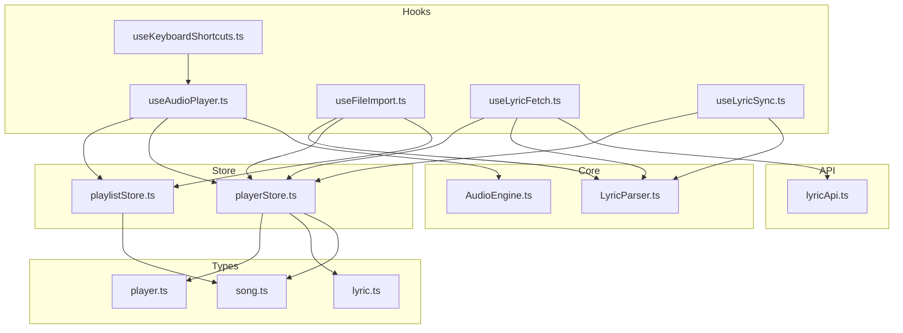
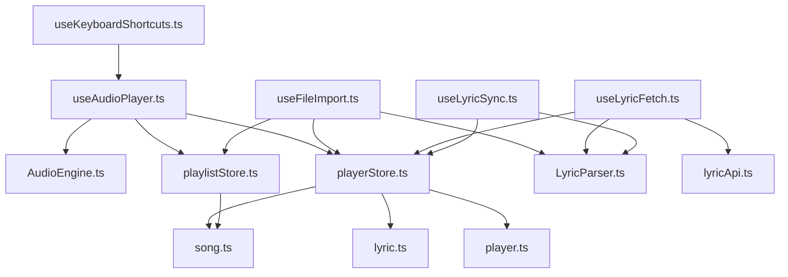
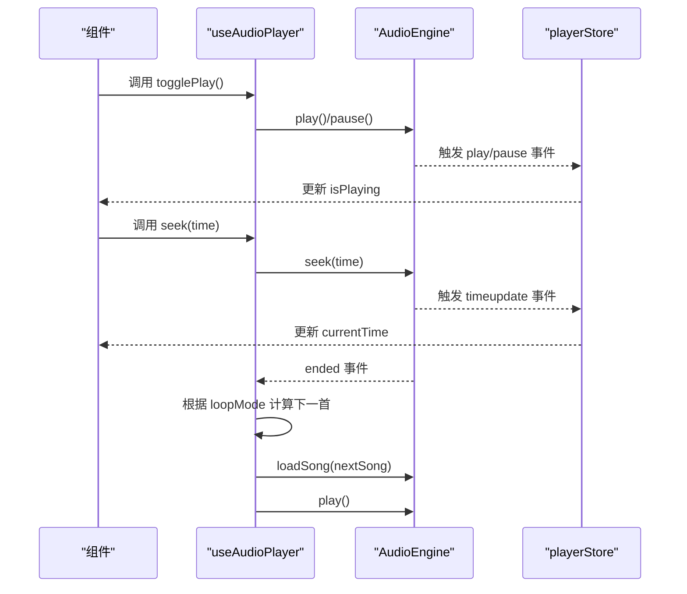
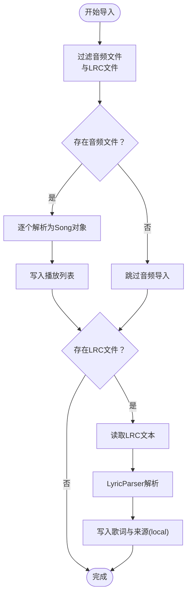
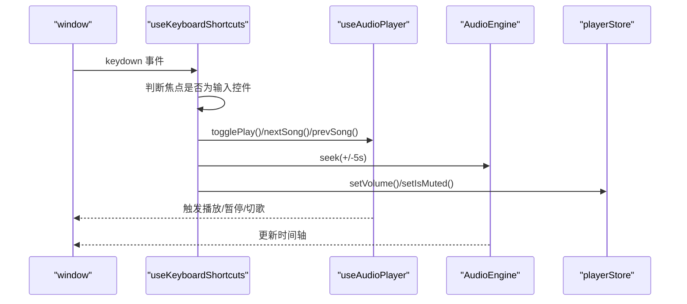
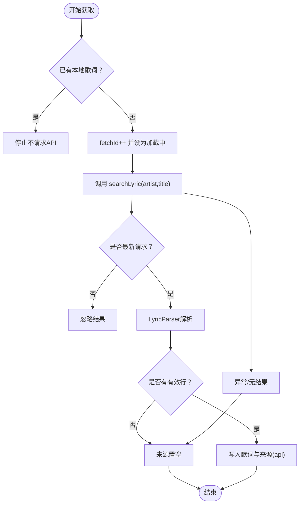
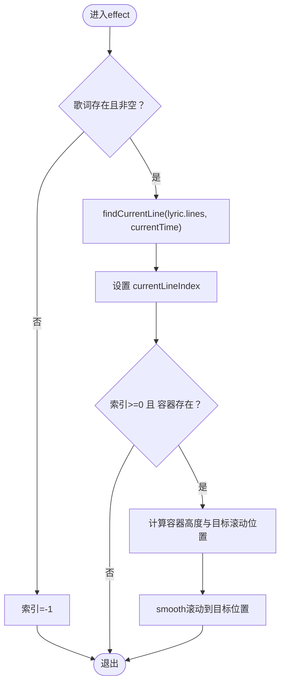
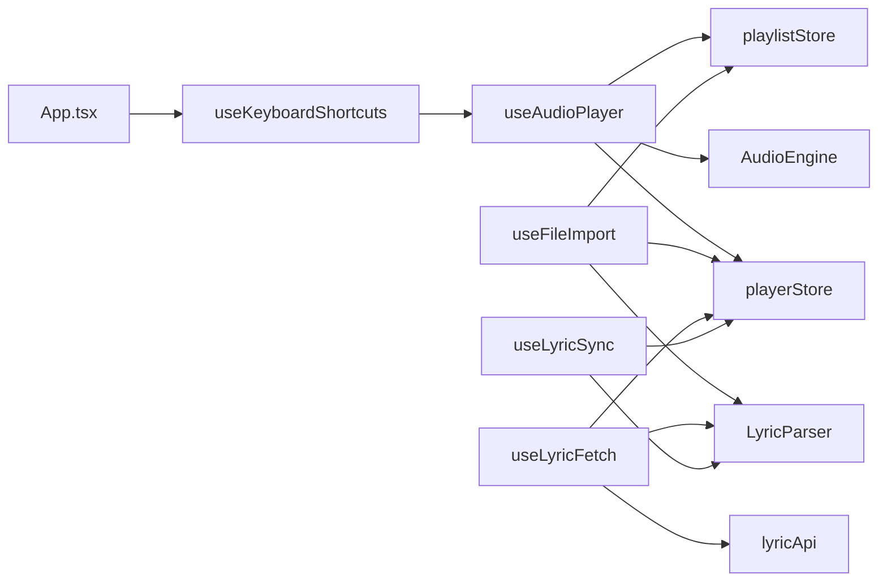

# 自定义Hook模块

<cite>
**本文引用的文件**
- [src/hooks/useAudioPlayer.ts](file://src/hooks/useAudioPlayer.ts)
- [src/hooks/useFileImport.ts](file://src/hooks/useFileImport.ts)
- [src/hooks/useKeyboardShortcuts.ts](file://src/hooks/useKeyboardShortcuts.ts)
- [src/hooks/useLyricFetch.ts](file://src/hooks/useLyricFetch.ts)
- [src/hooks/useLyricSync.ts](file://src/hooks/useLyricSync.ts)
- [src/core/AudioEngine.ts](file://src/core/AudioEngine.ts)
- [src/core/LyricParser.ts](file://src/core/LyricParser.ts)
- [src/store/playerStore.ts](file://src/store/playerStore.ts)
- [src/store/playlistStore.ts](file://src/store/playlistStore.ts)
- [src/api/lyricApi.ts](file://src/api/lyricApi.ts)
- [src/types/player.ts](file://src/types/player.ts)
- [src/types/lyric.ts](file://src/types/lyric.ts)
- [src/types/song.ts](file://src/types/song.ts)
- [src/App.tsx](file://src/App.tsx)
</cite>

## 目录
1. [简介](#简介)
2. [项目结构](#项目结构)
3. [核心组件](#核心组件)
4. [架构总览](#架构总览)
5. [详细组件分析](#详细组件分析)
6. [依赖分析](#依赖分析)
7. [性能考虑](#性能考虑)
8. [故障排查指南](#故障排查指南)
9. [结论](#结论)
10. [附录](#附录)

## 简介
本文件系统性梳理并解读项目中的自定义Hook模块，重点覆盖以下核心Hook：useAudioPlayer、useFileImport、useKeyboardShortcuts、useLyricFetch、useLyricSync。文档从设计模式、业务逻辑封装、状态共享与副作用处理策略出发，解释各Hook之间的依赖关系与协作方式；同时给出参数配置、返回值设计、错误处理方式、使用示例与最佳实践，帮助开发者高效组合使用这些Hook并进行性能优化与调试。

## 项目结构
自定义Hook位于 src/hooks 目录，围绕播放器状态管理（Zustand）、音频引擎（HTMLAudioElement封装）、歌词解析与网络API展开。主要文件组织如下：
- Hooks：useAudioPlayer、useFileImport、useKeyboardShortcuts、useLyricFetch、useLyricSync
- Store：playerStore、playlistStore（Zustand状态）
- Core：AudioEngine（音频引擎）、LyricParser（歌词解析）
- API：lyricApi（歌词搜索）
- Types：song、lyric、player（类型定义）

图表来源
- [src/hooks/useAudioPlayer.ts](file://src/hooks/useAudioPlayer.ts#L1-L131)
- [src/hooks/useFileImport.ts](file://src/hooks/useFileImport.ts#L1-L78)
- [src/hooks/useKeyboardShortcuts.ts](file://src/hooks/useKeyboardShortcuts.ts#L1-L73)
- [src/hooks/useLyricFetch.ts](file://src/hooks/useLyricFetch.ts#L1-L95)
- [src/hooks/useLyricSync.ts](file://src/hooks/useLyricSync.ts#L1-L33)
- [src/core/AudioEngine.ts](file://src/core/AudioEngine.ts#L1-L143)
- [src/core/LyricParser.ts](file://src/core/LyricParser.ts#L1-L101)
- [src/store/playerStore.ts](file://src/store/playerStore.ts#L1-L95)
- [src/store/playlistStore.ts](file://src/store/playlistStore.ts#L1-L88)
- [src/api/lyricApi.ts](file://src/api/lyricApi.ts#L1-L129)
- [src/types/song.ts](file://src/types/song.ts#L1-L14)
- [src/types/lyric.ts](file://src/types/lyric.ts#L1-L21)
- [src/types/player.ts](file://src/types/player.ts#L1-L4)

章节来源
- [src/hooks/useAudioPlayer.ts](file://src/hooks/useAudioPlayer.ts#L1-L131)
- [src/hooks/useFileImport.ts](file://src/hooks/useFileImport.ts#L1-L78)
- [src/hooks/useKeyboardShortcuts.ts](file://src/hooks/useKeyboardShortcuts.ts#L1-L73)
- [src/hooks/useLyricFetch.ts](file://src/hooks/useLyricFetch.ts#L1-L95)
- [src/hooks/useLyricSync.ts](file://src/hooks/useLyricSync.ts#L1-L33)
- [src/core/AudioEngine.ts](file://src/core/AudioEngine.ts#L1-L143)
- [src/core/LyricParser.ts](file://src/core/LyricParser.ts#L1-L101)
- [src/store/playerStore.ts](file://src/store/playerStore.ts#L1-L95)
- [src/store/playlistStore.ts](file://src/store/playlistStore.ts#L1-L88)
- [src/api/lyricApi.ts](file://src/api/lyricApi.ts#L1-L129)
- [src/types/player.ts](file://src/types/player.ts#L1-L4)
- [src/types/lyric.ts](file://src/types/lyric.ts#L1-L21)
- [src/types/song.ts](file://src/types/song.ts#L1-L14)

## 核心组件
本节对五个自定义Hook进行要点提炼与职责划分：
- useAudioPlayer：统一管理播放、暂停、切歌、进度跳转、音量与循环模式，桥接AudioEngine与Zustand状态。
- useFileImport：处理本地音频与LRC歌词文件导入，生成Song对象并写入播放列表，支持歌词解析与来源标记。
- useKeyboardShortcuts：全局键盘监听，调用useAudioPlayer提供的播放控制与seek操作，配合音量与静音切换。
- useLyricFetch：基于API的歌词智能获取，包含防抖/竞态控制、缓存与加载状态管理，支持自动与手动刷新。
- useLyricSync：根据播放时间同步高亮歌词行，滚动定位至居中位置，提供容器引用以供滚动控制。

章节来源
- [src/hooks/useAudioPlayer.ts](file://src/hooks/useAudioPlayer.ts#L6-L130)
- [src/hooks/useFileImport.ts](file://src/hooks/useFileImport.ts#L33-L77)
- [src/hooks/useKeyboardShortcuts.ts](file://src/hooks/useKeyboardShortcuts.ts#L6-L72)
- [src/hooks/useLyricFetch.ts](file://src/hooks/useLyricFetch.ts#L12-L94)
- [src/hooks/useLyricSync.ts](file://src/hooks/useLyricSync.ts#L5-L32)

## 架构总览
下图展示Hook与核心模块的交互关系：useAudioPlayer依赖AudioEngine与两个Zustand Store；useFileImport依赖LyricParser与Store；useKeyboardShortcuts依赖useAudioPlayer；useLyricFetch依赖API与LyricParser；useLyricSync依赖LyricParser与Store。

图表来源
- [src/hooks/useAudioPlayer.ts](file://src/hooks/useAudioPlayer.ts#L1-L131)
- [src/hooks/useFileImport.ts](file://src/hooks/useFileImport.ts#L1-L78)
- [src/hooks/useKeyboardShortcuts.ts](file://src/hooks/useKeyboardShortcuts.ts#L1-L73)
- [src/hooks/useLyricFetch.ts](file://src/hooks/useLyricFetch.ts#L1-L95)
- [src/hooks/useLyricSync.ts](file://src/hooks/useLyricSync.ts#L1-L33)
- [src/core/AudioEngine.ts](file://src/core/AudioEngine.ts#L1-L143)
- [src/core/LyricParser.ts](file://src/core/LyricParser.ts#L1-L101)
- [src/store/playerStore.ts](file://src/store/playerStore.ts#L1-L95)
- [src/store/playlistStore.ts](file://src/store/playlistStore.ts#L1-L88)
- [src/api/lyricApi.ts](file://src/api/lyricApi.ts#L1-L129)
- [src/types/song.ts](file://src/types/song.ts#L1-L14)
- [src/types/lyric.ts](file://src/types/lyric.ts#L1-L21)
- [src/types/player.ts](file://src/types/player.ts#L1-L4)

## 详细组件分析

### useAudioPlayer 分析
- 设计模式：命令式与声明式结合，通过回调函数暴露播放控制能力，内部使用useEffect绑定AudioEngine事件，驱动Zustand状态更新。
- 关键副作用：
  - 初始化阶段订阅timeupdate/durationchange/play/pause/ended事件，将引擎状态映射到播放器Store。
  - 监听音量/静音变化，同步到引擎。
  - 结束事件触发下一首逻辑，支持单曲循环、随机与列表循环三种模式。
- 状态共享机制：
  - 读取播放器Store中的isPlaying、volume、isMuted、currentSong、currentIndex、loopMode等。
  - 写入currentTime、duration、currentSong与索引。
- 处理策略：
  - 播放失败（浏览器自动播放限制）捕获异常，等待用户交互后重试。
  - seek同时更新Store与引擎，保证UI与引擎一致。
- 返回值设计：返回togglePlay、nextSong、prevSong、seek、playSongAtIndex等方法，以及当前播放状态与歌曲信息。
- 参数配置：playSongAtIndex接收索引；seek接收目标时间；togglePlay按当前状态决定播放或暂停。
- 错误处理：播放异常时静默处理，避免中断流程；结束事件内通过模式判断与随机算法确保不卡死。

图表来源
- [src/hooks/useAudioPlayer.ts](file://src/hooks/useAudioPlayer.ts#L15-L36)
- [src/hooks/useAudioPlayer.ts](file://src/hooks/useAudioPlayer.ts#L64-L75)
- [src/hooks/useAudioPlayer.ts](file://src/hooks/useAudioPlayer.ts#L77-L90)
- [src/hooks/useAudioPlayer.ts](file://src/hooks/useAudioPlayer.ts#L116-L119)
- [src/core/AudioEngine.ts](file://src/core/AudioEngine.ts#L23-L45)
- [src/store/playerStore.ts](file://src/store/playerStore.ts#L24-L38)

章节来源
- [src/hooks/useAudioPlayer.ts](file://src/hooks/useAudioPlayer.ts#L6-L130)
- [src/core/AudioEngine.ts](file://src/core/AudioEngine.ts#L1-L143)
- [src/store/playerStore.ts](file://src/store/playerStore.ts#L8-L40)

### useFileImport 分析
- 设计模式：文件过滤与批量处理，将本地音频转换为Song对象并写入播放列表；LRC文件解析后写入歌词Store。
- 关键逻辑：
  - 音频文件识别：按MIME类型或扩展名过滤。
  - 歌名/歌手解析：尝试从文件名“歌手 - 歌名”格式提取；默认未知歌手。
  - 歌词导入：读取LRC文本，交由LyricParser解析，设置歌词与来源为local。
- 状态共享机制：通过playlistStore写入歌曲；通过playerStore写入歌词与歌词来源。
- 处理策略：仅当存在有效音频文件时才添加；LRC解析失败或为空时保持无歌词状态。
- 返回值设计：导出importFiles/importAudioFiles/importLrcFile三个方法，便于在拖拽区或上传入口复用。
- 参数配置：接收FileList或File[]；返回已解析的Song数组。
- 错误处理：LRC解析异常时静默忽略，避免阻断整体导入流程。

图表来源
- [src/hooks/useFileImport.ts](file://src/hooks/useFileImport.ts#L37-L49)
- [src/hooks/useFileImport.ts](file://src/hooks/useFileImport.ts#L51-L58)
- [src/hooks/useFileImport.ts](file://src/hooks/useFileImport.ts#L60-L74)
- [src/core/LyricParser.ts](file://src/core/LyricParser.ts#L18-L81)
- [src/store/playlistStore.ts](file://src/store/playlistStore.ts#L36-L38)
- [src/store/playerStore.ts](file://src/store/playerStore.ts#L74-L76)

章节来源
- [src/hooks/useFileImport.ts](file://src/hooks/useFileImport.ts#L1-L78)
- [src/core/LyricParser.ts](file://src/core/LyricParser.ts#L1-L101)
- [src/store/playlistStore.ts](file://src/store/playlistStore.ts#L1-L88)
- [src/store/playerStore.ts](file://src/store/playerStore.ts#L1-L95)

### useKeyboardShortcuts 分析
- 设计模式：全局事件监听，按键分发到useAudioPlayer与AudioEngine，避免在输入控件中触发。
- 关键逻辑：
  - 空格：播放/暂停
  - N/P：下一首/上一首
  - 方向键：快进/快退、增大/减小音量、M键静音切换
  - 防输入干扰：忽略INPUT/TEXTAREA/SELECT焦点。
- 依赖关系：直接依赖useAudioPlayer提供的方法，间接依赖playerStore与AudioEngine。
- 处理策略：preventDefault避免默认滚动与表单行为；音量调节通过playerStore状态更新。
- 返回值设计：无返回值，副作用在effect中注册与清理。
- 参数配置：无外部参数，依赖useAudioPlayer与AudioEngine内部状态。
- 错误处理：按键分支明确，无显式try/catch，依赖被调用方法的内部容错。

图表来源
- [src/hooks/useKeyboardShortcuts.ts](file://src/hooks/useKeyboardShortcuts.ts#L9-L71)
- [src/hooks/useAudioPlayer.ts](file://src/hooks/useAudioPlayer.ts#L77-L114)
- [src/core/AudioEngine.ts](file://src/core/AudioEngine.ts#L67-L87)
- [src/store/playerStore.ts](file://src/store/playerStore.ts#L27-L36)

章节来源
- [src/hooks/useKeyboardShortcuts.ts](file://src/hooks/useKeyboardShortcuts.ts#L1-L73)
- [src/hooks/useAudioPlayer.ts](file://src/hooks/useAudioPlayer.ts#L1-L131)
- [src/core/AudioEngine.ts](file://src/core/AudioEngine.ts#L1-L143)
- [src/store/playerStore.ts](file://src/store/playerStore.ts#L1-L95)

### useLyricFetch 分析
- 设计模式：异步获取+防抖/竞态控制，结合本地缓存与加载状态，支持自动与手动刷新。
- 关键逻辑：
  - 自动获取：仅在无本地歌词时触发API请求；清空旧歌词与来源。
  - 手动刷新：强制清空并重新请求。
  - 防抖/竞态：fetchIdRef递增，若结果不是最新请求则忽略。
  - 缓存：命中localStorage缓存直接返回；成功后写入缓存。
- 状态共享机制：通过playerStore设置歌词、歌词来源与加载状态。
- 处理策略：API失败或无结果时将来源置空；finally统一关闭loading。
- 返回值设计：返回autoFetchLyric、refreshLyric、fetchLyricFromApi三个方法。
- 参数配置：接收artist与title；返回布尔值表示是否成功获取到可用歌词。
- 错误处理：网络异常与解析异常均安全返回false，避免污染状态。

图表来源
- [src/hooks/useLyricFetch.ts](file://src/hooks/useLyricFetch.ts#L65-L79)
- [src/hooks/useLyricFetch.ts](file://src/hooks/useLyricFetch.ts#L84-L91)
- [src/hooks/useLyricFetch.ts](file://src/hooks/useLyricFetch.ts#L23-L60)
- [src/api/lyricApi.ts](file://src/api/lyricApi.ts#L86-L119)
- [src/core/LyricParser.ts](file://src/core/LyricParser.ts#L18-L81)
- [src/store/playerStore.ts](file://src/store/playerStore.ts#L74-L76)

章节来源
- [src/hooks/useLyricFetch.ts](file://src/hooks/useLyricFetch.ts#L1-L95)
- [src/api/lyricApi.ts](file://src/api/lyricApi.ts#L1-L129)
- [src/core/LyricParser.ts](file://src/core/LyricParser.ts#L1-L101)
- [src/store/playerStore.ts](file://src/store/playerStore.ts#L1-L95)

### useLyricSync 分析
- 设计模式：基于播放时间的歌词行高亮与滚动同步，使用二分查找定位当前行。
- 关键逻辑：
  - 当歌词存在且非空时，通过LyricParser的findCurrentLine计算当前行索引。
  - 使用容器ref与scrollTo平滑滚动至当前行居中位置。
- 状态共享机制：读取playerStore中的currentTime与lyric。
- 处理策略：索引小于0或容器不存在时跳过滚动；容器高度变化时自动重新计算滚动位置。
- 返回值设计：返回currentLineIndex与containerRef，供LyricDisplay组件使用。
- 参数配置：无外部参数，依赖playerStore与LyricParser。
- 错误处理：无显式异常，边界条件（空歌词、索引无效）通过条件判断规避。

图表来源
- [src/hooks/useLyricSync.ts](file://src/hooks/useLyricSync.ts#L11-L29)
- [src/core/LyricParser.ts](file://src/core/LyricParser.ts#L83-L100)
- [src/store/playerStore.ts](file://src/store/playerStore.ts#L9-L21)

章节来源
- [src/hooks/useLyricSync.ts](file://src/hooks/useLyricSync.ts#L1-L33)
- [src/core/LyricParser.ts](file://src/core/LyricParser.ts#L1-L101)
- [src/store/playerStore.ts](file://src/store/playerStore.ts#L1-L95)

## 依赖分析
- 组件耦合与内聚：
  - useAudioPlayer是核心枢纽，耦合AudioEngine与两个Store，内聚播放控制逻辑。
  - useFileImport与useLyricFetch分别耦合LyricParser与API，职责清晰。
  - useKeyboardShortcuts低耦合依赖useAudioPlayer，便于复用播放控制。
  - useLyricSync低耦合依赖LyricParser与Store，专注UI同步。
- 直接与间接依赖：
  - 直接：Hook → Store/Engine/Parser/API
  - 间接：App通过useKeyboardShortcuts注册全局快捷键；DragDropZone可调用useFileImport导入文件。
- 循环依赖：未发现循环依赖，模块间通过Hook与Store解耦。
- 外部依赖：Zustand持久化中间件、浏览器Audio API、localStorage缓存。

图表来源
- [src/App.tsx](file://src/App.tsx#L12-L22)
- [src/hooks/useKeyboardShortcuts.ts](file://src/hooks/useKeyboardShortcuts.ts#L6-L7)
- [src/hooks/useAudioPlayer.ts](file://src/hooks/useAudioPlayer.ts#L1-L131)
- [src/hooks/useFileImport.ts](file://src/hooks/useFileImport.ts#L1-L78)
- [src/hooks/useLyricFetch.ts](file://src/hooks/useLyricFetch.ts#L1-L95)
- [src/hooks/useLyricSync.ts](file://src/hooks/useLyricSync.ts#L1-L33)
- [src/core/AudioEngine.ts](file://src/core/AudioEngine.ts#L1-L143)
- [src/core/LyricParser.ts](file://src/core/LyricParser.ts#L1-L101)
- [src/api/lyricApi.ts](file://src/api/lyricApi.ts#L1-L129)
- [src/store/playerStore.ts](file://src/store/playerStore.ts#L1-L95)
- [src/store/playlistStore.ts](file://src/store/playlistStore.ts#L1-L88)

章节来源
- [src/App.tsx](file://src/App.tsx#L1-L98)
- [src/hooks/useKeyboardShortcuts.ts](file://src/hooks/useKeyboardShortcuts.ts#L1-L73)
- [src/hooks/useAudioPlayer.ts](file://src/hooks/useAudioPlayer.ts#L1-L131)
- [src/hooks/useFileImport.ts](file://src/hooks/useFileImport.ts#L1-L78)
- [src/hooks/useLyricFetch.ts](file://src/hooks/useLyricFetch.ts#L1-L95)
- [src/hooks/useLyricSync.ts](file://src/hooks/useLyricSync.ts#L1-L33)
- [src/core/AudioEngine.ts](file://src/core/AudioEngine.ts#L1-L143)
- [src/core/LyricParser.ts](file://src/core/LyricParser.ts#L1-L101)
- [src/api/lyricApi.ts](file://src/api/lyricApi.ts#L1-L129)
- [src/store/playerStore.ts](file://src/store/playerStore.ts#L1-L95)
- [src/store/playlistStore.ts](file://src/store/playlistStore.ts#L1-L88)

## 性能考虑
- 防抖与竞态控制：useLyricFetch通过fetchIdRef避免快速切歌导致的竞态与重复渲染。
- 事件订阅与清理：useAudioPlayer在初始化时仅订阅一次事件；useKeyboardShortcuts在组件卸载时移除监听。
- 状态粒度：playerStore与playlistStore拆分职责，减少无关状态更新带来的重渲染。
- 持久化：Zustand持久化中间件仅保存必要字段，降低存储开销。
- 滚动优化：useLyricSync使用smooth滚动并仅在索引有效时执行，避免不必要的DOM操作。
- 缓存：useLyricFetch结合localStorage缓存，显著降低重复请求成本。

## 故障排查指南
- 播放失败（自动播放限制）：
  - 现象：首次播放抛出异常或无声。
  - 处理：等待用户交互（点击/触摸）后再次调用play；useAudioPlayer内部已捕获并提示。
  - 参考路径：[src/hooks/useAudioPlayer.ts](file://src/hooks/useAudioPlayer.ts#L70-L75)
- 快捷键无效：
  - 现象：在输入框中按下快捷键无响应。
  - 处理：确认焦点不在INPUT/TEXTAREA/SELECT；检查useKeyboardShortcuts是否正确注册。
  - 参考路径：[src/hooks/useKeyboardShortcuts.ts](file://src/hooks/useKeyboardShortcuts.ts#L11-L13)
- 歌词未显示：
  - 现象：播放歌曲但歌词不出现。
  - 处理：确认是否为本地LRC；若为在线歌曲，检查useLyricFetch是否成功获取；查看playerStore.lyric与lyricSource。
  - 参考路径：[src/hooks/useLyricFetch.ts](file://src/hooks/useLyricFetch.ts#L65-L79), [src/store/playerStore.ts](file://src/store/playerStore.ts#L19-L22)
- 歌词滚动不同步：
  - 现象：当前行高亮与滚动位置不一致。
  - 处理：确认LyricDisplay容器ref正确传入；检查findCurrentLine返回索引；确保容器高度有效。
  - 参考路径：[src/hooks/useLyricSync.ts](file://src/hooks/useLyricSync.ts#L20-L29), [src/core/LyricParser.ts](file://src/core/LyricParser.ts#L83-L100)
- 导入文件无反应：
  - 现象：拖拽音频/LRC无效果。
  - 处理：确认文件类型匹配；检查useFileImport的过滤逻辑与返回值；查看playlistStore与playerStore是否更新。
  - 参考路径：[src/hooks/useFileImport.ts](file://src/hooks/useFileImport.ts#L37-L49), [src/store/playlistStore.ts](file://src/store/playlistStore.ts#L36-L38), [src/store/playerStore.ts](file://src/store/playerStore.ts#L74-L76)

章节来源
- [src/hooks/useAudioPlayer.ts](file://src/hooks/useAudioPlayer.ts#L70-L75)
- [src/hooks/useKeyboardShortcuts.ts](file://src/hooks/useKeyboardShortcuts.ts#L11-L13)
- [src/hooks/useLyricFetch.ts](file://src/hooks/useLyricFetch.ts#L65-L79)
- [src/hooks/useLyricSync.ts](file://src/hooks/useLyricSync.ts#L20-L29)
- [src/hooks/useFileImport.ts](file://src/hooks/useFileImport.ts#L37-L49)
- [src/store/playerStore.ts](file://src/store/playerStore.ts#L19-L22)
- [src/store/playlistStore.ts](file://src/store/playlistStore.ts#L36-L38)

## 结论
本Hook模块以Zustand为核心状态源，围绕AudioEngine与LyricParser构建了完整的播放与歌词体验。各Hook职责清晰、依赖明确，通过事件驱动与状态共享实现高内聚低耦合。建议在实际使用中遵循防抖/竞态控制、事件清理、状态最小化更新与缓存策略，以获得更佳的性能与稳定性。

## 附录
- 使用示例与最佳实践
  - 在根组件中注册全局快捷键：参考 [src/App.tsx](file://src/App.tsx#L21-L22)
  - 在拖拽区组件中调用文件导入：参考 [src/hooks/useFileImport.ts](file://src/hooks/useFileImport.ts#L37-L49)
  - 在歌词显示组件中使用同步Hook：参考 [src/hooks/useLyricSync.ts](file://src/hooks/useLyricSync.ts#L31)
  - 在播放控制组件中组合useAudioPlayer与useKeyboardShortcuts：参考 [src/hooks/useAudioPlayer.ts](file://src/hooks/useAudioPlayer.ts#L77-L114), [src/hooks/useKeyboardShortcuts.ts](file://src/hooks/useKeyboardShortcuts.ts#L6-L7)
- 类型与配置参考
  - 歌曲类型：[src/types/song.ts](file://src/types/song.ts#L1-L14)
  - 歌词类型：[src/types/lyric.ts](file://src/types/lyric.ts#L1-L21)
  - 播放器类型：[src/types/player.ts](file://src/types/player.ts#L1-L4)
  - 播放器状态：[src/store/playerStore.ts](file://src/store/playerStore.ts#L8-L40)
  - 播放列表状态：[src/store/playlistStore.ts](file://src/store/playlistStore.ts#L12-L27)
  - 歌词API配置：[src/api/lyricApi.ts](file://src/api/lyricApi.ts#L51-L78)