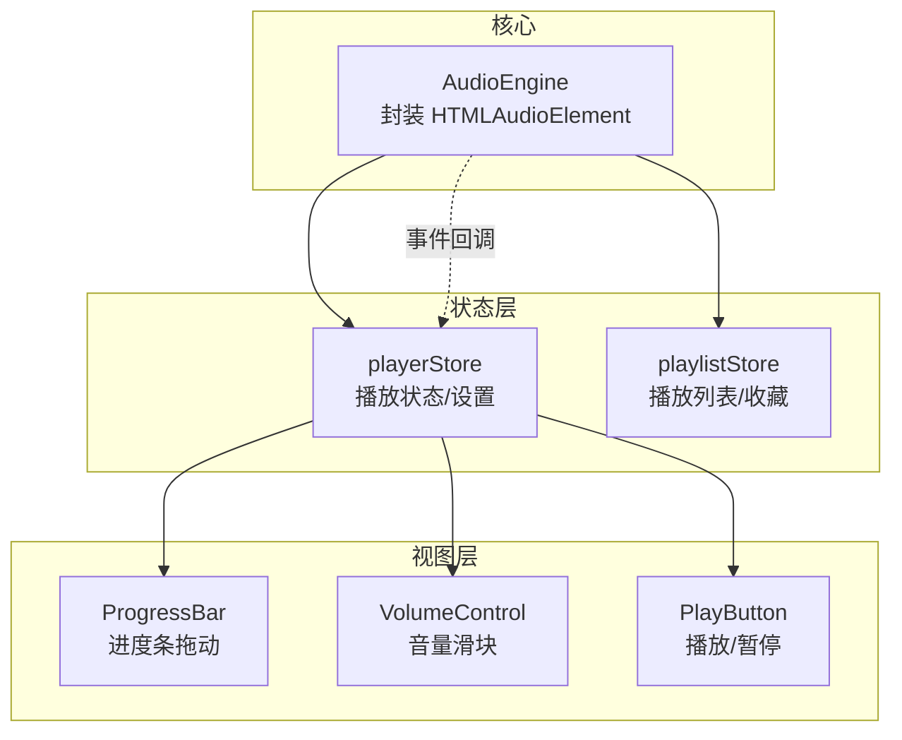
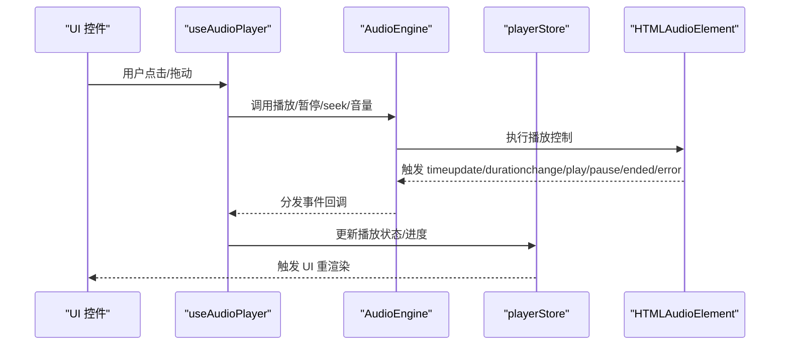
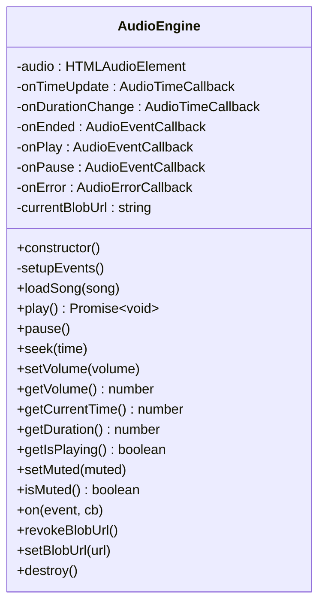
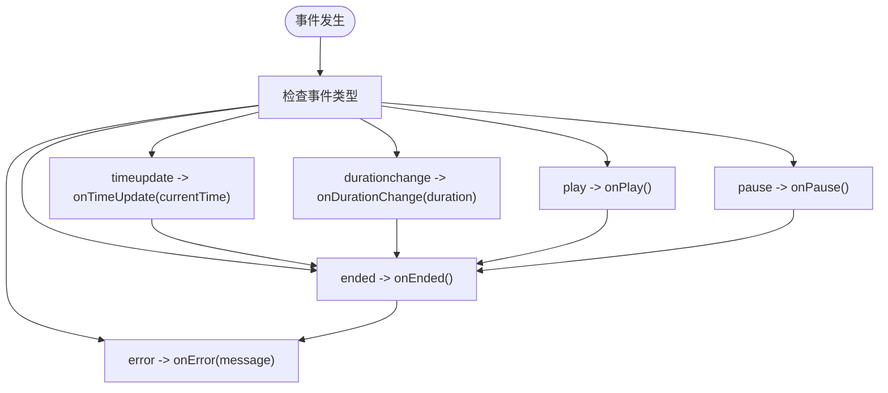
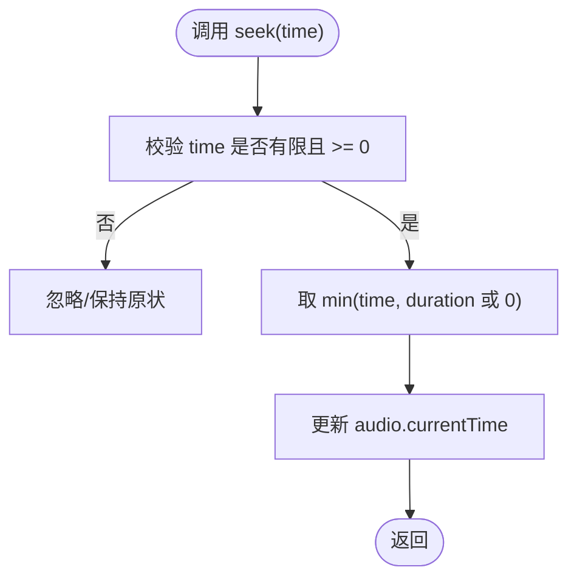
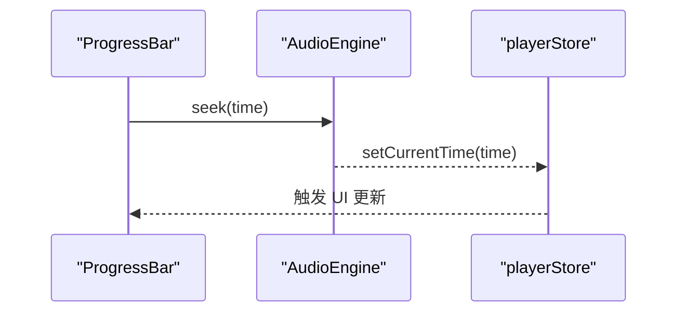
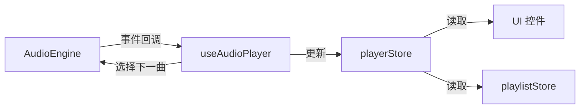
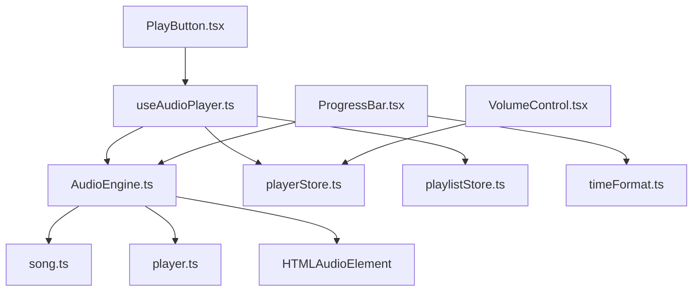

# 音频引擎模块

<cite>
**本文引用的文件列表**
- [AudioEngine.ts](file://src/core/AudioEngine.ts)
- [useAudioPlayer.ts](file://src/hooks/useAudioPlayer.ts)
- [playerStore.ts](file://src/store/playerStore.ts)
- [playlistStore.ts](file://src/store/playlistStore.ts)
- [song.ts](file://src/types/song.ts)
- [player.ts](file://src/types/player.ts)
- [ProgressBar.tsx](file://src/components/Controls/ProgressBar.tsx)
- [VolumeControl.tsx](file://src/components/Controls/VolumeControl.tsx)
- [PlayButton.tsx](file://src/components/Controls/PlayButton.tsx)
- [timeFormat.ts](file://src/utils/timeFormat.ts)
- [vendor.d.ts](file://src/types/vendor.d.ts)
</cite>

## 目录
1. [简介](#简介)
2. [项目结构](#项目结构)
3. [核心组件](#核心组件)
4. [架构总览](#架构总览)
5. [详细组件分析](#详细组件分析)
6. [依赖关系分析](#依赖关系分析)
7. [性能考量](#性能考量)
8. [故障排查指南](#故障排查指南)
9. [结论](#结论)
10. [附录](#附录)

## 简介
本文件系统性阐述“音频引擎模块”的设计与实现，重点围绕 AudioEngine 类展开，涵盖其对 HTMLAudioElement 的封装、事件监听机制、播放控制方法、错误处理与内存管理策略（含 Blob URL 处理）、生命周期管理以及与 UI 控件和状态管理的集成方式。文档同时提供 API 使用方法、最佳实践与性能优化建议，帮助开发者在不直接阅读源码的情况下也能高效理解与扩展该模块。

## 项目结构
音频引擎模块位于 src/core 目录，配合 React Hooks、Zustand 状态管理与 UI 控件共同构成完整的播放器体系：
- 核心：AudioEngine 封装 HTMLAudioElement，提供统一的播放控制与事件分发
- 状态：playerStore 与 playlistStore 维护播放状态、播放列表与用户设置
- 视图：ProgressBar、VolumeControl、PlayButton 等控件通过 Hook 与引擎交互
- 工具：timeFormat 提供时间格式化

图表来源
- [AudioEngine.ts](file://src/core/AudioEngine.ts#L1-L143)
- [playerStore.ts](file://src/store/playerStore.ts#L1-L95)
- [playlistStore.ts](file://src/store/playlistStore.ts#L1-L88)
- [ProgressBar.tsx](file://src/components/Controls/ProgressBar.tsx#L1-L83)
- [VolumeControl.tsx](file://src/components/Controls/VolumeControl.tsx#L1-L59)
- [PlayButton.tsx](file://src/components/Controls/PlayButton.tsx#L1-L17)

章节来源
- [AudioEngine.ts](file://src/core/AudioEngine.ts#L1-L143)
- [playerStore.ts](file://src/store/playerStore.ts#L1-L95)
- [playlistStore.ts](file://src/store/playlistStore.ts#L1-L88)
- [ProgressBar.tsx](file://src/components/Controls/ProgressBar.tsx#L1-L83)
- [VolumeControl.tsx](file://src/components/Controls/VolumeControl.tsx#L1-L59)
- [PlayButton.tsx](file://src/components/Controls/PlayButton.tsx#L1-L17)

## 核心组件
- AudioEngine：单例引擎，负责音频加载、播放、暂停、跳转、音量与静音控制、事件转发、错误处理、Blob URL 内存回收与销毁
- useAudioPlayer：React Hook，订阅引擎事件，同步播放状态，处理循环模式切换与下一首/上一首逻辑
- playerStore/playlistStore：Zustand 状态容器，保存当前歌曲、播放进度、音量、循环模式、播放列表等
- ProgressBar/VolumeControl/PlayButton：UI 控件，分别负责进度拖动、音量调节与播放控制

章节来源
- [AudioEngine.ts](file://src/core/AudioEngine.ts#L1-L143)
- [useAudioPlayer.ts](file://src/hooks/useAudioPlayer.ts#L1-L131)
- [playerStore.ts](file://src/store/playerStore.ts#L1-L95)
- [playlistStore.ts](file://src/store/playlistStore.ts#L1-L88)
- [ProgressBar.tsx](file://src/components/Controls/ProgressBar.tsx#L1-L83)
- [VolumeControl.tsx](file://src/components/Controls/VolumeControl.tsx#L1-L59)
- [PlayButton.tsx](file://src/components/Controls/PlayButton.tsx#L1-L17)

## 架构总览
AudioEngine 作为底层播放内核，向上提供统一 API；useAudioPlayer 负责业务逻辑与状态同步；UI 控件通过状态与 Hook 间接调用引擎。事件流从浏览器 HTMLAudioElement 事件出发，经由引擎转发至状态层，再驱动 UI 更新。

图表来源
- [useAudioPlayer.ts](file://src/hooks/useAudioPlayer.ts#L1-L131)
- [AudioEngine.ts](file://src/core/AudioEngine.ts#L1-L143)
- [playerStore.ts](file://src/store/playerStore.ts#L1-L95)

## 详细组件分析

### AudioEngine 类设计与实现
- 封装对象：内部持有 HTMLAudioElement 实例，并设置预加载策略
- 事件监听：在构造时注册 timeupdate、durationchange、ended、play、pause、error 六类事件，将原生事件映射为回调
- 播放控制：提供 play/pause/loadSong/seek/setVolume/getVolume/getCurrentTime/getDuration/getIsPlaying/setMuted/isMuted 等方法
- 错误处理：捕获 error 事件，提取错误信息并回调
- 内存管理：支持 Blob URL 的设置与撤销，避免内存泄漏
- 生命周期：destroy 方法统一暂停、清空资源、撤销 Blob URL

图表来源
- [AudioEngine.ts](file://src/core/AudioEngine.ts#L1-L143)

章节来源
- [AudioEngine.ts](file://src/core/AudioEngine.ts#L1-L143)

### 事件监听机制
- 原生事件到回调映射：timeupdate/durationchange/play/pause/ended/error 分别映射到 onTimeUpdate/onDurationChange/onPlay/onPause/onEnded/onError
- 回调注册：通过 on(event, cb) 注册对应事件回调，内部以 switch 匹配事件名
- 事件触发时机：由 HTMLAudioElement 在播放过程中按需触发，引擎负责转发给订阅者

图表来源
- [AudioEngine.ts](file://src/core/AudioEngine.ts#L23-L44)

章节来源
- [AudioEngine.ts](file://src/core/AudioEngine.ts#L23-L44)

### 播放控制 API 与实现要点
- 加载：loadSong(song) 暂停、重置时间、设置 src 并调用 load
- 播放：play() 返回 Promise，捕获异常并抛出，便于上层处理浏览器自动播放限制
- 暂停：pause() 直接暂停
- 跳转：seek(time) 安全边界校验，确保时间非负且不超过时长
- 音量：setVolume(volume) 将值约束在 0~1 之间
- 静音：setMuted(muted)/isMuted() 对应 muted 属性
- 查询：getCurrentTime()/getDuration()/getIsPlaying() 提供运行时状态查询

图表来源
- [AudioEngine.ts](file://src/core/AudioEngine.ts#L67-L71)

章节来源
- [AudioEngine.ts](file://src/core/AudioEngine.ts#L47-L99)

### 错误处理机制
- 原生 error 事件：捕获 HTMLAudioElement.error，提取 message 或回退为默认提示
- 上层处理：play() 捕获异常，提示“可能需要用户交互”，交由调用方决定后续行为（如等待用户手势）

章节来源
- [AudioEngine.ts](file://src/core/AudioEngine.ts#L41-L44)
- [AudioEngine.ts](file://src/core/AudioEngine.ts#L54-L61)

### 内存管理策略（Blob URL）
- 设置：setBlobUrl(url) 会先撤销旧 Blob URL，再记录新 URL
- 撤销：revokeBlobUrl() 在存在有效 URL 时调用 URL.revokeObjectURL 并清空
- 销毁：destroy() 统一暂停、清空 src、撤销 Blob URL，防止内存泄漏

章节来源
- [AudioEngine.ts](file://src/core/AudioEngine.ts#L118-L134)

### 生命周期管理
- 构造：初始化 HTMLAudioElement，设置 preload，绑定事件
- 运行：通过 Hook 订阅事件，同步状态
- 销毁：destroy() 清理资源，适合组件卸载或应用退出场景

章节来源
- [AudioEngine.ts](file://src/core/AudioEngine.ts#L17-L21)
- [AudioEngine.ts](file://src/core/AudioEngine.ts#L130-L134)

### 与 UI 控件的集成
- ProgressBar：鼠标拖动计算比例，调用引擎 seek 并同步当前时间
- VolumeControl：拖动更新音量，必要时取消静音
- PlayButton：根据 isPlaying 切换播放/暂停

图表来源
- [ProgressBar.tsx](file://src/components/Controls/ProgressBar.tsx#L14-L25)
- [useAudioPlayer.ts](file://src/hooks/useAudioPlayer.ts#L116-L119)

章节来源
- [ProgressBar.tsx](file://src/components/Controls/ProgressBar.tsx#L1-L83)
- [VolumeControl.tsx](file://src/components/Controls/VolumeControl.tsx#L1-L59)
- [PlayButton.tsx](file://src/components/Controls/PlayButton.tsx#L1-L17)
- [useAudioPlayer.ts](file://src/hooks/useAudioPlayer.ts#L116-L119)

### 与状态管理的集成
- useAudioPlayer：订阅引擎事件，同步播放状态、时长、播放中标志；根据循环模式自动切歌
- playerStore：保存播放状态、音量、静音、当前歌曲、索引、循环模式、播放器模式等
- playlistStore：维护播放列表、收藏、用户歌单

图表来源
- [useAudioPlayer.ts](file://src/hooks/useAudioPlayer.ts#L1-L131)
- [playerStore.ts](file://src/store/playerStore.ts#L1-L95)
- [playlistStore.ts](file://src/store/playlistStore.ts#L1-L88)

章节来源
- [useAudioPlayer.ts](file://src/hooks/useAudioPlayer.ts#L1-L131)
- [playerStore.ts](file://src/store/playerStore.ts#L1-L95)
- [playlistStore.ts](file://src/store/playlistStore.ts#L1-L88)

## 依赖关系分析
- 类型依赖：Song 接口定义音频元数据；LoopMode/PlayerMode/Quality 定义播放模式与音质
- 引擎依赖：HTMLAudioElement；UI 依赖 Hook；Hook 依赖 Zustand Store
- 外部模块：timeFormat 提供时间格式化；vendor.d.ts 声明第三方库模块

图表来源
- [AudioEngine.ts](file://src/core/AudioEngine.ts#L1-L143)
- [song.ts](file://src/types/song.ts#L1-L14)
- [player.ts](file://src/types/player.ts#L1-L4)
- [useAudioPlayer.ts](file://src/hooks/useAudioPlayer.ts#L1-L131)
- [playerStore.ts](file://src/store/playerStore.ts#L1-L95)
- [playlistStore.ts](file://src/store/playlistStore.ts#L1-L88)
- [ProgressBar.tsx](file://src/components/Controls/ProgressBar.tsx#L1-L83)
- [VolumeControl.tsx](file://src/components/Controls/VolumeControl.tsx#L1-L59)
- [PlayButton.tsx](file://src/components/Controls/PlayButton.tsx#L1-L17)
- [timeFormat.ts](file://src/utils/timeFormat.ts#L1-L7)

章节来源
- [song.ts](file://src/types/song.ts#L1-L14)
- [player.ts](file://src/types/player.ts#L1-L4)
- [vendor.d.ts](file://src/types/vendor.d.ts#L1-L3)

## 性能考量
- 预加载策略：构造时设置 preload 为 auto，有助于减少首帧延迟
- 事件频率：timeupdate 事件频繁触发，建议在 UI 中做节流或最小化重渲染
- 资源释放：及时调用 revokeBlobUrl 与 destroy，避免内存泄漏
- 自动播放限制：play() 可能因浏览器策略抛错，应等待用户交互后重试
- 循环模式：随机播放时注意避免重复选择同一首歌，已在 Hook 中实现防自循环

章节来源
- [AudioEngine.ts](file://src/core/AudioEngine.ts#L18-L21)
- [useAudioPlayer.ts](file://src/hooks/useAudioPlayer.ts#L47-L62)

## 故障排查指南
- 播放失败（自动播放限制）：捕获异常并提示“可能需要用户交互”，建议引导用户点击页面任意位置后再试
- 无法加载音频：检查 song.audioUrl 是否有效；确认网络与跨域配置
- 进度条无效：确认 ProgressBar 正确调用 seek 并同步当前时间；检查事件是否被正确订阅
- 音量无变化：确认 VolumeControl 已同步音量并取消静音；检查 setVolume 是否被调用
- Blob URL 导致内存占用：确保每次切换歌曲前调用 setBlobUrl，引擎会自动撤销旧 URL；应用退出时调用 destroy

章节来源
- [AudioEngine.ts](file://src/core/AudioEngine.ts#L54-L61)
- [ProgressBar.tsx](file://src/components/Controls/ProgressBar.tsx#L14-L25)
- [VolumeControl.tsx](file://src/components/Controls/VolumeControl.tsx#L14-L20)
- [useAudioPlayer.ts](file://src/hooks/useAudioPlayer.ts#L64-L75)

## 结论
AudioEngine 以简洁的封装实现了对 HTMLAudioElement 的统一抽象，结合事件回调与状态同步，为播放器提供了稳定可靠的播放内核。通过 Hook 与 UI 控件的解耦设计，模块具备良好的可扩展性与可维护性。遵循本文的最佳实践与性能建议，可在保证用户体验的同时降低资源消耗与风险。

## 附录

### API 参考（概要）
- 加载：loadSong(song)
- 播放：play()（返回 Promise）
- 暂停：pause()
- 跳转：seek(time)
- 音量：setVolume(volume)/getVolume()
- 静音：setMuted(muted)/isMuted()
- 查询：getCurrentTime()/getDuration()/getIsPlaying()
- 事件：on('timeupdate' | 'durationchange' | 'ended' | 'play' | 'pause' | 'error', cb)
- 内存：setBlobUrl(url)/revokeBlobUrl()/destroy()

章节来源
- [AudioEngine.ts](file://src/core/AudioEngine.ts#L47-L134)