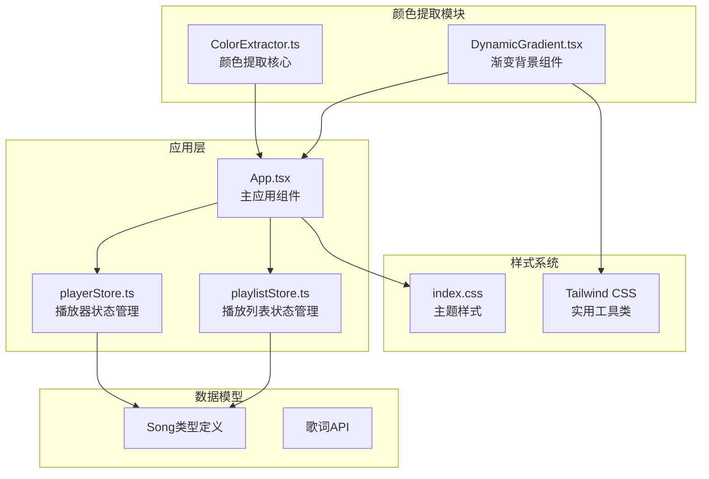
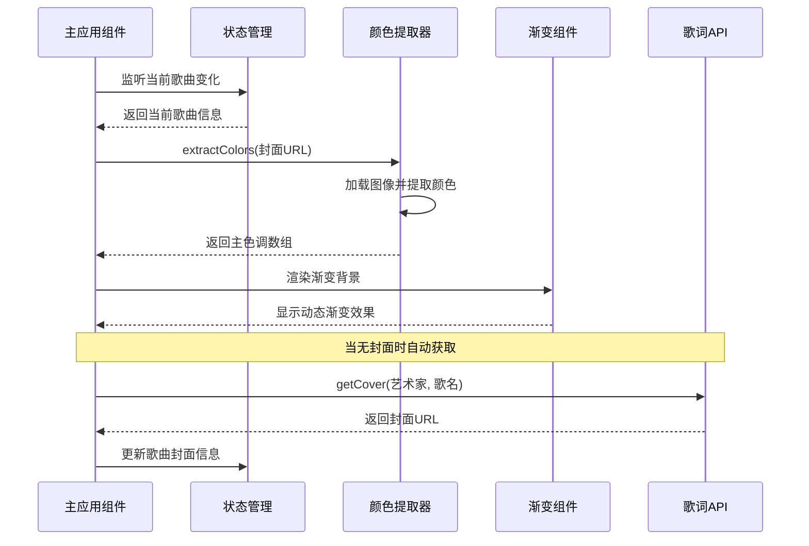
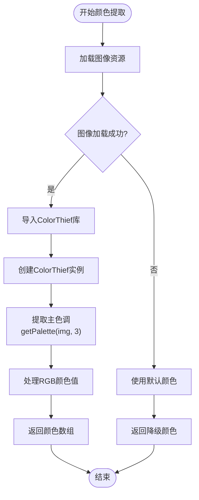
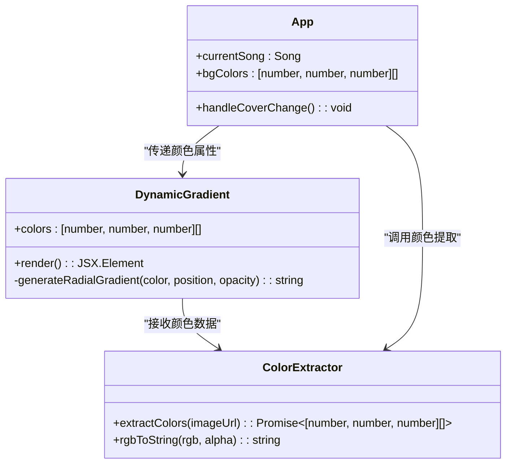
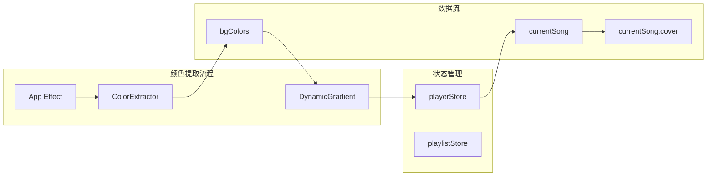
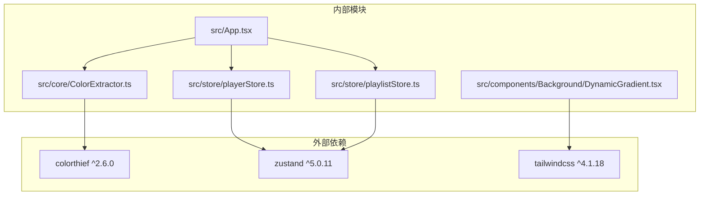

# 颜色提取模块

<cite>
**本文档引用的文件**
- [src/core/ColorExtractor.ts](file://src/core/ColorExtractor.ts)
- [src/components/Background/DynamicGradient.tsx](file://src/components/Background/DynamicGradient.tsx)
- [src/App.tsx](file://src/App.tsx)
- [src/store/playerStore.ts](file://src/store/playerStore.ts)
- [src/store/playlistStore.ts](file://src/store/playlistStore.ts)
- [src/types/song.ts](file://src/types/song.ts)
- [src/api/lyricApi.ts](file://src/api/lyricApi.ts)
- [src/index.css](file://src/index.css)
- [package.json](file://package.json)
</cite>

## 目录
1. [简介](#简介)
2. [项目结构](#项目结构)
3. [核心组件](#核心组件)
4. [架构概览](#架构概览)
5. [详细组件分析](#详细组件分析)
6. [依赖关系分析](#依赖关系分析)
7. [性能考虑](#性能考虑)
8. [故障排除指南](#故障排除指南)
9. [结论](#结论)

## 简介

颜色提取模块是音乐播放器项目中的一个关键功能组件，负责从专辑封面图片中提取主色调并生成动态渐变背景效果。该模块基于 ColorThief 库实现颜色提取算法，结合 React 组件系统实现实时的颜色变化和渐变渲染。

本模块的核心价值在于：
- **智能颜色提取**：通过 ColorThief 库实现高效的主色调提取
- **动态渐变渲染**：生成美观的径向渐变背景效果
- **实时响应**：当歌曲切换时自动更新背景颜色
- **容错处理**：具备完善的错误处理和降级机制

## 项目结构

颜色提取模块在项目中的组织结构如下：

**图表来源**
- [src/core/ColorExtractor.ts](file://src/core/ColorExtractor.ts#L1-L27)
- [src/components/Background/DynamicGradient.tsx](file://src/components/Background/DynamicGradient.tsx#L1-L22)
- [src/App.tsx](file://src/App.tsx#L1-L98)

**章节来源**
- [src/core/ColorExtractor.ts](file://src/core/ColorExtractor.ts#L1-L27)
- [src/components/Background/DynamicGradient.tsx](file://src/components/Background/DynamicGradient.tsx#L1-L22)
- [src/App.tsx](file://src/App.tsx#L1-L98)

## 核心组件

### ColorExtractor 颜色提取器

ColorExtractor 是整个模块的核心，负责处理图像颜色提取的完整流程。

**主要功能特性：**
- 异步图像加载和颜色提取
- 错误处理和降级机制
- RGB 颜色格式转换支持
- 跨域图像处理支持

**关键实现要点：**
- 使用原生 Image 对象进行异步加载
- 采用 ColorThief 库进行颜色聚类分析
- 实现完整的 Promise 包装确保异步安全性
- 提供默认颜色数组作为降级方案

**章节来源**
- [src/core/ColorExtractor.ts](file://src/core/ColorExtractor.ts#L1-L27)

### DynamicGradient 渐变背景组件

DynamicGradient 是一个专门用于渲染动态渐变背景的 React 组件。

**设计特点：**
- 接受颜色数组作为属性输入
- 使用径向渐变实现自然的色彩过渡
- 支持透明度和颜色混合效果
- 集成 CSS 过渡动画实现平滑颜色变化

**渐变算法：**
- 两个主要径向渐变叠加
- 第三个背景层提供深色基底
- 自动颜色映射到 RGB 格式
- 默认颜色提供无封面时的视觉体验

**章节来源**
- [src/components/Background/DynamicGradient.tsx](file://src/components/Background/DynamicGradient.tsx#L1-L22)

## 架构概览

颜色提取模块的整体架构采用分层设计，确保各组件职责清晰且松耦合。

**图表来源**
- [src/App.tsx](file://src/App.tsx#L24-L31)
- [src/core/ColorExtractor.ts](file://src/core/ColorExtractor.ts#L1-L20)
- [src/components/Background/DynamicGradient.tsx](file://src/components/Background/DynamicGradient.tsx#L5-L21)

**章节来源**
- [src/App.tsx](file://src/App.tsx#L15-L46)

## 详细组件分析

### 颜色提取算法实现

颜色提取模块的核心算法基于 ColorThief 库，实现了高效的主色调聚类分析。

**图表来源**
- [src/core/ColorExtractor.ts](file://src/core/ColorExtractor.ts#L1-L20)

**算法复杂度分析：**
- 时间复杂度：O(n)，其中 n 为像素数量
- 空间复杂度：O(k)，其中 k 为提取的颜色数量
- 颜色聚类：使用 K-means 算法进行颜色分类

**章节来源**
- [src/core/ColorExtractor.ts](file://src/core/ColorExtractor.ts#L1-L27)

### 渐变渲染系统

DynamicGradient 组件实现了多层次的渐变渲染效果。

**图表来源**
- [src/components/Background/DynamicGradient.tsx](file://src/components/Background/DynamicGradient.tsx#L1-L22)
- [src/core/ColorExtractor.ts](file://src/core/ColorExtractor.ts#L22-L26)
- [src/App.tsx](file://src/App.tsx#L19-L31)

**渐变效果实现：**
- 径向渐变圆点位置：(20%, 30%) 和 (80%, 70%)
- 颜色透明度：c1 使用 15% 透明度，c2 使用 10% 透明度
- 背景层次：两个渐变 + 深色基底 (#1a1a1a)
- 动画过渡：1000ms 的 CSS 过渡效果

**章节来源**
- [src/components/Background/DynamicGradient.tsx](file://src/components/Background/DynamicGradient.tsx#L5-L21)

### 状态管理系统集成

颜色提取模块与 Zustand 状态管理系统的深度集成。

**图表来源**
- [src/store/playerStore.ts](file://src/store/playerStore.ts#L39-L81)
- [src/App.tsx](file://src/App.tsx#L19-L31)

**状态同步机制：**
- 使用 React useEffect 监听歌曲封面变化
- 通过 useState 管理渐变颜色状态
- 自动触发组件重新渲染
- 支持空状态和错误状态处理

**章节来源**
- [src/store/playerStore.ts](file://src/store/playerStore.ts#L39-L81)
- [src/App.tsx](file://src/App.tsx#L19-L31)

## 依赖关系分析

颜色提取模块的依赖关系清晰明确，遵循最小依赖原则。

**图表来源**
- [package.json](file://package.json#L12-L21)
- [src/core/ColorExtractor.ts](file://src/core/ColorExtractor.ts#L7-L7)
- [src/App.tsx](file://src/App.tsx#L1-L13)

**依赖特性：**
- ColorThief：专业的颜色提取库
- Zustand：轻量级状态管理
- Tailwind CSS：实用优先的 CSS 框架
- React：组件化开发框架

**章节来源**
- [package.json](file://package.json#L12-L21)

## 性能考虑

颜色提取模块在性能方面采用了多项优化策略：

### 异步加载优化
- 图像资源异步加载，避免阻塞主线程
- Promise 包装确保异步操作的安全性
- 错误处理机制防止异常影响整体性能

### 内存管理
- 及时清理图像对象引用
- 避免内存泄漏
- 合理的缓存策略

### 渲染优化
- CSS 过渡动画由 GPU 加速
- 最小化的 DOM 操作
- 合理的颜色计算频率

### 用户体验优化
- 即时反馈机制
- 平滑的颜色过渡效果
- 容错降级方案

## 故障排除指南

### 常见问题及解决方案

**问题1：跨域图像加载失败**
- 现象：颜色提取失败，使用默认颜色
- 解决方案：确保服务器设置正确的 CORS 头部
- 预防措施：检查图片源的跨域配置

**问题2：ColorThief 库加载失败**
- 现象：运行时错误，颜色提取异常
- 解决方案：检查网络连接和库版本兼容性
- 预防措施：添加库加载超时机制

**问题3：颜色提取结果不理想**
- 现象：提取的颜色过于鲜艳或暗淡
- 解决方案：调整颜色提取参数
- 预防措施：实现颜色校正算法

**问题4：渐变渲染性能问题**
- 现象：页面滚动卡顿
- 解决方案：优化 CSS 过渡动画
- 预防措施：使用 CSS 硬件加速

**章节来源**
- [src/core/ColorExtractor.ts](file://src/core/ColorExtractor.ts#L11-L17)

## 结论

颜色提取模块通过精心设计的架构和算法实现了高效的颜色提取和动态渐变渲染功能。模块的主要优势包括：

**技术优势：**
- 基于专业库 ColorThief 的可靠颜色提取算法
- React 组件化的现代化架构设计
- 完善的错误处理和降级机制
- 与状态管理系统的无缝集成

**用户体验优势：**
- 即时的颜色响应和渐变效果
- 平滑的动画过渡体验
- 适配多种图片格式和尺寸
- 良好的性能表现

**扩展性考虑：**
- 模块化设计便于功能扩展
- 清晰的接口定义支持二次开发
- 与现代前端技术栈的良好兼容性

该模块为音乐播放器提供了出色的视觉体验，是项目中不可或缺的重要组成部分。