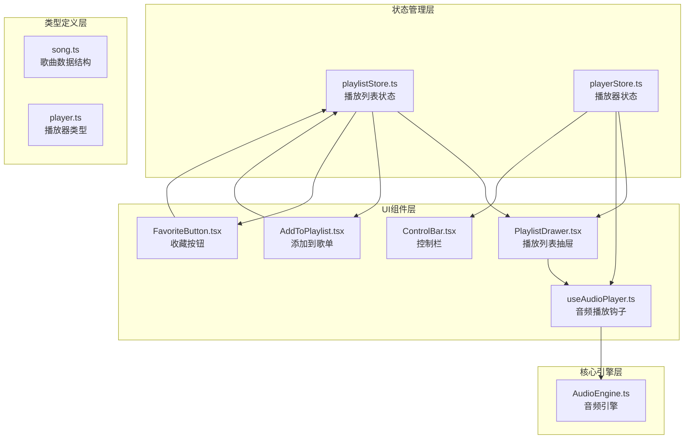
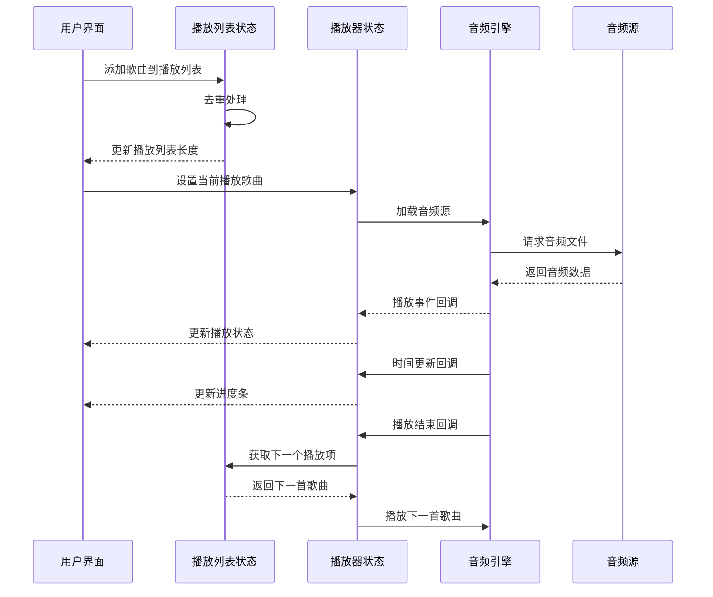
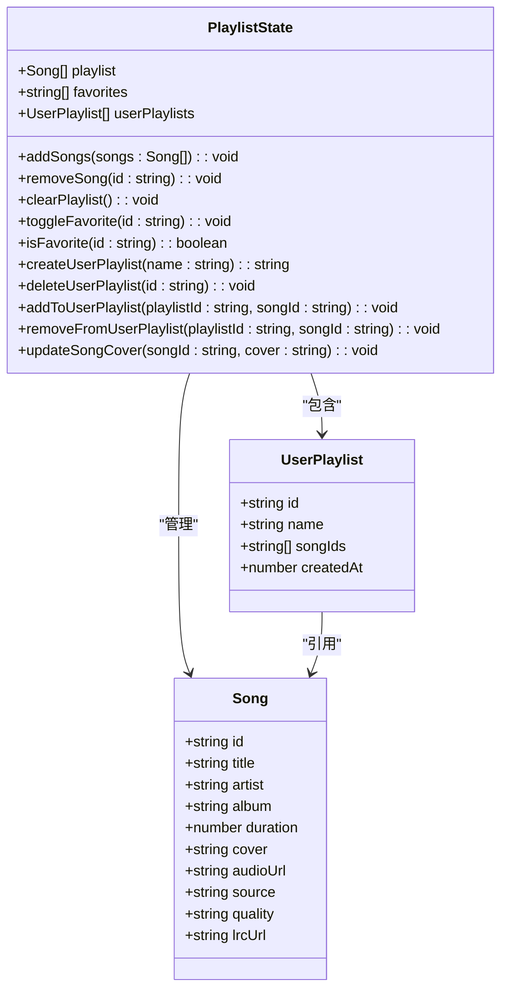
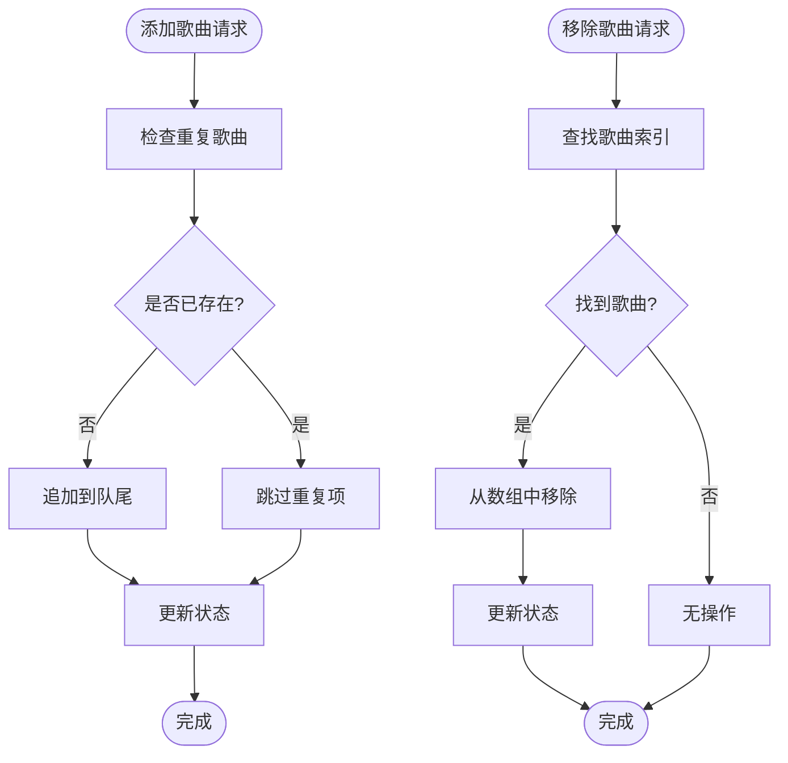
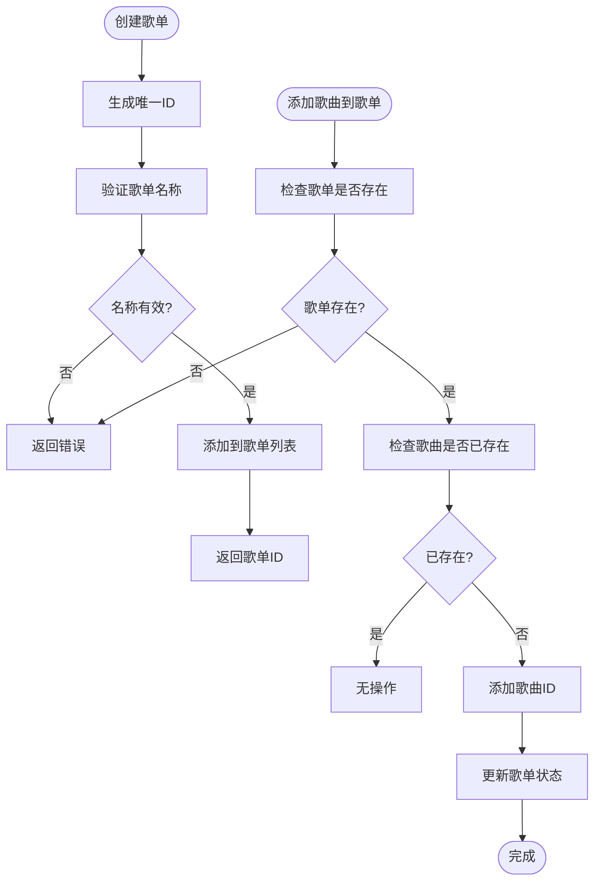
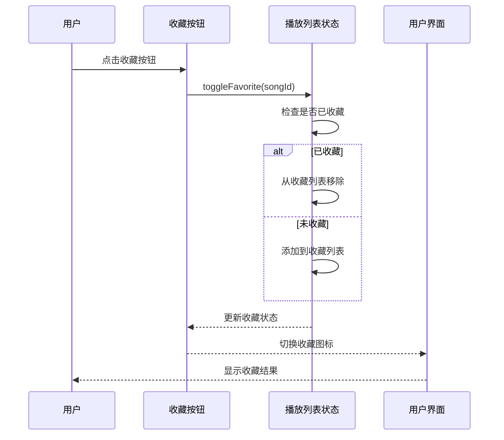
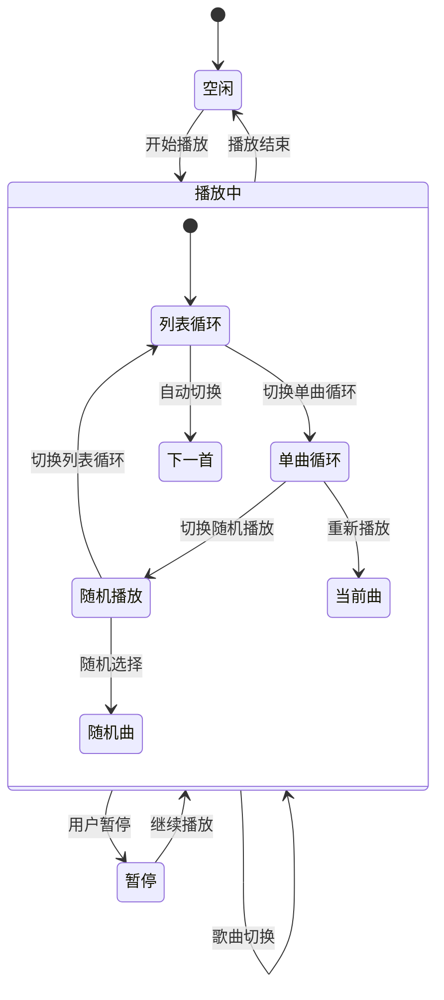
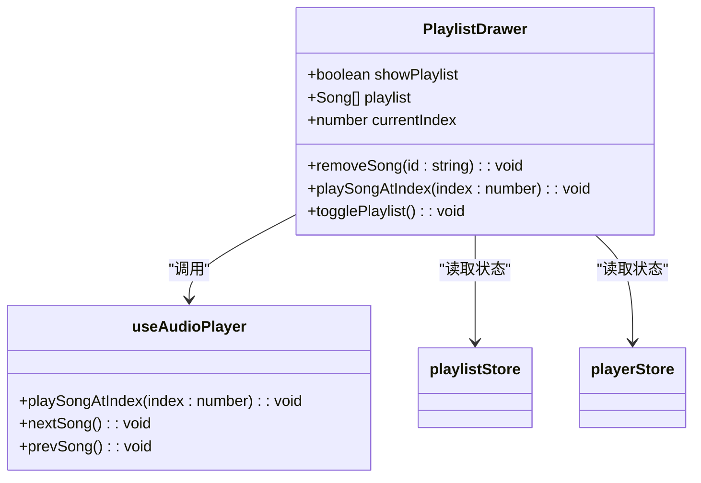
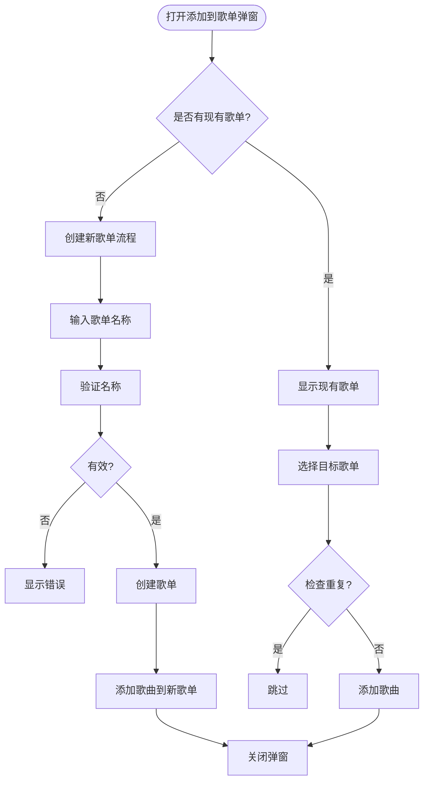
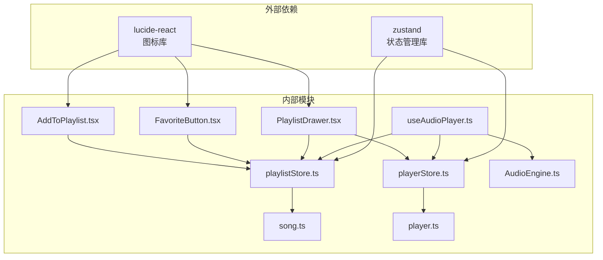

# 播放列表状态管理

<cite>
**本文档引用的文件**
- [playlistStore.ts](file://src/store/playlistStore.ts)
- [playerStore.ts](file://src/store/playerStore.ts)
- [song.ts](file://src/types/song.ts)
- [player.ts](file://src/types/player.ts)
- [PlaylistDrawer.tsx](file://src/components/Playlist/PlaylistDrawer.tsx)
- [useAudioPlayer.ts](file://src/hooks/useAudioPlayer.ts)
- [FavoriteButton.tsx](file://src/components/SongInfo/FavoriteButton.tsx)
- [AddToPlaylist.tsx](file://src/components/Playlist/AddToPlaylist.tsx)
- [ControlBar.tsx](file://src/components/Controls/ControlBar.tsx)
- [AudioEngine.ts](file://src/core/AudioEngine.ts)
- [App.tsx](file://src/App.tsx)
</cite>

## 目录
1. [简介](#简介)
2. [项目结构](#项目结构)
3. [核心组件](#核心组件)
4. [架构概览](#架构概览)
5. [详细组件分析](#详细组件分析)
6. [依赖关系分析](#依赖关系分析)
7. [性能考虑](#性能考虑)
8. [故障排除指南](#故障排除指南)
9. [结论](#结论)

## 简介

本文件深入解析音乐播放器项目的播放列表状态管理系统。该系统采用 Zustand 状态管理库，实现了完整的播放队列管理、用户歌单存储、收藏歌曲管理等功能。系统通过分离的播放器状态和播放列表状态，确保了清晰的职责划分和高效的性能表现。

## 项目结构

播放列表状态管理主要涉及以下核心模块：

**图表来源**
- [playlistStore.ts](file://src/store/playlistStore.ts#L1-L88)
- [playerStore.ts](file://src/store/playerStore.ts#L1-L95)
- [song.ts](file://src/types/song.ts#L1-L14)
- [player.ts](file://src/types/player.ts#L1-L4)

**章节来源**
- [playlistStore.ts](file://src/store/playlistStore.ts#L1-L88)
- [playerStore.ts](file://src/store/playerStore.ts#L1-L95)

## 核心组件

### 播放列表状态管理器

播放列表状态管理器是整个系统的核心，负责管理播放队列、用户歌单和收藏歌曲。其主要功能包括：

- **播放队列管理**：添加、移除、清空歌曲
- **用户歌单管理**：创建、删除、更新用户自定义歌单
- **收藏歌曲管理**：添加、移除收藏歌曲
- **状态持久化**：自动保存收藏和用户歌单数据

### 播放器状态管理器

播放器状态管理器专注于播放器的实时状态，包括：
- 播放/暂停状态
- 当前播放位置和总时长
- 音量和静音设置
- 循环模式和播放模式
- 当前播放歌曲索引

**章节来源**
- [playlistStore.ts](file://src/store/playlistStore.ts#L12-L27)
- [playerStore.ts](file://src/store/playerStore.ts#L8-L40)

## 架构概览

系统采用分层架构设计，通过状态分离实现高内聚低耦合：

**图表来源**
- [useAudioPlayer.ts](file://src/hooks/useAudioPlayer.ts#L15-L36)
- [playerStore.ts](file://src/store/playerStore.ts#L42-L82)
- [AudioEngine.ts](file://src/core/AudioEngine.ts#L23-L45)

## 详细组件分析

### 播放列表数据结构设计

播放列表系统采用简洁而高效的数据结构设计：

**图表来源**
- [playlistStore.ts](file://src/store/playlistStore.ts#L5-L27)
- [song.ts](file://src/types/song.ts#L1-L14)

#### 播放队列管理算法

播放队列采用数组结构，支持高效的随机访问和顺序遍历：

**图表来源**
- [playlistStore.ts](file://src/store/playlistStore.ts#L36-L42)

#### 用户歌单存储机制

用户歌单采用独立的数据结构，支持动态创建和管理：

**图表来源**
- [playlistStore.ts](file://src/store/playlistStore.ts#L49-L72)

**章节来源**
- [playlistStore.ts](file://src/store/playlistStore.ts#L5-L88)

### 收藏歌曲管理

收藏功能提供了用户个性化的内容管理能力：

**图表来源**
- [FavoriteButton.tsx](file://src/components/SongInfo/FavoriteButton.tsx#L11-L15)
- [playlistStore.ts](file://src/store/playlistStore.ts#L43-L47)

**章节来源**
- [FavoriteButton.tsx](file://src/components/SongInfo/FavoriteButton.tsx#L1-L30)
- [playlistStore.ts](file://src/store/playlistStore.ts#L20-L21)

### 播放器状态协调机制

播放器状态与播放列表状态通过紧密协作实现无缝的播放体验：

**图表来源**
- [useAudioPlayer.ts](file://src/hooks/useAudioPlayer.ts#L47-L62)
- [playerStore.ts](file://src/store/playerStore.ts#L67-L71)

#### 当前播放歌曲与播放列表的关系

系统通过 `currentIndex` 属性维护当前播放歌曲与播放列表的精确对应关系：

**章节来源**
- [useAudioPlayer.ts](file://src/hooks/useAudioPlayer.ts#L47-L114)
- [playerStore.ts](file://src/store/playerStore.ts#L15-L16)

### UI组件集成

#### 播放列表抽屉组件

播放列表抽屉提供了直观的播放队列管理界面：

**图表来源**
- [PlaylistDrawer.tsx](file://src/components/Playlist/PlaylistDrawer.tsx#L6-L12)
- [useAudioPlayer.ts](file://src/hooks/useAudioPlayer.ts#L64-L75)

**章节来源**
- [PlaylistDrawer.tsx](file://src/components/Playlist/PlaylistDrawer.tsx#L1-L70)

#### 添加到歌单功能

添加到歌单功能提供了灵活的用户歌单管理：

**图表来源**
- [AddToPlaylist.tsx](file://src/components/Playlist/AddToPlaylist.tsx#L33-L44)
- [AddToPlaylist.tsx](file://src/components/Playlist/AddToPlaylist.tsx#L103-L124)

**章节来源**
- [AddToPlaylist.tsx](file://src/components/Playlist/AddToPlaylist.tsx#L1-L131)

## 依赖关系分析

系统采用模块化设计，各组件间依赖关系清晰：

**图表来源**
- [playlistStore.ts](file://src/store/playlistStore.ts#L1-L3)
- [playerStore.ts](file://src/store/playerStore.ts#L1-L3)
- [useAudioPlayer.ts](file://src/hooks/useAudioPlayer.ts#L1-L4)

**章节来源**
- [playlistStore.ts](file://src/store/playlistStore.ts#L1-L88)
- [playerStore.ts](file://src/store/playerStore.ts#L1-L95)

## 性能考虑

### 状态更新优化

系统采用不可变更新策略，确保状态变更的可预测性和性能优化：

- **批量更新**：使用单个 `set` 调用更新多个状态字段
- **去重处理**：在添加歌曲时自动避免重复
- **选择性渲染**：组件只订阅需要的状态字段

### 内存管理

- **状态持久化**：仅持久化必要的用户数据（收藏和歌单）
- **音频资源管理**：及时释放不再使用的音频资源
- **事件监听清理**：组件卸载时自动清理事件监听器

### 并发安全

系统通过以下机制确保并发安全性：
- 使用原子状态更新操作
- 避免直接修改现有对象引用
- 提供线程安全的状态访问方法

## 故障排除指南

### 常见问题及解决方案

#### 播放列表不同步问题

**症状**：播放列表显示与实际播放状态不一致

**可能原因**：
- `currentIndex` 与 `playlist` 不匹配
- 状态更新时机问题

**解决方法**：
1. 确保调用 `setCurrentSong(song, index)` 时传入正确的索引
2. 检查播放列表的添加和移除操作是否正确更新索引

#### 收藏状态异常

**症状**：收藏按钮状态与实际收藏状态不符

**解决方法**：
1. 使用 `isFavorite()` 方法检查当前收藏状态
2. 确保 `toggleFavorite()` 操作在正确的组件上下文中执行

#### 音频播放问题

**症状**：音频无法正常播放或播放中断

**解决方法**：
1. 检查浏览器自动播放策略限制
2. 确认音频源 URL 的有效性
3. 验证音频格式兼容性

**章节来源**
- [useAudioPlayer.ts](file://src/hooks/useAudioPlayer.ts#L77-L90)
- [AudioEngine.ts](file://src/core/AudioEngine.ts#L107-L116)

## 结论

播放列表状态管理系统通过精心设计的数据结构和清晰的职责分离，实现了高效、可靠的音乐播放体验。系统的主要优势包括：

1. **模块化设计**：播放列表状态和播放器状态分离，职责明确
2. **高性能实现**：采用不可变数据结构和优化的状态更新策略
3. **用户体验友好**：提供直观的播放列表管理和个性化收藏功能
4. **扩展性强**：清晰的接口设计便于功能扩展和维护

该系统为音乐播放器应用提供了坚实的技术基础，能够支持复杂的播放场景和用户需求。