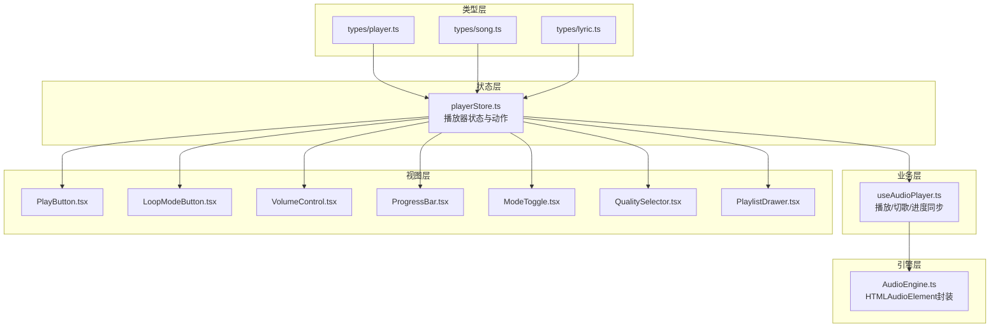
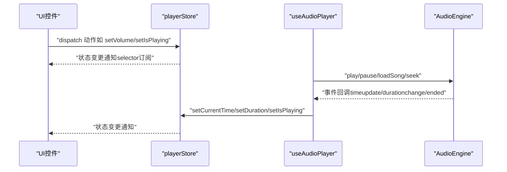
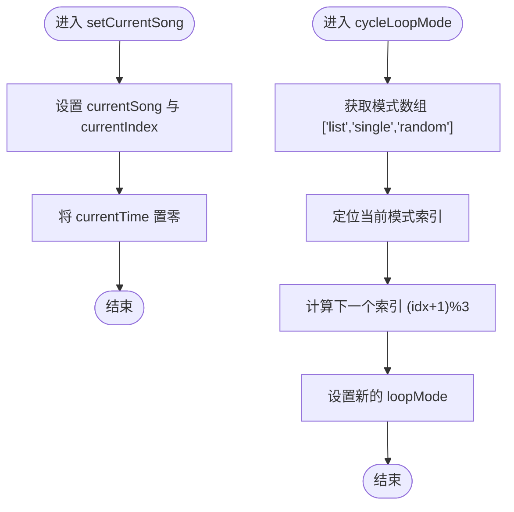
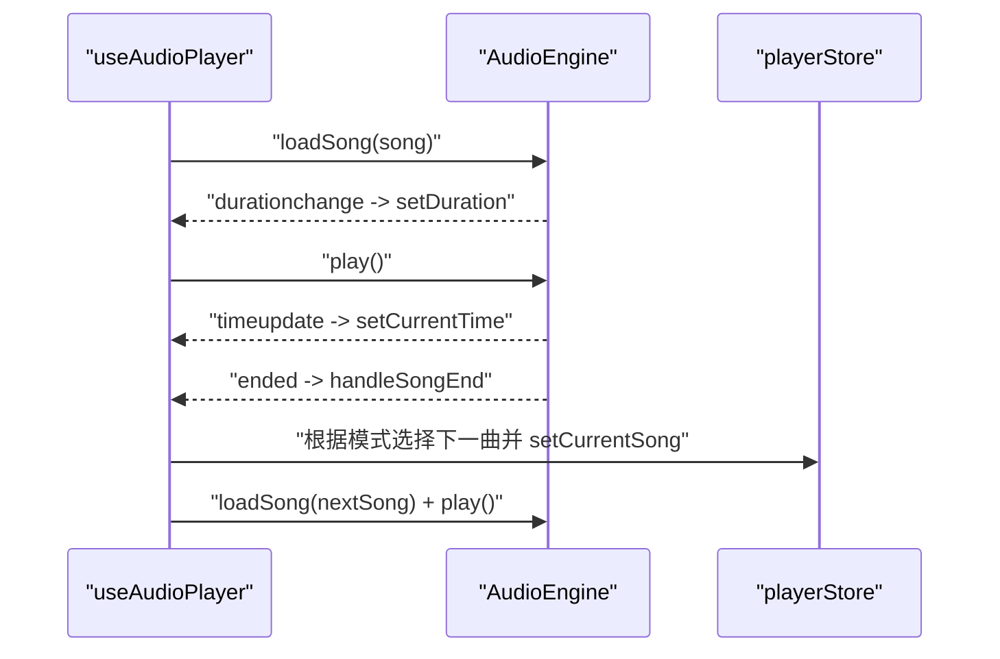
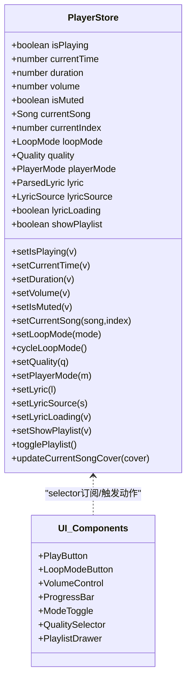
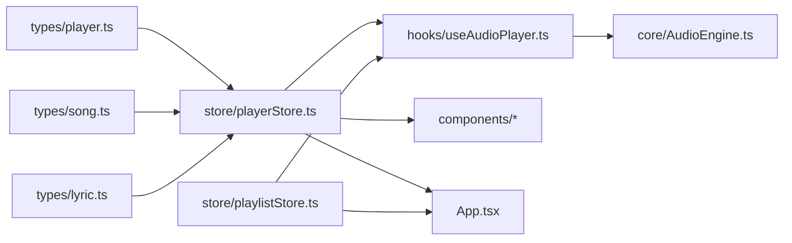

# 播放器状态管理

<cite>
**本文引用的文件**
- [src/store/playerStore.ts](file://src/store/playerStore.ts)
- [src/types/player.ts](file://src/types/player.ts)
- [src/hooks/useAudioPlayer.ts](file://src/hooks/useAudioPlayer.ts)
- [src/core/AudioEngine.ts](file://src/core/AudioEngine.ts)
- [src/types/song.ts](file://src/types/song.ts)
- [src/types/lyric.ts](file://src/types/lyric.ts)
- [src/components/Controls/PlayButton.tsx](file://src/components/Controls/PlayButton.tsx)
- [src/components/Controls/LoopModeButton.tsx](file://src/components/Controls/LoopModeButton.tsx)
- [src/components/Controls/VolumeControl.tsx](file://src/components/Controls/VolumeControl.tsx)
- [src/components/Controls/ProgressBar.tsx](file://src/components/Controls/ProgressBar.tsx)
- [src/components/Controls/ModeToggle.tsx](file://src/components/Controls/ModeToggle.tsx)
- [src/components/Controls/QualitySelector.tsx](file://src/components/Controls/QualitySelector.tsx)
- [src/components/Playlist/PlaylistDrawer.tsx](file://src/components/Playlist/PlaylistDrawer.tsx)
- [src/App.tsx](file://src/App.tsx)
</cite>

## 目录
1. [简介](#简介)
2. [项目结构](#项目结构)
3. [核心组件](#核心组件)
4. [架构总览](#架构总览)
5. [详细组件分析](#详细组件分析)
6. [依赖关系分析](#依赖关系分析)
7. [性能考量](#性能考量)
8. [故障排查指南](#故障排查指南)
9. [结论](#结论)

## 简介
本文件系统性梳理播放器状态管理的设计与实现，重点围绕 playerStore 的状态模型与更新方法，涵盖播放控制、音量控制、播放模式与质量设置、歌词状态以及播放列表显示控制等。同时解析 persist 中间件与 partialize 的选择性持久化策略，并给出状态使用最佳实践与性能优化建议。

## 项目结构
播放器状态管理主要由 Zustand store 与自定义 Hook、UI 控件协同完成：
- 状态层：playerStore 定义播放器全局状态与动作
- 业务层：useAudioPlayer 将 UI 与底层音频引擎对接
- 引擎层：AudioEngine 封装 HTMLAudioElement 事件与能力
- 类型层：player.ts、song.ts、lyric.ts 提供类型约束
- 视图层：各控件通过 store selector 订阅状态并触发动作

图表来源
- [src/store/playerStore.ts](file://src/store/playerStore.ts#L8-L40)
- [src/hooks/useAudioPlayer.ts](file://src/hooks/useAudioPlayer.ts#L6-L131)
- [src/core/AudioEngine.ts](file://src/core/AudioEngine.ts#L7-L137)
- [src/types/player.ts](file://src/types/player.ts#L1-L4)
- [src/types/song.ts](file://src/types/song.ts#L1-L14)
- [src/types/lyric.ts](file://src/types/lyric.ts#L1-L21)
- [src/components/Controls/PlayButton.tsx](file://src/components/Controls/PlayButton.tsx#L4-L16)
- [src/components/Controls/LoopModeButton.tsx](file://src/components/Controls/LoopModeButton.tsx#L10-L28)
- [src/components/Controls/VolumeControl.tsx](file://src/components/Controls/VolumeControl.tsx#L5-L58)
- [src/components/Controls/ProgressBar.tsx](file://src/components/Controls/ProgressBar.tsx#L5-L82)
- [src/components/Controls/ModeToggle.tsx](file://src/components/Controls/ModeToggle.tsx#L4-L22)
- [src/components/Controls/QualitySelector.tsx](file://src/components/Controls/QualitySelector.tsx#L12-L61)
- [src/components/Playlist/PlaylistDrawer.tsx](file://src/components/Playlist/PlaylistDrawer.tsx#L6-L69)

章节来源
- [src/store/playerStore.ts](file://src/store/playerStore.ts#L1-L95)
- [src/hooks/useAudioPlayer.ts](file://src/hooks/useAudioPlayer.ts#L1-L131)
- [src/core/AudioEngine.ts](file://src/core/AudioEngine.ts#L1-L143)
- [src/types/player.ts](file://src/types/player.ts#L1-L4)
- [src/types/song.ts](file://src/types/song.ts#L1-L14)
- [src/types/lyric.ts](file://src/types/lyric.ts#L1-L21)

## 核心组件
- 播放器状态与动作（playerStore）
  - 播放控制：isPlaying、currentTime、duration
  - 音量控制：volume、isMuted
  - 播放模式：loopMode、quality、playerMode
  - 歌词状态：lyric、lyricSource、lyricLoading
  - 播放列表显示：showPlaylist
  - 当前曲目：currentSong、currentIndex
  - 动作示例：setCurrentSong、cycleLoopMode、togglePlaylist、updateCurrentSongCover 等
- 音频引擎（AudioEngine）
  - 事件桥接：timeupdate、durationchange、ended、play、pause、error
  - 能力封装：loadSong、play、pause、seek、setVolume、setMuted
- 音频播放 Hook（useAudioPlayer）
  - 将引擎事件映射为 store 状态
  - 实现播放/暂停、切歌、上一首/下一首、拖拽进度
- UI 控件
  - 播放/暂停按钮、循环模式切换、音量控制、进度条、模式切换、音质选择、播放列表抽屉

章节来源
- [src/store/playerStore.ts](file://src/store/playerStore.ts#L8-L40)
- [src/core/AudioEngine.ts](file://src/core/AudioEngine.ts#L7-L137)
- [src/hooks/useAudioPlayer.ts](file://src/hooks/useAudioPlayer.ts#L6-L131)
- [src/components/Controls/PlayButton.tsx](file://src/components/Controls/PlayButton.tsx#L4-L16)
- [src/components/Controls/LoopModeButton.tsx](file://src/components/Controls/LoopModeButton.tsx#L10-L28)
- [src/components/Controls/VolumeControl.tsx](file://src/components/Controls/VolumeControl.tsx#L5-L58)
- [src/components/Controls/ProgressBar.tsx](file://src/components/Controls/ProgressBar.tsx#L5-L82)
- [src/components/Controls/ModeToggle.tsx](file://src/components/Controls/ModeToggle.tsx#L4-L22)
- [src/components/Controls/QualitySelector.tsx](file://src/components/Controls/QualitySelector.tsx#L12-L61)
- [src/components/Playlist/PlaylistDrawer.tsx](file://src/components/Playlist/PlaylistDrawer.tsx#L6-L69)

## 架构总览
播放器状态管理采用“状态驱动 + 引擎桥接”的分层架构：
- UI 层通过 store selector 订阅状态，点击或交互触发动作
- 动作为纯函数，调用 set 或 set((state)=>({...})) 更新状态
- useAudioPlayer 将引擎事件转换为 store 状态，形成闭环
- persist 中间件负责本地存储与恢复

图表来源
- [src/store/playerStore.ts](file://src/store/playerStore.ts#L42-L82)
- [src/hooks/useAudioPlayer.ts](file://src/hooks/useAudioPlayer.ts#L15-L36)
- [src/core/AudioEngine.ts](file://src/core/AudioEngine.ts#L23-L45)

## 详细组件分析

### playerStore 状态设计与实现
- 状态字段
  - 播放控制：isPlaying、currentTime、duration
  - 音量控制：volume、isMuted
  - 播放模式：loopMode、quality、playerMode
  - 歌词状态：lyric、lyricSource、lyricLoading
  - 播放列表显示：showPlaylist
  - 当前曲目：currentSong、currentIndex
- 关键动作
  - setCurrentSong：同时更新当前曲目与索引，并重置播放时间
  - cycleLoopMode：按 list → single → random 循环切换
  - togglePlaylist：显示/隐藏播放列表抽屉
  - updateCurrentSongCover：惰性更新当前曲目的封面
  - setShowPlaylist：显式控制播放列表抽屉
- persist 策略
  - 存储键名：music-player-settings
  - 选择性持久化：仅保存 volume、isMuted、loopMode、quality、playerMode

图表来源
- [src/store/playerStore.ts](file://src/store/playerStore.ts#L65-L71)
- [src/store/playerStore.ts](file://src/store/playerStore.ts#L77-L78)

章节来源
- [src/store/playerStore.ts](file://src/store/playerStore.ts#L8-L40)
- [src/store/playerStore.ts](file://src/store/playerStore.ts#L42-L94)
- [src/types/player.ts](file://src/types/player.ts#L1-L4)

### useAudioPlayer 与 AudioEngine 的协作
- 事件绑定
  - timeupdate → setCurrentTime
  - durationchange → setDuration
  - play/pause → setIsPlaying
  - ended → handleSongEnd（根据循环模式决定下一曲）
- 音量/静音同步
  - volume/isMuted 变化时调用引擎 setVolume/setMuted
- 播放控制
  - togglePlay：若无当前曲目则从播放列表首曲开始；否则切播放/暂停
  - nextSong/prevSong：根据循环模式与当前索引计算下/上一首
  - seek：同步引擎与 store 的 currentTime
- 加载与播放
  - playSongAtIndex：设置当前曲目索引并加载播放

图表来源
- [src/hooks/useAudioPlayer.ts](file://src/hooks/useAudioPlayer.ts#L15-L36)
- [src/hooks/useAudioPlayer.ts](file://src/hooks/useAudioPlayer.ts#L64-L75)
- [src/hooks/useAudioPlayer.ts](file://src/hooks/useAudioPlayer.ts#L77-L90)
- [src/hooks/useAudioPlayer.ts](file://src/hooks/useAudioPlayer.ts#L92-L106)
- [src/hooks/useAudioPlayer.ts](file://src/hooks/useAudioPlayer.ts#L108-L114)
- [src/hooks/useAudioPlayer.ts](file://src/hooks/useAudioPlayer.ts#L116-L119)
- [src/core/AudioEngine.ts](file://src/core/AudioEngine.ts#L47-L52)
- [src/core/AudioEngine.ts](file://src/core/AudioEngine.ts#L54-L61)
- [src/core/AudioEngine.ts](file://src/core/AudioEngine.ts#L67-L71)

章节来源
- [src/hooks/useAudioPlayer.ts](file://src/hooks/useAudioPlayer.ts#L6-L131)
- [src/core/AudioEngine.ts](file://src/core/AudioEngine.ts#L1-L143)

### UI 组件与状态的绑定
- 播放/暂停按钮：读取 isPlaying，调用 togglePlay
- 循环模式按钮：读取 loopMode，调用 cycleLoopMode
- 音量控制：读取 volume/isMuted，setVolume/setIsMuted
- 进度条：读取 currentTime/duration，拖拽时调用 seek 并更新 store
- 模式切换：读取 playerMode，setPlayerMode
- 音质选择：读取 quality，setQuality
- 播放列表抽屉：读取 showPlaylist，setShowPlaylist/togglePlaylist

图表来源
- [src/store/playerStore.ts](file://src/store/playerStore.ts#L8-L40)
- [src/components/Controls/PlayButton.tsx](file://src/components/Controls/PlayButton.tsx#L4-L16)
- [src/components/Controls/LoopModeButton.tsx](file://src/components/Controls/LoopModeButton.tsx#L10-L28)
- [src/components/Controls/VolumeControl.tsx](file://src/components/Controls/VolumeControl.tsx#L5-L58)
- [src/components/Controls/ProgressBar.tsx](file://src/components/Controls/ProgressBar.tsx#L5-L82)
- [src/components/Controls/ModeToggle.tsx](file://src/components/Controls/ModeToggle.tsx#L4-L22)
- [src/components/Controls/QualitySelector.tsx](file://src/components/Controls/QualitySelector.tsx#L12-L61)
- [src/components/Playlist/PlaylistDrawer.tsx](file://src/components/Playlist/PlaylistDrawer.tsx#L6-L69)

章节来源
- [src/components/Controls/PlayButton.tsx](file://src/components/Controls/PlayButton.tsx#L1-L17)
- [src/components/Controls/LoopModeButton.tsx](file://src/components/Controls/LoopModeButton.tsx#L1-L29)
- [src/components/Controls/VolumeControl.tsx](file://src/components/Controls/VolumeControl.tsx#L1-L59)
- [src/components/Controls/ProgressBar.tsx](file://src/components/Controls/ProgressBar.tsx#L1-L83)
- [src/components/Controls/ModeToggle.tsx](file://src/components/Controls/ModeToggle.tsx#L1-L23)
- [src/components/Controls/QualitySelector.tsx](file://src/components/Controls/QualitySelector.tsx#L1-L62)
- [src/components/Playlist/PlaylistDrawer.tsx](file://src/components/Playlist/PlaylistDrawer.tsx#L1-L70)

### persist 中间件与选择性持久化
- 存储键名：music-player-settings
- 选择性持久化（partialize）：仅保存以下字段，避免持久化运行时状态或大对象
  - volume、isMuted、loopMode、quality、playerMode
- 优势
  - 减少存储体积
  - 降低序列化/反序列化开销
  - 仅保留用户偏好类配置

章节来源
- [src/store/playerStore.ts](file://src/store/playerStore.ts#L83-L92)

### 状态更新方法实现要点
- setCurrentSong
  - 同步更新 currentSong、currentIndex，并将 currentTime 置零，确保新曲目从头开始
- cycleLoopMode
  - 使用固定模式数组与模运算实现循环切换
- togglePlaylist/showPlaylist
  - 通过布尔值控制播放列表抽屉显示/隐藏
- updateCurrentSongCover
  - 对 currentSong 做浅拷贝更新封面，避免破坏引用导致不必要的重渲染

章节来源
- [src/store/playerStore.ts](file://src/store/playerStore.ts#L65-L81)

### 播放列表显示控制
- UI 通过 showPlaylist 控制抽屉显隐
- 切歌时可直接传入索引，由 useAudioPlayer 调用 setCurrentSong 并加载播放
- 播放列表抽屉支持移除歌曲、点击跳转播放

章节来源
- [src/components/Playlist/PlaylistDrawer.tsx](file://src/components/Playlist/PlaylistDrawer.tsx#L6-L69)
- [src/hooks/useAudioPlayer.ts](file://src/hooks/useAudioPlayer.ts#L64-L75)

## 依赖关系分析
- playerStore 依赖类型定义（player.ts、song.ts、lyric.ts）
- useAudioPlayer 依赖 playerStore 与 AudioEngine
- UI 控件依赖 playerStore 的 selector 与动作
- App.tsx 依赖 playerStore 与 playlistStore，负责整体布局与封面颜色提取

图表来源
- [src/types/player.ts](file://src/types/player.ts#L1-L4)
- [src/types/song.ts](file://src/types/song.ts#L1-L14)
- [src/types/lyric.ts](file://src/types/lyric.ts#L1-L21)
- [src/store/playerStore.ts](file://src/store/playerStore.ts#L1-L95)
- [src/hooks/useAudioPlayer.ts](file://src/hooks/useAudioPlayer.ts#L1-L131)
- [src/core/AudioEngine.ts](file://src/core/AudioEngine.ts#L1-L143)
- [src/App.tsx](file://src/App.tsx#L1-L98)

章节来源
- [src/App.tsx](file://src/App.tsx#L1-L98)
- [src/store/playerStore.ts](file://src/store/playerStore.ts#L1-L95)

## 性能考量
- 状态粒度与选择器
  - UI 使用 selector 精准订阅所需字段，避免无关重渲染
  - 示例：ProgressBar 仅订阅 currentTime/duration，VolumeControl 仅订阅 volume/isMuted
- 事件节流与批量更新
  - 避免在高频事件（如 timeupdate）中进行昂贵操作
  - 将 UI 与引擎事件解耦，统一在 useAudioPlayer 中处理
- 选择性持久化
  - 仅持久化必要配置，减少存储与序列化成本
- 渲染优化
  - 使用 React.memo 与 useCallback 包裹高频交互组件
  - 进度条与音量条使用受控组件与最小化 DOM 更新

## 故障排查指南
- 播放失败（浏览器自动播放限制）
  - 现象：首次播放抛出异常或无声
  - 处理：捕获异常并提示用户交互后重试
  - 参考路径：[src/hooks/useAudioPlayer.ts](file://src/hooks/useAudioPlayer.ts#L70-L74)
- 进度不同步
  - 确认引擎事件已正确绑定，且 setCurrentTime/setDuration 在回调中被调用
  - 参考路径：[src/hooks/useAudioPlayer.ts](file://src/hooks/useAudioPlayer.ts#L19-L24)
- 静音后音量条不更新
  - 确保 setVolume 与 setIsMuted 同步更新
  - 参考路径：[src/components/Controls/VolumeControl.tsx](file://src/components/Controls/VolumeControl.tsx#L14-L20)
- 循环模式切换无效
  - 确认 cycleLoopMode 的模式数组与模运算逻辑
  - 参考路径：[src/store/playerStore.ts](file://src/store/playerStore.ts#L67-L71)
- 播放列表抽屉无法关闭
  - 检查 setShowPlaylist/togglePlaylist 是否被正确调用
  - 参考路径：[src/components/Playlist/PlaylistDrawer.tsx](file://src/components/Playlist/PlaylistDrawer.tsx#L18-L29)

章节来源
- [src/hooks/useAudioPlayer.ts](file://src/hooks/useAudioPlayer.ts#L70-L74)
- [src/components/Controls/VolumeControl.tsx](file://src/components/Controls/VolumeControl.tsx#L14-L20)
- [src/store/playerStore.ts](file://src/store/playerStore.ts#L67-L71)
- [src/components/Playlist/PlaylistDrawer.tsx](file://src/components/Playlist/PlaylistDrawer.tsx#L18-L29)

## 结论
本播放器状态管理以 playerStore 为核心，结合 useAudioPlayer 与 AudioEngine 实现了稳定的播放控制闭环。通过选择性持久化与细粒度状态订阅，兼顾了易用性与性能。建议在后续迭代中进一步完善错误恢复、日志追踪与状态快照功能，以提升可观测性与可维护性。