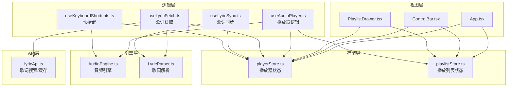
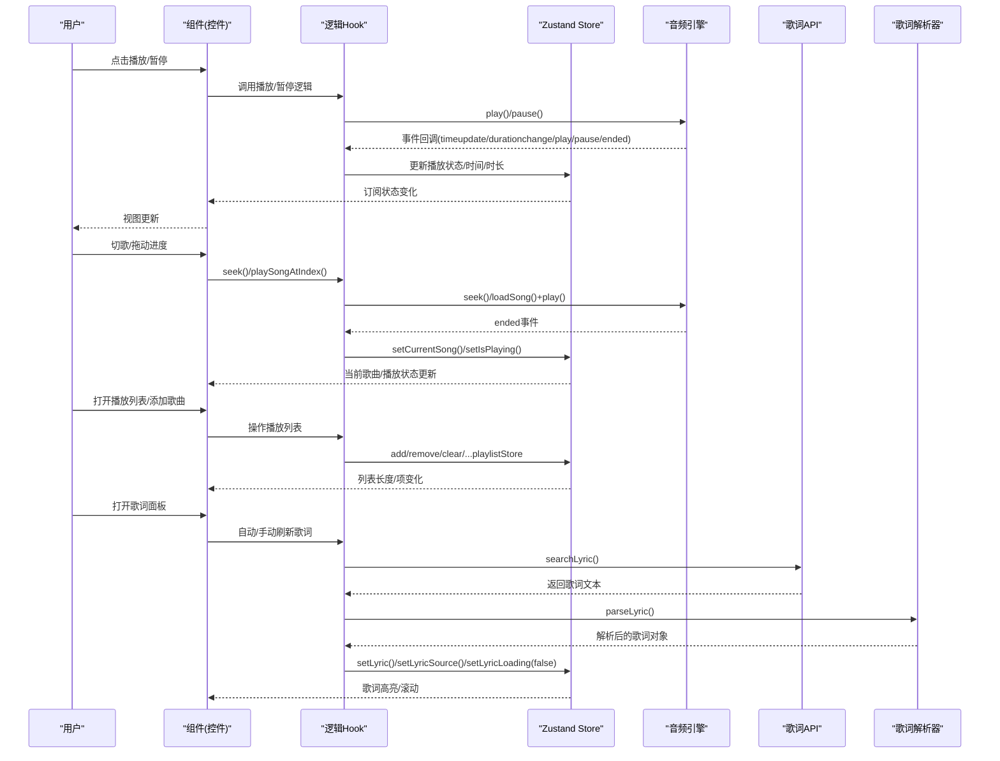
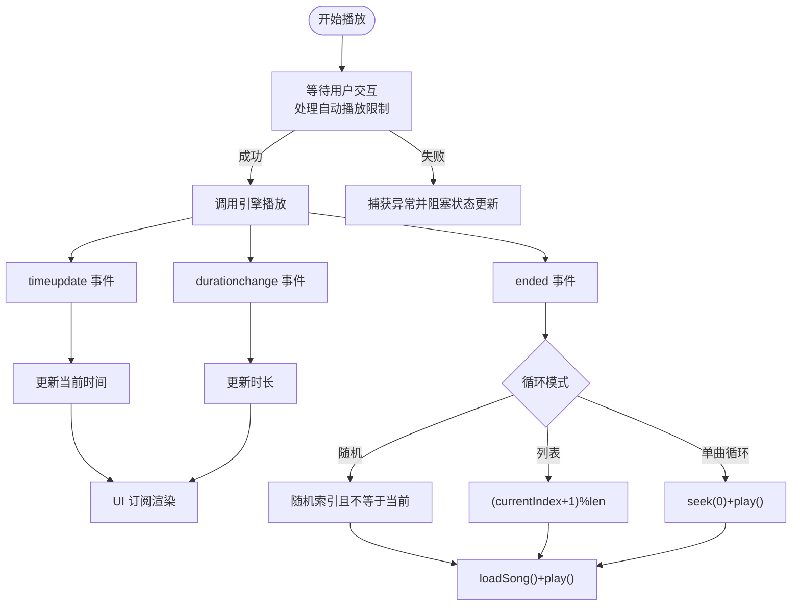
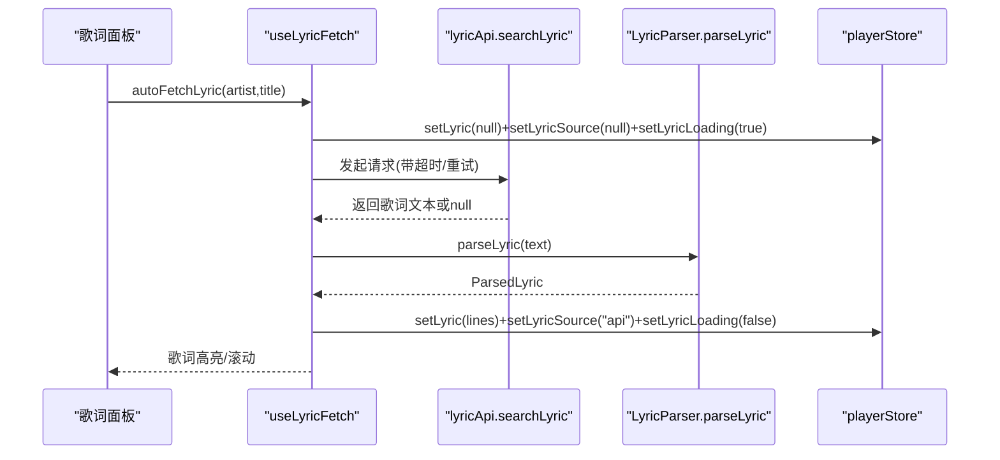
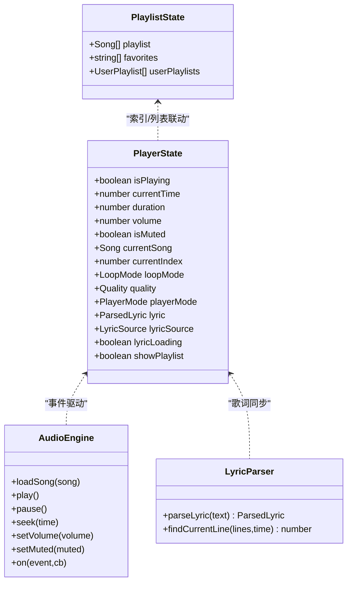

# 状态数据流

<cite>
**本文引用的文件**
- [src/store/playerStore.ts](file://src/store/playerStore.ts)
- [src/store/playlistStore.ts](file://src/store/playlistStore.ts)
- [src/hooks/useAudioPlayer.ts](file://src/hooks/useAudioPlayer.ts)
- [src/hooks/useLyricFetch.ts](file://src/hooks/useLyricFetch.ts)
- [src/hooks/useLyricSync.ts](file://src/hooks/useLyricSync.ts)
- [src/hooks/useKeyboardShortcuts.ts](file://src/hooks/useKeyboardShortcuts.ts)
- [src/core/AudioEngine.ts](file://src/core/AudioEngine.ts)
- [src/core/LyricParser.ts](file://src/core/LyricParser.ts)
- [src/api/lyricApi.ts](file://src/api/lyricApi.ts)
- [src/App.tsx](file://src/App.tsx)
- [src/components/Controls/ControlBar.tsx](file://src/components/Controls/ControlBar.tsx)
- [src/components/Playlist/PlaylistDrawer.tsx](file://src/components/Playlist/PlaylistDrawer.tsx)
- [src/types/player.ts](file://src/types/player.ts)
- [src/types/song.ts](file://src/types/song.ts)
- [src/types/lyric.ts](file://src/types/lyric.ts)
</cite>

## 目录
1. [简介](#简介)
2. [项目结构](#项目结构)
3. [核心组件](#核心组件)
4. [架构总览](#架构总览)
5. [详细组件分析](#详细组件分析)
6. [依赖分析](#依赖分析)
7. [性能考虑](#性能考虑)
8. [故障排查指南](#故障排查指南)
9. [结论](#结论)
10. [附录](#附录)

## 简介
本文件系统性梳理 My Music 2026 的状态数据流与更新机制，覆盖以下方面：
- 用户交互如何触发状态变更（播放控制、键盘快捷键、进度拖动、音量调节等）
- 组件如何订阅状态以实现响应式渲染
- 异步操作（歌词获取、封面补全、播放引擎事件）的状态管理策略
- 数据流向与时序关系的可视化说明
- 状态一致性、竞态条件处理与回滚思路
- 调试工具与常见问题排查方法

## 项目结构
应用采用“Zustand 存储 + Hooks 集成 + 核心引擎”的分层设计：
- 存储层：播放器状态与播放列表状态分别由独立 Zustand Store 管理，并持久化部分配置
- 逻辑层：播放器 Hook、歌词 Hook、键盘快捷键 Hook 将 UI 与核心引擎解耦
- 引擎层：音频引擎负责底层事件与媒体控制；歌词解析器负责 LRC 文本解析与定位
- API 层：歌词搜索与缓存封装，支持超时与重试
- 视图层：组件通过 Selector 订阅状态，实现最小粒度的响应式更新

图表来源
- [src/store/playerStore.ts](file://src/store/playerStore.ts#L1-L95)
- [src/store/playlistStore.ts](file://src/store/playlistStore.ts#L1-L88)
- [src/hooks/useAudioPlayer.ts](file://src/hooks/useAudioPlayer.ts#L1-L131)
- [src/hooks/useLyricFetch.ts](file://src/hooks/useLyricFetch.ts#L1-L95)
- [src/hooks/useLyricSync.ts](file://src/hooks/useLyricSync.ts#L1-L33)
- [src/hooks/useKeyboardShortcuts.ts](file://src/hooks/useKeyboardShortcuts.ts#L1-L73)
- [src/core/AudioEngine.ts](file://src/core/AudioEngine.ts#L1-L143)
- [src/core/LyricParser.ts](file://src/core/LyricParser.ts#L1-L101)
- [src/api/lyricApi.ts](file://src/api/lyricApi.ts#L1-L129)
- [src/App.tsx](file://src/App.tsx#L1-L98)
- [src/components/Controls/ControlBar.tsx](file://src/components/Controls/ControlBar.tsx#L1-L105)
- [src/components/Playlist/PlaylistDrawer.tsx](file://src/components/Playlist/PlaylistDrawer.tsx#L1-L70)

章节来源
- [src/store/playerStore.ts](file://src/store/playerStore.ts#L1-L95)
- [src/store/playlistStore.ts](file://src/store/playlistStore.ts#L1-L88)
- [src/App.tsx](file://src/App.tsx#L1-L98)

## 核心组件
- 播放器状态存储（playerStore）
  - 管理播放/暂停、当前时间、时长、音量、静音、当前歌曲、索引、循环模式、音质、播放器模式、歌词、歌词来源、歌词加载状态、播放列表抽屉可见性等
  - 提供 setter 与派生操作（如循环模式轮转、歌词加载状态切换、播放列表抽屉开关）
  - 使用持久化中间件保存音量、静音、循环模式、音质、播放器模式等用户偏好

- 播放列表存储（playlistStore）
  - 管理播放列表、收藏、用户歌单集合
  - 提供去重追加、移除、清空、收藏切换、用户歌单创建/删除、增删用户歌单项、封面更新等操作
  - 使用持久化中间件保存收藏与用户歌单

- 播放器逻辑（useAudioPlayer）
  - 订阅播放器与播放列表状态，绑定音频引擎事件
  - 实现播放/暂停、上一首/下一首、跳转、按索引播放、循环模式下的切歌策略
  - 同步音量/静音到引擎，处理浏览器自动播放限制

- 歌词获取（useLyricFetch）
  - 自动/手动获取歌词，防抖与竞态控制（fetchIdRef），解析后写入状态
  - 仅在无本地歌词时触发 API 请求，避免重复网络开销

- 歌词同步（useLyricSync）
  - 基于当前时间与解析后的歌词行，计算当前高亮行并滚动居中

- 键盘快捷键（useKeyboardShortcuts）
  - 空格播放/暂停、上下左右箭头快进/快退/增大/减小音量、M 切换静音
  - 通过直接读取/修改播放器状态实现即时反馈

章节来源
- [src/store/playerStore.ts](file://src/store/playerStore.ts#L8-L40)
- [src/store/playlistStore.ts](file://src/store/playlistStore.ts#L12-L27)
- [src/hooks/useAudioPlayer.ts](file://src/hooks/useAudioPlayer.ts#L6-L130)
- [src/hooks/useLyricFetch.ts](file://src/hooks/useLyricFetch.ts#L12-L94)
- [src/hooks/useLyricSync.ts](file://src/hooks/useLyricSync.ts#L5-L32)
- [src/hooks/useKeyboardShortcuts.ts](file://src/hooks/useKeyboardShortcuts.ts#L6-L72)

## 架构总览
下图展示从用户交互到状态更新与 UI 响应的完整数据流。

图表来源
- [src/hooks/useAudioPlayer.ts](file://src/hooks/useAudioPlayer.ts#L15-L75)
- [src/core/AudioEngine.ts](file://src/core/AudioEngine.ts#L23-L45)
- [src/hooks/useLyricFetch.ts](file://src/hooks/useLyricFetch.ts#L23-L58)
- [src/core/LyricParser.ts](file://src/core/LyricParser.ts#L18-L81)
- [src/api/lyricApi.ts](file://src/api/lyricApi.ts#L86-L119)
- [src/hooks/useLyricSync.ts](file://src/hooks/useLyricSync.ts#L11-L29)

## 详细组件分析

### 播放器状态与播放引擎集成
- 状态字段与派生操作
  - 关键状态：播放/暂停、当前时间、时长、音量、静音、当前歌曲、索引、循环模式、音质、播放器模式、歌词、歌词来源、歌词加载状态、播放列表抽屉可见性
  - 派生操作：循环模式轮转、歌词加载状态切换、播放列表抽屉开关、当前歌曲封面更新
- 引擎事件绑定
  - timeupdate/durationchange/play/pause/ended 事件映射到状态更新
  - 音量/静音通过 effect 同步至引擎
- 切歌策略
  - 单曲循环：回到开头并继续播放
  - 随机：随机选择不同于当前索引的歌曲
  - 列表循环：顺序下一个，支持模运算

图表来源
- [src/hooks/useAudioPlayer.ts](file://src/hooks/useAudioPlayer.ts#L15-L62)
- [src/core/AudioEngine.ts](file://src/core/AudioEngine.ts#L23-L45)

章节来源
- [src/store/playerStore.ts](file://src/store/playerStore.ts#L42-L94)
- [src/hooks/useAudioPlayer.ts](file://src/hooks/useAudioPlayer.ts#L64-L114)
- [src/core/AudioEngine.ts](file://src/core/AudioEngine.ts#L47-L99)

### 歌词获取与同步
- 自动获取策略
  - 仅在无本地歌词时触发 API 请求
  - 防抖与竞态：使用自增 ID 与 finally 保证最终状态一致
  - 成功解析后写入歌词与来源，失败或异常时清理来源
- 同步策略
  - 基于二分查找定位当前行，容器滚动居中高亮行
  - 无歌词或空歌词时清空高亮

图表来源
- [src/hooks/useLyricFetch.ts](file://src/hooks/useLyricFetch.ts#L65-L79)
- [src/api/lyricApi.ts](file://src/api/lyricApi.ts#L86-L119)
- [src/core/LyricParser.ts](file://src/core/LyricParser.ts#L18-L81)
- [src/hooks/useLyricSync.ts](file://src/hooks/useLyricSync.ts#L11-L29)

章节来源
- [src/hooks/useLyricFetch.ts](file://src/hooks/useLyricFetch.ts#L12-L94)
- [src/hooks/useLyricSync.ts](file://src/hooks/useLyricSync.ts#L5-L32)
- [src/core/LyricParser.ts](file://src/core/LyricParser.ts#L83-L100)

### 键盘快捷键与全局状态更新
- 快捷键映射
  - 空格：播放/暂停
  - N/P：下一曲/上一曲
  - 方向键：快进/快退/增大/减小音量
  - M：静音切换
- 实现要点
  - 在非输入元素时生效
  - 直接读取/修改播放器状态，确保即时反馈

章节来源
- [src/hooks/useKeyboardShortcuts.ts](file://src/hooks/useKeyboardShortcuts.ts#L9-L71)

### 播放列表与封面补全
- 播放列表操作
  - 去重追加、移除、清空、收藏切换、用户歌单 CRUD、封面批量更新
- 封面补全
  - 当当前歌曲无封面且非“未知歌手”时，异步从 API 获取并写回播放器与播放列表状态

章节来源
- [src/store/playlistStore.ts](file://src/store/playlistStore.ts#L29-L87)
- [src/App.tsx](file://src/App.tsx#L33-L46)

### 组件订阅与渲染
- 控制栏订阅播放器与播放列表状态，动态显示列表数量、启用/禁用按钮
- 播放列表抽屉订阅播放器状态以高亮当前播放项，并支持点击播放与移除
- App 根据播放器模式与空状态渲染不同布局

章节来源
- [src/components/Controls/ControlBar.tsx](file://src/components/Controls/ControlBar.tsx#L16-L29)
- [src/components/Playlist/PlaylistDrawer.tsx](file://src/components/Playlist/PlaylistDrawer.tsx#L6-L14)

## 依赖分析
- 存储层
  - playerStore 与 playlistStore 分离职责，降低耦合
  - 持久化仅保存必要配置，避免冗余状态
- 逻辑层
  - useAudioPlayer 依赖 AudioEngine 与两个 Store，集中处理播放策略
  - useLyricFetch 依赖 API 与解析器，集中处理异步与竞态
- 视图层
  - 组件通过 selector 订阅，避免无关重渲染
- 类型系统
  - LoopMode/PlayerMode/Quality 定义于类型文件，统一约束

图表来源
- [src/store/playerStore.ts](file://src/store/playerStore.ts#L8-L40)
- [src/store/playlistStore.ts](file://src/store/playlistStore.ts#L12-L27)
- [src/core/AudioEngine.ts](file://src/core/AudioEngine.ts#L7-L137)
- [src/core/LyricParser.ts](file://src/core/LyricParser.ts#L1-L101)

章节来源
- [src/types/player.ts](file://src/types/player.ts#L1-L4)
- [src/types/song.ts](file://src/types/song.ts#L1-L14)
- [src/types/lyric.ts](file://src/types/lyric.ts#L1-L21)

## 性能考虑
- 最小化订阅粒度：组件通过 selector 订阅所需字段，减少重渲染
- 防抖与竞态控制：歌词获取使用自增 ID 与 finally 保证最终一致性，避免“快速切歌”导致的竞态
- 事件驱动：引擎事件仅在初始化时绑定一次，避免频繁订阅/解绑
- 持久化：仅保存必要配置，降低存储压力
- 二分查找：歌词定位使用二分查找，时间复杂度 O(log n)，适合长歌词

## 故障排查指南
- 播放无声音或需交互
  - 现象：首次播放抛出异常，提示需要用户交互
  - 排查：确认浏览器自动播放策略；检查音量/静音状态是否被正确同步
  - 参考路径：[src/hooks/useAudioPlayer.ts](file://src/hooks/useAudioPlayer.ts#L70-L75)，[src/core/AudioEngine.ts](file://src/core/AudioEngine.ts#L54-L61)
- 快速切歌歌词错乱
  - 现象：频繁切歌后歌词高亮错误或来源混乱
  - 排查：确认 useLyricFetch 是否使用 fetchIdRef 与 finally 逻辑；检查 setLyricLoading 是否在 finally 中复位
  - 参考路径：[src/hooks/useLyricFetch.ts](file://src/hooks/useLyricFetch.ts#L17-L58)
- 歌词未显示或滚动异常
  - 现象：歌词解析后不滚动或高亮行不正确
  - 排查：确认歌词 lines 非空；检查 findCurrentLine 返回值与容器高度；确认容器存在子节点
  - 参考路径：[src/hooks/useLyricSync.ts](file://src/hooks/useLyricSync.ts#L11-L29)，[src/core/LyricParser.ts](file://src/core/LyricParser.ts#L83-L100)
- 列表抽屉不显示或无法播放
  - 现象：抽屉不出现或点击无反应
  - 排查：确认 showPlaylist 状态与点击事件；检查 playSongAtIndex 参数与索引边界
  - 参考路径：[src/components/Playlist/PlaylistDrawer.tsx](file://src/components/Playlist/PlaylistDrawer.tsx#L6-L14)，[src/hooks/useAudioPlayer.ts](file://src/hooks/useAudioPlayer.ts#L64-L75)
- 键盘快捷键无效
  - 现象：在输入框内仍响应快捷键
  - 排查：确认 useKeyboardShortcuts 的输入元素判断逻辑
  - 参考路径：[src/hooks/useKeyboardShortcuts.ts](file://src/hooks/useKeyboardShortcuts.ts#L10-L14)

## 结论
本项目通过“Zustand + Hooks + 引擎”的清晰分层，实现了稳定的状态数据流：
- 用户交互 → Hook 逻辑 → Store 状态 → UI 订阅渲染
- 异步操作（歌词、封面）通过防抖与竞态控制保障一致性
- 循环模式与切歌策略在 Hook 中集中实现，便于维护与扩展
- 建议持续关注：
  - 更细粒度的持久化策略（按需保存）
  - 歌词缓存过期与失效策略优化
  - 错误边界与降级策略（如歌词解析失败时的默认行为）

## 附录
- 调试工具
  - 开发环境下暴露音频引擎实例到全局，便于在控制台查看状态与调用方法
  - 参考路径：[src/core/AudioEngine.ts](file://src/core/AudioEngine.ts#L139-L142)
- 常见问题清单
  - 自动播放限制：首次播放需用户交互，已在播放逻辑中捕获异常
  - 快速切歌竞态：已通过 fetchIdRef 与 finally 保证最终一致性
  - 歌词解析异常：解析失败时清理歌词来源，避免脏状态
  - 列表抽屉状态：通过播放器状态控制显隐，避免重复渲染