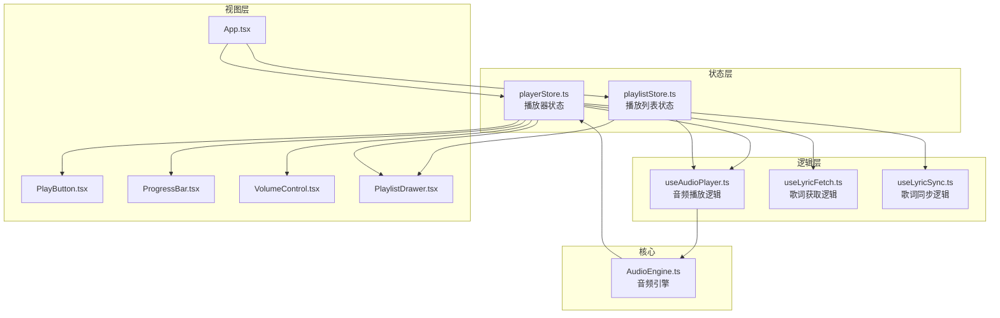
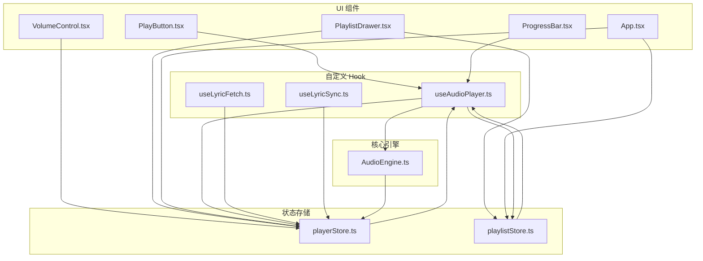
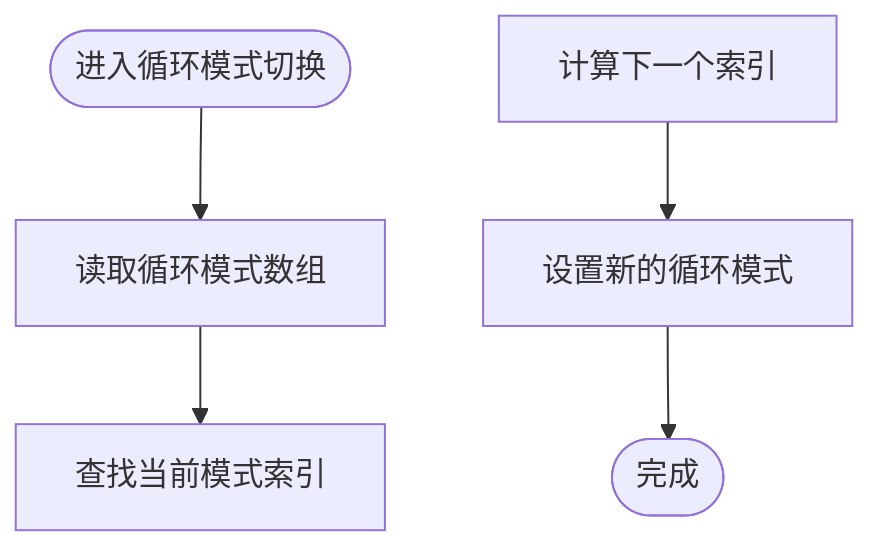
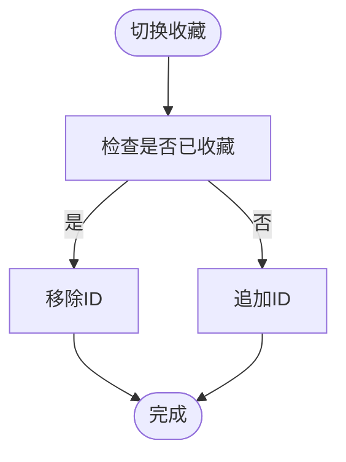
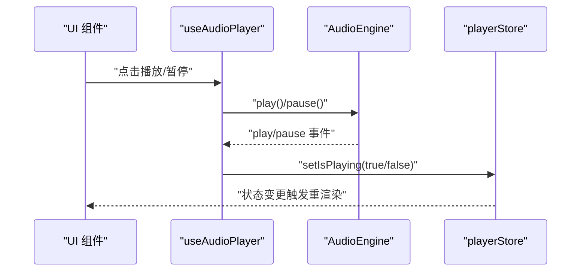
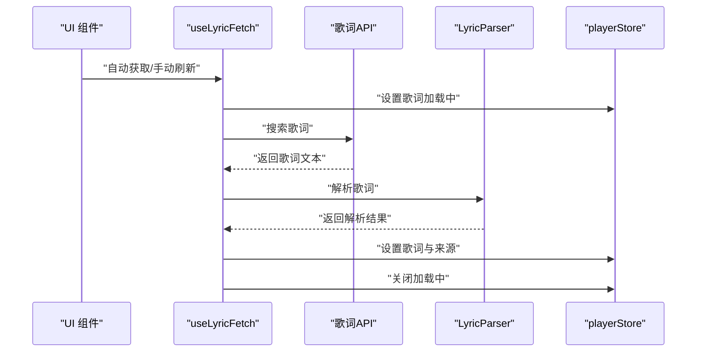
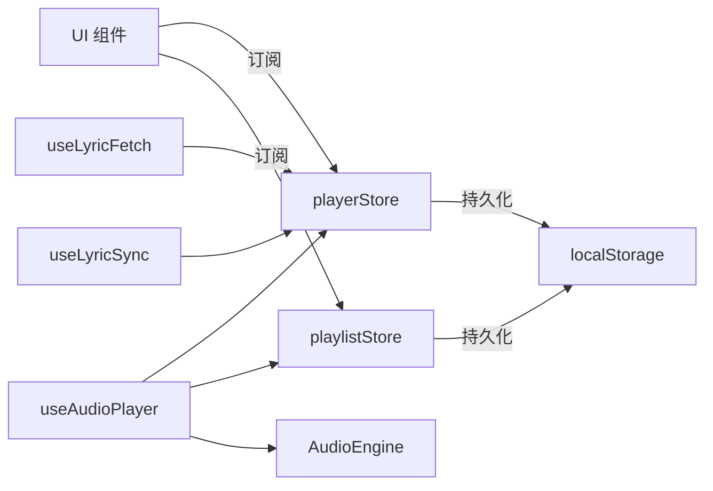

# 状态管理

<cite>
**本文引用的文件**
- [playerStore.ts](file://src/store/playerStore.ts)
- [playlistStore.ts](file://src/store/playlistStore.ts)
- [useAudioPlayer.ts](file://src/hooks/useAudioPlayer.ts)
- [useLyricFetch.ts](file://src/hooks/useLyricFetch.ts)
- [useLyricSync.ts](file://src/hooks/useLyricSync.ts)
- [AudioEngine.ts](file://src/core/AudioEngine.ts)
- [player.ts](file://src/types/player.ts)
- [song.ts](file://src/types/song.ts)
- [lyric.ts](file://src/types/lyric.ts)
- [vendor.d.ts](file://src/types/vendor.d.ts)
- [PlayButton.tsx](file://src/components/Controls/PlayButton.tsx)
- [ProgressBar.tsx](file://src/components/Controls/ProgressBar.tsx)
- [VolumeControl.tsx](file://src/components/Controls/VolumeControl.tsx)
- [PlaylistDrawer.tsx](file://src/components/Playlist/PlaylistDrawer.tsx)
- [App.tsx](file://src/App.tsx)
</cite>

## 目录
1. [简介](#简介)
2. [项目结构](#项目结构)
3. [核心组件](#核心组件)
4. [架构总览](#架构总览)
5. [详细组件分析](#详细组件分析)
6. [依赖关系分析](#依赖关系分析)
7. [性能考量](#性能考量)
8. [故障排查指南](#故障排查指南)
9. [结论](#结论)
10. [附录](#附录)

## 简介
本文件系统性梳理 My Music 2026 的状态管理体系，重点围绕 Zustand 状态管理库的设计与实现，覆盖播放器状态与播放列表状态的组织方式、数据流与更新机制、自定义 Hook 的封装策略、状态持久化、异步状态处理与订阅最佳实践，并给出调试技巧、性能优化建议与常见问题解决方案。文档同时展示状态管理与音频引擎、UI 组件及歌词解析等模块的集成模式。

## 项目结构
状态管理相关代码主要分布在以下位置：
- 状态存储：src/store 下的播放器与播放列表状态
- 自定义 Hook：src/hooks 下的音频播放、歌词获取与同步
- 核心音频引擎：src/core/AudioEngine.ts
- 类型定义：src/types 下的播放器、歌曲、歌词等类型
- UI 组件：src/components 下与播放器、进度条、音量、播放列表抽屉等相关的组件

图表来源
- [playerStore.ts](file://src/store/playerStore.ts#L42-L94)
- [playlistStore.ts](file://src/store/playlistStore.ts#L29-L87)
- [useAudioPlayer.ts](file://src/hooks/useAudioPlayer.ts#L6-L130)
- [useLyricFetch.ts](file://src/hooks/useLyricFetch.ts#L12-L94)
- [useLyricSync.ts](file://src/hooks/useLyricSync.ts#L5-L32)
- [AudioEngine.ts](file://src/core/AudioEngine.ts#L7-L137)
- [PlayButton.tsx](file://src/components/Controls/PlayButton.tsx#L4-L16)
- [ProgressBar.tsx](file://src/components/Controls/ProgressBar.tsx#L5-L82)
- [VolumeControl.tsx](file://src/components/Controls/VolumeControl.tsx#L5-L58)
- [PlaylistDrawer.tsx](file://src/components/Playlist/PlaylistDrawer.tsx#L6-L69)
- [App.tsx](file://src/App.tsx#L15-L97)

章节来源
- [playerStore.ts](file://src/store/playerStore.ts#L1-L95)
- [playlistStore.ts](file://src/store/playlistStore.ts#L1-L88)
- [useAudioPlayer.ts](file://src/hooks/useAudioPlayer.ts#L1-L131)
- [useLyricFetch.ts](file://src/hooks/useLyricFetch.ts#L1-L95)
- [useLyricSync.ts](file://src/hooks/useLyricSync.ts#L1-L33)
- [AudioEngine.ts](file://src/core/AudioEngine.ts#L1-L143)
- [player.ts](file://src/types/player.ts#L1-L4)
- [song.ts](file://src/types/song.ts#L1-L14)
- [lyric.ts](file://src/types/lyric.ts#L1-L21)
- [vendor.d.ts](file://src/types/vendor.d.ts#L1-L3)
- [PlayButton.tsx](file://src/components/Controls/PlayButton.tsx#L1-L17)
- [ProgressBar.tsx](file://src/components/Controls/ProgressBar.tsx#L1-L83)
- [VolumeControl.tsx](file://src/components/Controls/VolumeControl.tsx#L1-L59)
- [PlaylistDrawer.tsx](file://src/components/Playlist/PlaylistDrawer.tsx#L1-L70)
- [App.tsx](file://src/App.tsx#L1-L98)

## 核心组件
- 播放器状态存储（playerStore）
  - 职责：集中管理播放器运行时状态（播放/暂停、当前时间、时长、音量、静音、当前歌曲、索引、循环模式、音质、播放器模式、歌词、歌词来源、歌词加载状态、播放列表抽屉显隐）以及对应的更新方法。
  - 特性：通过持久化中间件保存音量、静音、循环模式、音质、播放器模式；提供派生状态更新（如切换循环模式、切换播放列表抽屉）。
  - 关键接口路径：[播放器状态接口与动作](file://src/store/playerStore.ts#L8-L40)，[持久化配置](file://src/store/playerStore.ts#L83-L93)。

- 播放列表状态存储（playlistStore）
  - 职责：维护播放列表、收藏、用户自建歌单，提供增删改查、去重合并、歌单管理、封面更新等能力。
  - 特性：持久化收藏与用户歌单；通过 get 获取派生状态（如是否为收藏）；支持批量添加与去重。
  - 关键接口路径：[播放列表状态接口与动作](file://src/store/playlistStore.ts#L12-L27)，[持久化配置](file://src/store/playlistStore.ts#L79-L85)。

- 音频播放 Hook（useAudioPlayer）
  - 职责：桥接 AudioEngine 与 Zustand 状态，负责播放/暂停、切歌、上一首/下一首、拖拽跳转、循环模式下的下一曲策略、自动播放限制处理。
  - 关键实现路径：[初始化引擎事件监听](file://src/hooks/useAudioPlayer.ts#L15-L36)，[播放/暂停切换](file://src/hooks/useAudioPlayer.ts#L77-L90)，[下一首/上一首](file://src/hooks/useAudioPlayer.ts#L92-L114)，[拖拽跳转](file://src/hooks/useAudioPlayer.ts#L116-L119)。

- 歌词获取 Hook（useLyricFetch）
  - 职责：自动/手动从 API 获取歌词，防抖与竞态控制，解析并写入状态，标记歌词来源。
  - 关键实现路径：[防抖与竞态控制](file://src/hooks/useLyricFetch.ts#L17-L18)，[API 获取与解析](file://src/hooks/useLyricFetch.ts#L23-L60)，[自动获取与手动刷新](file://src/hooks/useLyricFetch.ts#L65-L91)。

- 歌词同步 Hook（useLyricSync）
  - 职责：根据当前时间定位歌词行并滚动居中，平滑滚动体验。
  - 关键实现路径：[定位当前行](file://src/hooks/useLyricSync.ts#L16-L18)，[滚动行为](file://src/hooks/useLyricSync.ts#L20-L29)。

- 音频引擎（AudioEngine）
  - 职责：封装 HTMLAudioElement，统一事件分发（timeupdate/durationchange/ended/play/pause/error），提供播放、暂停、跳转、音量设置、静音等能力。
  - 关键实现路径：[事件绑定与转发](file://src/core/AudioEngine.ts#L23-L45)，[播放控制与错误处理](file://src/core/AudioEngine.ts#L54-L61)，[seek 边界校验](file://src/core/AudioEngine.ts#L67-L71)。

章节来源
- [playerStore.ts](file://src/store/playerStore.ts#L8-L94)
- [playlistStore.ts](file://src/store/playlistStore.ts#L12-L87)
- [useAudioPlayer.ts](file://src/hooks/useAudioPlayer.ts#L6-L130)
- [useLyricFetch.ts](file://src/hooks/useLyricFetch.ts#L12-L94)
- [useLyricSync.ts](file://src/hooks/useLyricSync.ts#L5-L32)
- [AudioEngine.ts](file://src/core/AudioEngine.ts#L7-L137)

## 架构总览
下图展示了状态管理在系统中的角色与交互：Zustand Store 作为单一事实来源，UI 组件通过 Hook 订阅状态；业务逻辑通过自定义 Hook 与核心引擎协作，最终驱动 UI 更新。

图表来源
- [PlayButton.tsx](file://src/components/Controls/PlayButton.tsx#L4-L16)
- [ProgressBar.tsx](file://src/components/Controls/ProgressBar.tsx#L5-L82)
- [VolumeControl.tsx](file://src/components/Controls/VolumeControl.tsx#L5-L58)
- [PlaylistDrawer.tsx](file://src/components/Playlist/PlaylistDrawer.tsx#L6-L69)
- [App.tsx](file://src/App.tsx#L15-L97)
- [useAudioPlayer.ts](file://src/hooks/useAudioPlayer.ts#L6-L130)
- [useLyricFetch.ts](file://src/hooks/useLyricFetch.ts#L12-L94)
- [useLyricSync.ts](file://src/hooks/useLyricSync.ts#L5-L32)
- [playerStore.ts](file://src/store/playerStore.ts#L42-L94)
- [playlistStore.ts](file://src/store/playlistStore.ts#L29-L87)
- [AudioEngine.ts](file://src/core/AudioEngine.ts#L7-L137)

## 详细组件分析

### 播放器状态管理（playerStore）
- 状态组织
  - 基础播放状态：播放/暂停、当前时间、时长、音量、静音
  - 播放上下文：当前歌曲与索引、循环模式、音质、播放器模式
  - 歌词相关：歌词对象、歌词来源、歌词加载状态
  - UI 控制：播放列表抽屉显隐
  - 类型约束：循环模式、播放器模式、音质由类型定义保证取值合法
- 数据流与更新机制
  - 同步更新：音量、静音、播放器模式、循环模式、音质等通过 set 直接更新
  - 派生更新：切换播放列表抽屉、切换循环模式、更新当前歌曲封面等使用基于状态的函数式更新
  - 异步更新：歌词加载状态、歌词来源与歌词对象的更新由 Hook 触发
- 持久化策略
  - 仅持久化与用户偏好强相关的字段，避免存储大体积或频繁变动的数据
  - 通过 partialize 精准裁剪，减少存储开销与兼容性风险
- 关键实现路径
  - [状态接口与动作定义](file://src/store/playerStore.ts#L8-L40)
  - [默认值与初始化](file://src/store/playerStore.ts#L44-L58)
  - [循环模式切换逻辑](file://src/store/playerStore.ts#L67-L71)
  - [播放列表抽屉切换](file://src/store/playerStore.ts#L77-L78)
  - [持久化配置](file://src/store/playerStore.ts#L83-L93)

图表来源
- [playerStore.ts](file://src/store/playerStore.ts#L67-L71)

章节来源
- [playerStore.ts](file://src/store/playerStore.ts#L8-L94)
- [player.ts](file://src/types/player.ts#L1-L4)

### 播放列表状态管理（playlistStore）
- 状态组织
  - 播放列表：Song 数组，去重合并插入
  - 收藏：Song ID 集合，支持切换与查询
  - 用户歌单：UserPlaylist 列表，支持创建、删除、增删歌单项
- 数据流与更新机制
  - 批量添加：过滤重复后追加
  - 删除与清空：按 ID 过滤或置空
  - 收藏切换：存在即移除，否则追加
  - 歌单增删：映射更新指定歌单的 songIds
  - 封面更新：批量更新播放列表与当前歌曲封面
- 持久化策略
  - 仅持久化收藏与用户歌单，避免持久化播放列表导致的冗余
- 关键实现路径
  - [状态接口与动作定义](file://src/store/playlistStore.ts#L12-L27)
  - [批量添加与去重](file://src/store/playlistStore.ts#L36-L38)
  - [收藏切换与查询](file://src/store/playlistStore.ts#L43-L48)
  - [用户歌单管理](file://src/store/playlistStore.ts#L49-L72)
  - [持久化配置](file://src/store/playlistStore.ts#L79-L85)

图表来源
- [playlistStore.ts](file://src/store/playlistStore.ts#L43-L48)

章节来源
- [playlistStore.ts](file://src/store/playlistStore.ts#L12-L87)
- [song.ts](file://src/types/song.ts#L1-L14)

### 音频播放逻辑（useAudioPlayer）
- 事件桥接
  - 初始化时注册音频引擎事件，将引擎回调转换为状态更新
  - 事件包括 timeupdate、durationchange、play、pause、ended
- 播放控制
  - 切歌：设置当前歌曲与索引，加载音频并尝试播放（处理浏览器自动播放限制）
  - 上一首/下一首：根据循环模式计算索引并播放
  - 拖拽跳转：直接调用引擎 seek 并同步状态
- 循环模式策略
  - 单曲循环：回到开头并继续播放
  - 随机：随机选择下一曲，避免与当前曲目相同
  - 列表循环：顺序递增取模
- 关键实现路径
  - [事件监听与状态同步](file://src/hooks/useAudioPlayer.ts#L15-L36)
  - [播放/暂停切换](file://src/hooks/useAudioPlayer.ts#L77-L90)
  - [下一首/上一首](file://src/hooks/useAudioPlayer.ts#L92-L114)
  - [拖拽跳转](file://src/hooks/useAudioPlayer.ts#L116-L119)
  - [引擎封装](file://src/core/AudioEngine.ts#L23-L45)

图表来源
- [useAudioPlayer.ts](file://src/hooks/useAudioPlayer.ts#L77-L90)
- [AudioEngine.ts](file://src/core/AudioEngine.ts#L35-L40)
- [playerStore.ts](file://src/store/playerStore.ts#L60-L61)

章节来源
- [useAudioPlayer.ts](file://src/hooks/useAudioPlayer.ts#L6-L130)
- [AudioEngine.ts](file://src/core/AudioEngine.ts#L7-L137)

### 歌词获取与同步（useLyricFetch、useLyricSync）
- 歌词获取
  - 自动获取：当歌词为空且非本地歌词时，从 API 搜索并解析
  - 手动刷新：强制清空并重新获取
  - 防抖与竞态：使用 fetchIdRef 防止快速切歌导致的竞态与多余请求
- 歌词同步
  - 定位当前行：根据当前时间在歌词行中二分/线性查找
  - 滚动居中：容器滚动到当前行，平滑滚动提升体验
- 关键实现路径
  - [防抖与竞态控制](file://src/hooks/useLyricFetch.ts#L17-L18)
  - [API 获取与解析](file://src/hooks/useLyricFetch.ts#L23-L60)
  - [自动获取与手动刷新](file://src/hooks/useLyricFetch.ts#L65-L91)
  - [定位当前行](file://src/hooks/useLyricSync.ts#L16-L18)
  - [滚动行为](file://src/hooks/useLyricSync.ts#L20-L29)

图表来源
- [useLyricFetch.ts](file://src/hooks/useLyricFetch.ts#L23-L60)
- [playerStore.ts](file://src/store/playerStore.ts#L74-L76)

章节来源
- [useLyricFetch.ts](file://src/hooks/useLyricFetch.ts#L12-L94)
- [useLyricSync.ts](file://src/hooks/useLyricSync.ts#L5-L32)
- [lyric.ts](file://src/types/lyric.ts#L17-L21)

### UI 组件与状态订阅
- 播放按钮（PlayButton）
  - 订阅播放状态与切换函数，点击触发播放/暂停
  - 关键实现路径：[按钮交互](file://src/components/Controls/PlayButton.tsx#L7-L15)
- 进度条（ProgressBar）
  - 订阅当前时间与总时长，支持拖拽跳转；拖拽时同步引擎与状态
  - 关键实现路径：[拖拽跳转](file://src/components/Controls/ProgressBar.tsx#L14-L25)
- 音量控制（VolumeControl）
  - 订阅音量与静音状态，拖拽更新音量并取消静音
  - 关键实现路径：[音量更新](file://src/components/Controls/VolumeControl.tsx#L14-L20)
- 播放列表抽屉（PlaylistDrawer）
  - 订阅播放列表与当前索引，支持移除歌曲与点击播放
  - 关键实现路径：[抽屉渲染与交互](file://src/components/Playlist/PlaylistDrawer.tsx#L6-L69)

章节来源
- [PlayButton.tsx](file://src/components/Controls/PlayButton.tsx#L4-L16)
- [ProgressBar.tsx](file://src/components/Controls/ProgressBar.tsx#L5-L82)
- [VolumeControl.tsx](file://src/components/Controls/VolumeControl.tsx#L5-L58)
- [PlaylistDrawer.tsx](file://src/components/Playlist/PlaylistDrawer.tsx#L6-L69)

## 依赖关系分析
- 组件对状态的依赖
  - UI 组件通过选择器订阅所需状态片段，降低重渲染范围
  - 播放器组件依赖播放器状态；播放列表组件依赖播放列表状态
- Hook 对状态与引擎的依赖
  - useAudioPlayer 依赖 playerStore、playlistStore 与 AudioEngine
  - useLyricFetch 依赖 playerStore 与歌词 API/解析器
  - useLyricSync 依赖 playerStore 的歌词与当前时间
- 状态对持久化的依赖
  - playerStore 与 playlistStore 均使用 persist 中间件，分别持久化偏好与用户数据

图表来源
- [playerStore.ts](file://src/store/playerStore.ts#L83-L93)
- [playlistStore.ts](file://src/store/playlistStore.ts#L79-L85)
- [useAudioPlayer.ts](file://src/hooks/useAudioPlayer.ts#L6-L130)
- [useLyricFetch.ts](file://src/hooks/useLyricFetch.ts#L12-L94)
- [useLyricSync.ts](file://src/hooks/useLyricSync.ts#L5-L32)

章节来源
- [playerStore.ts](file://src/store/playerStore.ts#L83-L93)
- [playlistStore.ts](file://src/store/playlistStore.ts#L79-L85)
- [useAudioPlayer.ts](file://src/hooks/useAudioPlayer.ts#L6-L130)
- [useLyricFetch.ts](file://src/hooks/useLyricFetch.ts#L12-L94)
- [useLyricSync.ts](file://src/hooks/useLyricSync.ts#L5-L32)

## 性能考量
- 状态粒度与订阅
  - 使用选择器订阅最小必要状态，避免不必要的重渲染
  - 将高频更新（如 currentTime）拆分为独立组件或局部状态，减少全局波动
- 持久化策略
  - 仅持久化关键偏好字段，避免存储大对象或频繁变化的数据
  - 合理设置持久化分区（partialize），降低序列化与反序列化成本
- 异步与竞态
  - 歌词获取使用防抖与竞态标识，确保最新请求的结果被采用
  - 音频播放异常（自动播放限制）需捕获并提示用户交互
- UI 交互
  - 进度条拖拽时直接调用引擎 seek 并同步状态，避免多次状态更新
  - 歌词滚动采用节流/防抖策略，避免频繁 DOM 操作
- 资源释放
  - 销毁音频引擎时及时清理 blob URL，避免内存泄漏

## 故障排查指南
- 播放无法开始
  - 检查浏览器自动播放策略，确保用户交互后再次尝试播放
  - 查看引擎错误事件回调，确认音频资源可访问
  - 参考路径：[播放异常处理](file://src/core/AudioEngine.ts#L54-L61)，[自动播放限制处理](file://src/hooks/useAudioPlayer.ts#L70-L75)
- 歌词未显示
  - 确认歌词来源是否为 API 或本地；检查歌词解析结果是否为空
  - 使用防抖与竞态控制，避免旧请求覆盖新结果
  - 参考路径：[歌词获取与竞态](file://src/hooks/useLyricFetch.ts#L23-L60)
- 进度条跳转无效
  - 检查拖拽时是否正确计算比例并调用引擎 seek
  - 确保状态同步与引擎同步一致
  - 参考路径：[进度条拖拽](file://src/components/Controls/ProgressBar.tsx#L14-L25)
- 播放列表抽屉不显示
  - 检查播放器状态中的抽屉显隐标志
  - 确认遮罩与抽屉容器的样式与事件绑定
  - 参考路径：[抽屉显隐](file://src/components/Playlist/PlaylistDrawer.tsx#L6-L21)
- 静音/音量异常
  - 检查音量更新逻辑与静音标志联动
  - 参考路径：[音量更新](file://src/components/Controls/VolumeControl.tsx#L14-L20)

章节来源
- [AudioEngine.ts](file://src/core/AudioEngine.ts#L54-L61)
- [useAudioPlayer.ts](file://src/hooks/useAudioPlayer.ts#L70-L75)
- [useLyricFetch.ts](file://src/hooks/useLyricFetch.ts#L23-L60)
- [ProgressBar.tsx](file://src/components/Controls/ProgressBar.tsx#L14-L25)
- [PlaylistDrawer.tsx](file://src/components/Playlist/PlaylistDrawer.tsx#L6-L21)
- [VolumeControl.tsx](file://src/components/Controls/VolumeControl.tsx#L14-L20)

## 结论
本项目以 Zustand 为核心构建了清晰、可维护的状态管理方案：播放器状态与播放列表状态职责明确、持久化精准、更新机制简洁；自定义 Hook 将业务规则与 UI 解耦，既便于测试又利于扩展；与音频引擎、歌词解析、UI 组件的集成自然流畅。遵循本文的调试与优化建议，可在复杂场景下保持良好的性能与稳定性。

## 附录
- 类型定义补充
  - 播放器模式与循环模式、音质枚举定义
  - 歌曲与歌词数据结构定义
  - 第三方模块声明
  - 参考路径：[播放器类型](file://src/types/player.ts#L1-L4)，[歌曲类型](file://src/types/song.ts#L1-L14)，[歌词类型](file://src/types/lyric.ts#L1-L21)，[第三方声明](file://src/types/vendor.d.ts#L1-L3)
- 开发调试小贴士
  - 在开发环境暴露音频引擎实例到全局，便于在控制台查看状态与事件
  - 使用浏览器开发者工具的 Redux DevTools（结合 Zustand 插件）追踪状态变更
  - 对高频状态（如 currentTime）进行节流或局部缓存，减少渲染压力