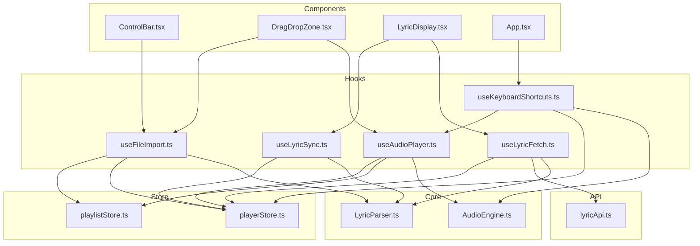
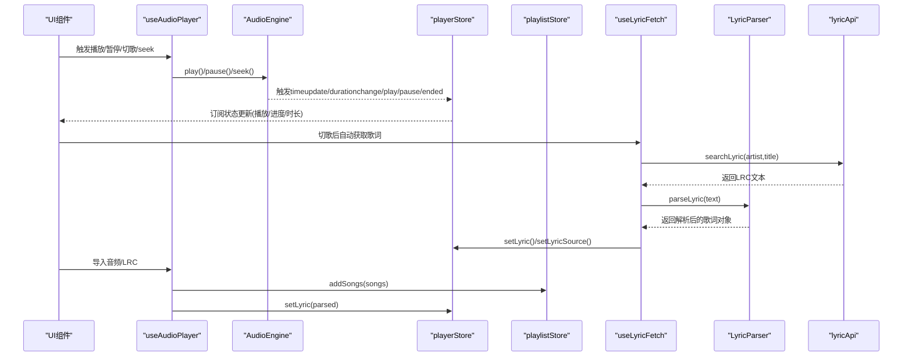
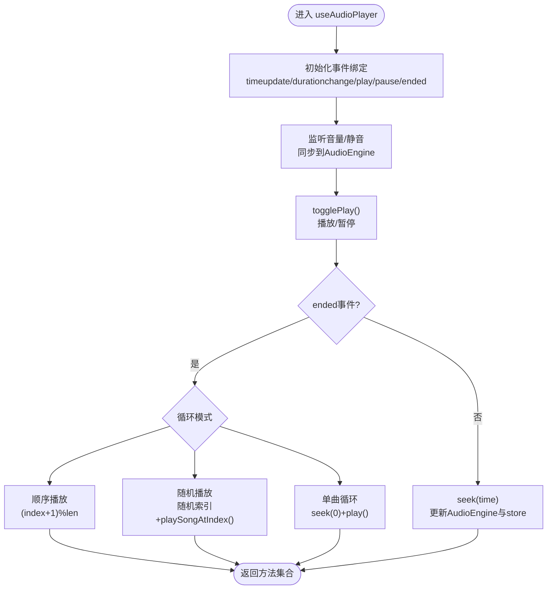
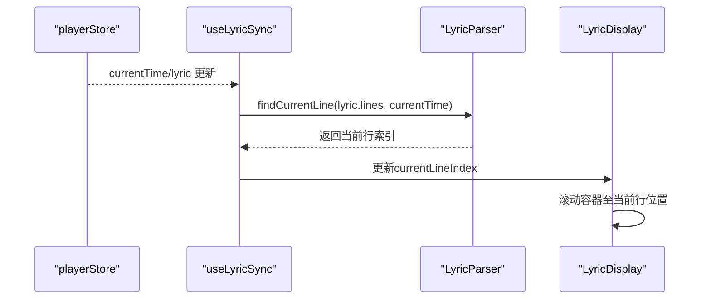
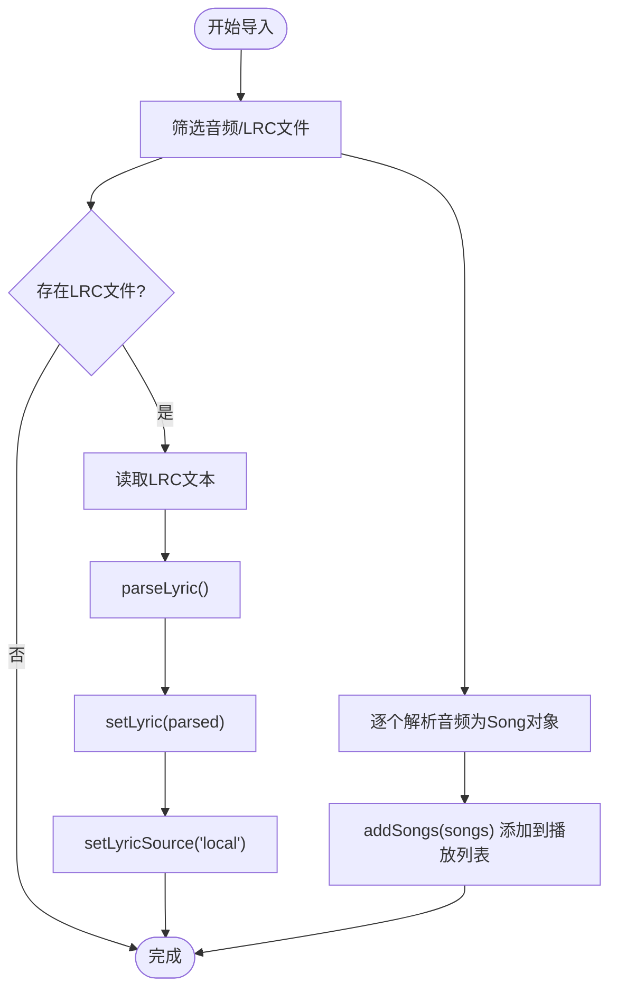
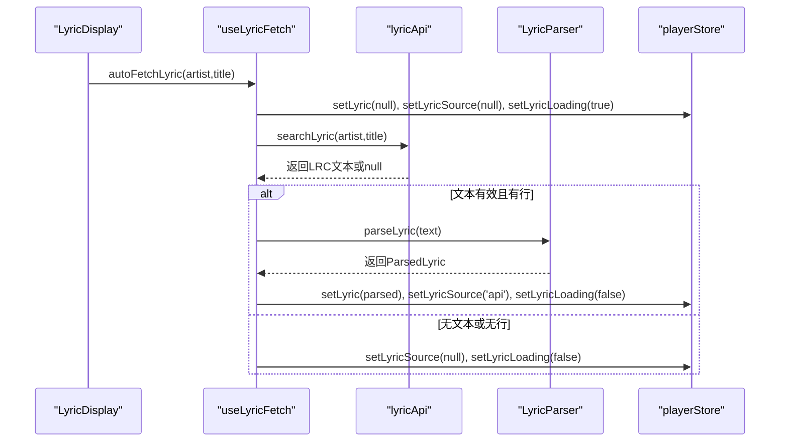
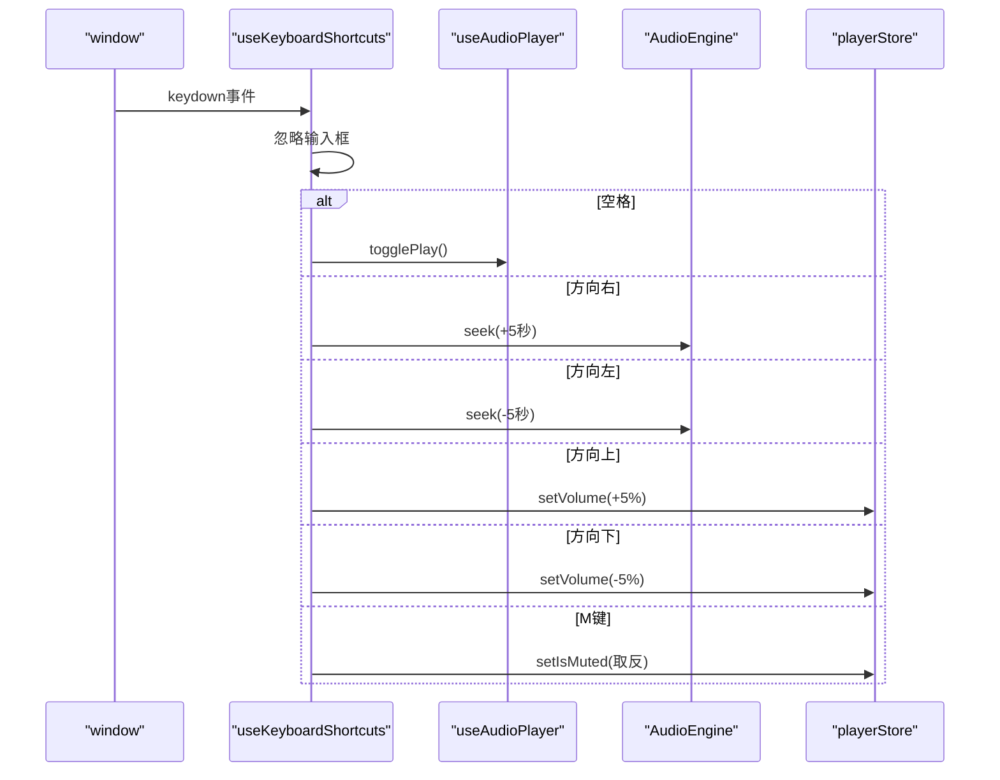
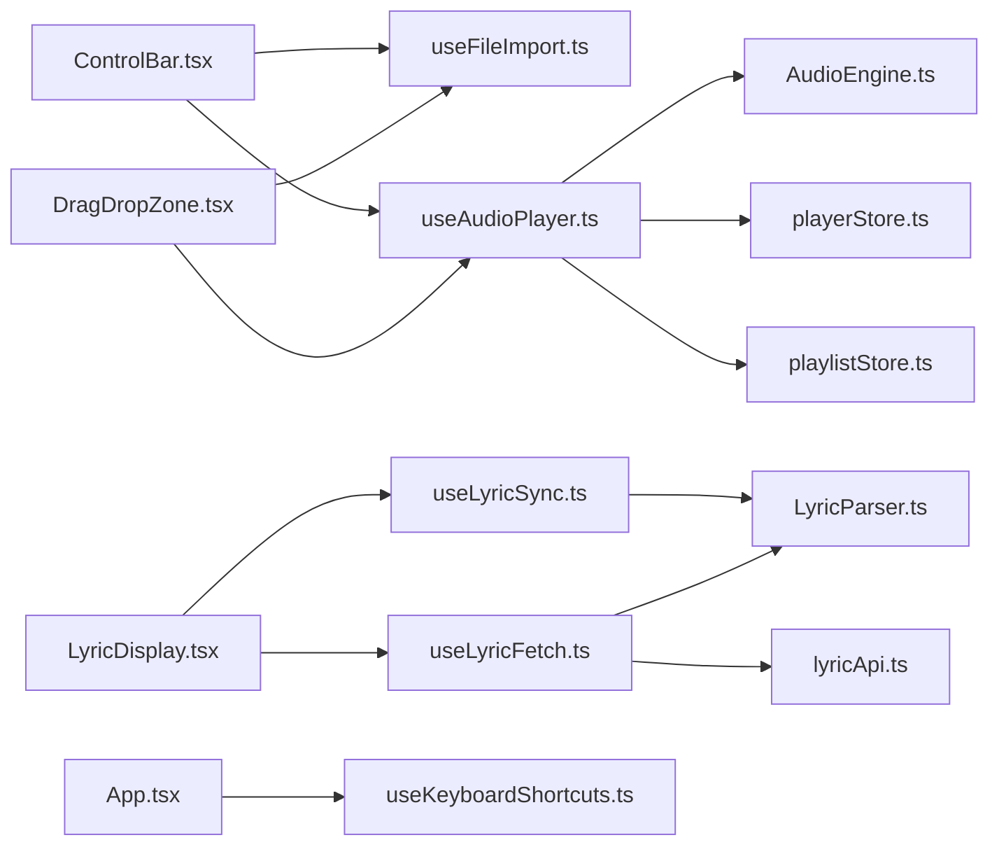

# 自定义Hook集成

<cite>
**本文引用的文件**
- [src/hooks/useAudioPlayer.ts](file://src/hooks/useAudioPlayer.ts)
- [src/hooks/useLyricSync.ts](file://src/hooks/useLyricSync.ts)
- [src/hooks/useFileImport.ts](file://src/hooks/useFileImport.ts)
- [src/hooks/useLyricFetch.ts](file://src/hooks/useLyricFetch.ts)
- [src/hooks/useKeyboardShortcuts.ts](file://src/hooks/useKeyboardShortcuts.ts)
- [src/store/playerStore.ts](file://src/store/playerStore.ts)
- [src/store/playlistStore.ts](file://src/store/playlistStore.ts)
- [src/core/AudioEngine.ts](file://src/core/AudioEngine.ts)
- [src/core/LyricParser.ts](file://src/core/LyricParser.ts)
- [src/api/lyricApi.ts](file://src/api/lyricApi.ts)
- [src/types/player.ts](file://src/types/player.ts)
- [src/types/lyric.ts](file://src/types/lyric.ts)
- [src/components/Controls/ControlBar.tsx](file://src/components/Controls/ControlBar.tsx)
- [src/components/FileImport/DragDropZone.tsx](file://src/components/FileImport/DragDropZone.tsx)
- [src/components/Lyrics/LyricDisplay.tsx](file://src/components/Lyrics/LyricDisplay.tsx)
- [src/App.tsx](file://src/App.tsx)
</cite>

## 目录
1. [简介](#简介)
2. [项目结构](#项目结构)
3. [核心组件](#核心组件)
4. [架构总览](#架构总览)
5. [详细组件分析](#详细组件分析)
6. [依赖关系分析](#依赖关系分析)
7. [性能考量](#性能考量)
8. [故障排查指南](#故障排查指南)
9. [结论](#结论)
10. [附录](#附录)

## 简介
本文件系统性梳理并深入解析本音乐播放器项目中的自定义Hook集成方案，重点覆盖以下Hook的设计与实现：
- useAudioPlayer：音频播放器核心状态与行为封装，负责播放控制、切歌、循环/随机播放、进度跳转等
- useLyricSync：歌词同步滚动与高亮，基于播放时间与解析后的歌词行进行联动
- useFileImport：本地音频与LRC歌词的导入、解析与入库，支持拖拽与文件选择
- useLyricFetch：歌词的自动获取与手动刷新，包含防抖/竞态控制与缓存策略
- useKeyboardShortcuts：全局键盘快捷键绑定，统一委托给播放器控制

文档将从架构设计、数据流、副作用处理、异步管理、Hook协作与数据传递、最佳实践、测试策略与性能优化等方面展开，帮助开发者高效理解与扩展该套Hook体系。

## 项目结构
围绕Hook与状态管理的关键目录与文件如下：
- Hooks层：集中于 src/hooks，包含播放器、歌词、文件导入、快捷键等自定义Hook
- 状态层：src/store 使用 Zustand 管理播放器与播放列表状态
- 核心能力：src/core 提供音频引擎与歌词解析
- API层：src/api 提供歌词搜索与封面获取
- 类型定义：src/types 定义播放器、歌词等类型
- 组件层：src/components 展示如何在UI中消费这些Hook

图表来源
- [src/hooks/useAudioPlayer.ts](file://src/hooks/useAudioPlayer.ts#L1-L131)
- [src/hooks/useLyricSync.ts](file://src/hooks/useLyricSync.ts#L1-L33)
- [src/hooks/useFileImport.ts](file://src/hooks/useFileImport.ts#L1-L78)
- [src/hooks/useLyricFetch.ts](file://src/hooks/useLyricFetch.ts#L1-L95)
- [src/hooks/useKeyboardShortcuts.ts](file://src/hooks/useKeyboardShortcuts.ts#L1-L73)
- [src/store/playerStore.ts](file://src/store/playerStore.ts#L1-L95)
- [src/store/playlistStore.ts](file://src/store/playlistStore.ts#L1-L88)
- [src/core/AudioEngine.ts](file://src/core/AudioEngine.ts#L1-L143)
- [src/core/LyricParser.ts](file://src/core/LyricParser.ts#L1-L101)
- [src/api/lyricApi.ts](file://src/api/lyricApi.ts#L1-L129)
- [src/components/Controls/ControlBar.tsx](file://src/components/Controls/ControlBar.tsx#L1-L105)
- [src/components/FileImport/DragDropZone.tsx](file://src/components/FileImport/DragDropZone.tsx#L1-L67)
- [src/components/Lyrics/LyricDisplay.tsx](file://src/components/Lyrics/LyricDisplay.tsx#L1-L102)
- [src/App.tsx](file://src/App.tsx#L1-L98)

章节来源
- [src/hooks/useAudioPlayer.ts](file://src/hooks/useAudioPlayer.ts#L1-L131)
- [src/hooks/useLyricSync.ts](file://src/hooks/useLyricSync.ts#L1-L33)
- [src/hooks/useFileImport.ts](file://src/hooks/useFileImport.ts#L1-L78)
- [src/hooks/useLyricFetch.ts](file://src/hooks/useLyricFetch.ts#L1-L95)
- [src/hooks/useKeyboardShortcuts.ts](file://src/hooks/useKeyboardShortcuts.ts#L1-L73)
- [src/store/playerStore.ts](file://src/store/playerStore.ts#L1-L95)
- [src/store/playlistStore.ts](file://src/store/playlistStore.ts#L1-L88)
- [src/core/AudioEngine.ts](file://src/core/AudioEngine.ts#L1-L143)
- [src/core/LyricParser.ts](file://src/core/LyricParser.ts#L1-L101)
- [src/api/lyricApi.ts](file://src/api/lyricApi.ts#L1-L129)
- [src/types/player.ts](file://src/types/player.ts#L1-L4)
- [src/types/lyric.ts](file://src/types/lyric.ts#L1-L21)
- [src/components/Controls/ControlBar.tsx](file://src/components/Controls/ControlBar.tsx#L1-L105)
- [src/components/FileImport/DragDropZone.tsx](file://src/components/FileImport/DragDropZone.tsx#L1-L67)
- [src/components/Lyrics/LyricDisplay.tsx](file://src/components/Lyrics/LyricDisplay.tsx#L1-L102)
- [src/App.tsx](file://src/App.tsx#L1-L98)

## 核心组件
本节聚焦三个关键Hook：useAudioPlayer、useLyricSync、useFileImport 的职责划分与协作方式。

- useAudioPlayer
  - 职责：封装播放器状态与播放控制；监听音频引擎事件；根据循环模式切换下一首；处理音量/静音；进度跳转；首次播放与自动播放限制处理
  - 关键点：通过Zustand store暴露的setter更新播放状态；通过AudioEngine执行播放、暂停、seek、音量设置；在播放结束时按循环模式选择下一首
- useLyricSync
  - 职责：根据播放时间与解析歌词定位当前行；滚动容器使当前行居中；提供容器ref供滚动控制
  - 关键点：依赖LyricParser的二分查找定位当前歌词行；使用useEffect在当前时间或歌词变更时更新索引
- useFileImport
  - 职责：解析本地音频文件为Song对象；从文件名解析“歌手 - 歌名”；批量导入音频与LRC歌词；更新播放列表与歌词状态
  - 关键点：过滤合法音频与LRC文件；生成唯一ID；调用store方法添加歌曲；解析歌词并标记来源

章节来源
- [src/hooks/useAudioPlayer.ts](file://src/hooks/useAudioPlayer.ts#L1-L131)
- [src/hooks/useLyricSync.ts](file://src/hooks/useLyricSync.ts#L1-L33)
- [src/hooks/useFileImport.ts](file://src/hooks/useFileImport.ts#L1-L78)

## 架构总览
下图展示Hook与状态、核心模块、API以及UI组件之间的交互关系：

图表来源
- [src/hooks/useAudioPlayer.ts](file://src/hooks/useAudioPlayer.ts#L1-L131)
- [src/core/AudioEngine.ts](file://src/core/AudioEngine.ts#L1-L143)
- [src/store/playerStore.ts](file://src/store/playerStore.ts#L1-L95)
- [src/store/playlistStore.ts](file://src/store/playlistStore.ts#L1-L88)
- [src/hooks/useLyricFetch.ts](file://src/hooks/useLyricFetch.ts#L1-L95)
- [src/core/LyricParser.ts](file://src/core/LyricParser.ts#L1-L101)
- [src/api/lyricApi.ts](file://src/api/lyricApi.ts#L1-L129)
- [src/components/Controls/ControlBar.tsx](file://src/components/Controls/ControlBar.tsx#L1-L105)
- [src/components/FileImport/DragDropZone.tsx](file://src/components/FileImport/DragDropZone.tsx#L1-L67)
- [src/components/Lyrics/LyricDisplay.tsx](file://src/components/Lyrics/LyricDisplay.tsx#L1-L102)

## 详细组件分析

### useAudioPlayer 设计与实现
- 状态封装
  - 从playerStore读取播放状态（播放/暂停、当前时间、时长、音量、静音、当前歌曲、索引、循环模式等）
  - 从playlistStore读取播放列表，用于切歌与随机播放
- 副作用与事件绑定
  - 初始化时绑定AudioEngine事件（timeupdate/durationchange/play/pause/ended），并将事件回调映射到store的setter
  - 监听音量/静音变化，同步到AudioEngine
- 异步与错误处理
  - play()可能因浏览器自动播放限制抛错，捕获后提示等待用户交互
  - ended事件触发时根据loopMode选择下一首：单曲循环、随机播放、顺序播放
- 方法导出
  - togglePlay：根据是否已有当前歌曲决定播放第一首或切换播放状态
  - nextSong/prevSong：根据循环模式计算下一首索引并播放
  - seek：更新AudioEngine与store中的当前时间
  - playSongAtIndex：加载并播放指定索引的歌曲

图表来源
- [src/hooks/useAudioPlayer.ts](file://src/hooks/useAudioPlayer.ts#L1-L131)
- [src/core/AudioEngine.ts](file://src/core/AudioEngine.ts#L1-L143)
- [src/store/playerStore.ts](file://src/store/playerStore.ts#L1-L95)
- [src/store/playlistStore.ts](file://src/store/playlistStore.ts#L1-L88)

章节来源
- [src/hooks/useAudioPlayer.ts](file://src/hooks/useAudioPlayer.ts#L1-L131)
- [src/core/AudioEngine.ts](file://src/core/AudioEngine.ts#L1-L143)
- [src/store/playerStore.ts](file://src/store/playerStore.ts#L1-L95)
- [src/store/playlistStore.ts](file://src/store/playlistStore.ts#L1-L88)

### useLyricSync 设计与实现
- 数据来源
  - 订阅playerStore中的currentTime与lyric
- 同步逻辑
  - 当歌词存在且非空时，使用LyricParser的findCurrentLine二分查找当前行索引
  - 在currentLineIndex变化时，滚动容器使目标行位于可视区域中心
- 容器控制
  - 返回containerRef供LyricDisplay使用，实现平滑滚动

图表来源
- [src/hooks/useLyricSync.ts](file://src/hooks/useLyricSync.ts#L1-L33)
- [src/core/LyricParser.ts](file://src/core/LyricParser.ts#L1-L101)
- [src/components/Lyrics/LyricDisplay.tsx](file://src/components/Lyrics/LyricDisplay.tsx#L1-L102)

章节来源
- [src/hooks/useLyricSync.ts](file://src/hooks/useLyricSync.ts#L1-L33)
- [src/core/LyricParser.ts](file://src/core/LyricParser.ts#L1-L101)
- [src/components/Lyrics/LyricDisplay.tsx](file://src/components/Lyrics/LyricDisplay.tsx#L1-L102)

### useFileImport 设计与实现
- 文件筛选
  - 过滤类型为audio/*或常见音频扩展名的文件；识别LRC文件
- 音频解析
  - 生成临时URL；从文件名解析“歌手 - 歌名”；构造Song对象（含唯一ID、来源、音质等）
- 导入流程
  - 批量导入音频：去重后添加到播放列表
  - 导入LRC：读取文本、parseLyric、写入playerStore并标记歌词来源为本地
- 返回方法
  - importAudioFiles：仅导入音频
  - importLrcFile：仅导入LRC
  - importFiles：同时处理音频与LRC

图表来源
- [src/hooks/useFileImport.ts](file://src/hooks/useFileImport.ts#L1-L78)
- [src/store/playlistStore.ts](file://src/store/playlistStore.ts#L1-L88)
- [src/store/playerStore.ts](file://src/store/playerStore.ts#L1-L95)
- [src/core/LyricParser.ts](file://src/core/LyricParser.ts#L1-L101)

章节来源
- [src/hooks/useFileImport.ts](file://src/hooks/useFileImport.ts#L1-L78)
- [src/store/playlistStore.ts](file://src/store/playlistStore.ts#L1-L88)
- [src/store/playerStore.ts](file://src/store/playerStore.ts#L1-L95)
- [src/core/LyricParser.ts](file://src/core/LyricParser.ts#L1-L101)

### useLyricFetch 设计与实现
- 自动获取
  - 切歌时若无本地歌词，则发起API请求获取；先清空旧歌词与来源，再设置loading
- 手动刷新
  - 强制从API重新获取，覆盖现有歌词
- 竞态与防抖
  - 使用fetchIdRef递增标识当前请求，避免快速切歌导致的竞态；请求完成后仅当fetchId匹配才写入结果
- 缓存与错误处理
  - 成功后写入localStorage缓存；异常时清理来源并保持loading状态
- 返回方法
  - autoFetchLyric：自动获取（无本地歌词时）
  - refreshLyric：手动刷新
  - fetchLyricFromApi：底层API调用

图表来源
- [src/hooks/useLyricFetch.ts](file://src/hooks/useLyricFetch.ts#L1-L95)
- [src/api/lyricApi.ts](file://src/api/lyricApi.ts#L1-L129)
- [src/core/LyricParser.ts](file://src/core/LyricParser.ts#L1-L101)
- [src/components/Lyrics/LyricDisplay.tsx](file://src/components/Lyrics/LyricDisplay.tsx#L1-L102)

章节来源
- [src/hooks/useLyricFetch.ts](file://src/hooks/useLyricFetch.ts#L1-L95)
- [src/api/lyricApi.ts](file://src/api/lyricApi.ts#L1-L129)
- [src/core/LyricParser.ts](file://src/core/LyricParser.ts#L1-L101)
- [src/components/Lyrics/LyricDisplay.tsx](file://src/components/Lyrics/LyricDisplay.tsx#L1-L102)

### useKeyboardShortcuts 设计与实现
- 依赖注入
  - 依赖useAudioPlayer提供的播放控制方法（togglePlay、nextSong、prevSong）
- 事件绑定
  - 监听全局keydown，忽略输入类元素；根据按键执行对应动作
  - 方向键左右：seek微调；上下：音量调节；空格：播放/暂停；N/P：下一曲/上一曲；M：静音切换
- 生命周期
  - 组件挂载时注册事件，卸载时移除

图表来源
- [src/hooks/useKeyboardShortcuts.ts](file://src/hooks/useKeyboardShortcuts.ts#L1-L73)
- [src/hooks/useAudioPlayer.ts](file://src/hooks/useAudioPlayer.ts#L1-L131)
- [src/core/AudioEngine.ts](file://src/core/AudioEngine.ts#L1-L143)
- [src/store/playerStore.ts](file://src/store/playerStore.ts#L1-L95)

章节来源
- [src/hooks/useKeyboardShortcuts.ts](file://src/hooks/useKeyboardShortcuts.ts#L1-L73)
- [src/hooks/useAudioPlayer.ts](file://src/hooks/useAudioPlayer.ts#L1-L131)
- [src/core/AudioEngine.ts](file://src/core/AudioEngine.ts#L1-L143)
- [src/store/playerStore.ts](file://src/store/playerStore.ts#L1-L95)

## 依赖关系分析
- 组件与Hook
  - ControlBar：消费useFileImport导入文件，消费useAudioPlayer控制播放
  - DragDropZone：消费useFileImport与useAudioPlayer，实现拖拽导入并自动播放
  - LyricDisplay：消费useLyricSync与useLyricFetch，展示歌词并支持点击跳转
  - App：注册全局快捷键useKeyboardShortcuts
- Hook之间协作
  - useAudioPlayer与useLyricFetch：播放器状态变化驱动歌词获取；歌词解析后回填到播放器store
  - useFileImport与useAudioPlayer：导入完成后可直接播放第一首
  - useKeyboardShortcuts依赖useAudioPlayer的方法，形成统一控制入口
- 外部依赖
  - AudioEngine：封装HTMLAudioElement事件与API
  - LyricParser：解析LRC文本为结构化歌词
  - lyricApi：提供歌词搜索与缓存

图表来源
- [src/components/Controls/ControlBar.tsx](file://src/components/Controls/ControlBar.tsx#L1-L105)
- [src/components/FileImport/DragDropZone.tsx](file://src/components/FileImport/DragDropZone.tsx#L1-L67)
- [src/components/Lyrics/LyricDisplay.tsx](file://src/components/Lyrics/LyricDisplay.tsx#L1-L102)
- [src/App.tsx](file://src/App.tsx#L1-L98)
- [src/hooks/useAudioPlayer.ts](file://src/hooks/useAudioPlayer.ts#L1-L131)
- [src/hooks/useFileImport.ts](file://src/hooks/useFileImport.ts#L1-L78)
- [src/hooks/useLyricSync.ts](file://src/hooks/useLyricSync.ts#L1-L33)
- [src/hooks/useLyricFetch.ts](file://src/hooks/useLyricFetch.ts#L1-L95)
- [src/hooks/useKeyboardShortcuts.ts](file://src/hooks/useKeyboardShortcuts.ts#L1-L73)
- [src/core/AudioEngine.ts](file://src/core/AudioEngine.ts#L1-L143)
- [src/core/LyricParser.ts](file://src/core/LyricParser.ts#L1-L101)
- [src/api/lyricApi.ts](file://src/api/lyricApi.ts#L1-L129)
- [src/store/playerStore.ts](file://src/store/playerStore.ts#L1-L95)
- [src/store/playlistStore.ts](file://src/store/playlistStore.ts#L1-L88)

章节来源
- [src/components/Controls/ControlBar.tsx](file://src/components/Controls/ControlBar.tsx#L1-L105)
- [src/components/FileImport/DragDropZone.tsx](file://src/components/FileImport/DragDropZone.tsx#L1-L67)
- [src/components/Lyrics/LyricDisplay.tsx](file://src/components/Lyrics/LyricDisplay.tsx#L1-L102)
- [src/App.tsx](file://src/App.tsx#L1-L98)
- [src/hooks/useAudioPlayer.ts](file://src/hooks/useAudioPlayer.ts#L1-L131)
- [src/hooks/useFileImport.ts](file://src/hooks/useFileImport.ts#L1-L78)
- [src/hooks/useLyricSync.ts](file://src/hooks/useLyricSync.ts#L1-L33)
- [src/hooks/useLyricFetch.ts](file://src/hooks/useLyricFetch.ts#L1-L95)
- [src/hooks/useKeyboardShortcuts.ts](file://src/hooks/useKeyboardShortcuts.ts#L1-L73)
- [src/core/AudioEngine.ts](file://src/core/AudioEngine.ts#L1-L143)
- [src/core/LyricParser.ts](file://src/core/LyricParser.ts#L1-L101)
- [src/api/lyricApi.ts](file://src/api/lyricApi.ts#L1-L129)
- [src/store/playerStore.ts](file://src/store/playerStore.ts#L1-L95)
- [src/store/playlistStore.ts](file://src/store/playlistStore.ts#L1-L88)

## 性能考量
- 避免不必要的渲染
  - 将回调函数使用useCallback稳定化，减少子组件重渲染（如useAudioPlayer中的togglePlay、nextSong、prevSong、seek、playSongAtIndex）
  - 在useLyricSync中仅在currentLineIndex变化时滚动，避免频繁DOM操作
- 事件绑定与解绑
  - useAudioPlayer在初始化时绑定一次事件；useKeyboardShortcuts在卸载时移除事件监听
- 异步与竞态
  - useLyricFetch使用fetchIdRef避免快速切歌导致的竞态；歌词解析与写入store采用原子性更新
- 存储与缓存
  - playerStore与playlistStore使用persist中间件持久化关键状态；lyricApi使用localStorage缓存歌词，降低重复请求
- 计算复杂度
  - findCurrentLine使用二分查找，时间复杂度O(log n)，适合大段歌词的快速定位

章节来源
- [src/hooks/useAudioPlayer.ts](file://src/hooks/useAudioPlayer.ts#L1-L131)
- [src/hooks/useLyricSync.ts](file://src/hooks/useLyricSync.ts#L1-L33)
- [src/hooks/useLyricFetch.ts](file://src/hooks/useLyricFetch.ts#L1-L95)
- [src/store/playerStore.ts](file://src/store/playerStore.ts#L1-L95)
- [src/store/playlistStore.ts](file://src/store/playlistStore.ts#L1-L88)
- [src/api/lyricApi.ts](file://src/api/lyricApi.ts#L1-L129)
- [src/core/LyricParser.ts](file://src/core/LyricParser.ts#L1-L101)

## 故障排查指南
- 播放失败（自动播放限制）
  - 现象：首次播放抛错或无声
  - 处理：捕获异常并提示用户交互；后续播放可正常工作
  - 参考路径：[src/hooks/useAudioPlayer.ts](file://src/hooks/useAudioPlayer.ts#L70-L75)
- 歌词不显示或滚动异常
  - 现象：歌词为空、滚动不生效、高亮不正确
  - 排查：确认歌词已解析且lines非空；检查findCurrentLine返回值；确保containerRef正确传入容器
  - 参考路径：[src/hooks/useLyricSync.ts](file://src/hooks/useLyricSync.ts#L11-L30)
- 导入文件无效
  - 现象：拖拽/选择文件后无歌曲加入
  - 排查：确认文件类型为audio/*或常见扩展名；LRC文件需以.lrc结尾；检查addSongs去重逻辑
  - 参考路径：[src/hooks/useFileImport.ts](file://src/hooks/useFileImport.ts#L37-L49)
- 快捷键无效
  - 现象：全局按键无响应
  - 排查：确认不在输入框内；检查useKeyboardShortcuts事件绑定与依赖数组
  - 参考路径：[src/hooks/useKeyboardShortcuts.ts](file://src/hooks/useKeyboardShortcuts.ts#L9-L72)
- 歌词获取失败
  - 现象：网络异常或API返回空
  - 排查：查看console日志；确认artist/title非空且非“未知歌手”；检查缓存是否过期
  - 参考路径：[src/hooks/useLyricFetch.ts](file://src/hooks/useLyricFetch.ts#L23-L58), [src/api/lyricApi.ts](file://src/api/lyricApi.ts#L86-L119)

章节来源
- [src/hooks/useAudioPlayer.ts](file://src/hooks/useAudioPlayer.ts#L70-L75)
- [src/hooks/useLyricSync.ts](file://src/hooks/useLyricSync.ts#L11-L30)
- [src/hooks/useFileImport.ts](file://src/hooks/useFileImport.ts#L37-L49)
- [src/hooks/useKeyboardShortcuts.ts](file://src/hooks/useKeyboardShortcuts.ts#L9-L72)
- [src/hooks/useLyricFetch.ts](file://src/hooks/useLyricFetch.ts#L23-L58)
- [src/api/lyricApi.ts](file://src/api/lyricApi.ts#L86-L119)

## 结论
本项目通过一组职责清晰的自定义Hook实现了播放器的核心功能：播放控制、歌词同步、文件导入与歌词获取。其设计遵循以下原则：
- 单一职责：每个Hook专注一个领域，便于维护与复用
- 状态集中：Zustand store统一管理播放状态与播放列表，避免组件间状态碎片化
- 事件驱动：AudioEngine作为外部事件源，通过store桥接至UI
- 异步安全：竞态控制与错误兜底保障用户体验
- 可扩展性：新增功能可通过组合现有Hook实现，耦合度低

## 附录
- 最佳实践清单
  - 状态订阅：使用store选择器精确订阅所需字段，避免全量重渲染
  - 回调稳定化：对传递给子组件的回调使用useCallback，减少重渲染
  - 事件生命周期：在useEffect中注册事件，在cleanup中移除，防止内存泄漏
  - 错误处理：对外部API与浏览器特性（自动播放）做好降级与提示
  - 性能优化：二分查找定位歌词行；缓存歌词；避免频繁DOM滚动
- 测试策略建议
  - 单元测试：针对LyricParser的解析与findCurrentLine进行边界测试；对useLyricFetch的竞态与缓存逻辑进行模拟
  - 集成测试：模拟AudioEngine事件序列，验证useAudioPlayer的状态流转；模拟文件导入流程，验证store更新
  - UI测试：验证LyricDisplay在不同歌词状态下的渲染与交互；验证DragDropZone的拖拽与播放联动
- 类型与配置参考
  - 循环模式、音质、播放器模式类型定义：[src/types/player.ts](file://src/types/player.ts#L1-L4)
  - 歌词数据结构：[src/types/lyric.ts](file://src/types/lyric.ts#L1-L21)