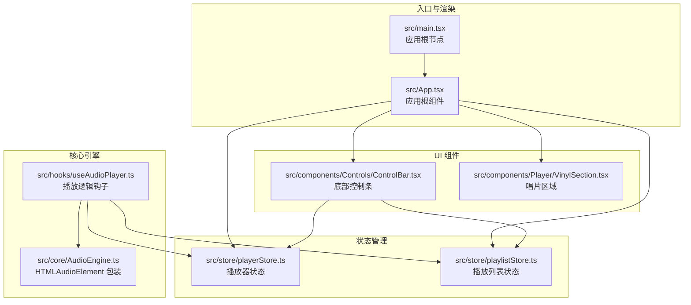
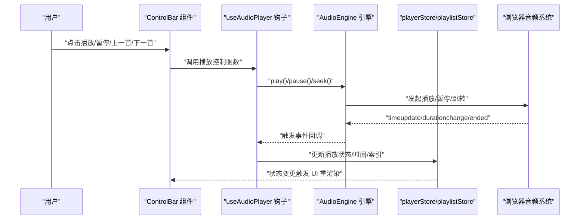
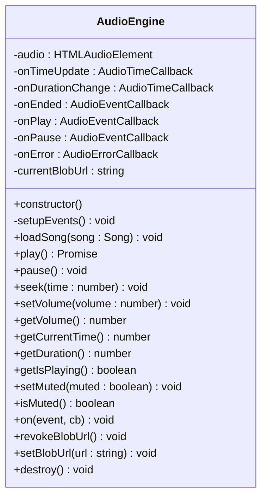
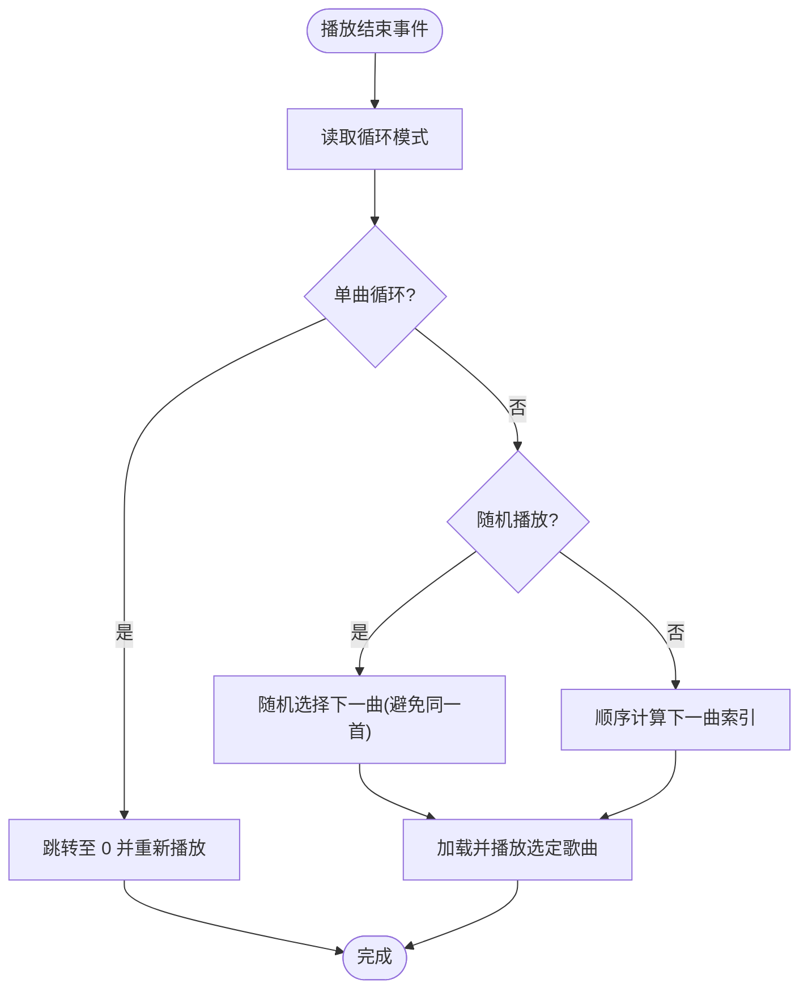
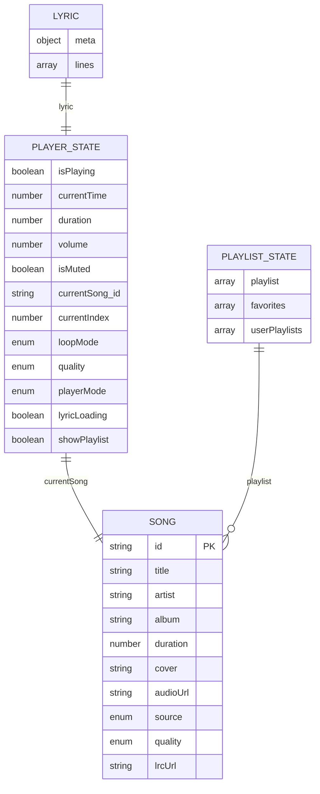
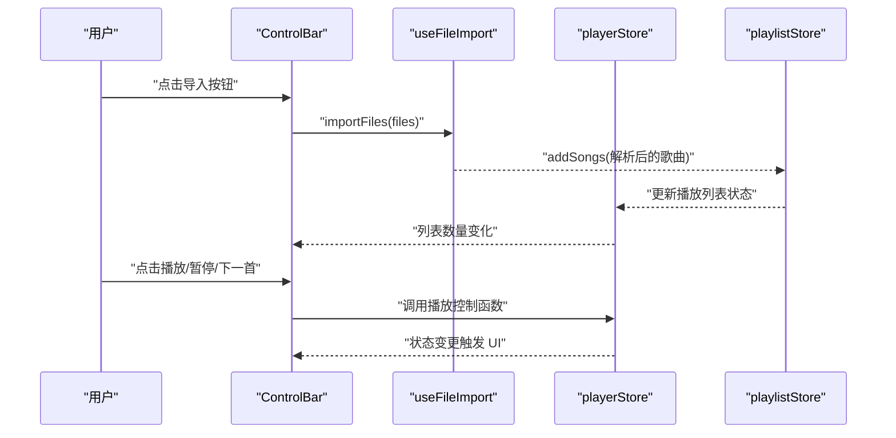
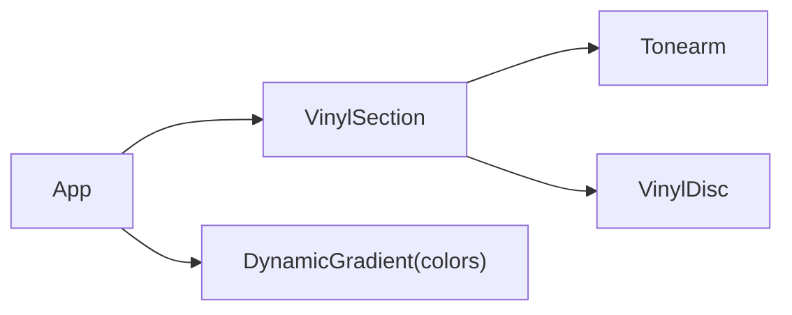
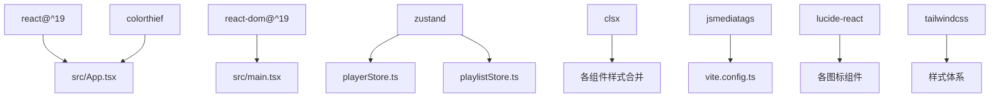

# 项目概述

<cite>
**本文档引用的文件**
- [README.md](file://README.md)
- [Web音乐播放器PRD.md](file://Web音乐播放器PRD.md)
- [package.json](file://package.json)
- [vite.config.ts](file://vite.config.ts)
- [src/main.tsx](file://src/main.tsx)
- [src/App.tsx](file://src/App.tsx)
- [src/core/AudioEngine.ts](file://src/core/AudioEngine.ts)
- [src/hooks/useAudioPlayer.ts](file://src/hooks/useAudioPlayer.ts)
- [src/store/playerStore.ts](file://src/store/playerStore.ts)
- [src/store/playlistStore.ts](file://src/store/playlistStore.ts)
- [src/components/Controls/ControlBar.tsx](file://src/components/Controls/ControlBar.tsx)
- [src/components/Player/VinylSection.tsx](file://src/components/Player/VinylSection.tsx)
- [src/types/player.ts](file://src/types/player.ts)
- [src/types/song.ts](file://src/types/song.ts)
- [src/types/lyric.ts](file://src/types/lyric.ts)
</cite>

## 目录
1. [引言](#引言)
2. [项目结构](#项目结构)
3. [核心组件](#核心组件)
4. [架构总览](#架构总览)
5. [详细组件分析](#详细组件分析)
6. [依赖关系分析](#依赖关系分析)
7. [性能考虑](#性能考虑)
8. [故障排查指南](#故障排查指南)
9. [结论](#结论)
10. [附录](#附录)

## 引言
My Music 2026 是一个由 Qoder 设计的 Web AI 音乐播放器，旨在以浏览器为载体提供“即开即听”的沉浸式音乐体验。项目围绕以下核心愿景展开：
- 浏览器即用：无需安装，打开即播，跨平台一致体验
- 沉浸式视觉：黑胶唱片动画、动态渐变背景、逐行歌词滚动
- 智能歌词同步：LRC 歌词解析与播放时间对齐，支持中英对照
- 本地文件管理：拖拽导入本地音频与歌词，构建个人播放队列
- 用户掌控：播放队列、循环模式、音质选择、键盘快捷键等

这些能力共同构成一个面向现代 Web 的 AI 驱动音乐播放器原型，既适合初学者快速理解，也为有经验的开发者提供了清晰的技术架构与实现路径。

## 项目结构
项目采用按功能域划分的目录组织方式，核心模块包括：
- 核心引擎：音频播放与事件桥接
- 状态管理：播放器状态与播放列表状态
- 组件层：播放器界面、控制条、歌词显示、唱片动画等
- 类型系统：统一的数据模型与枚举
- 构建配置：Vite + React + TailwindCSS

图表来源
- [src/main.tsx](file://src/main.tsx#L1-L11)
- [src/App.tsx](file://src/App.tsx#L1-L98)
- [src/core/AudioEngine.ts](file://src/core/AudioEngine.ts#L1-L143)
- [src/hooks/useAudioPlayer.ts](file://src/hooks/useAudioPlayer.ts#L1-L131)
- [src/store/playerStore.ts](file://src/store/playerStore.ts#L1-L95)
- [src/store/playlistStore.ts](file://src/store/playlistStore.ts#L1-L88)
- [src/components/Controls/ControlBar.tsx](file://src/components/Controls/ControlBar.tsx#L1-L105)
- [src/components/Player/VinylSection.tsx](file://src/components/Player/VinylSection.tsx#L1-L12)

章节来源
- [README.md](file://README.md#L1-L3)
- [package.json](file://package.json#L1-L39)
- [vite.config.ts](file://vite.config.ts#L1-L13)

## 核心组件
本节聚焦播放器的关键构件及其职责边界，帮助读者快速把握系统骨架。

- 应用根组件
  - 负责根据播放器模式渲染不同布局（全屏/迷你/空状态），并挂载全局背景渐变、控制条与播放列表抽屉
  - 通过状态订阅实现封面变化时的颜色提取与歌词封面回填

- 音频引擎
  - 对 HTMLAudioElement 进行封装，统一事件监听与播放控制接口
  - 提供加载、播放、暂停、跳转、音量与静音设置等方法，并处理错误事件

- 播放逻辑钩子
  - 将音频引擎事件映射到播放器状态，负责循环模式下的切歌逻辑与随机播放策略
  - 提供播放/暂停、上一首/下一首、拖拽跳转等交互能力

- 状态存储
  - 播放器状态：播放/暂停、当前时间、总时长、音量、循环模式、音质、播放器模式、歌词数据与加载状态
  - 播放列表状态：歌曲集合、收藏、用户歌单、封面更新与歌单操作

- 控制条组件
  - 聚合播放控制、循环模式、音质选择、播放器模式切换、收藏与添加到歌单等入口
  - 提供本地文件导入能力（拖拽/文件选择）

章节来源
- [src/App.tsx](file://src/App.tsx#L1-L98)
- [src/core/AudioEngine.ts](file://src/core/AudioEngine.ts#L1-L143)
- [src/hooks/useAudioPlayer.ts](file://src/hooks/useAudioPlayer.ts#L1-L131)
- [src/store/playerStore.ts](file://src/store/playerStore.ts#L1-L95)
- [src/store/playlistStore.ts](file://src/store/playlistStore.ts#L1-L88)
- [src/components/Controls/ControlBar.tsx](file://src/components/Controls/ControlBar.tsx#L1-L105)

## 架构总览
下图展示了从用户交互到音频输出与 UI 更新的端到端流程，体现“状态驱动 + 事件桥接”的架构思想。

图表来源
- [src/components/Controls/ControlBar.tsx](file://src/components/Controls/ControlBar.tsx#L1-L105)
- [src/hooks/useAudioPlayer.ts](file://src/hooks/useAudioPlayer.ts#L1-L131)
- [src/core/AudioEngine.ts](file://src/core/AudioEngine.ts#L1-L143)
- [src/store/playerStore.ts](file://src/store/playerStore.ts#L1-L95)
- [src/store/playlistStore.ts](file://src/store/playlistStore.ts#L1-L88)

## 详细组件分析

### 音频引擎类图
AudioEngine 作为播放器的底层抽象，封装了浏览器音频能力并暴露统一事件接口，是连接 UI 与系统音频的关键桥梁。

图表来源
- [src/core/AudioEngine.ts](file://src/core/AudioEngine.ts#L1-L143)

章节来源
- [src/core/AudioEngine.ts](file://src/core/AudioEngine.ts#L1-L143)

### 播放逻辑流程图
该流程图描述了播放结束后的切歌策略，体现了循环模式与随机播放的分支逻辑。

图表来源
- [src/hooks/useAudioPlayer.ts](file://src/hooks/useAudioPlayer.ts#L47-L62)

章节来源
- [src/hooks/useAudioPlayer.ts](file://src/hooks/useAudioPlayer.ts#L1-L131)

### 状态模型与数据流
播放器状态与播放列表状态通过 Zustand 管理，并持久化到 localStorage。状态变更驱动 UI 与业务逻辑协同。

图表来源
- [src/store/playerStore.ts](file://src/store/playerStore.ts#L8-L40)
- [src/store/playlistStore.ts](file://src/store/playlistStore.ts#L5-L27)
- [src/types/song.ts](file://src/types/song.ts#L1-L14)
- [src/types/lyric.ts](file://src/types/lyric.ts#L1-L21)

章节来源
- [src/store/playerStore.ts](file://src/store/playerStore.ts#L1-L95)
- [src/store/playlistStore.ts](file://src/store/playlistStore.ts#L1-L88)
- [src/types/song.ts](file://src/types/song.ts#L1-L14)
- [src/types/lyric.ts](file://src/types/lyric.ts#L1-L21)

### 控制条组件序列图
控制条作为用户交互中枢，串联文件导入、播放控制、收藏与歌单操作。

图表来源
- [src/components/Controls/ControlBar.tsx](file://src/components/Controls/ControlBar.tsx#L1-L105)
- [src/store/playerStore.ts](file://src/store/playerStore.ts#L1-L95)
- [src/store/playlistStore.ts](file://src/store/playlistStore.ts#L1-L88)

章节来源
- [src/components/Controls/ControlBar.tsx](file://src/components/Controls/ControlBar.tsx#L1-L105)

### 唱片区域与视觉体验
唱片区域由“唱臂 + 唱片”组成，配合封面提取的主色调生成动态渐变背景，营造沉浸式体验。

图表来源
- [src/components/Player/VinylSection.tsx](file://src/components/Player/VinylSection.tsx#L1-L12)
- [src/App.tsx](file://src/App.tsx#L1-L98)

章节来源
- [src/components/Player/VinylSection.tsx](file://src/components/Player/VinylSection.tsx#L1-L12)
- [src/App.tsx](file://src/App.tsx#L1-L98)

## 依赖关系分析
项目技术栈与外部依赖如下：
- 运行时框架：React 19、React DOM 19
- 状态管理：Zustand（含持久化中间件）
- 图标与样式：Lucide React、TailwindCSS
- 颜色提取：colorthief
- 标签读取：jsmediatags（通过别名指向打包后的最小版本）
- 构建工具：Vite（集成 React 与 Tailwind 插件）

图表来源
- [package.json](file://package.json#L12-L36)
- [vite.config.ts](file://vite.config.ts#L1-L13)
- [src/App.tsx](file://src/App.tsx#L1-L98)

章节来源
- [package.json](file://package.json#L1-L39)
- [vite.config.ts](file://vite.config.ts#L1-L13)

## 性能考虑
- 首屏与渲染
  - 使用 React 19 的并发特性与严格模式，减少不必要重渲染
  - 通过 Zustand 精细化状态切片，避免全局状态波动导致的全量重渲染
- 音频播放
  - AudioEngine 在构造时预加载，减少首播延迟
  - 事件监听集中在引擎内部，避免重复绑定
- 视觉与交互
  - 动态渐变背景与歌词滚动均基于状态更新，避免高频重排
  - 控制条固定定位，减少布局抖动
- 构建优化
  - Vite 开发服务器热更新与按需编译，缩短等待时间
  - TailwindCSS 按需生成样式，减小包体

## 故障排查指南
- 播放失败（浏览器自动播放限制）
  - 现象：首次播放抛出异常，提示需要用户交互
  - 处理：等待用户点击后再次尝试播放，引擎已捕获并提示
  - 参考：[src/core/AudioEngine.ts](file://src/core/AudioEngine.ts#L54-L61)
- 进度跳转不生效
  - 现象：拖拽进度条后时间未更新
  - 排查：确认 seek 回调是否正确调用，以及当前歌曲是否存在
  - 参考：[src/hooks/useAudioPlayer.ts](file://src/hooks/useAudioPlayer.ts#L116-L119)
- 循环模式切换无效
  - 现象：点击循环按钮后模式未改变
  - 排查：检查循环模式枚举与状态更新函数
  - 参考：[src/store/playerStore.ts](file://src/store/playerStore.ts#L67-L71)
- 歌词未显示或不同步
  - 现象：歌词为空或高亮行不随播放移动
  - 排查：确认歌词解析结果与播放时间映射逻辑
  - 参考：[src/store/playerStore.ts](file://src/store/playerStore.ts#L74-L76)
- 封面缺失导致背景无色
  - 现象：切歌后背景仍为默认色
  - 处理：启用封面回填逻辑，从 API 获取并更新状态
  - 参考：[src/App.tsx](file://src/App.tsx#L34-L46)

章节来源
- [src/core/AudioEngine.ts](file://src/core/AudioEngine.ts#L54-L61)
- [src/hooks/useAudioPlayer.ts](file://src/hooks/useAudioPlayer.ts#L116-L119)
- [src/store/playerStore.ts](file://src/store/playerStore.ts#L67-L71)
- [src/App.tsx](file://src/App.tsx#L34-L46)

## 结论
My Music 2026 以 React 19 + TypeScript + Vite 为基础，结合 Zustand 状态管理与 TailwindCSS 样式体系，构建了一个轻量、可扩展且具备沉浸式体验的 Web 音乐播放器原型。其核心优势在于：
- 以状态驱动的清晰架构，便于扩展与维护
- 以用户体验为中心的视觉与交互设计
- 以浏览器为载体的即开即用理念

对于初学者，建议从 App 布局与 ControlBar 控制链路入手；对于有经验的开发者，可关注 AudioEngine 的事件桥接、Zustand 的持久化策略与歌词同步算法。

## 附录
- 产品愿景与功能清单可参考 PRD 文档，其中明确了 P0/P1/P2 优先级与验收标准
- 技术约束包括浏览器自动播放限制、音频源 URL 提供方式与本地偏好存储策略

章节来源
- [Web音乐播放器PRD.md](file://Web音乐播放器PRD.md#L5-L127)